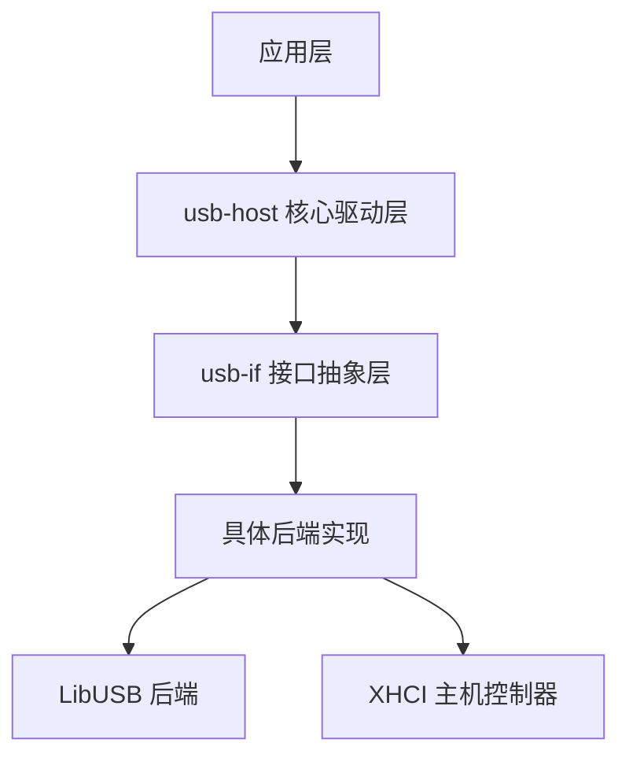
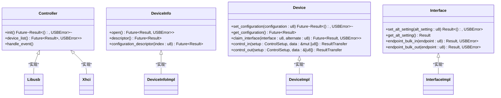
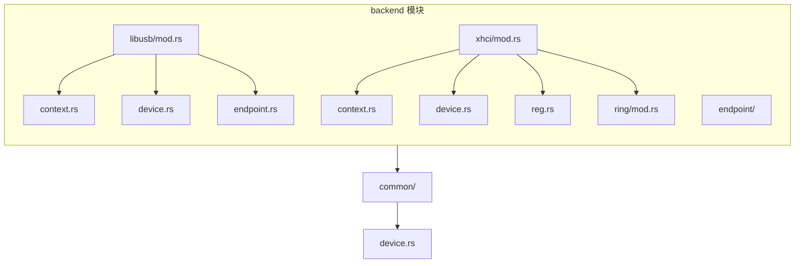
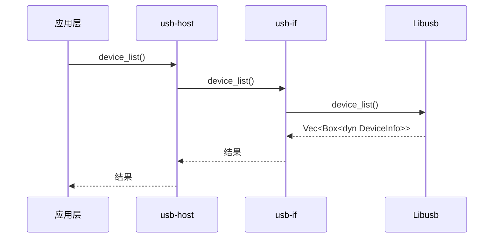

# 分层架构设计

<cite>
**Referenced Files in This Document**   
- [lib.rs](file://usb-host/src/lib.rs)
- [lib.rs](file://usb-if/src/lib.rs)
- [device.rs](file://usb-host/src/common/device.rs)
- [mod.rs](file://usb-host/src/backend/mod.rs)
- [mod.rs](file://usb-host/src/backend/libusb/mod.rs)
- [mod.rs](file://usb-host/src/backend/xhci/mod.rs)
- [device.rs](file://usb-host/src/backend/libusb/device.rs)
- [device.rs](file://usb-host/src/backend/xhci/device.rs)
- [mod.rs](file://usb-if/src/host/mod.rs)
- [mod.rs](file://usb-if/src/transfer/mod.rs)
</cite>

## Table of Contents
1. [分层架构概述](#分层架构概述)
2. [接口抽象层 (usb-if)](#接口抽象层-usb-if)
3. [核心驱动层 (usb-host)](#核心驱动层-usb-host)
4. [后端实现模块化](#后端实现模块化)
5. [公共API导出策略](#公共api导出策略)
6. [调用流程分析](#调用流程分析)
7. [架构优势与权衡](#架构优势与权衡)

## 分层架构概述

CrabUSB采用清晰的纵向分层架构，从上至下分为应用层、核心驱动层（`usb-host`）和接口抽象层（`usb-if`）。这种分层设计实现了功能解耦，使高层应用无需关心底层硬件细节。`usb-host`作为核心驱动层，依赖`usb-if`提供的抽象接口构建跨平台能力，同时通过模块化组织（backend、common、transfer）建立明确的责任边界。



**Diagram sources**
- [lib.rs](file://usb-host/src/lib.rs)
- [lib.rs](file://usb-if/src/lib.rs)

**Section sources**
- [lib.rs](file://usb-host/src/lib.rs)
- [lib.rs](file://usb-if/src/lib.rs)

## 接口抽象层 (usb-if)

`usb-if` crate定义了USB主机功能的核心抽象接口，为上层驱动提供统一的编程模型。该层通过trait定义了控制器、设备、接口和端点等关键组件的行为契约，屏蔽了不同后端实现的差异性。

### 核心接口定义



**Diagram sources**
- [mod.rs](file://usb-if/src/host/mod.rs)

**Section sources**
- [mod.rs](file://usb-if/src/host/mod.rs)
- [mod.rs](file://usb-if/src/transfer/mod.rs)

## 核心驱动层 (usb-host)

`usb-host`作为核心驱动层，基于`usb-if`的抽象接口构建具体功能实现。该层通过`common`模块封装通用逻辑，`backend`模块组织不同后端实现，形成清晰的职责划分。

### 设备管理实现

`Device`结构体是核心驱动层的关键组件，负责管理USB设备的生命周期和状态信息。它通过组合模式将底层设备操作委托给具体的后端实现。

```mermaid
classDiagram
class Device {
-descriptor : DeviceDescriptor
-info : Info
-raw : Box<dyn usb_if : : host : : Device>
-lang_id : LanguageId
+new(raw : Box<dyn Device>, descriptor : DeviceDescriptor) Result<Self, USBError>
+manufacturer_string() &str
+product_string() &str
+serial_number_string() &str
+set_configuration(configuration : u8) Result<(), USBError>
+claim_interface(interface : u8, alternate : u8) Result<Interface, USBError>
+string_descriptor(index : u8) Result<String, USBError>
}
class Info {
-configurations : Vec<ConfigurationDescriptor>
-manufacturer_string : String
-product_string : String
-serial_number_string : String
}
Device --> Info : "包含"
Device --> usb_if : : host : : Device : "依赖"
```

**Diagram sources**
- [device.rs](file://usb-host/src/common/device.rs)

**Section sources**
- [device.rs](file://usb-host/src/common/device.rs)
- [lib.rs](file://usb-host/src/lib.rs)

## 后端实现模块化

`usb-host`通过`backend`模块实现后端的模块化组织，支持多种底层实现（如LibUSB和XHCI），每个后端独立封装，互不影响。

### 后端模块结构



**Diagram sources**
- [mod.rs](file://usb-host/src/backend/mod.rs)
- [mod.rs](file://usb-host/src/backend/libusb/mod.rs)
- [mod.rs](file://usb-host/src/backend/xhci/mod.rs)

**Section sources**
- [mod.rs](file://usb-host/src/backend/mod.rs)
- [mod.rs](file://usb-host/src/backend/libusb/mod.rs)
- [mod.rs](file://usb-host/src/backend/xhci/mod.rs)

### LibUSB后端实现

LibUSB后端通过`Controller` trait的实现，将系统级LibUSB库的功能暴露给上层驱动。



**Diagram sources**
- [mod.rs](file://usb-host/src/backend/libusb/mod.rs)
- [device.rs](file://usb-host/src/backend/libusb/device.rs)

**