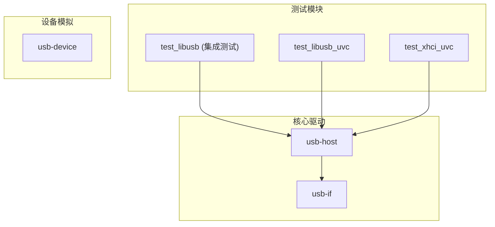
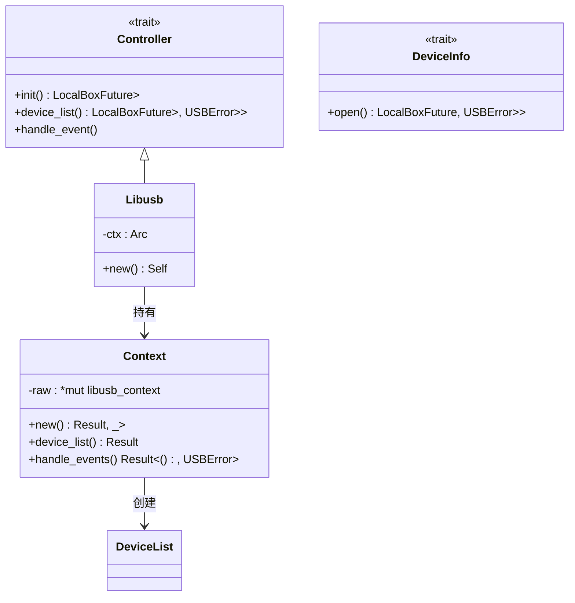
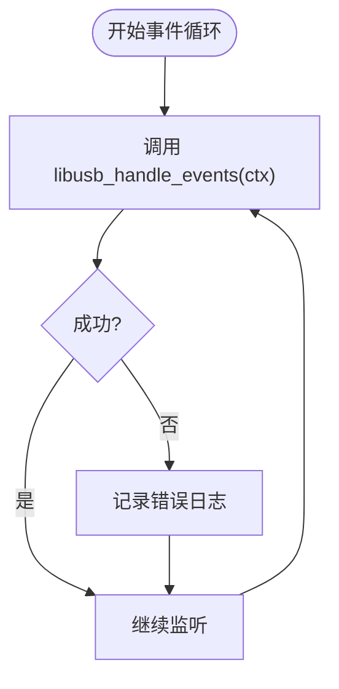
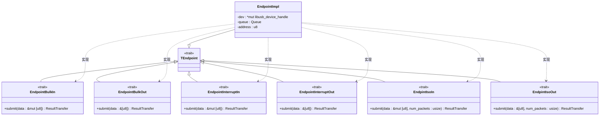
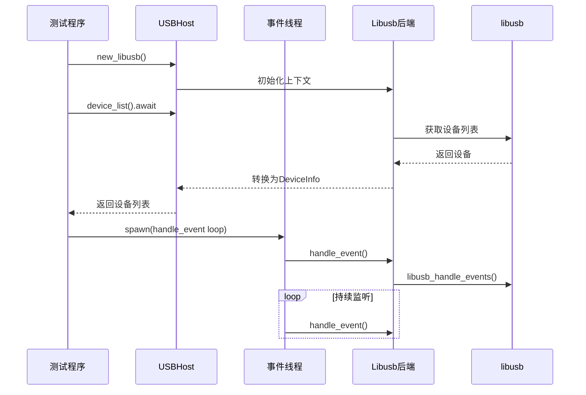

# libusb 用户空间后端

<cite>
**本文档引用的文件**
- [mod.rs](file://usb-host/src/backend/libusb/mod.rs)
- [context.rs](file://usb-host/src/backend/libusb/context.rs)
- [endpoint.rs](file://usb-host/src/backend/libusb/endpoint.rs)
- [test.rs](file://test_crates/test_libusb/tests/test.rs)
- [Cargo.toml](file://usb-host/Cargo.toml)
- [lib.rs](file://usb-host/src/lib.rs)
</cite>

## 目录
1. [引言](#引言)
2. [项目结构](#项目结构)
3. [核心组件](#核心组件)
4. [架构概述](#架构概述)
5. [详细组件分析](#详细组件分析)
6. [依赖分析](#依赖分析)
7. [性能考量](#性能考量)
8. [故障排除指南](#故障排除指南)
9. [结论](#结论)

## 引言
本文档全面介绍`CrabUSB`项目中`libusb`用户空间后端的实现机制。重点分析如何通过FFI调用`libusb`库实现`usb-if`定义的`Controller`、`DeviceInfo`等trait，阐述异步化包装策略与传输类型映射，并结合测试套件说明开发验证方法。

## 项目结构
该项目采用分层模块化设计，主要包含`usb-host`、`usb-if`、`test_crates`等核心目录。`usb-host`提供主机控制器抽象，`usb-if`定义通用接口，`test_crates`用于功能验证。



**Diagram sources**
- [mod.rs](file://usb-host/src/backend/libusb/mod.rs#L1-L64)
- [Cargo.toml](file://usb-host/Cargo.toml#L1-L50)

**Section sources**
- [mod.rs](file://usb-host/src/backend/libusb/mod.rs#L1-L64)
- [Cargo.toml](file://usb-host/Cargo.toml#L1-L50)

## 核心组件
本节深入分析`libusb`后端的核心实现，包括上下文管理、端点传输及事件处理机制。

**Section sources**
- [mod.rs](file://usb-host/src/backend/libusb/mod.rs#L1-L64)
- [context.rs](file://usb-host/src/backend/libusb/context.rs#L1-L71)
- [endpoint.rs](file://usb-host/src/backend/libusb/endpoint.rs#L1-L190)

## 架构概述
该后端通过`Libusb`结构体封装`libusb`上下文，实现`usb-if`定义的`Controller` trait，形成统一的异步接口。



**Diagram sources**
- [mod.rs](file://usb-host/src/backend/libusb/mod.rs#L1-L64)
- [context.rs](file://usb-host/src/backend/libusb/context.rs#L1-L71)

## 详细组件分析

### mod.rs 中的 FFI 封装机制
`mod.rs`通过`Controller` trait实现对`libusb`库的高层封装。`Libusb`结构体持有`Arc<Context>`以支持多线程共享，其`device_list`方法将底层设备列表转换为符合`usb-if`规范的`DeviceInfo`对象集合。

**Section sources**
- [mod.rs](file://usb-host/src/backend/libusb/mod.rs#L1-L64)

#### 对象关系图
```mermaid
classDiagram
Libusb --> Context : 使用
Libusb --> DeviceInfo : 生成
DeviceInfo --> usb_if : : host : : DeviceInfo : 实现
```

**Diagram sources**
- [mod.rs](file://usb-host/src/backend/libusb/mod.rs#L1-L64)

### context.rs 的异步化包装策略
`Context`结构体封装了`libusb_context`指针，通过`Arc`实现线程安全共享。`handle_events`方法在独立线程中轮询USB事件，配合`event_handler`实现非阻塞式事件处理，满足异步运行时需求。

**Section sources**
- [context.rs](file://usb-host/src/backend/libusb/context.rs#L1-L71)

#### 事件处理流程图


**Diagram sources**
- [context.rs](file://usb-host/src/backend/libusb/context.rs#L1-L71)

### endpoint.rs 的传输类型映射实现
`EndpointImpl`实现了四种传输类型的trait：批量（Bulk）、中断（Interrupt）、等时（Isochronous）输入输出。每种传输均通过`libusb_fill_*_transfer`填充传输描述符，并提交至`Queue`进行异步处理。

对于等时传输，特别设置了`iso_in_on_ready`回调函数，在接收完成后逐包检查状态并清零失败数据，确保数据完整性。

**Section sources**
- [endpoint.rs](file://usb-host/src/backend/libusb/endpoint.rs#L1-L190)

#### 传输类型类图


**Diagram sources**
- [endpoint.rs](file://usb-host/src/backend/libusb/endpoint.rs#L1-L190)

### test_libusb 测试套件验证方法
`test.rs`使用`tokio`运行时启动事件处理线程，遍历设备列表查找视频类接口。通过`claim_interface`获取接口控制权，并枚举其端点信息，可在非特权环境下完成基本通信验证。

**Section sources**
- [test.rs](file://test_crates/test_libusb/tests/test.rs#L1-L93)

#### 测试流程序列图


**Diagram sources**
- [test.rs](file://test_crates/test_libusb/tests/test.rs#L1-L93)

## 依赖分析
该后端依赖`libusb1-sys`进行系统调用，通过`futures`和`tokio`支持异步操作。特性开关`libusb`控制条件编译，便于跨平台适配。

```mermaid
graph LR
   