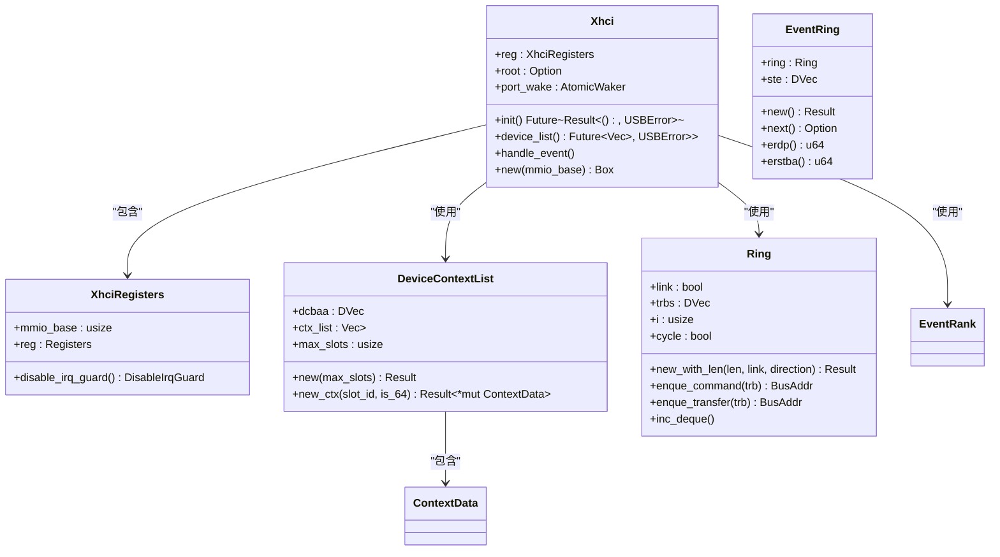
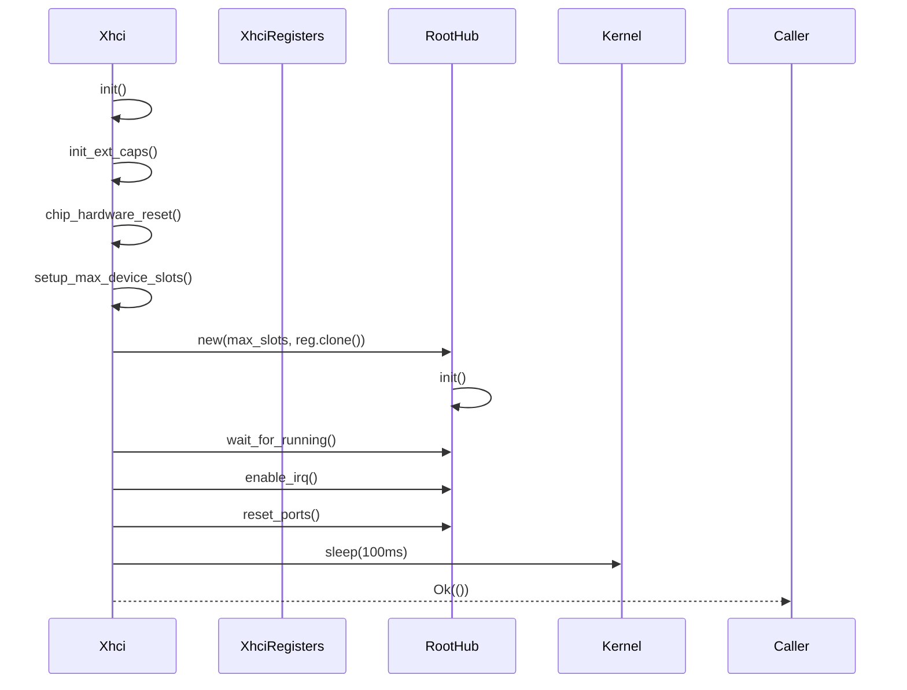
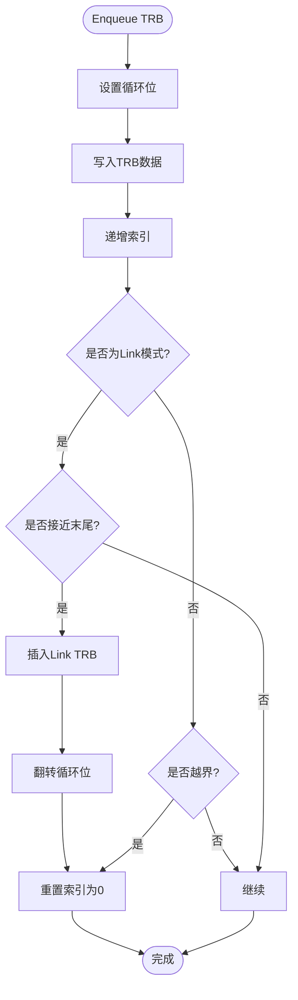

# xHCI 后端实现

<cite>
**Referenced Files in This Document**   
- [mod.rs](file://usb-host/src/backend/xhci/mod.rs)
- [reg.rs](file://usb-host/src/backend/xhci/reg.rs)
- [context.rs](file://usb-host/src/backend/xhci/context.rs)
- [ring/mod.rs](file://usb-host/src/backend/xhci/ring/mod.rs)
- [event.rs](file://usb-host/src/backend/xhci/event.rs)
- [libusb/mod.rs](file://usb-host/src/backend/libusb/mod.rs)
</cite>

## 目录
1. [简介](#简介)
2. [核心组件分析](#核心组件分析)
3. [控制器初始化流程](#控制器初始化流程)
4. [TRB环形队列无锁设计](#trb环形队列无锁设计)
5. [设备上下文管理](#设备上下文管理)
6. [中断事件处理机制](#中断事件处理机制)
7. [内存映射与DMA管理](#内存映射与dma管理)
8. [xHCI与libusb后端对比](#xhci与libusb后端对比)
9. [错误处理与调试建议](#错误处理与调试建议)

## 简介
本文档深入解析基于xHCI协议的内核级USB主机后端实现。重点阐述`mod.rs`中`Controller` trait的具体实现机制，包括通过MMIO访问xHCI寄存器、管理设备槽位和端点上下文。详细说明TRB环形队列的无锁设计原理及其在异步传输中的作用，并结合运行时状态管理描述设备枚举、中断处理和DMA内存映射的完整流程。

## 核心组件分析

该实现的核心由多个关键模块构成：`Xhci`结构体作为主控制器，`XhciRegisters`负责MMIO寄存器访问，`DeviceContextList`管理设备上下文，`Ring`实现TRB环形队列，以及`EventRing`处理中断事件。



**Diagram sources**
- [mod.rs](file://usb-host/src/backend/xhci/mod.rs#L0-L300)
- [reg.rs](file://usb-host/src/backend/xhci/reg.rs#L0-L89)
- [context.rs](file://usb-host/src/backend/xhci/context.rs#L0-L195)
- [ring/mod.rs](file://usb-host/src/backend/xhci/ring/mod.rs#L0-L158)
- [event.rs](file://usb-host/src/backend/xhci/event.rs#L0-L66)

**Section sources**
- [mod.rs](file://usb-host/src/backend/xhci/mod.rs#L0-L300)
- [reg.rs](file://usb-host/src/backend/xhci/reg.rs#L0-L89)
- [context.rs](file://usb-host/src/backend/xhci/context.rs#L0-L195)
- [ring/mod.rs](file://usb-host/src/backend/xhci/ring/mod.rs#L0-L158)
- [event.rs](file://usb-host/src/backend/xhci/event.rs#L0-L66)

## 控制器初始化流程

xHCI控制器的初始化遵循严格的硬件规范流程。首先执行芯片硬件复位，等待控制器就绪后进行扩展功能初始化，最后配置根集线器并启用中断。



**Diagram sources**
- [mod.rs](file://usb-host/src/backend/xhci/mod.rs#L15-L85)

**Section sources**
- [mod.rs](file://usb-host/src/backend/xhci/mod.rs#L15-L85)

## TRB环形队列无锁设计

TRB（Transfer Request Block）环形队列采用无锁设计，通过循环位（Cycle Bit）机制实现生产者-消费者同步。当队列指针到达末尾时，自动回绕到起始位置，并翻转循环位。



**Diagram sources**
- [ring/mod.rs](file://usb-host/src/backend/xhci/ring/mod.rs#L105-L156)

**Section sources**
- [ring/mod.rs](file://usb-host/src/backend/xhci/ring/mod.rs#L60-L156)

## 设备上下文管理

设备上下文管理通过`DeviceContextList`结构实现，维护DCBAA（Device Context Base Address Array）数组和上下文数据列表。每个设备槽位对应一个`ContextData`实例，包含输入和输出上下文缓冲区。

```mermaid
classDiagram
    class DeviceContextList {
        +dcbaa: DVec<u64>
        +ctx_list: Vec<Option<ContextData>>
        +max_slots: usize
        +new(max_slots) Result<Self>
        +new_ctx(slot_id, is_64) Result<*mut ContextData>
    }
    
    class ContextData {
        +ctx64: Option<Context64>
        +ctx32: Option<Context32>
        +dcbaa() u64
        +input_bus_addr() u64
        +with_input(f) 
        +with_empty_input(f)
        +input_perper_modify()
    }
    
    class Context64 {
        +out: DBox<Device