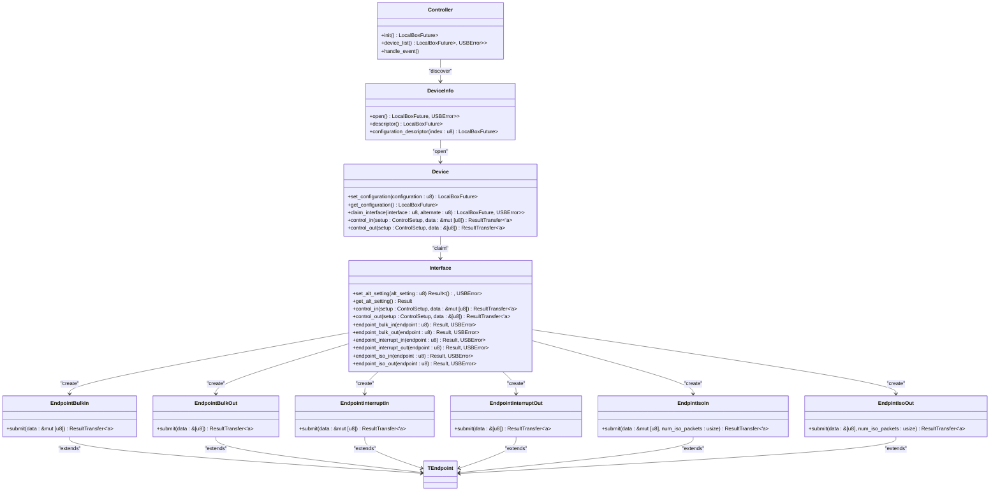
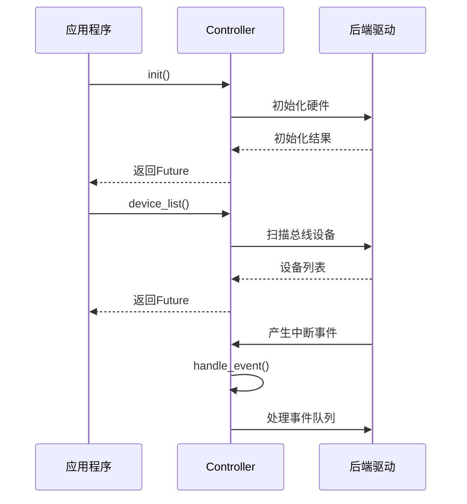
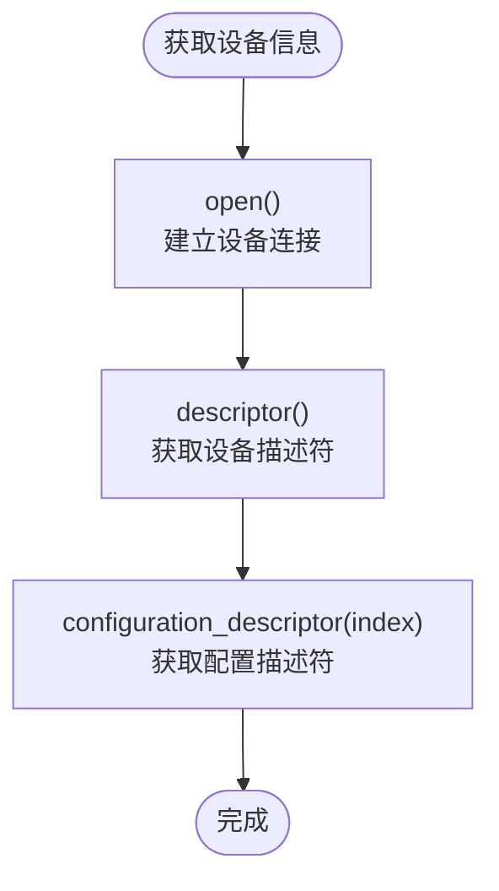

# 后端抽象接口规范

<cite>
**Referenced Files in This Document**   
- [lib.rs](file://usb-if/src/lib.rs)
- [mod.rs](file://usb-if/src/host/mod.rs)
- [mod.rs](file://usb-if/src/descriptor/mod.rs)
- [mod.rs](file://usb-if/src/transfer/mod.rs)
</cite>

## 目录
1. [核心接口族概览](#核心接口族概览)
2. [Controller控制器接口](#controller控制器接口)
3. [DeviceInfo设备信息接口](#deviceinfo设备信息接口)
4. [Device设备操作接口](#device设备操作接口)
5. [Interface接口配置接口](#interface接口配置接口)
6. [Endpoint端点传输接口](#endpoint端点传输接口)
7. [ControlSetup控制请求结构体](#controlsetup控制请求结构体)
8. [异步安全性与生命周期约束](#异步安全性与生命周期约束)
9. [动态分发与后端扩展](#动态分发与后端扩展)

## 核心接口族概览

`usb-if`模块定义了一套完整的主机端USB设备抽象接口族，采用Rust trait体系构建了层次化的设备控制模型。该接口族以`Controller`为顶层控制器，通过`DeviceInfo`发现设备，获取`Device`实例进行设备级操作，再通过`Interface`管理接口配置，最终由各类`Endpoint`实现具体的数据传输。



**Diagram sources**
- [lib.rs](file://usb-if/src/lib.rs#L10-L123)

**Section sources**
- [lib.rs](file://usb-if/src/lib.rs#L10-L123)

## Controller控制器接口

`Controller` trait代表USB主机控制器的抽象，是整个USB系统操作的入口点。它负责设备枚举、事件处理和资源管理。



**Section sources**
- [lib.rs](file://usb-if/src/lib.rs#L10-L15)

### init方法
`init()`方法用于初始化USB控制器，返回一个异步Future。该方法必须在任何其他操作之前调用，确保控制器处于可用状态。初始化过程包括硬件复位、寄存器配置和中断设置等底层操作。

### device_list方法
`device_list()`方法执行设备发现机制，扫描USB总线上所有连接的设备并返回`DeviceInfo`对象列表。该方法采用异步设计，避免阻塞主线程。设备发现过程涉及发送GET_DESCRIPTOR请求、解析设备描述符，并为每个设备创建对应的`DeviceInfo`实例。

### handle_event方法
`handle_event()`方法用于处理USB总线上的中断事件，通常在中断上下文中调用。该方法负责轮询事件队列、处理传输完成通知、设备拔插事件等异步回调，是实现非阻塞I/O的关键组件。

## DeviceInfo设备信息接口

`DeviceInfo` trait提供对USB设备基本信息的访问，允许应用程序查询设备属性而无需建立完整连接。



**Section sources**
- [lib.rs](file://usb-if/src/lib.rs#L17-L22)

### open方法
`open()`方法用于打开设备连接，返回一个`Device`对象的智能指针。此操作会分配设备槽位、初始化端点资源，并建立与设备的通信通道。如果设备已被其他进程占用，将返回`SlotLimitReached`错误。

### descriptor方法
`descriptor()`方法异步获取设备描述符（Device Descriptor），包含设备的厂商ID、产品ID、设备类等基本信息。这些信息可用于设备识别和驱动匹配。

### configuration_descriptor方法
`configuration_descriptor(index)`方法根据索引获取特定的配置描述符（Configuration Descriptor），描述了设备的一种工作配置模式，包括接口数量、电源需求等。

## Device设备操作接口

`Device` trait代表已打开的USB设备实例，提供设备级配置和控制功能。

```mermaid
sequenceDiagram
    participant App as 应用程序
    participant Dev as Device
    participant Ctrl as 控制器
    
    App->>Dev: set_configuration(1)
    Dev->>Ctrl: 发送SET_CONFIGURATION请求
    Ctrl-->>Dev: 配置结果
    Dev-->>App: 返回Future
    
    App->>Dev: get_configuration()
    Dev->>Ctrl: 发送GET_CONFIGURATION请求
    Ctrl-->>Dev: 当前配置值