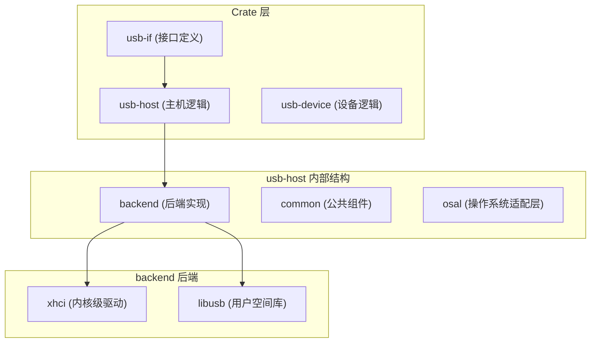
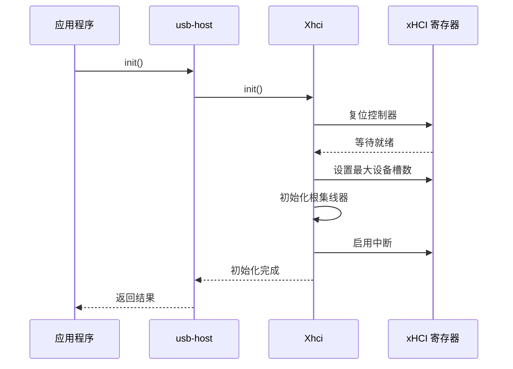

# 后端抽象机制

<cite>
**本文档引用的文件**
- [lib.rs](file://usb-if/src/lib.rs)
- [host/mod.rs](file://usb-if/src/host/mod.rs)
- [lib.rs](file://usb-host/src/lib.rs)
- [backend/mod.rs](file://usb-host/src/backend/mod.rs)
- [libusb/mod.rs](file://usb-host/src/backend/libusb/mod.rs)
- [xhci/mod.rs](file://usb-host/src/backend/xhci/mod.rs)
- [context.rs](file://usb-host/src/backend/libusb/context.rs)
- [context.rs](file://usb-host/src/backend/xhci/context.rs)
- [device.rs](file://usb-host/src/common/device.rs)
</cite>

## 目录
1. [引言](#引言)
2. [项目结构](#项目结构)
3. [核心组件](#核心组件)
4. [架构概述](#架构概述)
5. [详细组件分析](#详细组件分析)
6. [依赖关系分析](#依赖关系分析)
7. [性能考量](#性能考量)
8. [故障排除指南](#故障排除指南)
9. [结论](#结论)

## 引言
CrabUSB 是一个模块化的 USB 驱动框架，其设计核心在于通过清晰的后端抽象实现对不同硬件和库的支持。本文件旨在全面解析其后端抽象架构，重点阐述 `usb-if` 中定义的 trait 如何作为统一接口，以及 xHCI 和 libusb 两个后端如何分别实现这些接口。文档还将深入探讨桥接模式的应用，即 `usb-host` 运行时如何动态选择并绑定具体后端实例，从而实现业务逻辑与底层硬件/库的完全解耦。

## 项目结构
CrabUSB 的项目结构体现了清晰的分层设计理念。顶层包含多个独立的 crate，其中 `usb-if` 定义了通用接口，`usb-host` 实现了主机侧的核心逻辑并集成了多个后端，而 `usb-device` 则专注于设备端功能。测试用例分散在 `test_crates` 目录下，针对不同的后端和使用场景进行验证。



**Diagram sources**
- [usb-if/src/lib.rs](file://usb-if/src/lib.rs#L1-L8)
- [usb-host/src/lib.rs](file://usb-host/src/lib.rs#L1-L28)
- [usb-host/src/backend/mod.rs](file://usb-host/src/backend/mod.rs#L1-L32)

## 核心组件
本系统的核心组件围绕 `usb-if` crate 中定义的 `Controller`、`DeviceInfo` 和 `Device` 等 trait 构建。这些 trait 共同构成了一个完整的 USB 主机操作接口。`usb-host` crate 通过其实现，将上层应用逻辑与具体的硬件访问方式（如 xHCI 或 libusb）隔离开来。这种设计使得上层代码无需关心底层是通过直接内存映射访问 PCI 设备，还是通过系统调用与用户态守护进程通信。

**Section sources**
- [host/mod.rs](file://usb-if/src/host/mod.rs#L1-L123)
- [lib.rs](file://usb-host/src/lib.rs#L1-L28)

## 架构概述
CrabUSB 的整体架构采用经典的桥接模式。`usb-if` 提供了抽象的 API 接口，`usb-host` 作为抽象化的核心，负责管理这些接口的生命周期和调用。具体的实现则由 `xhci` 和 `libusb` 两个后端提供，它们各自实现了 `usb-if::host::Controller` trait。运行时，`usb-host` 可以根据编译时启用的 Cargo 特性或运行时配置，动态地创建并使用相应的后端实例。

```mermaid
classDiagram
class Controller {
<<trait>>
+init() Future~Result<(), USBError>~
+device_list() Future~Result<Vec<Box<dyn DeviceInfo>>, USBError>~
+handle_event()
}
class DeviceInfo {
<<trait>>
+open() Future~Result<Box<dyn Device>, USBError>~
+descriptor() Future~Result<DeviceDescriptor, USBError>~
+configuration_descriptor(index : u8) Future~Result<ConfigurationDescriptor, USBError>~
}
class Device {
<<trait>>
+set_configuration(configuration : u8) Future~Result<(), USBError>~
+claim_interface(interface : u8, alternate : u8) Future~Result<Box<dyn Interface>, USBError>~
+control_in(setup : ControlSetup, data : &mut [u8]) ResultTransfer<'a>
+control_out(setup : ControlSetup, data : &[u8]) ResultTransfer<'a>
}
class Xhci {
-reg : XhciRegisters
-root : Option<RootHub>
+new(mmio_base : NonNull<u8>) Box<Self>
}
class Libusb {
-ctx : Arc<context : : Context>
+new() Self
}
Controller <|-- Xhci : "实现"
Controller <|-- Libusb : "实现"
Xhci ..> "PCI MMIO" : 访问
Libusb ..> "libusb1_sys" : 调用
```

**Diagram sources**
- [host/mod.rs](file://usb-if/src/host/mod.rs#L1-L123)
- [xhci/mod.rs](file://usb-host/src/backend/xhci/mod.rs#L1-L300)
- [libusb/mod.rs](file://usb-host/src/backend/libusb/mod.rs#L1-L64)

## 详细组件分析

### usb-if 接口定义分析
`usb-if` crate 是整个抽象体系的基石。它通过一系列精心设计的 trait 定义了 USB 主机控制器所需的所有功能。`Controller` trait 是入口点，提供了初始化、设备列表查询和事件处理等核心方法。`DeviceInfo` 和 `Device` trait 则分别代表了设备的静态信息和可操作实例，支持异步的打开、配置设置和接口声明等操作。所有方法均返回 `Future`，确保了非阻塞的 I/O 模型。

**Section sources**
- [host/mod.rs](file://usb-if/src/host/mod.rs#L1-L123)

### xHCI 后端实现分析
xHCI 后端是一个面向内核环境的高性能实现。`Xhci` 结构体封装了对 xHCI 控制器 MMIO 寄存器的访问，并实现了 `Controller` trait。其 `init` 方法严格按照 xHCI 规范执行芯片硬件复位、扩展能力初始化和根集线器配置。`device_list` 方法通过轮询已连接且启用的端口来发现设备。`handle_event` 方法处理中断状态寄存器中的事件标志，如事件中断和端口变化检测。



**Diagram sources**
- [xhci/mod.rs](file://usb-host/src/backend/xhci/mod.rs#L1-L300)
- [context.rs](file://usb-host/src/backend/xhci/context.rs#L1-L194)

### libusb 后端实现分析
libusb 后端为用户空间应用提供了便利的访问途径。`Libusb` 结构体持有一个 `Arc<context::Context>`，该上下文对象封装了对 `libusb1_sys` C 库的调用。其 `init` 方法仅需创建上下文即可完成初始化。`device_list` 方法通过调用 `libusb_get