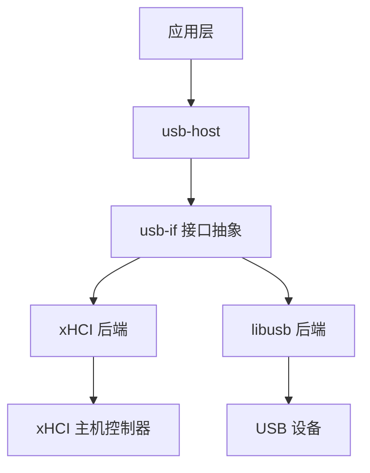
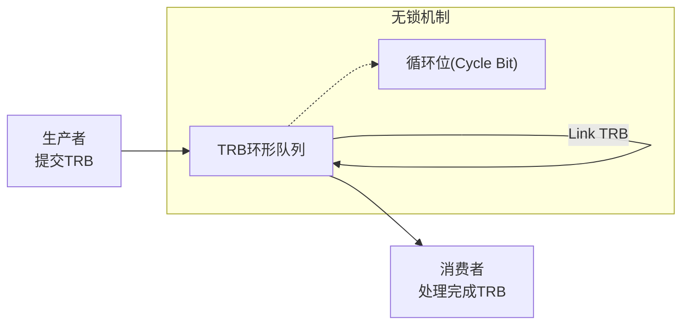

<cite>
**本文档引用文件**
- [design.md](file://doc/design.md)
- [lib.rs](file://usb-host/src/lib.rs)
- [mod.rs](file://usb-if/src/lib.rs)
- [mod.rs](file://usb-host/src/backend/xhci/ring/mod.rs)
- [queue.rs](file://usb-host/src/backend/libusb/queue.rs)
- [context.rs](file://usb-host/src/backend/xhci/context.rs)
- [device.rs](file://usb-host/src/common/device.rs)
- [mod.rs](file://usb-if/src/host/mod.rs)
</cite>

## 目录
1. [技术架构](#技术架构)
2. [分层设计模式](#分层设计模式)
3. [桥接模式与硬件解耦](#桥接模式与硬件解耦)
4. [TRB环形队列与无锁并发](#trb环形队列与无锁并发)
5. [特征对象与多后端支持](#特征对象与多后端支持)
6. [组件关系图](#组件关系图)
7. [模块组织与封装策略](#模块组织与封装策略)
8. [架构权衡分析](#架构权衡分析)

## 技术架构

CrabUSB采用清晰的分层架构设计，通过接口抽象层（usb-if）将高层应用逻辑与底层硬件实现解耦。系统基于异步模型构建，利用预分配的传输请求块（TRB）在环形队列中实现无锁并发访问。该架构支持多种后端实现，包括xHCI主机控制器和libusb用户空间库，为不同运行环境提供灵活适配能力。

**Section sources**
- [design.md](file://doc/design.md#L0-L15)
- [lib.rs](file://usb-host/src/lib.rs#L0-L28)

## 分层设计模式

CrabUSB的架构遵循自顶向下的分层设计原则，从高层应用到硬件交互形成清晰的数据流与控制流路径：

1. **应用层**：直接使用`usb-host`提供的高级API进行设备操作
2. **接口抽象层**（usb-if）：定义统一的设备、传输和描述符接口
3. **后端实现层**：包含xHCI和libusb两种具体实现
4. **硬件层**：实际的USB主机控制器或设备

这种分层模式确保了业务逻辑与硬件细节的完全分离，使得上层代码无需关心底层是通过PCIe总线访问xHCI控制器还是通过用户态libusb库与设备通信。



**Diagram sources**
- [lib.rs](file://usb-host/src/lib.rs#L0-L28)
- [mod.rs](file://usb-if/src/lib.rs#L0-L8)

**Section sources**
- [lib.rs](file://usb-host/src/lib.rs#L0-L28)
- [mod.rs](file://usb-if/src/lib.rs#L0-L8)

## 桥接模式与硬件解耦

CrabUSB通过桥接模式实现了业务逻辑与硬件交互的彻底解耦。这一设计的核心在于`usb-if` crate中定义的一系列trait，特别是`Controller`、`Device`和`Interface`等核心接口。

这些trait作为抽象桥梁，允许不同的后端实现（如xHCI和libusb）提供各自的具体实现，而上层应用代码只需针对这些抽象接口编程。当需要切换后端时，只需更改初始化配置，无需修改任何业务逻辑代码，极大地提升了系统的可维护性和可扩展性。

**Section sources**
- [mod.rs](file://usb-if/src/host/mod.rs#L0-L123)
- [lib.rs](file://usb-host/src/lib.rs#L0-L28)

## TRB环形队列与无锁并发

TRB（Transfer Request Block）环形队列是CrabUSB实现高性能无锁并发的关键机制。每个TRB代表一个独立的异步传输任务，包含完整的传输状态信息。

环形队列的设计特点包括：
- 预分配TRB内存，避免运行时分配开销
- 使用循环位（cycle bit）标识有效TRB，实现生产者-消费者无锁同步
- 在link模式下自动创建链接TRB，形成闭环
- 通过总线地址计算实现DMA直接访问

这种设计允许多个CPU核心同时访问队列的不同部分，最大限度地减少了锁竞争，特别适合高吞吐量的USB数据传输场景。



**Diagram sources**
- [mod.rs](file://usb-host/src/backend/xhci/ring/mod.rs#L0-L157)

**Section sources**
- [mod.rs](file://usb-host/src/backend/xhci/ring/mod.rs#L0-L157)
- [design.md](file://doc/design.md#L0-L15)

## 特征对象与多后端支持

特征对象（trait object）机制是CrabUSB支持多后端的核心技术。通过将具体的后端实现包装为`Box<dyn Trait>`形式的动态调度对象，系统能够在运行时根据配置选择适当的实现。

例如，`Device` trait被`xhci::Device`和`libusb::Device`分别实现，但上层代码始终通过`Box<dyn Device>`接口与其交互。这种方式不仅实现了后端的热插拔能力，还保证了接口的一致性，使开发者可以专注于功能开发而非底层差异处理。

**Section sources**
- [mod.rs](file://usb-if/src/host/mod.rs#L0-L123)
- [queue.rs](file://usb-host/src/backend/libusb/queue.rs#L0-L161)
- [context.rs](file://usb-host/src/backend/xhci/context.rs#L0-L194)

## 组件关系图

以下图表展示了CrabUSB主要组件之间的协作关系，包括主机控制器、设备管理和传输调度三个核心子系统。

```mermaid
classDiagram
class UsbHost {
+init()
+device_list()
+handle_event()
}
class XhciController {
-context : ContextData
-ring : Ring
}
class LibusbBackend {
-queue : Queue
-context : libusb_context
}
class DeviceManager {
-devices : Vec~Device~
+enumerate()
+open_device()
}
class TransferScheduler {
+submit_transfer()
+handle_completion()
}
class Device {
-descriptor : DeviceDescriptor
-raw : Box~dyn Device~
}
class Interface {
-endpoint_in : Box~dyn EndpointBulkIn~
-endpoint_out : Box~dyn EndpointBulkOut~
}
UsbHost <|-- XhciController
UsbHost <|-- LibusbBackend
UsbHost --> DeviceManager
DeviceManager --> Device
Device --> Interface
Interface --> TransferScheduler
TransferScheduler --> XhciController
TransferScheduler --> LibusbBackend
note right of UsbHost
主机控制器抽象
支持多种后端实现
end
note left of TransferScheduler
负责传输请求的
调度与完成处理
end
```

**Diagram sources**
- [lib.rs](file://usb-host/src/lib.rs#L0-L28)
- [mod.rs](file://usb-if/src/host/mod.rs#L0-L123)
- [context.rs](file://usb-host/src/backend/xhci/context.rs#L0-L194)
- [queue.rs](file://usb-host/src/backend/libusb/queue.rs#L0-L161)

**Section sources**
- [lib.rs](file://usb-host/src/lib.rs#L0-L28)
- [mod.rs](file://usb-if/src/host/mod.rs#L0-L123)

## 模块组织与封装策略

CrabUSB的Rust crate组织体现了良好的封装原则。`usb-host`作为主crate暴露高层API，`usb-if`提供跨平台接口定义，而后端实现则分别封装在独立的模块中。

这种模块化设计通过`pub use`重新导出关键类型，简化了外部用户的导入路径。同时，内部实现细节（如`backend`、`common`等模块）被妥善隐藏，仅通过受控的公共接口暴露必要功能，既保证了易用性又维护了封装完整性。

**Section sources**
- [lib.rs](file://usb-host/src/lib.rs#L0-L28)
- [mod.rs](file://usb-if/src/lib.rs#L0-L8)

## 架构权衡分析

CrabUSB的架构决策在性能与可维护性之间取得了良好平衡：

**性能优势**：
- TRB环形队列实现零锁竞争
- 预分配内存避免