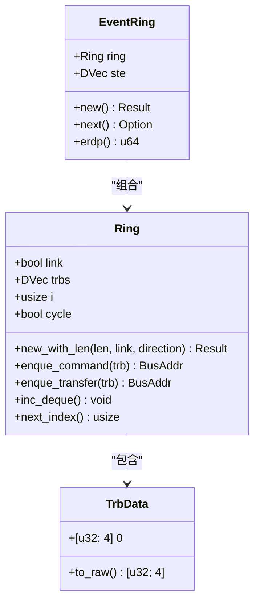
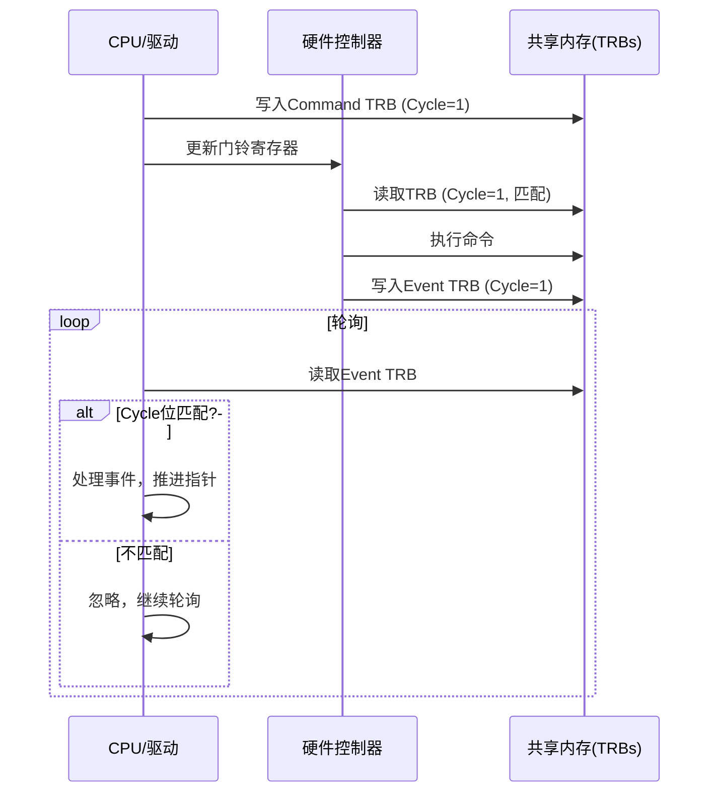
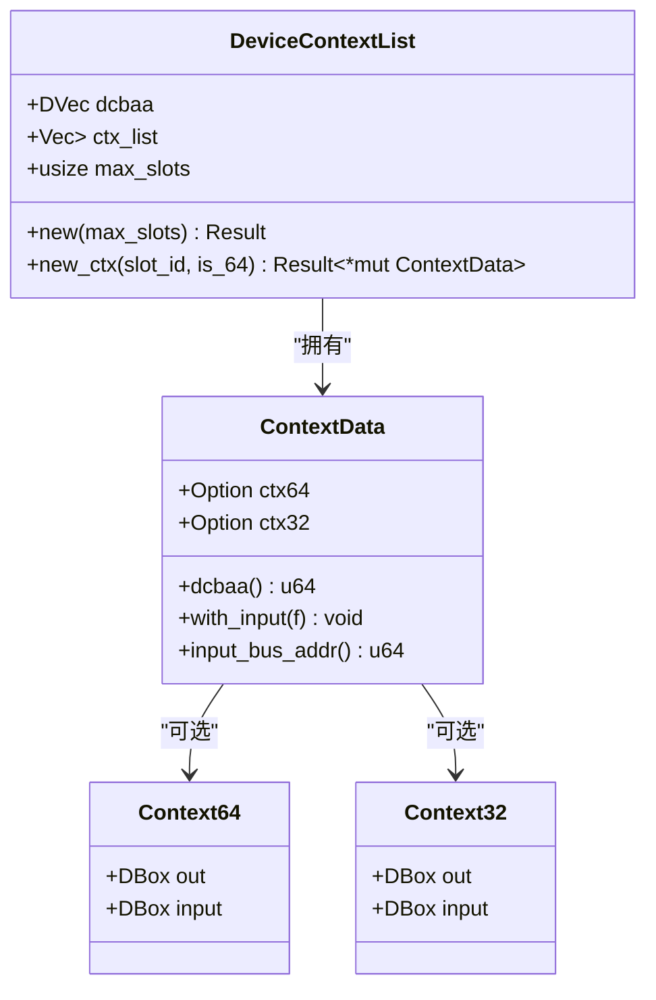

<cite>
**本文档引用的文件**
- [design.md](file://doc/design.md)
- [ring/mod.rs](file://usb-host/src/backend/xhci/ring/mod.rs)
- [context.rs](file://usb-host/src/backend/xhci/context.rs)
- [event.rs](file://usb-host/src/backend/xhci/event.rs)
</cite>

## 目录
1. [引言](#引言)
2. [TRB环形队列设计原理](#trb环形队列设计原理)
3. [无锁并发机制分析](#无锁并发机制分析)
4. [控制器上下文管理](#控制器上下文管理)
5. [性能优势与no_std兼容性](#性能优势与no_std兼容性)
6. [结论](#结论)

## 引言

本文系统性阐述基于TRB（Transfer Request Block）环形队列的无锁并发设计原理。该设计遵循`design.md`中描述的异步模型，将每个TRB作为独立的异步任务载体，在预分配内存中保持执行状态，从而避免运行时竞争条件。通过分析`ring`模块中的环形缓冲区管理机制、内存屏障和原子操作的使用，以及`context.rs`中控制器上下文对多个环形队列生命周期的协调，全面揭示该架构在高吞吐量场景下的性能优势及其对`#![no_std]`环境的友好特性。

**Section sources**
- [design.md](file://doc/design.md#L1-L15)

## TRB环形队列设计原理

### 环形缓冲区结构

`Ring`结构体是XHCI主机控制器中命令和数据传输的核心组件。它由一个预分配的`DVec<TrbData>`构成，其中`TrbData`是一个透明表示的4×32位数组，用于存储各种类型的TRB（如命令、传输、链接等）。这种预分配机制确保了所有TRB在初始化时即存在于物理连续的DMA可访问内存中，消除了运行时动态内存分配的需求和相关开销。

环形队列支持两种模式：带链接（link）和不带链接。在链接模式下，当写入指针接近缓冲区末尾时，会自动插入一个Link TRB并重置索引，同时翻转周期位（cycle bit），实现无缝循环。这一机制保证了硬件可以持续不断地从环形队列中读取指令，而无需软件频繁干预。

**Diagram sources**
- [ring/mod.rs](file://usb-host/src/backend/xhci/ring/mod.rs#L25-L157)
- [event.rs](file://usb-host/src/backend/xhci/event.rs#L18-L65)

**Section sources**
- [ring/mod.rs](file://usb-host/src/backend/xhci/ring/mod.rs#L25-L157)

### 写入与推进机制

`enque_command`和`enque_transfer`方法负责将不同类型的TRB写入环形队列。在写入前，会根据当前`cycle`标志设置或清除TRB中的周期位。随后调用`enque_trb`将数据写入当前索引位置，并通过`next_index`推进写指针。

`next_index`方法实现了核心的循环逻辑：当达到缓冲区末尾时，若为链接模式，则在最后一个位置写入Link TRB并重置索引至0，同时翻转`cycle`标志；否则直接重置索引。对于非链接模式，则在到达末尾后直接归零索引。`inc_deque`方法用于消费已完成的TRB，其逻辑类似，但在索引归零时也会翻转`cycle`标志。

## 无锁并发机制分析

### 周期位协议

该设计的核心无锁机制依赖于“周期位协议”（Cycle Bit Protocol）。`cycle`布尔字段代表当前环形队列的活动周期。每当硬件或软件绕过环形缓冲区一圈时，该位就会翻转。每个写入的TRB都会携带当前的周期位值。

在事件处理端，`EventRing::next`方法通过比较当前TRB的周期位与环形队列的`cycle`标志来判断该TRB是否已“生效”。只有当两者匹配时，才认为该事件是新的且有效的。这有效地解决了生产者-消费者问题中的边界情况，允许多个线程（或CPU与设备）安全地并发访问同一块内存区域，而无需传统的互斥锁。

**Diagram sources**
- [ring/mod.rs](file://usb-host/src/backend/xhci/ring/mod.rs#L74-L87)
- [event.rs](file://usb-host/src/backend/xhci/event.rs#L46-L55)

### 内存屏障

为了确保内存操作的顺序性，防止编译器或CPU进行可能导致竞态的重排序，代码在关键路径上使用了显式的内存屏障。在`event.rs`中，`mbarrier::mb()`函数在确认事件TRB有效后被调用。这个全内存屏障（full memory barrier）强制要求在此之前的内存读写操作必须在屏障之后的操作之前完成。

这对于保证事件处理的正确性至关重要：必须确保在读取到带有正确周期位的事件TRB之后，再读取该事件所关联的任何其他数据结构（如传输完成状态、数据包信息等），以避免读取到旧的或未更新的数据。

**Section sources**
- [event.rs](file://usb-host/src/backend/xhci/event.rs#L46-L55)

## 控制器上下文管理

### 设备上下文列表

`DeviceContextList`结构体管理着XHCI主机控制器中所有设备槽（Slot）的上下文。它包含一个DMA可访问的`dcbaa`（Device Context Base Address Array）数组，该数组存储指向各个设备上下文的物理地址。`ctx_list`向量则持有这些上下文的Rust所有权。

`new_ctx`方法用于为指定的设备槽创建一个新的`ContextData`实例。它首先构造上下文对象，然后将其基地址写入`dcbaa`数组的对应位置，并将上下文本身存入`ctx_list`。这种设计将硬件可见的地址表与软件管理的对象生命周期清晰地分离。

**Diagram sources**
- [context.rs](file://usb-host/src/backend/xhci/context.rs#L1-L194)

### 上下文数据与输入处理

`ContextData`封装了设备上下文的具体实现，支持32字节和64字节两种格式。它通过`with_input`和`with_empty_input`等方法提供安全的接口来修改输入上下文（Input Context），这些方法内部会读取现有的输入上下文，应用用户提供的闭包进行修改，然后再写回。这种方式确保了对DMA内存的访问是原子的，并且符合Rust的所有权规则。

`input_perper_modify`方法展示了如何准备一个用于“配置设备”的输入上下文，它会清除添加和删除上下文的标志位，并为控制端点（Endpoint 0）设置添加标志。这体现了控制器上下文如何协调底层硬件操作。

**Section sources**
- [context.rs](file://usb-host/src/backend/xhci/context.rs#L1-L194)

## 性能优势与no_std兼容性

### 高吞吐