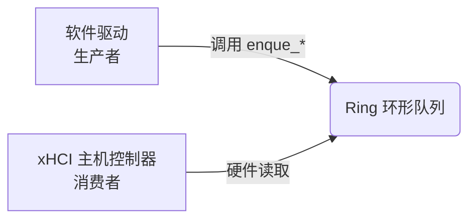
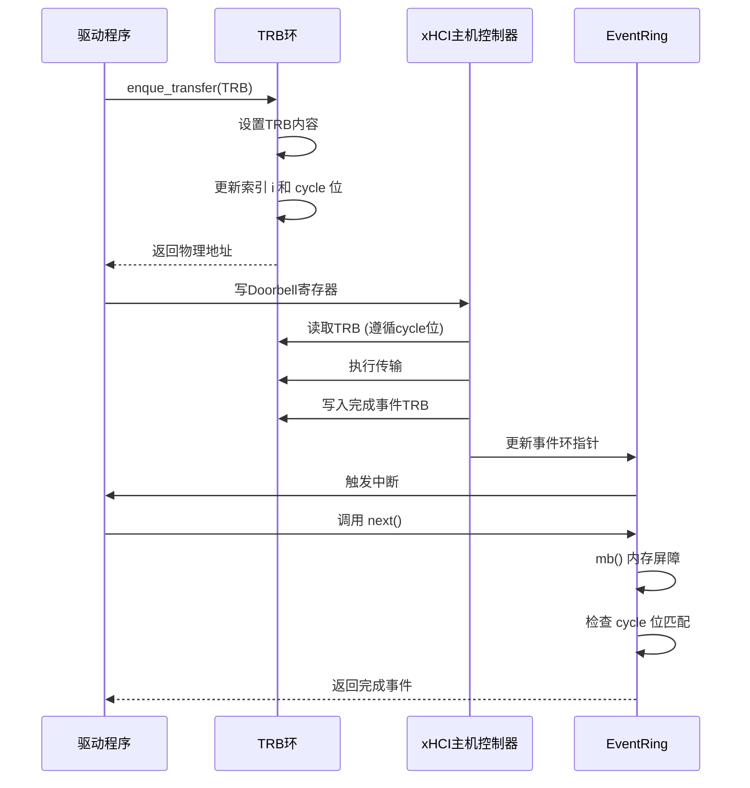

<cite>
**本文档引用的文件**
- [ring/mod.rs](file://usb-host/src/backend/xhci/ring/mod.rs)
- [event.rs](file://usb-host/src/backend/xhci/event.rs)
- [def.rs](file://usb-host/src/backend/xhci/def.rs)
- [queue.rs](file://usb-host/src/backend/libusb/queue.rs)
</cite>

## 目录
1. [引言](#引言)
2. [TRB环形队列核心结构](#trb环形队列核心结构)
3. [内存布局与生产者-消费者模式](#内存布局与生产者-消费者模式)
4. [原子指针更新与内存屏障](#原子指针更新与内存屏障)
5. [事件索引同步机制](#事件索引同步机制)
6. [Doorbell寄存器触发时机](#doorbell寄存器触发时机)
7. [传输请求全流程分析](#传输请求全流程分析)
8. [TRB类型切换逻辑](#trb类型切换逻辑)
9. [高频率数据流性能瓶颈排查](#高频率数据流性能瓶颈排查)
10. [结论](#结论)

## 引言
本文档深入解析CrabUSB驱动中基于xHCI协议的TRB（Transfer Request Block）环形队列工作机制。重点分析`ring/mod.rs`中的环形缓冲区实现，阐述其在生产者-消费者模式下的并发控制、内存屏障应用以及事件同步机制。结合`queue.rs`文件，完整呈现传输请求从入队、硬件处理到完成状态通知的全流程，并提供可视化图示说明不同类型TRB的切换逻辑。

## TRB环形队列核心结构

`Ring`结构体是TRB环形队列的核心实现，封装了底层DMA可访问的`DVec<TrbData>`缓冲区。该结构通过`i`索引和`cycle`标志位共同维护当前读写位置的状态。`TrbData`作为透明表示（`repr(transparent)`），确保其内存布局与四个u32元素的数组完全一致，便于直接映射到硬件可读取的格式。

**Section sources**
- [ring/mod.rs](file://usb-host/src/backend/xhci/ring/mod.rs#L1-L157)

## 内存布局与生产者-消费者模式

### 内存布局
TRB环形队列的内存布局由连续的`TrbData`块构成，每个块大小为16字节（4个u32）。队列的物理总线地址通过`bus_addr()`方法获取，而任意索引`i`处TRB的物理地址则通过`trb_bus_addr(i)`计算得出，即基地址加上偏移量。

### 生产者-消费者模式
该实现采用经典的单生产者-单消费者（SPSC）模型：
- **生产者**：软件驱动通过`enque_command`或`enque_transfer`方法向队列添加新的命令或传输请求。
- **消费者**：xHCI主机控制器硬件作为消费者，从队列前端按序读取并执行TRB。

此模式通过`cycle`标志位和`next_index`方法中的边界检查来协调双方操作，避免覆盖未处理的请求。

**Diagram sources**
- [ring/mod.rs](file://usb-host/src/backend/xhci/ring/mod.rs#L50-L157)

**Section sources**
- [ring/mod.rs](file://usb-host/src/backend/xhci/ring/mod.rs#L50-L157)

## 原子指针更新与内存屏障

### 原子指针更新
`Ring`结构体本身不直接使用原子类型进行指针更新，而是依赖于`cycle`标志位和严格的单线程生产者约束来保证一致性。`i`索引的递增（`next_index`和`inc_deque`）在软件层面是原子操作，因为假设只有一个CPU核心上的驱动代码在修改它。

### 内存屏障
内存屏障的应用是确保硬件能正确感知软件更新的关键。当事件处理器从事件环中取出一个已完成的TRB时，会调用`mbarrier::mb()`函数。这个全内存屏障（full memory barrier）强制刷新所有缓存，确保之前对`cycle`位的修改对xHCI主机控制器可见，防止因缓存不一致导致的竞态条件。

**Diagram sources**
- [ring/mod.rs](file://usb-host/src/backend/xhci/ring/mod.rs#L100-L157)
- [event.rs](file://usb-host/src/backend/xhci/event.rs#L45-L65)
- [mbarrier::mb](file://usb-host/src/backend/xhci/event.rs#L48)

**Section sources**
- [ring/mod.rs](file://usb-host/src/backend/xhci/ring/mod.rs#L100-L157)
- [event.rs](file://usb-host/src/backend/xhci/event.rs#L45-L65)

## 事件索引同步机制

事件索引同步机制的核心在于`cycle`标志位的翻转。每当生产者或消费者越过环形队列的末尾时，`cycle`位就会被翻转。硬件在读取一个TRB时，会检查其`cycle`位是否与环形队列当前的`cycle`标志匹配。只有匹配的TRB才会被视为有效，这有效地将环形队列划分为两个半周期，解决了“空”与“满”的二义性问题。

例如，在`next_index`方法中，当索引到达末尾时，不仅重置索引，还会翻转`self.cycle`，并插入一个带有新`cycle`位的Link TRB。这确保了硬件不会错误地将旧的、已处理过的TRB当作新请求。

**Section sources**
- [ring/mod.rs](file://usb-host/src/backend/xhci/ring/mod.rs#L120-L140)

## Doorbell寄存器触发时机

Doorbell寄存器的触发时机发生在成功将一个或多个TRB入队之后。虽然`ring/mod.rs`本身不直接操作Doorbell寄存器，但其提供的`enque_command`和`enque_transfer`方法返回了新入队TRB的物理总线地址。上层驱动逻辑（通常在`context.rs`或类似文件中）会利用这些信息，向对应设备插槽（Slot）和端点（Endpoint）的Doorbell寄存器写入信号，从而通知xHCI主机控制器有新的工作需要处理。

**Section sources**
- [ring/mod.rs](file://usb-host/src/backend/xhci/ring/mod.rs#L85-L100)

## 传输请求全流程分析

结合`libusb/queue.rs`的实现，可以梳理出完整的传输请求流程：

1.  **用户提交**：用户调用`Queue::submit`方法提交一个传输请求。
2.  **准备TRB**：回调函数`f`被调用，用于配置`USBTransfer`结构体，这最终会转化为一个或多个`transfer::Allowed`类型的TRB。
3.  **入队TRB**：驱动代码调用`Ring::enque_transfer`将TRB放入环形队列，并根据当前`cycle`位设置TRB的`cycle`标志。
4.  **触发Doorbell**：驱动向上层xHCI控制器发送Doorbell信号。
5.  **硬件执行**：xHCI控制器从环中取出TRB并执行USB传输。
6.  **生成事件**：传输完成后，控制器在事件环（Event Ring）中写入一个完成事件TRB。
7.  **轮询与通知**：驱动通过`EventRing::next`方法轮询事件环。该方法使用内存屏障确保可见性，并检查`cycle`位。一旦发现匹配的完成事件，`wait_map`会被更新，从而唤醒等待的用户任务并调用其回调函数。

**Section sources**
- [ring/mod.rs](file://usb-host/src/backend/xhci