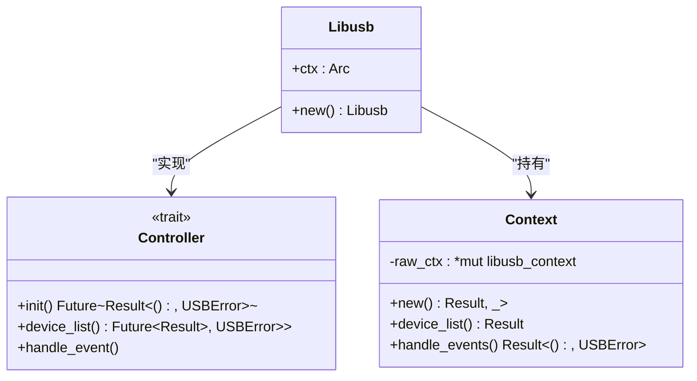
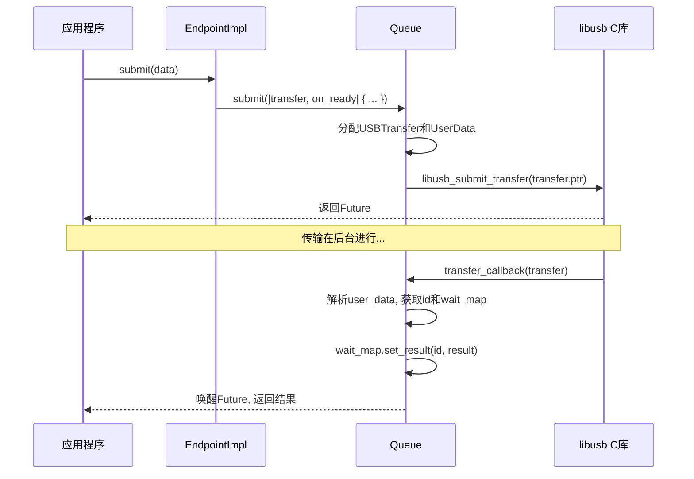

# libusb 后端封装

<cite>
**Referenced Files in This Document **   
- [mod.rs](file://usb-host/src/backend/libusb/mod.rs)
- [context.rs](file://usb-host/src/backend/libusb/context.rs)
- [endpoint.rs](file://usb-host/src/backend/libusb/endpoint.rs)
- [err.rs](file://usb-host/src/backend/libusb/err.rs)
- [interface.rs](file://usb-host/src/backend/libusb/interface.rs)
- [queue.rs](file://usb-host/src/backend/libusb/queue.rs)
- [main.rs](file://test_crates/test_libusb_uvc/src/main.rs)
</cite>

## 目录
1. [引言](#引言)
2. [核心架构与异步适配层](#核心架构与异步适配层)
3. [上下文生命周期管理](#上下文生命周期管理)
4. [端点配置与数据传输](#端点配置与数据传输)
5. [错误处理与资源回收](#错误处理与资源回收)
6. [典型应用示例](#典型应用示例)
7. [性能对比与适用边界](#性能对比与适用边界)

## 引言

CrabUSB 是一个为 Rust 生态设计的 USB 主机驱动框架，其 `libusb` 后端通过 FFI（外部函数接口）对传统的 `libusb` C 库进行封装，旨在将阻塞式、同步的底层 API 无缝集成到现代的 `async/await` 异步编程模型中。本文档深入分析其实现机制，涵盖从全局上下文管理、设备通信到错误转换和资源自动回收的完整技术栈，并探讨其在实际开发中的应用场景。

## 核心架构与异步适配层

`libusb` 后端的核心是 `Libusb` 结构体，它实现了 `usb_if::host::Controller` trait，作为整个后端的控制中心。该结构体持有一个 `Arc<context::Context>` 的引用，确保了上下文可以在多个组件间安全共享。

**Diagram sources**
- [mod.rs](file://usb-host/src/backend/libusb/mod.rs#L1-L65)
- [context.rs](file://usb-host/src/backend/libusb/context.rs#L1-L72)

**Section sources**
- [mod.rs](file://usb-host/src/backend/libusb/mod.rs#L1-L65)
- [context.rs](file://usb-host/src/backend/libusb/context.rs#L1-L72)

### 异步化原理

`libusb` 库本身是同步阻塞的。为了适应 `async/await` 模型，CrabUSB 采用了“事件循环+回调”的模式。`Libusb` 实例会启动一个独立的线程来持续调用 `context::Context::handle_events()` 方法。这个方法内部会调用 `libusb_handle_events()`，这是一个阻塞调用，负责处理所有来自 USB 子系统的异步事件（如传输完成、设备断开等）。

当用户代码通过 `submit` 提交一个传输请求时，该请求会被放入一个队列中并立即返回一个 `Future`。一旦 `libusb_handle_events()` 检测到该传输完成，它会触发一个 C 回调函数 (`transfer_callback`)。这个回调最终会唤醒对应的 `Future`，使其得以继续执行，从而实现了非阻塞的异步语义。

## 上下文生命周期管理

`context.rs` 文件定义了 `Context` 结构体，它是对 `libusb_context` 句柄的安全封装。

**关键特性：**

1.  **线程安全 (Send + Sync)**：`Context` 被标记为 `unsafe impl Send + Sync`，这允许它被安全地跨线程传递和共享。这是实现多线程事件处理的基础。
2.  **RAII 资源管理**：虽然当前代码中 `Drop` 实现被注释掉了，但其设计意图是明确的——当 `Context` 实例离开作用域时，应自动调用 `libusb_exit()` 来释放底层的 `libusb_context` 资源，防止内存泄漏。
3.  **设备列表迭代器**：`device_list()` 方法返回一个 `DeviceList` 迭代器，它包装了 `libusb_get_device_list` 的结果。`DeviceList` 自身也实现了 `Drop`，确保在迭代完成后调用 `libusb_free_device_list` 进行清理。

**Section sources**
- [context.rs](file://usb-host/src/backend/libusb/context.rs#L1-L72)

## 端点配置与数据传输

`endpoint.rs` 和 `interface.rs` 共同完成了端点级别的通信封装。

### 端点抽象 (`EndpointImpl`)

`EndpointImpl` 结构体是所有类型端点（批量、中断、等时）的统一实现。它通过 `address` 字段标识具体的端点地址，并持有一个指向 `libusb_device_handle` 的原始指针。

对于每种传输类型，`EndpointImpl` 都实现了相应的 trait：
*   `EndpointBulkIn` / `EndpointBulkOut`
*   `EndpointInterruptIn` / `EndpointInterruptOut`
*   `EndpintIsoIn` / `EndpintIsoOut`

这些 `submit` 方法的共同模式是：接收用户的数据缓冲区，然后通过 `queue::Queue` 的 `submit` 或 `submit_iso` 方法，使用 `libusb_fill_*_transfer` 系列函数填充一个 `libusb_transfer` 结构体，并提交给 `libusb`。

### 等时传输特殊处理

等时传输（ISO）用于音视频流，对实时性要求高。`EndpointImpl` 对 ISO 输入 (`iso_in_on_ready`) 提供了一个特殊的就绪回调。该回调会在每个 ISO 数据包传输完成后被调用，允许驱动程序检查每个数据包的状态（成功或失败），并对失败的数据包进行填充（例如清零），保证上层应用接收到的数据流完整性。

### 接口操作 (`InterfaceImpl`)

`InterfaceImpl` 封装了接口级别的操作，如 `control_in/out` 控制传输、`set_alt_setting` 切换备用设置以及创建各种类型的端点实例。

**Diagram sources**
- [endpoint.rs](file://usb-host/src/backend/libusb/endpoint.rs#L1-L191)
- [queue.rs](file://usb-host/src/backend/libusb/queue.rs#L1-L162)

**Section sources**
- [endpoint.rs](file://usb-host/src/backend/libusb/endpoint.rs#L1-L191)
- [interface.rs](file://usb-host/src/backend/libusb/interface.rs#L1-L98)
- [queue.rs](file://usb-host/src/backend/libusb/queue.rs#L1-L162)

## 错误处理与资源回收

### 错误码转换

`err.rs` 文件是错误处理的核心。

1.  **宏 `usb!`**：这是一个关键的宏，用于包裹所有 `libusb` 的 C 函数调用。它调用 `libusb_error_to_usb_error` 函数。
2.  **`libusb_error_to_usb_error`**：该函数将 `libusb` 的整数错误码（如 `LIBUSB_ERROR_TIMEOUT`）转换为更高级别的 `usb_if::host::USBError` 枚举。这实现了从底层库错误到通用 USB 错误的映射。
3.  **`transfer_status_to_result`**：此函数专门处理传输完成后的状态码（`libusb_transfer.status`），将其转换为 `usb_if::err::TransferError`，用于表示传输过程中的具体问题（超时、取消、STALL等）。

### 线程安全与资源自动回收

*   **`Send/Sync`**：`Context`、`EndpointImpl` 和 `USBTransfer` 等关键结构体都显式地实现了 `Send` 和 `Sync`，确保了它们可以在线程间安全移动和共享。
*   **`Drop` 特质**：`DeviceList` 和 `USBTransfer` 结构体都实现了 `Drop`。`DeviceList` 在销毁时释放设备列表内存，`USBTransfer` 在销毁时调用 `libusb_free_transfer` 释放 `libusb_transfer` 结构体内存。这种 RAII 模式是资源自动回收的关键。

**Section sources**
-