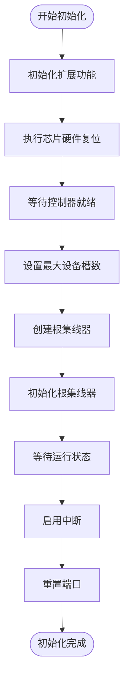
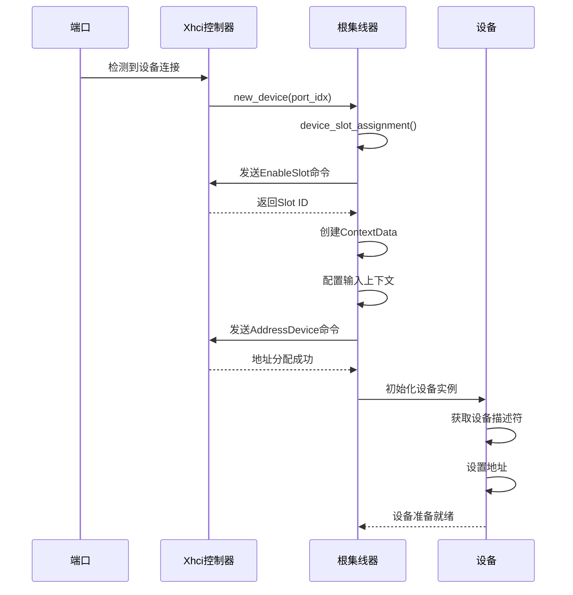

# xHCI 后端实现

<cite>
**本文档引用的文件**
- [mod.rs](file://usb-host/src/backend/xhci/mod.rs)
- [ring/mod.rs](file://usb-host/src/backend/xhci/ring/mod.rs)
- [context.rs](file://usb-host/src/backend/xhci/context.rs)
- [reg.rs](file://usb-host/src/backend/xhci/reg.rs)
- [event.rs](file://usb-host/src/backend/xhci/event.rs)
- [root.rs](file://usb-host/src/backend/xhci/root.rs)
- [device.rs](file://usb-host/src/backend/xhci/device.rs)
</cite>

## 目录
1. [引言](#引言)
2. [初始化流程](#初始化流程)
3. [设备枚举机制](#设备枚举机制)
4. [中断处理逻辑](#中断处理逻辑)
5. [TRB环形队列设计](#trb环形队列设计)
6. [控制器上下文管理](#控制器上下文管理)
7. [硬件寄存器访问](#硬件寄存器访问)
8. [DMA缓冲区与事件环](#dma缓冲区与事件环)
9. [命令调度过程](#命令调度过程)
10. [xHCI规范对比与优化](#xhci规范对比与优化)
11. [硬件兼容性调试](#硬件兼容性调试)
12. [性能调优建议](#性能调优建议)

## 引言
CrabUSB中的xHCI主机控制器后端实现提供了一个完整的USB 3.0主机控制器驱动框架。该实现遵循xHCI（可扩展主机控制器接口）规范，支持从设备检测到数据传输的完整生命周期管理。本文档深入解析其核心组件和工作机制，重点关注初始化、设备枚举、中断处理等关键流程。

## 初始化流程
xHCI控制器的初始化遵循严格的时序要求，确保硬件处于正确状态后才进行配置。`Xhci::init()`方法实现了这一复杂流程。

首先，通过`init_ext_caps().await?`初始化扩展功能，特别是处理传统USB支持能力。随后执行芯片硬件复位，等待控制器就绪标志清除。在`chip_hardware_reset()`中，先停止控制器运行，等待其完全停止后，再发起主机控制器复位并等待完成。

接着，通过读取`hcsparams1`寄存器获取最大设备槽数量，并将其写入`CONFIG`寄存器的`MaxSlotsEn`字段以启用相应数量的设备槽。创建根集线器实例并初始化，最后等待控制器进入运行状态，启用中断并重置所有端口。



**图示来源**
- [mod.rs](file://usb-host/src/backend/xhci/mod.rs#L27-L60)
- [root.rs](file://usb-host/src/backend/xhci/root.rs#L107-L158)

**章节来源**
- [mod.rs](file://usb-host/src/backend/xhci/mod.rs#L27-L60)
- [root.rs](file://usb-host/src/backend/xhci/root.rs#L107-L158)

## 设备枚举机制
设备枚举是将物理连接的USB设备转化为软件可操作对象的过程。当端口检测到设备连接时，系统启动枚举流程。

`new_device()`方法负责为新连接的设备分配资源。首先通过发送`EnableSlot`命令获取一个设备槽ID。然后根据控制器能力决定使用32字节还是64字节上下文格式，创建相应的`ContextData`并通过`DeviceContextList`管理。使用`DCBAAP`寄存器指向设备上下文基址数组。

设备地址化阶段，构建输入上下文，包含槽上下文和控制端点0上下文。槽上下文中设置端口号、路由字符串和速度等信息。控制端点上下文中指定最大包大小、传输环起始地址等。通过`AddressDevice`命令提交这些信息，使控制器为设备分配唯一地址。



**图示来源**
- [mod.rs](file://usb-host/src/backend/xhci/mod.rs#L62-L110)
- [device.rs](file://usb-host/src/backend/xhci/device.rs#L100-L200)
- [root.rs](file://usb-host/src/backend/xhci/root.rs#L500-L600)

**章节来源**
- [mod.rs](file://usb-host/src/backend/xhci/mod.rs#L62-L110)
- [device.rs](file://usb-host/src/backend/xhci/device.rs#L100-L200)

## 中断处理逻辑
中断处理是xHCI控制器响应硬件事件的核心机制。`handle_event()`方法被定期调用以检查和处理各种中断源。

主要处理三种中断：事件中断、端口变化检测和主机系统错误。事件中断由事件环产生，指示命令完成或传输完成。端口变化中断表示有设备插入或拔出，此时唤醒等待的端口任务。主机系统错误需要特殊处理以恢复系统稳定性。

事件处理委托给`Root`结构体的`handle_event()`方法。它清理事件环中的已完成事件，更新事件环出队指针，并清除中断挂起状态。对于命令完成事件，通过`WaitMap`机制通知等待结果的任务；对于传输事件，则更新传输完成状态。

```mermaid
flowchart TD
    A[开始处理中断] --> B{读取USBSTS寄存器}
    B --> C{事件中断?}
    C -->|是| D[调用Root.handle_event()]
    C -->|否| E{端口变化?}
    E -->|是| F[唤醒端口任务]
    E -->|否| G{主机系统错误?}
    G -->|是| H[清除错误标志]
    G -->|否| I[无操作]
    D --> J[处理事件环]
    J --> K