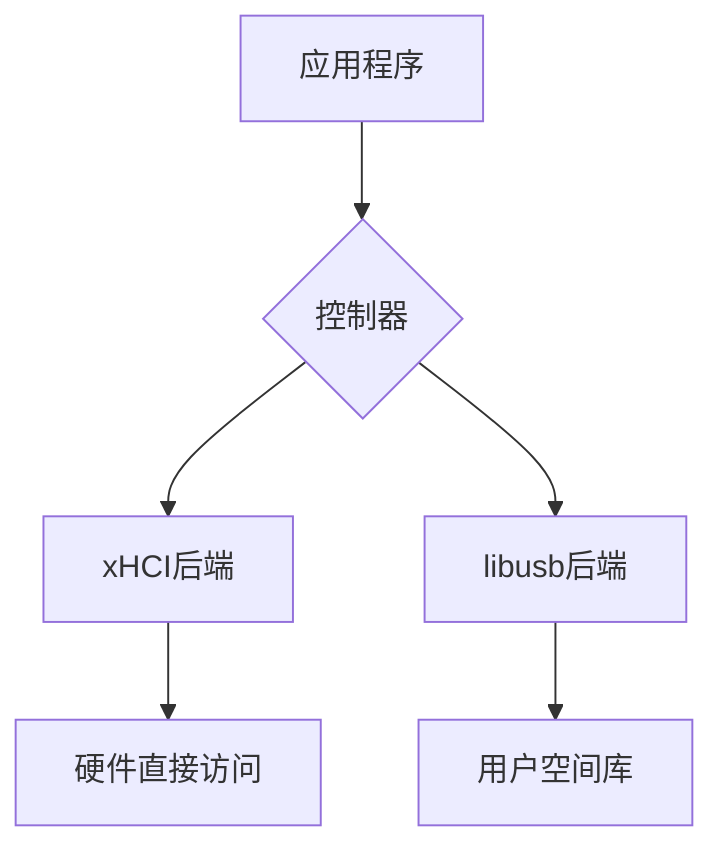
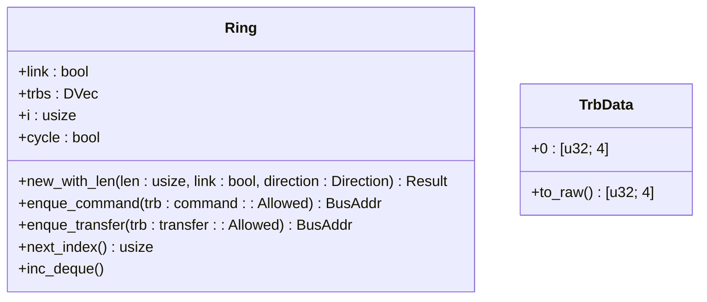

# 核心功能详解

<cite>
**Referenced Files in This Document**
- [ring/mod.rs](file://usb-host/src/backend/xhci/ring/mod.rs)
- [xhci/mod.rs](file://usb-host/src/backend/xhci/mod.rs)
- [libusb/mod.rs](file://usb-host/src/backend/libusb/mod.rs)
- [event.rs](file://usb-host/src/backend/xhci/event.rs)
- [context.rs](file://usb-host/src/backend/libusb/context.rs)
- [reg.rs](file://usb-host/src/backend/xhci/reg.rs)
- [lib.rs](file://usb-host/src/lib.rs)
</cite>

## 目录
1. [异步操作与无锁设计](#异步操作与无锁设计)
2. [双后端支持机制](#双后端支持机制)
3. xHCI后端实现
   - [TRB环形队列工作原理](#trb环形队列工作原理)
   - [事件处理流程](#事件处理流程)
   - [寄存器映射机制](#寄存器映射机制)
4. libusb后端实现
   - [用户空间API封装](#用户空间api封装)
   - [统一接口提供](#统一接口提供)
5. 后端性能对比与选择建议
6. 异步模型与中断驱动结合
7. 内存屏障与原子操作应用
8. 性能基准测试与优化建议

## 异步操作与无锁设计

CrabUSB框架通过`async/await`模型实现了高效的异步I/O操作，避免了传统阻塞调用带来的性能瓶颈。该设计充分利用了Rust的零成本抽象特性，在保证类型安全的同时实现了接近裸机的运行效率。

在无锁设计方面，框架通过精心设计的数据结构和内存管理策略，最大限度地减少了对互斥锁的依赖。核心组件如TRB（Transfer Request Block）环形队列采用循环缓冲区设计，配合内存屏障确保多线程环境下的数据一致性。这种设计不仅提高了并发性能，还降低了死锁风险。

**Section sources**
- [lib.rs](file://usb-host/src/lib.rs#L1-L29)
- [xhci/mod.rs](file://usb-host/src/backend/xhci/mod.rs#L1-L300)

## 双后端支持机制

CrabUSB框架提供了两种不同的后端实现：xHCI后端和libusb后端，以适应不同场景的需求。这两种后端通过统一的抽象接口对外提供服务，使得上层应用无需关心底层实现细节。

xHCI后端直接与硬件交互，适用于需要高性能和低延迟的嵌入式系统或内核级应用。而libusb后端则运行在用户空间，通过标准的libusb库与USB设备通信，更适合桌面应用和快速原型开发。

两种后端都实现了相同的`Controller` trait，确保了API的一致性。这种模块化设计允许开发者根据具体需求灵活选择最合适的后端，甚至可以在运行时动态切换。

**Diagram sources**
- [xhci/mod.rs](file://usb-host/src/backend/xhci/mod.rs#L1-L300)
- [libusb/mod.rs](file://usb-host/src/backend/libusb/mod.rs#L1-L65)

**Section sources**
- [xhci/mod.rs](file://usb-host/src/backend/xhci/mod.rs#L1-L300)
- [libusb/mod.rs](file://usb-host/src/backend/libusb/mod.rs#L1-L65)

## xHCI后端实现

### TRB环形队列工作原理

xHCI后端的核心是TRB（Transfer Request Block）环形队列，它作为主机控制器与驱动程序之间的通信桥梁。每个TRB包含四个32位字，用于描述特定类型的USB传输请求。

环形队列的设计采用了循环索引和周期位（Cycle Bit）机制来区分有效和无效的TRB。当生产者向队列添加新的TRB时，会根据当前周期位设置相应的标志；消费者在处理TRB时，会检查周期位以确定是否为最新数据。这种机制避免了复杂的锁竞争，实现了高效的无锁队列操作。

队列的最后一个位置通常被Link TRB占据，用于连接到队列的起始位置，形成真正的"环形"结构。当遍历到Link TRB时，系统会自动重置索引并翻转周期位，从而无缝地继续处理后续请求。

**Diagram sources**
- [ring/mod.rs](file://usb-host/src/backend/xhci/ring/mod.rs#L1-L158)

**Section sources**
- [ring/mod.rs](file://usb-host/src/backend/xhci/ring/mod.rs#L1-L158)

### 事件处理流程

xHCI后端的事件处理基于中断驱动模型。当USB总线上发生重要事件（如设备连接、断开或数据传输完成）时，主机会产生中断信号。驱动程序通过轮询或中断处理函数读取事件环形队列中的事件TRB来响应这些事件。

事件处理流程始于`handle_event`方法，该方法首先检查USB状态寄存器中的事件标志位。如果检测到事件中断，则从事件环形队列中获取最新的事件TRB进行处理。处理完成后，清除相应的中断标志位，完成整个事件循环。

这种设计确保了事件的及时响应，同时避免了频繁的轮询带来的CPU资源浪费。通过将事件处理与命令执行分离，系统能够高效地管理多个并发的USB操作。

**Section sources**
- [event.rs](file://usb-host/src/backend/xhci/event.rs#L1-L66)
- [xhci/mod.rs](file://usb-host/src/backend/xhci/mod.rs#L1-L300)

### 寄存器映射机制

xHCI后端通过内存映射I/O（MMIO）方式访问硬件寄存器。`XhciRegisters`结构体封装了对所有xHCI寄存器的访问，包括能力寄存器、操作寄存器和端口寄存器等。

寄存器映射使用了Rust的Deref和DerefMut特性，使得对`XhciRegisters`实例的操作可以直接转发到底层的寄存器结构。这种设计既保持了类型安全性，又提供了直观的API接口。

为了防止并发访问冲突，关键的寄存器操作被包装在临时的禁用中断保护区内。`DisableIrqGuard`结构体实现了RAII模式，在其生命周期内自动管理中断使能状态，确保了寄存器操作的原子性。

**Section sources**
- [reg.rs](file://usb-host/src/backend/xhci/reg.rs#L1-L89)
- [xhci/mod.rs](file://usb-host/src/backend/xhci/mod.rs#L1-L300)

## libusb后端实现

### 用户空间API封装

libusb后端通过FFI（Foreign Function Interface）技术封装了libusb1_sys库提供的C语言API。`Context`结构体作为核心封装单元，管理着libusb上下文的生命周期，并提供了安全的Rust接口。

所有的libusb调用都被包装在`usb!`宏中，该宏负责处理错误码转换，将C风格的返回值映射为Rust的Result类型。这种设计不仅提高了代码的安全性，还简化了错误处理逻辑。

对于设备列表等动态资源，后端实现了迭代器模式和Drop trait，确保资源在使用完毕后能够正确释放，避免了常见的内存泄漏问题。

**Section sources**
- [context.rs](file://usb-host/src/backend/libusb/context.rs#L1-L72)
- [libusb/mod.rs](file://usb-host/src/backend/libusb/mod.rs#L1-L65)

### 统一接口提供

尽管libusb后端运行在用户空间，但它通过实现与xHCI后端相同的`Controller` trait，提供了完全一致的外部接口。`init`方法返回一个空的异步块，因为libusb上下文已经在构造函数中初始化完成。

`device_list`方法异步地获取当前连接的USB设备列表，并将其转换为统一的`DeviceInfo`对象。`handle_event`方法则调用libusb的事件处理函数，确保后台事件能够被及时处理。

这种统一接口的设计使得上层应用可以无缝地在两种后端之间切换，极大地提高了框架的灵活性和可移植性。

**Section sources**
- [libusb/mod.rs](file://usb-host/src/backend/libusb/mod.rs#L1-L65)

## 后端性能对比与选择建议

| 特性 | xHCI后端 | libusb后端 |
|------|---------|----------|
| 性能 | 高（直接硬件访问） | 中等（用户空间开销） |
| 延迟 | 低 | 较高 |
| 安全性 | 需要特权权限 | 沙箱环境更安全 |
| 调试便利性 | 复杂 | 简单 |
| 适用场景 | 嵌入式系统、内核模块 | 桌面应用、快速开发 |

**选择建议：**
- 对于追求极致性能和低延迟的应用（如实时音视频传输），推荐使用xHCI后端。
- 对于需要快速开发和调试的应用，或者运行在受限环境中的应用，libusb后端是更好的选择。
- 在生产环境中，可以考虑使用xHCI后端；而在开发和测试阶段，使用libusb后端可以提高开发效率。

## 异步模型与中断驱动结合

CrabUSB巧妙地将`async/await`异步模型与底层的中断驱动机制相结合。高层的异步API为开发者提供了简洁的编程接口，而底层的中断处理确保了系统的高响应性和低延迟。

当发起一个异步