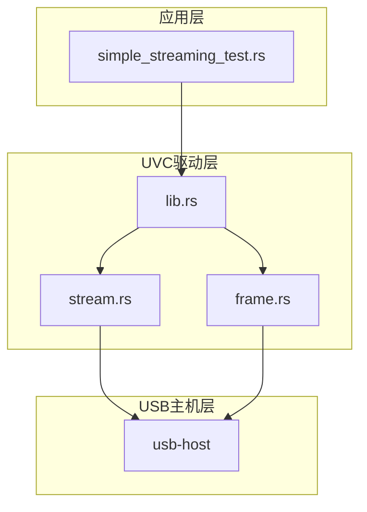
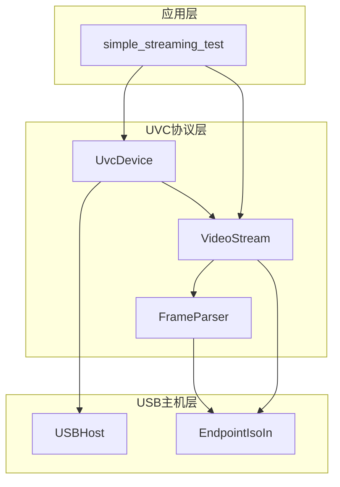
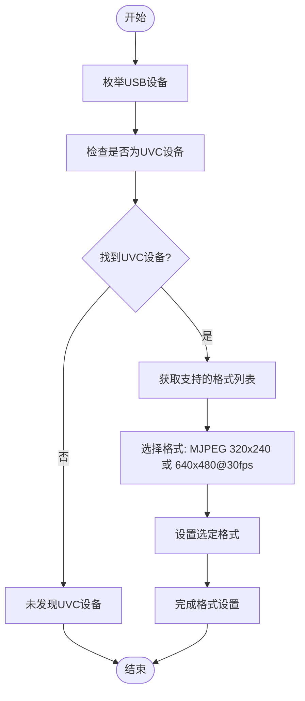

# UVC流传输验证

<cite>
**本文档引用的文件**
- [simple_streaming_test.rs](file://usb-device/uvc/examples/simple_streaming_test.rs)
- [stream.rs](file://usb-device/uvc/src/stream.rs)
- [frame.rs](file://usb-device/uvc/src/frame.rs)
- [lib.rs](file://usb-device/uvc/src/lib.rs)
</cite>

## 目录
1. [简介](#简介)
2. [项目结构](#项目结构)
3. [核心组件](#核心组件)
4. [架构概述](#架构概述)
5. [详细组件分析](#详细组件分析)
6. [依赖关系分析](#依赖关系分析)
7. [性能考量](#性能考量)
8. [故障排除指南](#故障排除指南)
9. [结论](#结论)

## 简介
本文件深入解析`simple_streaming_test.rs`示例程序，阐述其作为诊断工具在UVC等时传输问题中的关键作用。文档将详细说明程序如何查找UVC设备、获取支持的视频格式列表，并优先选择MJPEG 320x240或640x480@30fps进行测试。同时，解释set_format和start_streaming调用序列的语义，以及recv帧接收机制的设计考量。分析注释中重试逻辑与RequestQueueFull错误处理策略，提供优化建议以提升流健壮性，并指导开发者如何扩展此测试以记录吞吐量、延迟和丢帧率指标。

## 项目结构
该项目是一个基于Rust的USB UVC（Video Class）设备驱动库，主要包含以下模块：
- `usb-device/uvc`: 核心UVC设备驱动实现
- `usb-host`: USB主机控制器抽象层
- `usb-if`: USB接口定义
- `test_crates`: 各类测试套件
- `utils/uvc-frame-parser`: UVC帧解析工具

UVC驱动库位于`usb-device/uvc`目录下，包含示例代码、源码实现和测试用例。

**图示来源**
- [simple_streaming_test.rs](file://usb-device/uvc/examples/simple_streaming_test.rs)
- [lib.rs](file://usb-device/uvc/src/lib.rs)
- [stream.rs](file://usb-device/uvc/src/stream.rs)
- [frame.rs](file://usb-device/uvc/src/frame.rs)

**本节来源**
- [simple_streaming_test.rs](file://usb-device/uvc/examples/simple_streaming_test.rs)
- [lib.rs](file://usb-device/uvc/src/lib.rs)

## 核心组件
`simple_streaming_test.rs`示例程序是用于诊断UVC等时传输问题的核心测试工具。它通过创建USB主机实例来探测和连接UVC设备，获取设备支持的视频格式列表，并尝试设置特定的MJPEG格式进行流传输测试。程序实现了完整的UVC设备生命周期管理，包括设备发现、格式协商、流启动和帧接收等关键操作。

该测试程序特别关注于验证基础的视频流功能是否正常工作，通过简单的帧接收操作来确认数据通道的连通性。当遇到RequestQueueFull等错误时，程序会进行适当的等待和重试，体现了基本的错误恢复能力。

**本节来源**
- [simple_streaming_test.rs](file://usb-device/uvc/examples/simple_streaming_test.rs)
- [lib.rs](file://usb-device/uvc/src/lib.rs)

## 架构概述
整个UVC驱动系统采用分层架构设计，从上到下分别为应用层、UVC协议层和USB主机抽象层。应用层通过UVC协议层提供的高级API与设备交互，而UVC协议层则依赖于底层的USB主机抽象来完成实际的数据传输。

在UVC协议层内部，系统进一步划分为设备管理、流控制和帧解析三个主要组件。设备管理负责UVC设备的发现和初始化；流控制处理视频格式设置和流启停操作；帧解析则专注于从原始USB数据包中提取出完整的视频帧。

**图示来源**
- [simple_streaming_test.rs](file://usb-device/uvc/examples/simple_streaming_test.rs)
- [lib.rs](file://usb-device/uvc/src/lib.rs)
- [stream.rs](file://usb-device/uvc/src/stream.rs)
- [frame.rs](file://usb-device/uvc/src/frame.rs)

## 详细组件分析

### 设备发现与格式选择分析
`simple_streaming_test.rs`中的设备发现流程首先通过USB主机枚举所有连接的设备，然后使用`UvcDevice::check`方法识别出符合UVC规范的设备。一旦找到UVC设备，程序会调用`get_supported_formats`方法获取设备支持的所有视频格式。

在格式选择策略上，程序优先寻找320x240分辨率的MJPEG格式，如果未找到则退而求其次选择640x480@30fps的MJPEG格式。这种选择策略考虑到了不同分辨率对带宽的需求差异，较小的分辨率更有可能在各种USB总线条件下成功传输，从而提高测试的可靠性。

**图示来源**
- [simple_streaming_test.rs](file://usb-device/uvc/examples/simple_streaming_test.rs)
- [lib.rs](file://usb-device/uvc/src/lib.rs)

**本节来源**
- [simple_streaming_test.rs](file://usb-device/uvc/examples/simple_streaming_test.rs)
- [lib.rs](file://usb-device/uvc/src/lib.rs)

### 流设置与启动机制分析
UVC流的设置和启动过程遵循标准的UVC协议流程。`set_format`方法首先构建一个StreamControl结构体，其中包含了格式索引、帧索引、帧间隔等参数。然后通过VS_PROBE控制请求向设备查询当前的流配置能力，再通过VS_COMMIT请求正式提交配置变更。

`start_streaming`方法在内部会根据当前设置的格式选择最合适的alternate setting，这通常基于端点的最大包大小来决定。系统会选择一个既能满足带宽需求又不过度占用总线资源的配置。一旦选择了合适的配置，就会声明相应的接口并获取同步IN端点，最后创建并返回一个VideoStream实例