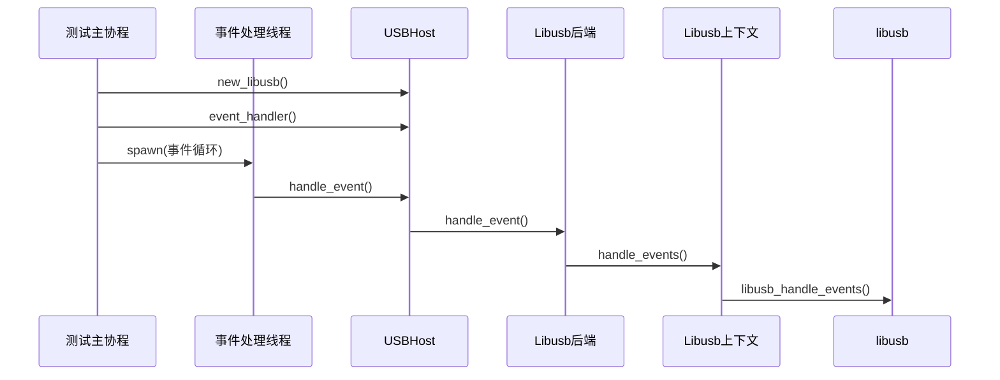

<cite>
**Referenced Files in This Document**  
- [test.rs](file://test_crates/test_libusb/tests/test.rs)
- [lib.rs](file://test_crates/test_libusb/src/lib.rs)
- [mod.rs](file://usb-host/src/backend/libusb/mod.rs)
- [context.rs](file://usb-host/src/backend/libusb/context.rs)
- [device.rs](file://usb-host/src/backend/libusb/device.rs)
- [common/mod.rs](file://usb-host/src/common/mod.rs)
- [common/device.rs](file://usb-host/src/common/device.rs)
</cite>

## 目录
1. [单元与集成测试](#单元与集成测试)
2. [异步事件循环与热插拔处理](#异步事件循环与热插拔处理)
3. [设备枚举与接口匹配验证](#设备枚举与接口匹配验证)
4. [设备操作与数据读取验证](#设备操作与数据读取验证)
5. [接口声明与端点操作路径](#接口声明与端点操作路径)
6. [日志调试信息分析](#日志调试信息分析)
7. [测试用例扩展与故障注入](#测试用例扩展与故障注入)

## 单元与集成测试

本文档详细阐述了基于 `libusb` 后端的单元测试和集成测试实现，重点分析 `test_crates/test_libusb` 中的测试逻辑。通过 `tokio` 运行时模拟异步事件循环，并使用 `event_handler` 处理 USB 热插拔事件。文档将深入解析测试用例中 `device_list` 枚举、接口类匹配（如 `Class::Video`）、设备打开与字符串描述符读取的具体验证逻辑，展示 `claim_interface` 和 `endpoint` 操作的集成路径，并探讨日志调试信息在测试中的作用。

**Section sources**
- [test.rs](file://test_crates/test_libusb/tests/test.rs#L1-L93)
- [common/mod.rs](file://usb-host/src/common/mod.rs#L0-L331)

## 异步事件循环与热插拔处理

测试框架利用 `tokio` 作为异步运行时来驱动整个测试流程。测试入口函数 `test()` 使用 `#[tokio::test]` 宏进行标记，确保其在 `tokio` 的多线程运行时环境中执行。为了持续处理底层 `libusb` 库产生的 USB 事件（如设备插入/拔出），测试代码启动了一个独立的 OS 线程。

该线程通过调用 `USBHost` 实例的 `event_handler()` 方法获取一个 `EventHandler` 对象。此对象被设计为可在线程间安全传递（`Send + Sync`）。线程内部通过一个无限循环不断调用 `event_handler.handle_event()` 方法。该方法最终会触发 `Libusb` 后端的 `handle_event()` 实现，进而调用 `Context::handle_events()` 函数，该函数封装了对原生 `libusb_handle_events()` C 函数的调用，从而实现了非阻塞的事件轮询机制，确保了热插拔事件能够被及时捕获和处理。



**Diagram sources**
- [test.rs](file://test_crates/test_libusb/tests/test.rs#L10-L20)
- [common/mod.rs](file://usb-host/src/common/mod.rs#L280-L331)
- [mod.rs](file://usb-host/src/backend/libusb/mod.rs#L50-L60)
- [context.rs](file://usb-host/src/backend/libusb/context.rs#L25-L30)

**Section sources**
- [test.rs](file://test_crates/test_libusb/tests/test.rs#L10-L20)
- [common/mod.rs](file://usb-host/src/common/mod.rs#L280-L331)

## 设备枚举与接口匹配验证

测试的核心起点是设备枚举。测试首先调用 `USBHost` 的 `device_list().await` 方法，该方法是一个异步过程，它会委托给底层的 `Libusb` 控制器。`Libusb` 控制器通过其持有的 `Context` 实例调用 `device_list()` 方法，该方法最终使用 `libusb_get_device_list()` 获取当前连接的所有 USB 设备的原始列表。

`device_list()` 返回一个包含 `DeviceInfo` 对象的迭代器。每个 `DeviceInfo` 封装了一个物理设备的基本信息，如厂商ID、产品ID和设备描述符。测试用例随后遍历这些设备，并进一步检查其接口描述符。通过调用 `device.interface_descriptors()`，测试可以获取设备所有配置下所有接口的第一个备用设置。

关键的验证逻辑在于接口类别的匹配。测试代码使用模式匹配 `matches!(iface.class(), Class::Video | Class::AudioVideo(_))` 来识别视频类设备。一旦发现符合 `Class::Video` 或 `AudioVideo` 类型的接口，测试即认为找到了目标设备，并将其信息存储起来用于后续的深度测试。

```mermaid
flowchart TD
A[开始设备枚举] --> B{调用 device_list().await}
B --> C[获取 Libusb 后端]
C --> D[调用 Context.device_list()]
D --> E[执行 libusb_get_device_list()]
E --> F[返回原始设备指针列表]
F --> G[转换为 DeviceInfo 对象]
G --> H[返回 DeviceInfo 迭代器]
H --> I[遍历每个 DeviceInfo]
I --> J[获取接口描述符列表]
J --> K{接口类别是否为<br/>Class::Video 或 AudioVideo?}
K --> |是| L[标记为目标设备]
K --> |否| M[继续下一个设备]
```

**Diagram sources**
- [test.rs](file://test_crates/test_libusb/tests/test.rs#L21-L35)
- [mod.rs](file://usb-host/src/backend/libusb/mod.rs#L20-L35)
- [context.rs](file://usb-host/src/backend/libusb/context.rs#L10-L20)
- [common/mod.rs](file://usb-host/src/common/mod.rs#L200-L220)
- [common/device.rs](file://usb-host/src/common/device.rs#L250-L280)

**Section sources**
- [test.rs](file://test_crates/test_libusb/tests/test.rs#L21-L35)
- [common/device.rs](file://usb-host/src/common/device.rs#L250-L280)

## 设备操作与数据读取验证

在成功识别并选择目标设备后，测试进入设备操作阶段。首先，通过调用 `DeviceInfo` 的 `open().await` 方法来打开设备。此方法会创建一个 `Device` 实例，该实例持有对 `libusb_device_handle` 的引用，从而获得与设备通信的能力。

接下来，测试尝试读取设备的制造商字符串。这通过检查设备描述符中的 `manufacturer_string_index` 字段来完成。如果索引存在，则调用 `device.string_descriptor(index.get()).await` 方法。该方法构建一个标准的控制传输请求（`GET_DESCRIPTOR`），向设备发起请求以获取指定索引的字符串描述符，并将其从 UTF-16LE 编码解码为 Rust 的 `String` 类型。成功读取并打印制造商信息是验证基本控制传输功能的关键步骤。

```mermaid
sequenceDiagram
    participant Test as 测试代码
    participant Device as Device实例
    participant RawDev as 原始设备句柄
    participant USB as USB总线

    Test->>Device: open().await
    Device->>RawDev: libusb_open()
    RawDev-->>Device: 创建Device实例
    Device-->>Test: 返回Device

    Test->>Device: string_descriptor(index)
    Device->>Device: 构建ControlSetup
    Device->>RawDev: control_in(setup, buffer)
    RawDev->>USB: 发送控制IN包
    USB->>设备: 请求字符串描述符
    设备->>USB: 返回字符串数据
    USB->>RawDev: 接收数据