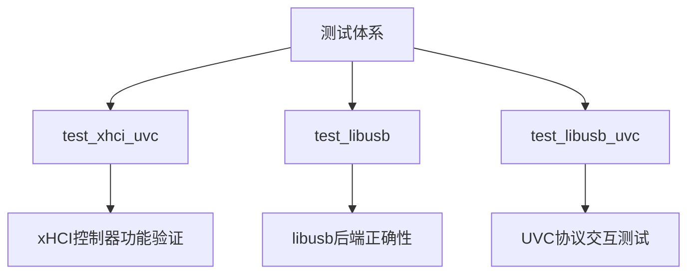
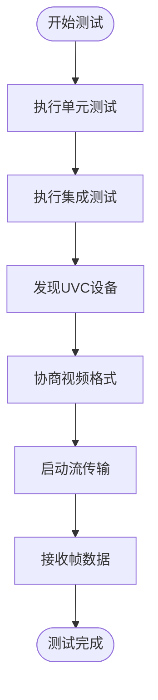
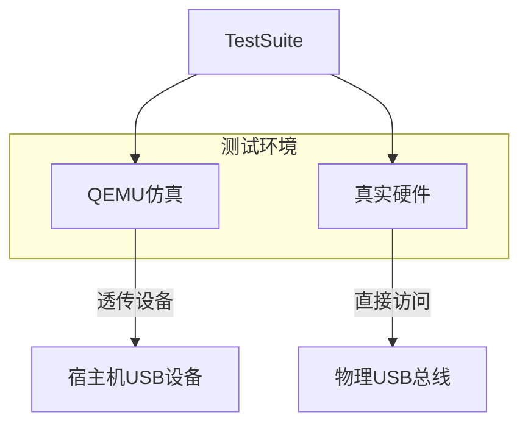
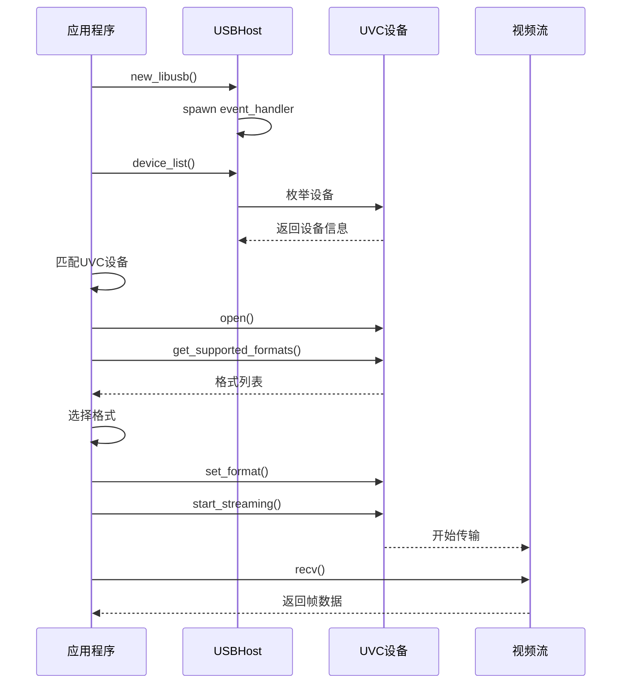

# 测试与验证

<cite>
**本文档引用的文件**
- [test_xhci_uvc/README.md](file://test_crates/test_xhci_uvc/README.md)
- [test_libusb/Cargo.toml](file://test_crates/test_libusb/Cargo.toml)
- [test_xhci_uvc/Cargo.toml](file://test_crates/test_xhci_uvc/Cargo.toml)
- [simple_streaming_test.rs](file://usb-device/uvc/examples/simple_streaming_test.rs)
- [xhci/mod.rs](file://usb-host/src/backend/xhci/mod.rs)
- [libusb/mod.rs](file://usb-host/src/backend/libusb/mod.rs)
- [bare-test.toml](file://usb-host/bare-test.toml)
- [README.md](file://README.md)
</cite>

## 目录
1. [引言](#引言)
2. [测试套件架构](#测试套件架构)
3. [单元测试与集成测试体系](#单元测试与集成测试体系)
4. [硬件仿真与真实设备测试](#硬件仿真与真实设备测试)
5. [UVC流媒体测试实现](#uvC流媒体测试实现)
6. [故障注入与响应模拟方法论](#故障注入与响应模拟方法论)
7. [性能评估指标：帧率与稳定性](#性能评估指标帧率与稳定性)
8. [CI/CD集成建议](#cicd集成建议)
9. [覆盖率统计与回归测试最佳实践](#覆盖率统计与回归测试最佳实践)
10. [结论](#结论)

## 引言
本项目构建了一套完整的USB驱动测试与验证体系，覆盖从单元测试、集成测试到硬件仿真的多层次验证流程。系统支持在QEMU虚拟环境和真实硬件上运行测试用例，确保xHCI控制器与libusb后端的功能正确性与稳定性。特别针对UVC（USB Video Class）摄像头设备设计了流式传输测试方案，用于诊断等时传输（isochronous transfer）问题，并通过日志分析工具进行帧数据解析与行为追踪。

**文档来源**
- [README.md](file://README.md#L26-L31)
- [usb-host/README.md](file://usb-host/README.md#L102-L170)

## 测试套件架构
项目中的`test_crates`目录包含多个专用测试套件，分别针对不同层次和功能模块进行验证：

- `test_xhci_uvc`：用于验证xHCI主机控制器对UVC设备的支持能力，重点测试控制命令处理、设备枚举及流启动逻辑。
- `test_libusb`：确保基于libusb用户态后端的驱动接口正确性，适用于开发阶段快速迭代与调试。
- `test_libusb_uvc`：结合libusb后端与UVC协议栈，验证视频类设备的基本通信流程。

各测试套件通过Cargo配置文件明确依赖关系，并利用`bare-test`框架实现跨平台兼容性测试。



**图示来源**
- [test_xhci_uvc/Cargo.toml](file://test_crates/test_xhci_uvc/Cargo.toml)
- [test_libusb/Cargo.toml](file://test_crates/test_libusb/Cargo.toml)

**本节来源**
- [test_xhci_uvc/Cargo.toml](file://test_crates/test_xhci_uvc/Cargo.toml#L1-L27)
- [test_libusb/Cargo.toml](file://test_crates/test_libusb/Cargo.toml#L1-L13)

## 单元测试与集成测试体系
测试框架采用Rust原生`#[test]`宏与异步运行时支持（tokio），实现同步与异步测试用例的统一管理。`test_libusb`中定义了基础加法函数及其单元测试，作为模板供其他模块复用。

集成测试则通过`futures`库提供的异步任务调度机制，模拟真实设备连接、枚举、配置等完整生命周期操作。例如，在`simple_streaming_test.rs`中实现了完整的UVC设备发现、格式协商与流启动流程。



**图示来源**
- [test_libusb/src/lib.rs](file://test_crates/test_libusb/src/lib.rs#L7-L17)
- [simple_streaming_test.rs](file://usb-device/uvc/examples/simple_streaming_test.rs#L0-L123)

**本节来源**
- [test_libusb/src/lib.rs](file://test_crates/test_libusb/src/lib.rs#L1-L17)
- [simple_streaming_test.rs](file://usb-device/uvc/examples/simple_streaming_test.rs#L0-L123)

## 硬件仿真与真实设备测试
系统支持两种主要测试模式：QEMU仿真环境与真实硬件（如U-Boot平台）。

### QEMU仿真测试
通过修改`bare-test.toml`配置文件，可将宿主机上的物理USB设备透传至QEMU虚拟机中。例如：
```toml
args = "-usb -device qemu-xhci,id=xhci -device usb-host,bus=xhci.0,vendorid=0x1b17,productid=0x0211"
```
该配置启用xHCI控制器并绑定指定VID/PID的摄像头设备。

### 真实硬件测试
在U-Boot环境下运行测试命令：
```bash
cargo test --release --test test -- --show-output --uboot
```
需确保目标平台具备DMA内存支持、中断处理能力和定时器服务。

权限问题可通过udev规则或手动chmod解决：
```bash
sudo chmod 666 /dev/bus/usb/003/038
```



**图示来源**
- [usb-host/bare-test.toml](file://usb-host/bare-test.toml#L0-L7)
- [usb-host/README.md](file://usb-host/README.md#L102-L170)

**本节来源**
- [usb-host/bare-test.toml](file://usb-host/bare-test.toml#L0-L7)
- [usb-host/README.md](file://usb-host/README.md#L102-L170)

## UVC流媒体测试实现
`simple_streaming_test.rs`是核心的UVC流测试用例，其实现流程如下：

1. 初始化`USBHost`实例（使用libusb后端）
2. 启动事件处理线程，持续监听USB事件
3. 枚举所有连接设备，识别符合UVC规范的摄像头
4. 查询设备支持的视频格式列表
5. 优先选择320x240 MJPEG格式，否则回退至640x480@30fps
6. 设置选定格式并启动流传输
7. 接收并打印首帧信息

此测试可用于诊断等时传输初始化失败、带宽分配异常等问题。



**图示来源**
- [simple_streaming_test.rs](file://usb-device/uvc/examples/simple_streaming_test.rs#L0-L123)

**本节来源**
- [simple_streaming_test.rs](file://usb-device/uvc/examples/simple_streaming_test.rs#L0-L123)

## 故障注入与响应模拟方法论
虽然当前代码未显式实现故障注入机制，但可通过以下方式模拟异常条件：

- **日志重放分析**：使用`uvc-frame-parser`工具解析测试日志，人工构造错误响应包进行回放验证。
- **libusb层拦截**：在`libusb::endpoint.rs`中修改ISO包状态码（如`LIBUSB_TRANSFER_STALL`）以触发错误处理路径。
- **xHCI寄存器篡改**：在`xhci/mod.rs`中手动设置`portsc`或`usbsts`寄存器位，模拟端口断开或控制器错误。

建议未来引入mock对象或stub函数，实现更精细的故障注入控制。

**本节来源**
- [usb-host/src/backend/libusb/endpoint.rs](file://usb-host/src/backend/libusb/endpoint.rs#L102-L177)
- [usb-host/src/backend/xhci/mod.rs](file://usb-host/src/backend/xhci/mod.rs#L0-L299)

## 性能评估指标：帧率与稳定性
当前测试框架已具备基本性能监控能力：

- **帧率统计**：通过记录