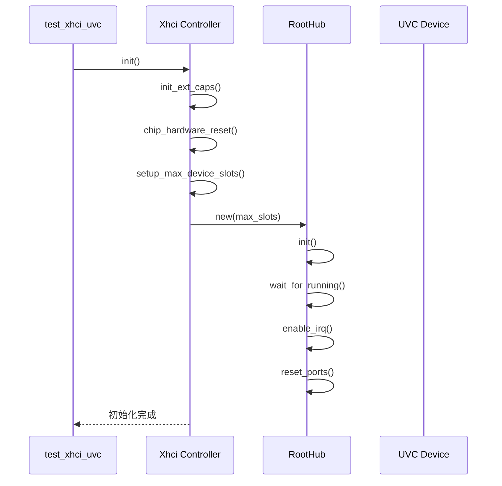

<cite>
**Referenced Files in This Document**
- [build.rs](file://test_crates/test_xhci_uvc/build.rs)
- [lib.rs](file://test_crates/test_xhci_uvc/src/lib.rs)
- [mod.rs](file://usb-host/src/backend/xhci/mod.rs)
- [device.rs](file://usb-host/src/backend/xhci/device.rs)
- [stream.rs](file://usb-device/uvc/src/stream.rs)
- [frame.rs](file://usb-device/uvc/src/frame.rs)
- [README.md](file://test_crates/test_xhci_uvc/README.md)
- [bare-test.toml](file://test_crates/test_xhci_uvc/bare-test.toml)
</cite>

## 目录
1. [引言](#引言)
2. [测试套件与构建配置](#测试套件与构建配置)
3. [xHCI控制器初始化与设备枚举](#xhci控制器初始化与设备枚举)
4. [UVC设备通信链路解析](#uvc设备通信链路解析)
5. [流稳定性与性能评估](#流稳定性与性能评估)
6. [硬件部署与测试执行](#硬件部署与测试执行)
7. [结论](#结论)

## 引言
本文档详细描述了在真实或仿真硬件环境下，针对基于xHCI控制器的UVC（USB Video Class）设备进行端到端测试的完整流程。核心目标是验证驱动栈在`no_std`环境下的可靠性、内存安全性和实时性能。文档将深入分析`test_xhci_uvc`测试套件的作用，阐述从底层硬件初始化到高层视频流解析的全链路实现，并提供在QEMU仿真器和物理平台上部署测试的具体步骤。

## 测试套件与构建配置

本项目中的`test_xhci_uvc`是一个专为裸机（bare-metal）环境设计的`no_std`兼容测试套件，其作用是作为顶层集成测试模块，验证整个USB主机栈（特别是xHCI后端）与UVC设备交互的正确性。

该测试套件的构建过程由`build.rs`脚本控制，此脚本通过调用`bare_test_macros::build_test_setup!()`宏来配置裸机环境的构建参数。这些参数包括链接脚本、入口点设置、以及针对特定目标架构（如`aarch64-unknown-none-softfloat`）的编译选项，确保生成的二进制文件可以直接在无操作系统的硬件或仿真环境中运行。

**Section sources**
- [build.rs](file://test_crates/test_xhci_uvc/build.rs#L1-L4)
- [lib.rs](file://test_crates/test_xhci_uvc/src/lib.rs#L1-L4)

## xHCI控制器初始化与设备枚举

### 控制器初始化流程
`Xhci`结构体实现了`usb_if::host::Controller` trait，其`init`异步方法负责控制器的初始化。流程严格遵循xHCI规范：
1.  **扩展能力初始化 (`init_ext_caps`)**：探测并初始化USB Legacy Support等扩展功能。
2.  **芯片硬件复位**：通过向`USBCMD`寄存器写入复位标志，触发硬件复位，并等待`CNR`（Controller Not Ready）标志清零。
3.  **配置设备槽数**：读取`HCSParams1`寄存器获取最大设备槽数，并将其写入`CONFIG`寄存器以启用。
4.  **根集线器初始化**：创建并初始化`RootHub`实例，使其进入运行状态，并启用中断。
5.  **端口重置与稳定化**：对所有连接的端口执行重置操作，并加入延时以确保设备连接稳定。



**Diagram sources**
- [mod.rs](file://usb-host/src/backend/xhci/mod.rs#L40-L150)

### 设备枚举与接口声明
当控制器初始化完成后，系统开始枚举连接的UVC设备。
1.  **设备发现**：`device_list`方法扫描所有端口，为每个已连接的设备创建一个`Device`对象。
2.  **地址分配**：`address`方法为新设备分配唯一的USB地址。它会根据端口速度确定默认的最大包大小（Max Packet Size），并使用`AddressDevice`命令配置设备上下文。
3.  **获取描述符**：通过控制传输（Control Transfer）获取设备描述符（Device Descriptor）、配置描述符（Configuration Descriptor）等关键信息。
4.  **设置配置**：调用`set_configuration`方法，向设备发送`SetConfiguration`标准请求，激活指定的配置。
5.  **声明接口**：调用`claim_interface`方法，首先通过`SetInterface`请求切换到所需的备用设置（Alternate Setting），然后解析该设置下的端点描述符，并为每个端点建立`EndpointRaw`对象，完成接口的声明和端点的配置。

**Section sources**
- [mod.rs](file://usb-host/src/backend/xhci/mod.rs#L152-L299)
- [device.rs](file://usb-host/src/backend/xhci/device.rs#L1-L791)

## UVC设备通信链路解析

UVC设备的视频流通过等时（Isochronous）传输进行。完整的通信链路由`VideoStream`组件管理。

### 等时传输启动
`VideoStream`的构造函数`new`接收一个`EndpointIsoIn`类型的输入端点。它根据端点的最大包大小和视频帧的总字节数，计算出每次传输需要提交的包数量（`packets_per_transfer`），并预分配一个足够大的缓冲区。这标志着等时传输的逻辑准备就绪。

### 数据接收与帧组装
`recv`方法是数据接收的核心：
1.  **提交传输请求**：调用`ep.submit`方法，将预分配的缓冲区提交给xHCI驱动栈，请求接收数据。
2.  **数据处理**：当数据到达时，`recv`方法遍历缓冲区中按包大小划分的数据块。
3.  **载荷头解析**：对于每个数据包，`FrameParser`首先解析UVC协议定义的载荷头（`UvcPayloadHeader`）。该头包含FID（帧ID）、EOF（帧结束）、PTS（呈现时间戳）等关键信息。
4.  **错误处理**：如果载荷头的`ERR`标志被置位，`FrameParser`会增加错误计数器并丢弃当前正在组装的帧，防止损坏的数据污染输出。
5.  **帧边界检测**：`FrameParser`利用FID位的翻转来判断新帧的开始，并通过EOF位来确认一帧数据的结束。
6.  **事件生成**：当收到一个带有EOF标志的数据包时，`FrameParser`将缓冲区中的数据打包成一个`FrameEvent`，其中包含了完整的视频帧数据、PTS时间戳和帧号，并返回给上层应用。

```mermaid
flowchart TD
    A[Start recv()] --> B[Submit Buffer to Endpoint]
    B --> C{Data Received?}
    C -->|Yes| D[Process Each Packet]
    D --> E[Parse UVC Payload Header]
    E --> F{ERR Flag Set?}
    F -->|Yes| G