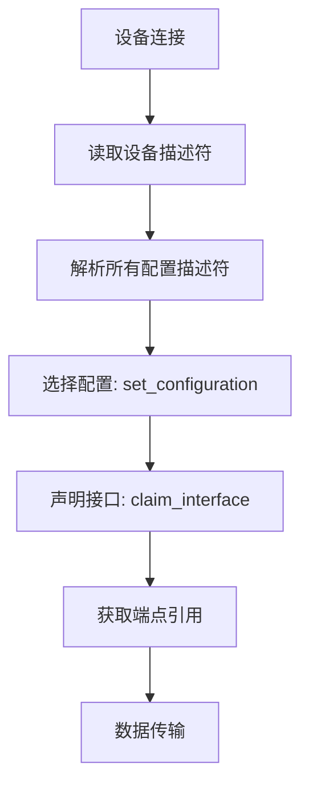
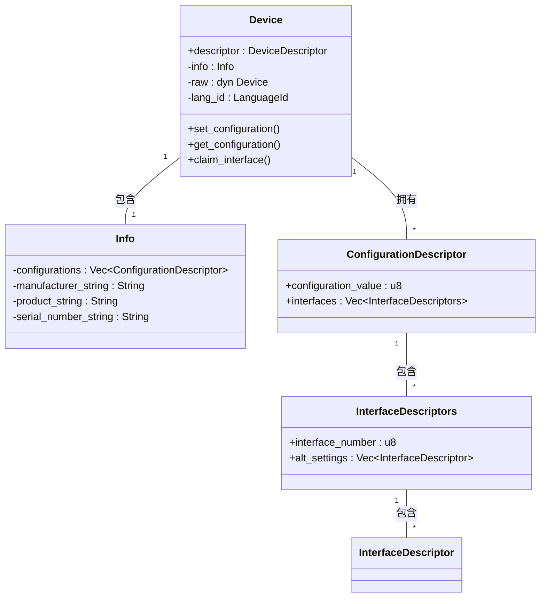
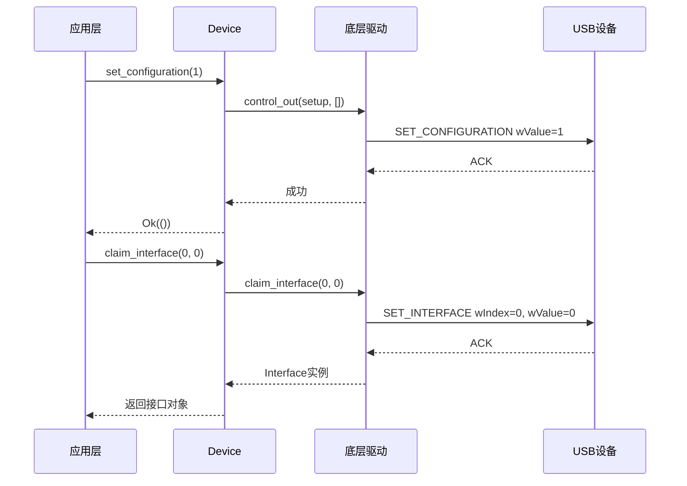

# 接口配置与管理

<cite>
**Referenced Files in This Document**  
- [device.rs](file://usb-host/src/common/device.rs)
- [mod.rs](file://usb-if/src/transfer/mod.rs)
- [mod.rs](file://usb-if/src/descriptor/mod.rs)
- [interface.rs](file://usb-host/src/backend/libusb/interface.rs)
- [interface.rs](file://usb-host/src/backend/xhci/interface.rs)
</cite>

## 目录
1. [接口配置流程概述](#接口配置流程概述)
2. [设备状态维护机制](#设备状态维护机制)
3. [控制传输同步实现](#控制传输同步实现)
4. [多接口复合设备支持](#多接口复合设备支持)
5. [接口切换与资源重映射](#接口切换与资源重映射)
6. [备用设置查询与运行时切换](#备用设置查询与运行时切换)

## 接口配置流程概述

USB设备的接口配置是一个分阶段的过程，涉及配置描述符的选择、接口设置的激活以及端点声明。系统通过`Device`结构体提供的异步方法来完成这些操作。

在初始化过程中，设备首先读取其设备描述符，并基于描述符中的配置数量（`num_configurations`）逐个解析配置描述符。每个配置描述符包含一个或多个接口描述符集合（`InterfaceDescriptors`），每个集合又包含多个备用设置（alternate settings）。这种层次化结构允许设备在不同工作模式间切换。

配置选择通过`set_configuration`方法完成，该方法接受一个配置值（configuration value）作为参数。一旦配置被激活，就可以通过`claim_interface`方法声明对特定接口的控制权，同时指定要使用的备用设置编号。

**Diagram sources**
- [device.rs](file://usb-host/src/common/device.rs#L0-L280)
- [mod.rs](file://usb-if/src/descriptor/mod.rs#L0-L241)

**Section sources**
- [device.rs](file://usb-host/src/common/device.rs#L0-L280)

## 设备状态维护机制

`Device`结构体负责维护当前激活的配置值和接口号等关键状态信息。这些状态存储在内部的`Info`结构体中，包括已解析的配置描述符列表、制造商字符串、产品字符串和序列号字符串。

当调用`get_configuration`方法时，底层驱动会通过控制传输从硬件查询当前实际的配置值。此值与本地缓存的状态保持同步，确保软件视图与硬件状态一致。对于接口级别的状态，虽然`Device`本身不直接跟踪每个接口的备用设置，但这一职责被委托给具体的接口实例。

在`libusb`后端实现中，`InterfaceImpl`结构体明确维护了`alt_setting`字段来记录当前激活的备用设置。而在`xhci`后端，尽管未显式存储该值，但可通过查询硬件状态或依赖上层逻辑进行管理。

**Diagram sources**
- [device.rs](file://usb-host/src/common/device.rs#L0-L280)
- [mod.rs](file://usb-if/src/descriptor/mod.rs#L0-L241)

**Section sources**
- [device.rs](file://usb-host/src/common/device.rs#L0-L280)

## 控制传输同步实现

系统使用标准USB控制请求`SET_CONFIGURATION`和`SET_INTERFACE`来完成硬件同步。这些请求的定义位于`usb-if`库的`Request`枚举中，分别对应值9和11。

`SET_CONFIGURATION`请求通过`Device::set_configuration`方法触发。该方法构造一个`ControlSetup`结构体，设置请求类型为标准（Standard）、接收者为设备（Device）、请求码为`SetConfiguration`，并将目标配置值作为`value`参数传递。随后，该请求通过底层驱动的`control_out`通道发送至设备。

类似地，`SET_INTERFACE`请求由接口实现的`set_alt_setting`方法发起。以`libusb`后端为例，该方法直接调用`libusb_set_interface_alt_setting`函数，传入设备句柄、接口号和目标备用设置编号。成功返回后，本地`alt_setting`字段被更新以反映新状态。

值得注意的是，`xhci`后端目前尚未实现`set_alt_setting`和`get_alt_setting`方法（标记为`todo!()`），表明该功能仍在开发中或依赖其他机制实现。

**Diagram sources**
- [mod.rs](file://usb-if/src/transfer/mod.rs#L60-L109)
- [device.rs](file://usb-host/src/common/device.rs#L0-L280)
- [interface.rs](file://usb-host/src/backend/libusb/interface.rs#L0-L97)

**Section sources**
- [mod.rs](file://usb-if/src/transfer/mod.rs#L60-L109)
- [device.rs](file://usb-host/src/common/device.rs#L0-L280)
- [interface.rs](file://usb-host/src/backend/libusb/interface.rs#L0-L97)

## 多接口复合设备支持

本系统通过`ConfigurationDescriptor`中的`interfaces`字段天然支持多接口复合设备。一个配置可以包含多个独立的接口，每个接口都有自己的接口号（`interface_number`）和一组备用设置。

在运行时，应用程序可以按需声明（claim）任意数量的接口。例如，在测试代码中可以看到循环遍历当前配置下所有接口并逐一声明的模式。每个接口被独立管理，拥有自己的控制管道和数据端点。

接口之间的隔离性由USB协议保证。每个接口的数据流互不干扰，可以同时进行数据传输。资源分配方面，端点地址在整个设备范围内必须唯一，因此不同接口不能使用相同地址的端点。

系统通过`find_interface_desc`辅助方法根据接口号和备用设置编号快速查找对应的描述符，这为多接口设备的灵活配置提供了基础支持。

**Section sources**
- [device.rs](file://usb-host/src/common/device.rs#L0-L280)
- [mod.rs](file://usb-if/src/descriptor/mod.rs#L0-L241)

## 接口切换与资源重映射

接口切换主要通过改变备用设置（alternate setting）来实现，这一过程伴随着资源的重新映射。当调用`set_alt_setting`时，设备将激活新的接口描述符，该描述符可能指向不同的端点集合。

在`xhci`后端，资源重映射体现在`ep_map`（BTreeMap<Dci, EndpointRaw>）的使用上。每当获取一个端点时，系统根据其DCI（Device Context Index）从映射表中移除对应的`EndpointRaw`并构建新的类型安全端点包装器。这种设计确保了每个端点在同一时间只能被一个所有者持有，防止了资源竞争。

然而，由于`xhci`后端的`set_alt_setting`方法尚未实现，当前无法动态切换备用设置。相比之下，`libusb`后端已完整实现了该功能，能够安全地通知硬件切换设置并更新本地状态。

理想情况下，完整的接口切换应包括：发送`SET_INTERFACE`请求、验证响应、重新解析新设置下的端点描述符、重建端点对象并更新内部资源映射表。

**Section sources**
- [interface.rs](file://usb-host/src/backend/xhci/interface.rs#L0-L140)
- [interface.rs](file://usb-host/src/backend/libusb/interface.rs#L0-L97)

## 备用设置查询与运行时切换

查询接口支持的备用设置是通过遍历`ConfigurationDescriptor`中对应接口的`alt_settings`向量实现的。每个`InterfaceDescriptor`代表一个可用的备用设置，应用程序可以根据需要选择最合适的设置。

运行时切换的安全执行依赖于正确的状态管理和错误处理。在`libusb`后端，`set_alt_setting`方法封装了底层调用并更新本地状态，但如果调用失败则可能造成软硬件状态不一致。

为了防止数据传输中断，建议的切换流程如下：
1. 停止所有正在进行的传输
2. 调用`set_alt_setting`切换到新设置
3. 重新获取端点引用（因为端点属性可能已改变）
4. 重启数据传输

尽管框架提供了必要的基础设施，但用户有责任确保在切换期间没有活跃的传输操作，以避免未定义行为。

**Section sources**
- [mod.rs](file://usb-if/src/descriptor/mod.rs#L0-L241)
- [device.rs](file://usb-host/src/common/device.rs#L0-L280)
- [interface.rs](file://usb-host/src/backend/libusb/interface.rs#L0-L97)