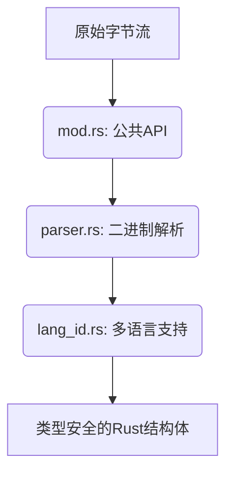
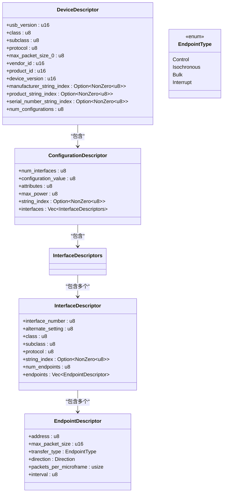

<cite>
**本文档中引用的文件**
- [mod.rs](file://usb-if/src/descriptor/mod.rs)
- [lang_id.rs](file://usb-if/src/descriptor/lang_id.rs)
- [parser.rs](file://usb-if/src/descriptor/parser.rs)
</cite>

## 目录
1. [引言](#引言)
2. [描述符解析机制概述](#描述符解析机制概述)
3. [核心数据结构与类型安全设计](#核心数据结构与类型安全设计)
4. [二进制格式解码逻辑](#二进制格式解码逻辑)
5. [字符串描述符多语言支持](#字符串描述符多语言支持)
6. [实际解析案例分析](#实际解析案例分析)
7. [错误处理与系统鲁棒性](#错误处理与系统鲁棒性)
8. [结论](#结论)

## 引言

USB设备通过标准描述符向主机报告其功能和配置信息。这些描述符以原始字节流的形式传输，必须被正确解析才能理解设备的能力。本文深入解析`CrabUSB`驱动框架中描述符的解析机制，重点分析如何将低级二进制数据转换为类型安全的Rust结构体，并探讨其在多语言支持和容错处理方面的实现。

## 描述符解析机制概述

整个解析流程采用分层架构，由`mod.rs`作为公共接口入口，`parser.rs`负责底层二进制解析，`lang_id.rs`提供语言ID支持。该设计实现了关注点分离，确保了解析逻辑的清晰性和可维护性。

**Diagram sources**
- [mod.rs](file://usb-if/src/descriptor/mod.rs)
- [parser.rs](file://usb-if/src/descriptor/parser.rs)
- [lang_id.rs](file://usb-if/src/descriptor/lang_id.rs)

**Section sources**
- [mod.rs](file://usb-if/src/descriptor/mod.rs)
- [parser.rs](file://usb-if/src/descriptor/parser.rs)
- [lang_id.rs](file://usb-if/src/descriptor/lang_id.rs)

## 核心数据结构与类型安全设计

### 类型化描述符结构

`mod.rs`定义了`DeviceDescriptor`、`ConfigurationDescriptor`、`InterfaceDescriptor`和`EndpointDescriptor`等Rust结构体。这些结构体使用`#[derive(Debug, Clone)]`宏，确保了良好的调试支持和值语义。关键字段如`manufacturer_string_index`被包装在`Option<NonZero<u8>>`中，这在编译时就排除了无效索引（0或空）的可能性，提升了类型安全性。

**Diagram sources**
- [mod.rs](file://usb-if/src/descriptor/mod.rs#L50-L241)

**Section sources**
- [mod.rs](file://usb-if/src/descriptor/mod.rs#L50-L241)

### 解析器与公共结构体的转换

`mod.rs`中的公共结构体不直接持有原始数据，而是通过`From` trait从`parser.rs`中的解析器结构体转换而来。例如，`DeviceDescriptor::parse`函数调用`parser::DeviceDescriptor::new(data)`创建一个解析器实例，然后通过`Into::into`将其转换为公共的`DeviceDescriptor`。这种设计隔离了不安全的内存访问（在`parser`模块内），对外暴露的是安全、不可变的数据结构。

**Section sources**
- [mod.rs](file://usb-if/src/descriptor/mod.rs#L100-L120)
- [mod.rs](file://usb-if/src/descriptor/mod.rs#L200-L241)

## 二进制格式解码逻辑

### 基础解析单元：Descriptor 结构

`parser.rs`中的`Descriptor<'a>`结构是所有解析操作的基础。它是一个对`&[u8]`的封装，实现了`Deref` trait，允许像操作切片一样访问字节。其`new`方法执行关键的边界检查：确保输入至少有2个字节（长度和类型字段），并且第一个字节指定的长度不超过缓冲区的实际长度。这防止了后续解析过程中的越界访问。

**Section sources**
- [parser.rs](file://usb-if/src/descriptor/parser.rs#L40-L55)

### 宏驱动的字段提取

为了减少重复代码并保证正确性，项目使用了`descriptor_fields!`宏。该宏接受一个结构体和一组字段声明，自动生成从字节切片中按偏移量提取字段的`fn`方法。例如，对于`DeviceDescriptor`，宏会生成`usb_version at 2 -> u16`，这意味着从偏移量2开始读取2个字节，并将其解释为小端序的`u16`。这种方法避免了手动编写易出错的字节操作。

**Section sources**
- [parser.rs](file://usb-if/src/descriptor/parser.rs#L190-L205)

### 配置描述符的链式解析

`ConfigurationDescriptor`的解析体现了复杂的嵌套结构处理。`new`方法首先验证基本的配置描述符头，然后读取`wTotalLength`字段来确定整个配置（包括所有接口和端点描述符）的总长度。`descriptors()`方法返回一个`DescriptorIter`，用于遍历紧跟在配置头之后的所有子描述符。`interfaces()`方法利用迭代器，将属于同一接口号的不同备用设置（Alternate Setting）分组到`InterfaceDescriptors`中。

**Section sources**
- [parser.rs](file://usb-if/src/descriptor/parser.rs#L300-L400)

## 字符串描述符多语言支持

### 语言ID枚举

`lang_id.rs`文件定义了一个庞大的`LanguageId`枚举，其中每个变体对应一个标准的USB语言ID（如`EnglishUnitedStates = 0x0409`）。该枚举使用`num_enum`库的`FromPrimitive`和`IntoPrimitive`派生，可以方便地在`u16`数值和具体的语言之间进行双向转换。