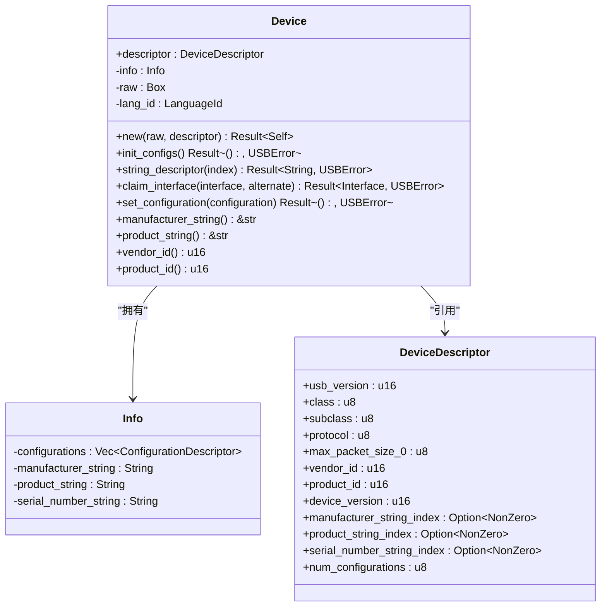
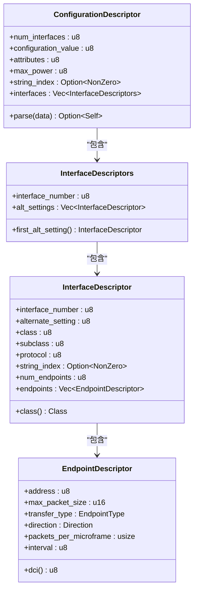
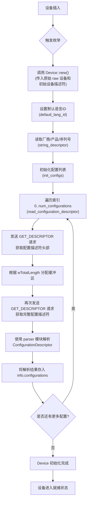
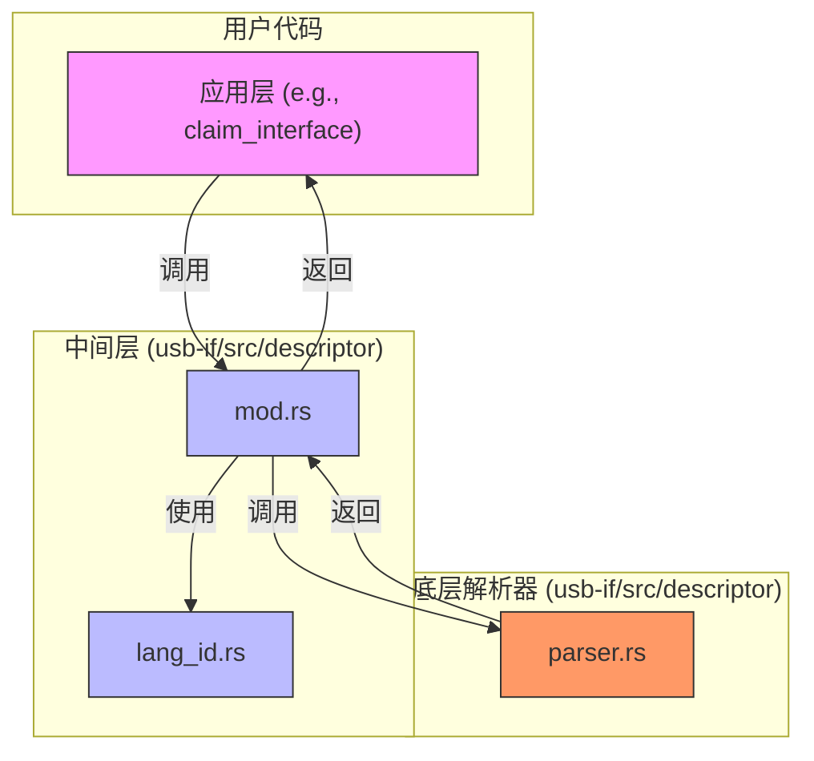

# 设备管理

<cite>
**Referenced Files in This Document **   
- [device.rs](file://usb-host/src/common/device.rs)
- [mod.rs](file://usb-if/src/descriptor/mod.rs)
- [lang_id.rs](file://usb-if/src/descriptor/lang_id.rs)
- [parser.rs](file://usb-if/src/descriptor/parser.rs)
</cite>

## 目录
1. [引言](#引言)
2. [核心组件分析](#核心组件分析)
3. [设备状态机与生命周期](#设备状态机与生命周期)
4. [描述符解析机制](#描述符解析机制)
5. [元数据获取示例](#元数据获取示例)
6. [错误处理与资源管理](#错误处理与资源管理)

## 引言

本文档系统化地记录了CrabUSB驱动框架中的设备管理全流程。重点阐述了设备从物理插入到逻辑就绪的完整生命周期，涵盖了设备检测、枚举、标准USB描述符（设备、配置、接口、端点）及字符串描述符的解析过程。文档详细说明了`Device`结构体如何通过内部状态机管理设备状态，并解释了`descriptor`模块如何实现对复杂二进制描述符的高效、安全解析，包括对多语言字符串的本地化支持。

## 核心组件分析

本节分析设备管理功能的核心代码文件和关键结构。

**Section sources**
- [device.rs](file://usb-host/src/common/device.rs#L1-L280)
- [mod.rs](file://usb-if/src/descriptor/mod.rs#L1-L241)
- [lang_id.rs](file://usb-if/src/descriptor/lang_id.rs#L1-L304)

### Device 结构体

`Device`是设备管理的核心实体，封装了与一个USB设备交互所需的所有信息和方法。它不仅持有从硬件读取的原始`DeviceDescriptor`，还维护了一个`Info`结构体，用于缓存已解析的配置、字符串等信息，避免重复的I/O操作。

**Diagram sources **
- [device.rs](file://usb-host/src/common/device.rs#L15-L280)
- [mod.rs](file://usb-if/src/descriptor/mod.rs#L47-L69)

### 描述符模块

`descriptor`模块定义了所有标准USB描述符的数据结构，如`DeviceDescriptor`、`ConfigurationDescriptor`、`InterfaceDescriptor`和`EndpointDescriptor`。这些结构体提供了类型安全的访问接口，将底层的字节数组转换为易于使用的Rust类型。

**Diagram sources **
- [mod.rs](file://usb-if/src/descriptor/mod.rs#L111-L224)

## 设备状态机与生命周期

`Device`结构体的创建和初始化过程是一个典型的异步状态机，精确地管理了设备从“未初始化”到“就绪”的状态转换。

### 生命周期流程图

**Diagram sources **
- [device.rs](file://usb-host/src/common/device.rs#L35-L100)
- [device.rs](file://usb-host/src/common/device.rs#L140-L180)
- [device.rs](file://usb-host/src/common/device.rs#L220-L260)

### 关键状态转换函数

- `Device::new`: 构造函数，是整个生命周期的入口。它负责协调后续所有初始化步骤。
- `defautl_lang_id`: 在读取任何字符串描述符之前，必须先确定设备支持的语言。此函数通过向索引0的字符串描述符发起请求来获取语言ID列表，并选择第一个或默认为英语（美国）。
- `init_configs`: 此函数确保`info.configurations`被填充。它只在列表为空时执行，实现了惰性加载，优化了性能。
- `read_configuration_descriptor`: 这是枚举过程中最复杂的一步。它需要两次控制传输：第一次获取固定长度的头部以得知总长度，第二次获取完整的描述符链进行解析。

## 描述符解析机制

描述符解析由两个层次的模块协同完成：高层的`mod.rs`提供面向用户的API，低层的`parser.rs`负责实际的字节解析。

### 解析架构

**Diagram sources **
- [mod.rs](file://usb-if/src/descriptor/mod.rs)
- [parser.rs](file://usb-if/src/descriptor/parser.rs)
- [lang_id.rs](file://usb-if/src/descriptor/lang_id.rs)

### 字符串描述符与本地化

字符串描述符的本地化支持通过`LanguageId`枚举和`decode_string_descriptor`函数实现。

1.  **语言ID (`lang_id.rs`)**:
    *   `LanguageId`是一个`#[repr(u16)]`的枚举，直接映射了USB规范中定义的语言ID码。
    *   它利用`num_enum`库实现了`FromPrimitive`和`IntoPrimitive`，可以方便地在`u16`值和枚举变体之间转换。
    *   默认情况下，`Device`会尝试获取设备支持的语言列表，并选择`EnglishUnitedStates`作为后备。

2.  **字符串解码 (`parser.rs`)**:
    *   `decode_string_descriptor`函数接收一个字节数组，该数组是通过控制传输从设备读取的原始字符串描述符。
    *   函数首先验证描述符的有效性（长度、类型），然后跳过前两个字节（bLength, bDescriptor