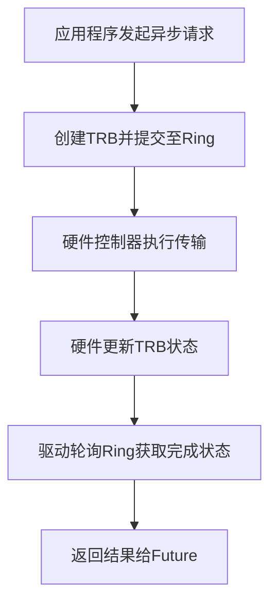

<cite>
**本文档引用的文件**
- [README.md](file://README.md)
- [usb-host/src/lib.rs](file://usb-host/src/lib.rs)
- [usb-if/src/lib.rs](file://usb-if/src/lib.rs)
- [doc/design.md](file://doc/design.md)
- [usb-host/src/common/device.rs](file://usb-host/src/common/device.rs)
- [usb-host/src/backend/mod.rs](file://usb-host/src/backend/mod.rs)
- [usb-host/src/backend/xhci/mod.rs](file://usb-host/src/backend/xhci/mod.rs)
- [usb-host/src/backend/libusb/mod.rs](file://usb-host/src/backend/libusb/mod.rs)
- [usb-if/src/transfer/mod.rs](file://usb-if/src/transfer/mod.rs)
</cite>

## 目录
1. [项目概述](#项目概述)
2. [核心定位与目标](#核心定位与目标)
3. [应用场景与用户群体](#应用场景与用户群体)
4. [设计哲学与关键技术特性](#设计哲学与关键技术特性)
5. [模块化架构解析](#模块化架构解析)
6. [学习路径指引](#学习路径指引)

## 项目概述

CrabUSB 是一个用 Rust 语言编写的高性能异步 USB 主机驱动框架，专为嵌入式系统和操作系统内核环境而设计。该项目旨在提供一个现代化、安全且高效的解决方案，用于在资源受限或对性能要求极高的场景下管理 USB 设备。

其核心价值在于将现代异步编程范式（async/await）与底层硬件交互相结合，通过创新的无锁架构实现卓越的性能和响应能力。CrabUSB 不仅严格遵循 USB 1.1、2.0 和 3.x 规范，支持控制、批量、中断和等时传输等多种数据传输类型，还具备出色的可移植性和灵活性，使其成为构建下一代嵌入式和内核级 USB 应用的理想选择。

**Section sources**
- [README.md](file://README.md#L1-L53)

## 核心定位与目标

CrabUSB 的核心定位是成为一个**高性能、异步、无锁的 USB 主机驱动框架**。它从根本上重新思考了传统同步阻塞式驱动的设计模式，转而采用基于事件和轮询的异步模型，以最大化系统吞吐量和最小化延迟。

其主要目标包括：
- **实现真正的异步操作**：所有 USB 操作（如设备枚举、数据传输）都以 `Future` 的形式暴露，允许调用者在等待 I/O 完成的同时执行其他任务，从而显著提高 CPU 利用率。
- **消除运行时锁竞争**：通过采用基于 TRB（传输请求块）环形队列的无锁设计，避免了多线程环境下的锁争用问题，确保了在高并发场景下的稳定性能。
- **提供跨平台兼容性**：支持直接访问 xHCI 硬件控制器，适用于裸机（bare-metal）和操作系统内核开发；同时提供基于 libusb 的用户空间后端，便于在标准 Linux 环境中进行测试和开发。
- **保证内存安全与低开销**：利用 Rust 的所有权和生命周期机制，在编译期杜绝内存错误，并通过 `#![no_std]` 支持实现最小化的内存占用，满足嵌入式系统的严苛要求。

**Section sources**
- [README.md](file://README.md#L7-L28)

## 应用场景与用户群体

### 应用场景
CrabUSB 特别适用于以下技术领域：
- **操作系统内核开发**：作为 ArceOS 等新兴 Rust 编写的操作系统的核心 USB 子系统，提供安全、高效的设备管理能力。
- **嵌入式系统**：应用于物联网设备、工业控制器、智能硬件等需要直接与 USB 外设（如摄像头、键盘、存储设备）交互的场景。
- **虚拟化与仿真环境**：其模块化设计和多后端支持使其易于集成到模拟器或虚拟机监控程序中，用于 USB 设备透传。
- **高性能数据采集**：对于需要实时处理来自 USB 音频/视频设备（UVC）高速数据流的应用，其异步和 DMA 感知特性至关重要。

### 目标用户群体
- **系统开发者**：专注于操作系统、固件或底层系统软件开发的工程师，他们需要一个可靠、高性能且与现代编程实践兼容的 USB 驱动栈。
- **嵌入式工程师**：在资源受限的硬件平台上工作的开发者，他们重视代码的安全性、可预测性和低内存占用。
- **Rust 语言爱好者与研究者**：探索如何在系统编程领域应用 Rust 的先进特性（如 async/await, trait, no_std）的个人或团队。

**Section sources**
- [README.md](file://README.md#L7-L28)
- [doc/design.md](file://doc/design.md#L1-L15)

## 设计哲学与关键技术特性

CrabUSB 的设计深受 Rust 语言哲学和现代系统架构思想的影响，其关键技术特性体现了对性能、安全和灵活性的极致追求。

### 无锁架构 (Lock-Free Design)
这是 CrabUSB 性能优势的核心。它摒弃了传统的互斥锁（mutex），转而使用预分配的 TRB（Transfer Request Block）环形队列来管理异步任务。每个 TRB 代表一个独立的传输请求，其状态由硬件和驱动程序通过原子操作共同维护。这种设计消除了临界区，允许多个 CPU 核心高效地并行处理 USB 请求，避免了因锁竞争导致的性能瓶颈。



**Diagram sources**
- [doc/design.md](file://doc/design.md#L4-L15)

### Async/Await 支持
CrabUSB 原生支持 Rust 的 `async/await` 语法糖。这使得编写非阻塞的 USB 代码变得直观且易于理解。例如，设备枚举过程可以被清晰地表达为一系列 `await` 调用，而不会阻塞整个执行线程。

### No-STD 兼容性
通过条件编译（`#![cfg_attr(not(feature = "libusb"), no_std)]`），CrabUSB 可以在没有标准库的环境中运行。这对于操作系统内核和裸机程序至关重要，因为它不依赖于动态内存分配以外的任何操作系统服务，从而实现了高度的可移植性和确定性行为。

### 执行器无关 (Executor Agnostic)
该框架的设计不绑定于任何特定的异步运行时（executor）。它生成的 `Future` 对象可以在任何兼容的执行器上被轮询（poll），这赋予了使用者极大的灵活性，可以根据具体的应用场景选择最合适的执行策略。

**Section sources**
- [README.md](file://README.md#L10-L15)
- [doc/design.md](file://doc/design.md#L4-L15)
- [usb-host/src/lib.rs](file://usb-host/src/lib.rs#L1-L28)

## 模块化架构解析

CrabUSB 采用了清晰的分层和模块化设计，各组件职责分明，耦合度低。

### 架构图示
```mermaid
graph TB
subgraph Application["应用程序"]
App[应用逻辑]
end
subgraph Interface["USB接口层 (usb-if)"]
IF["usb_if::host<br/>usb_if::descriptor<br/>usb_if::transfer"]
end
subgraph Host["主机控制器层 (usb-host)"]
Common["common/<br/>Device, Interface"]
Backend["backend/<br/>xHCI, libusb"]
end
App < --> IF
IF < --> Backend
```

**Diagram sources**
- [README.md](file://README.md#L49-L53)
- [usb-host/src/lib.rs](file://usb-host/src/lib.rs#L1-L28)
- [usb-if/src/lib.rs](file://usb-if/src/lib.rs#L1-L8)

### 核心模块说明
- **`usb-if` 模块**：位于 `usb-if/src/lib.rs`，定义了通用的 USB 接口抽象，包括描述符解析、传输类型和错误处理。它是上层应用与底层驱动之间的契约。
- **`usb-host` 模块**：位于 `usb-host/src/lib.rs`，是项目的主入口。它通过 `pub use usb_if::*` 将接口层导出，并组织了后端和公共逻辑。
- **`backend` 模块**：位于 `usb-host/src/backend/mod.rs`，实现了多后端支持。`xhci` 子模块提供了对 Extensible Host Controller Interface 的原生硬件访问，而 `libusb` 子模块则为用户空间测试提供了便利。
- **`common` 模块**：位于 `usb-host/src/common/device.rs`，包含了跨后端共享的核心数据结构，如 `Device` 结构体，负责管理设备的描述符、配置和字符串信息。

这种分层设计确保了代码的可维护性和可扩展性，新的后端可以轻松地被添加