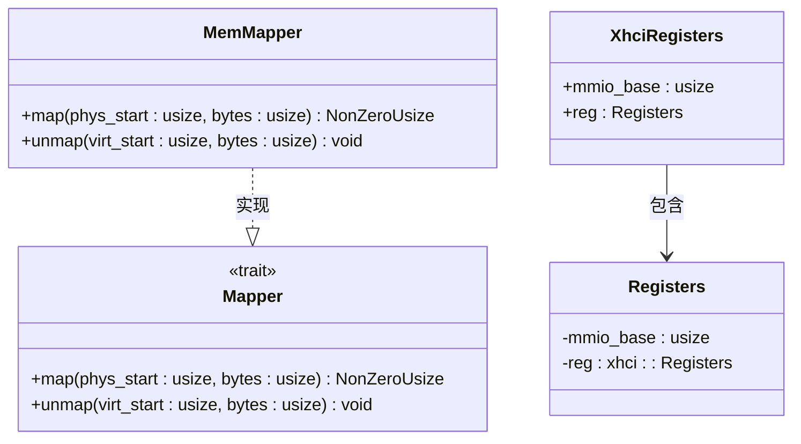
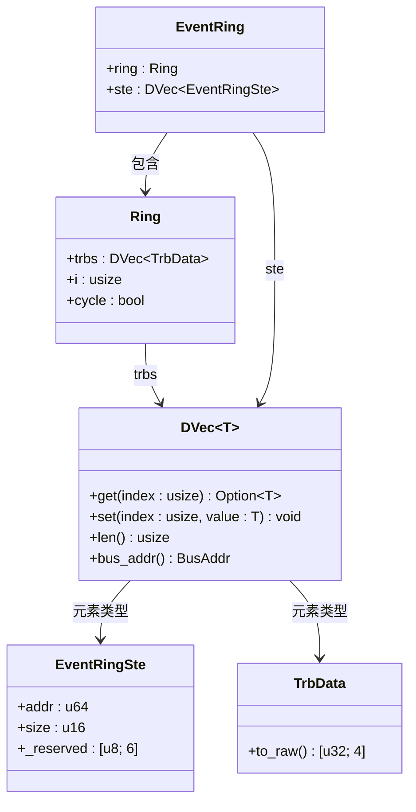
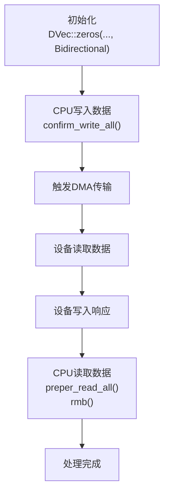

# DMA内存管理

<cite>
**本文档引用的文件**
- [reg.rs](file://usb-host/src/backend/xhci/reg.rs)
- [event.rs](file://usb-host/src/backend/xhci/event.rs)
- [ring/mod.rs](file://usb-host/src/backend/xhci/ring/mod.rs)
- [context.rs](file://usb-host/src/backend/xhci/context.rs)
- [endpoint.rs](file://usb-host/src/backend/xhci/endpoint.rs)
- [root.rs](file://usb-host/src/backend/xhci/root.rs)
</cite>

## 目录
1. [引言](#引言)
2. [XHCI寄存器访问抽象与MemMapper设计](#xhci寄存器访问抽象与memmapper设计)
3. [DVec在EventRing中的应用](#dvec在eventring中的应用)
4. [双向数据流控制与缓存一致性](#双向数据流控制与缓存一致性)
5. [no_std环境下的DMA内存调试技巧](#no_std环境下的dma内存调试技巧)
6. [结论](#结论)

## 引言
CrabUSB驱动框架在`no_std`环境下实现了高效、安全的USB主机控制器（XHCI）操作。其核心在于对DMA（直接内存访问）内存的精细管理，确保设备与主机之间的数据传输既快速又可靠。本文档深入解析CrabUSB中DMA内存管理的关键机制，重点分析`reg.rs`中的`MemMapper`零成本抽象、`EventRing`中`DVec`的安全向量化分配，以及`Direction::Bidirectional`在数据流控制和缓存一致性中的作用。

## XHCI寄存器访问抽象与MemMapper设计

### MemMapper的零成本抽象实现
在嵌入式系统中，硬件寄存器通常位于特定的物理地址空间。操作系统或固件需要将这些物理地址映射到虚拟地址以便CPU访问。CrabUSB通过`xhci`库提供的`Mapper` trait来实现这一映射，并在`reg.rs`中定义了具体的`MemMapper`结构体。



**图解来源**
- [reg.rs](file://usb-host/src/backend/xhci/reg.rs#L4-L87)

**Section sources**
- [reg.rs](file://usb-host/src/backend/xhci/reg.rs#L4-L87)

#### 核心代码分析
`MemMapper`的实现极其简洁，体现了“零成本抽象”的理念：

```rust
#[derive(Debug, Clone, Copy)]
pub struct MemMapper;

impl Mapper for MemMapper {
    unsafe fn map(&mut self, phys_start: usize, _bytes: usize) -> NonZeroUsize {
        unsafe { NonZeroUsize::new_unchecked(phys_start) }
    }
    fn unmap(&mut self, _virt_start: usize, _bytes: usize) {}
}
```

*   **`map`方法**: 该方法接收一个物理起始地址 `phys_start` 和字节数 `_bytes`。它直接返回一个非零的 `usize`，其值就是传入的物理地址。这里使用了 `unsafe` 代码块，因为它绕过了Rust的借用检查，直接创建了一个可能无效的指针。然而，在XHCI控制器的上下文中，MMIO（Memory-Mapped I/O）区域是静态且已知的，因此这种直接映射是安全且高效的。
*   **`unmap`方法**: 在此实现中为空。对于MMIO区域，通常不需要显式的取消映射操作，因为这些地址在整个系统运行期间都是有效的。

这种设计的关键优势在于：
1.  **零开销**: 映射过程没有额外的计算或系统调用开销，仅仅是地址的传递。
2.  **类型安全**: 尽管使用了 `unsafe`，但整个接口被封装在安全的 `Registers` 结构体中。外部代码通过 `XhciRegisters` 的 `Deref` 和 `DerefMut` 特性来访问寄存器，无需直接处理 `unsafe` 代码。
3.  **清晰的生命周期**: `XhciRegisters` 拥有 `Registers` 实例，确保了寄存器访问的生命周期由驱动自身管理。

## DVec在EventRing中的应用

### DMA安全向量的分配与对齐
`DVec<T>` 是 `dma_api` 库提供的一个关键数据结构，用于在DMA操作中安全地管理内存。它代表一个可以在设备和CPU之间共享的、连续的内存缓冲区。在 `event.rs` 文件中，`EventRing` 结构体利用 `DVec` 来管理事件环（Event Ring）和段表条目（Segment Table Entry, STE）。



**图解来源**
- [event.rs](file://usb-host/src/backend/xhci/event.rs#L0-L64)
- [ring/mod.rs](file://usb-host/src/backend/xhci/ring/mod.rs#L0-L157)

**Section sources**
- [event.rs](file://usb-host/src/backend/xhci/event.rs#L0-L64)
- [ring/mod.rs](file://usb-host/src/backend/xhci/ring/mod.rs#L0-L157)

#### 生命周期与初始化流程
`EventRing::new()` 方法展示了 `DVec` 的典型使用模式：

1.  **TRB环的创建**: 首先，创建一个 `Ring` 实例。`Ring` 内部包含一个 `DVec<TrbData>`，用于存储传输请求块（Transfer Request Blocks）。这个 `DVec` 的长度基于系统的页面大小进行计算，以确保良好的内存对齐。
2.  **STE的创建**: 接着，创建一个 `DVec<EventRingSte>`，其长度为1。`EventRingSte` 结构体描述了事件环段的物理地址和大小。
3.  **信息填充**: 使用 `ste.set(0, ste0)` 将第一个STE条目的 `addr` 字段设置为TRB环的总线地址（通过 `ring.trbs.bus_addr()` 获取），并将 `size` 设置为TRB的数量。
4.  **所有权转移**: 最后，`EventRing` 结构体同时拥有 `Ring` 和 `DVec<EventRingSte>` 的所有权，确保了整个事件环结构的内存安全。

这种方法的优势在于：
*   **自动对齐**: `DVec::zeros` 函数允许指定对齐要求（如 `page_size()`），这对于满足XHCI规范中对DMA缓冲区对齐的要求至关重要。
*   **统一管理**: 所有DMA相关的内存都通过 `DVec` 进行分配和释放，简化了内存管理逻辑。
*   **安全性**: `DVec` 提供了安全的API来读写数据，避免了直接的指针操作。

## 双向数据流控制与缓存一致性

### Direction::Bidirectional的作用
在 `dma_api` 中，`Direction` 枚举定义了DMA传输的方向：`ToDevice`（从CPU到设备）、`FromDevice`（从设备到CPU）和 `Bidirectional`（双向）。在CrabUSB中，`Direction::Bidirectional` 被广泛应用于像事件环（`EventRing`）和命令环（`Command Ring`）这样的场景。



**图解来源**
- [event.rs](file://usb-host/src/backend/xhci/event.rs#L0-L64)
- [endpoint.rs](file://usb-host/src/backend/xhci/endpoint.rs#L0-L631)

**Section sources**
- [event.rs](file://usb-host/src/backend/xhci/event.rs#L0-L64)
- [endpoint.rs](file://usb-host/src/backend/xhci/endpoint.rs#L0-L631)

#### 数据流控制
`Direction::Bidirectional` 表明该内存区域既可以被CPU写入、设备读取，也可以被设备写入、CPU读取。这完美契合了事件环的需求：
*   **CPU -> 设备 (写)**: CPU不直接写事件环，但会写入命令环来发起操作。
*   **设备 -> CPU (读)**: XHCI控制器会将事件（如传输完成、端口状态改变）写入事件环，然后由CPU读取并处理。

#### 缓存一致性保障
在具有缓存的系统中，CPU和设备看到的内存视图可能不同步。`mbarrier::mb`（内存屏障）是解决此问题的关键。

*   **`mb()` 的调用时机**: 在 `event.rs` 的 `next()` 方法中，当CPU准备从事件环读取数据时，会在检查循环位（Cycle Bit）之后立即调用 `mb()`。
    ```rust
    pub fn next(&mut self) -> Option<Allowed> {
        let (data, flag) = self.ring.current_data();
        let allowed = Allowed::try_from(data.to_raw()).ok()?;
        if flag != allowed.cycle_bit() {
            return None;
        }
        mb(); // 关键的内存屏障
        self.ring.inc_deque();
        Some(allowed)
    }
    ```
    这个 `mb()` 确保了在读取事件数据之前，所有来自设备的写入操作都已经完成，并且CPU缓存已经失效，从而保证了CPU能读取到最新的、一致的数据。

*   **`rmb()` 和 `wmb()` 的使用**: 在 `endpoint.rs` 中，`on_ready` 回调函数在处理完从设备接收到的数据后，会调用 `rmb()` 来确保后续对数据的读取能看到设备写入的最新内容。而在发送数据前，会调用 `confirm_write_all()`，这通常会隐式地包含一个写屏障（`wmb`），以确保所有待写入的数据都已刷新到主内存，可供设备读取。

## no_std环境下的DMA内存调试技巧

### 常见内存泄漏场景
在 `no_std` 环境下，没有标准库的垃圾回收机制，内存泄漏是常见问题。CrabUSB中潜在的泄漏点包括：
1.  **未正确Drop的DVec**: 如果 `DVec` 或包含 `DVec` 的结构体（如 `EventRing`, `Ring`）未能正常进入其析构函数（`Drop`），则其持有的DMA内存将不会被释放。
2.  **异步任务挂起**: 在 `async` 代码中，如果一个持有 `DVec` 的 `Future` 因错误而永远无法完成，那么该 `Future` 的栈帧中的 `DVec` 就会一直存在，导致泄漏。
3.  **死锁**: 如 `RootHub` 使用的 `MutexRoot`，如果发生死锁，可能导致某些资源（包括 `DVec`）永远无法被释放。

### 检测方法
1.  **日志跟踪**: 在 `DVec` 的 `Drop` 实现中添加日志，可以追踪每次内存的分配和释放。结合 `alloc` crate 的全局分配器钩子，可以统计总的内存使用情况。
2.  **静态分析**: 利用Rust的借用检查器和生命周期分析，确保 `DVec` 的所有权转移是明确的。例如，`EventRing` 在创建后完全拥有其 `DVec`，避免了悬垂指针。
3.  **单元测试**: 为 `EventRing::new()` 和 `Drop` 实现编写测试，验证其行为符合预期。虽然不能直接检测泄漏，但可以确保逻辑正确。
4.  **工具辅助**: 使用 `valgrind`（如果目标平台支持）或专门的嵌入式内存分析工具来监控内存分配和释放。

## 结论
CrabUSB通过精巧的设计实现了高效且安全的DMA内存管理。`MemMapper` 利用零成本抽象，将物理地址直接映射为虚拟地址，为寄存器访问提供了高性能的基础。`DVec` 作为核心的DMA安全容器，不仅负责内存的分配、对齐和生命周期管理，还通过 `Direction` 枚举明确了数据流向。`Direction::Bidirectional` 与 `mbarrier::mb` 的结合，有效解决了双向数据流中的缓存一致性问题。尽管在 `no_std` 环境下面临挑战，但通过严格的RAII原则和清晰的所有权模型，CrabUSB最大限度地降低了内存泄漏的风险，为构建可靠的USB主机驱动提供了坚实的基础。