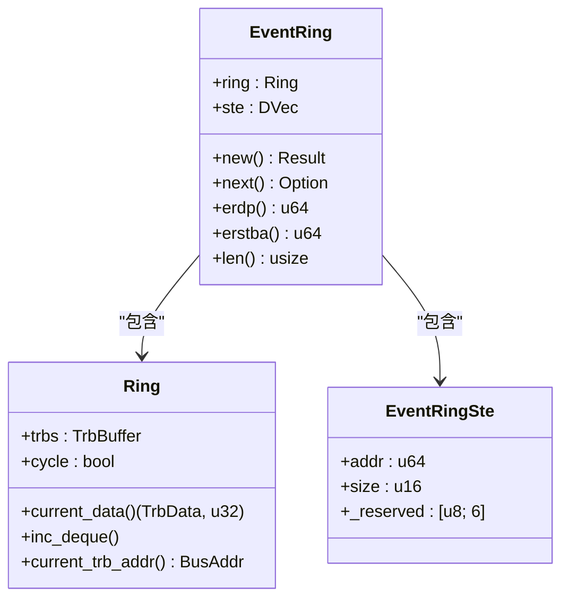
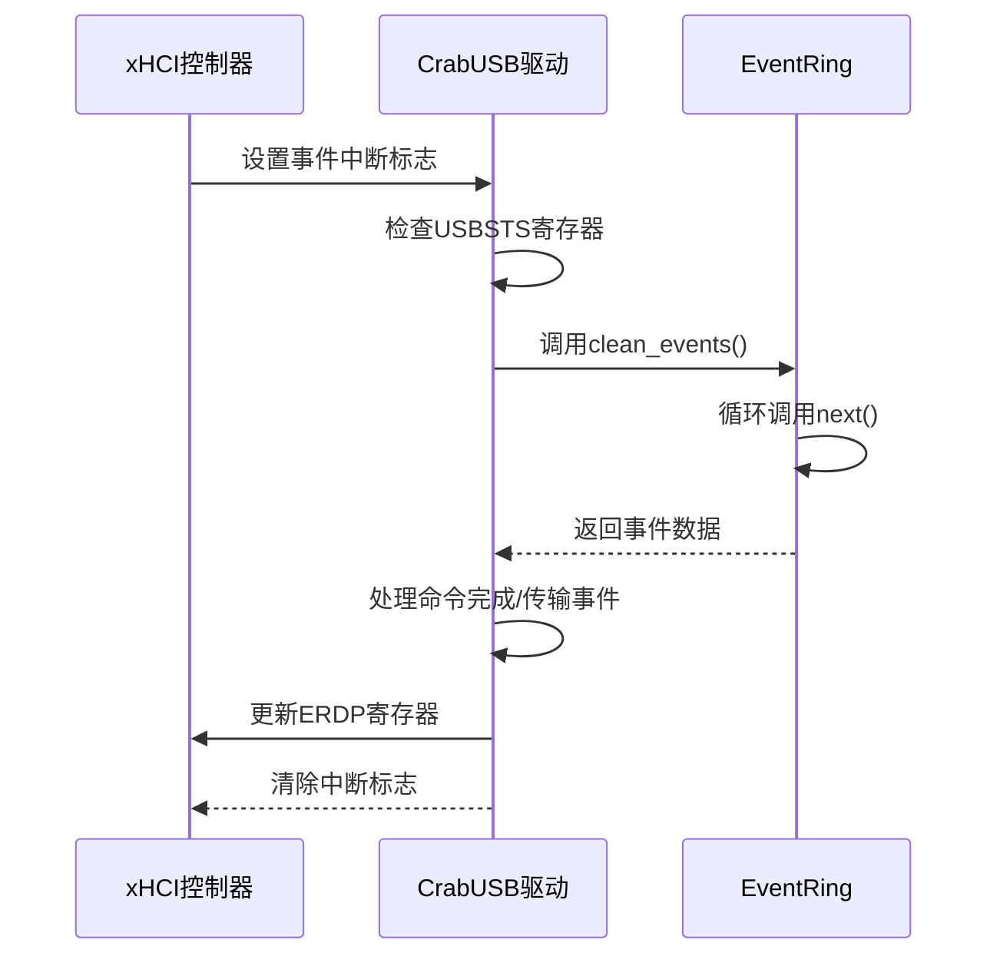
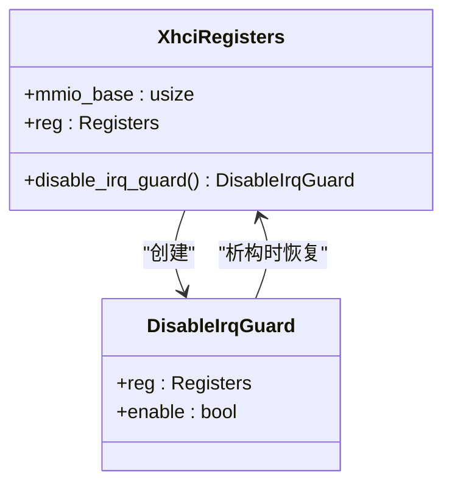

# 中断处理机制

<cite>
**本文档引用的文件**
- [event.rs](file://usb-host/src/backend/xhci/event.rs)
- [reg.rs](file://usb-host/src/backend/xhci/reg.rs)
- [root.rs](file://usb-host/src/backend/xhci/root.rs)
- [mod.rs](file://usb-host/src/backend/xhci/mod.rs)
</cite>

## 目录
1. [引言](#引言)
2. [事件环结构设计](#事件环结构设计)
3. [中断处理流程](#中断处理流程)
4. [临界区保护与中断控制](#临界区保护与中断控制)
5. [内存屏障同步策略](#内存屏障同步策略)
6. [性能分析与优化建议](#性能分析与优化建议)
7. [结论](#结论)

## 引言
CrabUSB基于xHCI规范实现了高效的USB主机控制器驱动，其核心中断处理机制依赖于事件环（Event Ring）架构。本文档详细分析了事件环的设计原理、中断处理流程以及多核环境下的同步机制，重点探讨了`event.rs`中`EventRing`结构体的实现细节和`reg.rs`中的中断保护机制。

**Section sources**
- [event.rs](file://usb-host/src/backend/xhci/event.rs#L0-L64)
- [reg.rs](file://usb-host/src/backend/xhci/reg.rs#L0-L87)

## 事件环结构设计

### EventRing 结构体分析
`EventRing`结构体是xHCI事件处理的核心数据结构，包含一个通用环形缓冲区（Ring）和事件段表（Event Ring Segment Table, STE）。该结构通过DMA安全地与硬件共享内存，确保事件数据的高效传递。



**Diagram sources**
- [event.rs](file://usb-host/src/backend/xhci/event.rs#L10-L64)

### next() 方法与循环位识别
`next()`方法是事件消费的核心，通过循环位（Cycle Bit）机制识别有效事件。当硬件写入新事件时，会设置相应的循环位；软件消费事件时检查当前循环位与预期是否匹配，不匹配则表示事件无效或已过期。

```rust
pub fn next(&mut self) -> Option<Allowed> {
    let (data, flag) = self.ring.current_data();
    let allowed = Allowed::try_from(data.to_raw()).ok()?;
    if flag != allowed.cycle_bit() {
        return None;
    }
    mb();
    self.ring.inc_deque();
    Some(allowed)
}
```

此机制避免了复杂的计数器同步问题，利用单个比特位的状态变化即可可靠地区分新旧事件。

**Section sources**
- [event.rs](file://usb-host/src/backend/xhci/event.rs#L45-L55)

### erdp() 和 erstba() 寄存器接口
`erdp()`和`erstba()`方法提供了对xHCI寄存器的关键访问：

- `erdp()`：返回事件环当前出队指针地址，用于更新ERDP（Event Ring Dequeue Pointer）寄存器
- `erstba()`：返回事件段表基地址，用于配置ERSTBA（Event Ring Segment Table Base Address）寄存器

这些接口在初始化和事件处理过程中被调用，确保硬件能够正确找到事件环的位置。

**Section sources**
- [event.rs](file://usb-host/src/backend/xhci/event.rs#L57-L62)

## 中断处理流程

### 中断触发与处理
当中断发生时，xHCI控制器设置USBSTS寄存器中的事件中断位。驱动程序在`handle_event()`方法中检测到该标志后，开始处理事件环中的所有待处理事件。



**Diagram sources**
- [root.rs](file://usb-host/src/backend/xhci/root.rs#L217-L249)
- [mod.rs](file://usb-host/src/backend/xhci/mod.rs#L86-L95)

### 事件清理与确认
`clean_events()`方法遍历事件环，处理所有可用事件。处理完成后，通过`erdp()`获取最新的出队指针并更新ERDP寄存器，向硬件确认事件已被消费。

**Section sources**
- [root.rs](file://usb-host/src/backend/xhci/root.rs#L229-L249)

## 临界区保护与中断控制

### DisableIrqGuard 实现原理
`DisableIrqGuard`是一个RAII风格的守卫结构，用于在临界区临时禁用中断。它在创建时保存当前中断状态并在析构时恢复，确保中断状态的一致性。



**Diagram sources**
- [reg.rs](file://usb-host/src/backend/xhci/reg.rs#L43-L87)

### 临界区保护机制
当需要修改共享状态时（如获取RootHub锁），驱动使用`try_lock()`方法尝试进入临界区。成功获取锁的同时会创建`DisableIrqGuard`，确保在临界区内不会