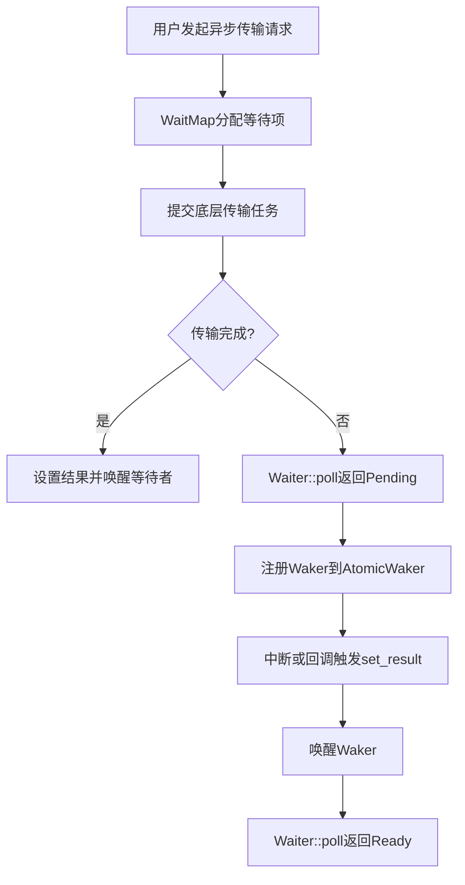

# 定时器与超时控制

<cite>
**Referenced Files in This Document **  
- [osal.rs](file://usb-host/src/osal.rs)
- [wait.rs](file://usb-if/src/transfer/wait.rs)
- [design.md](file://doc/design.md)
</cite>

## 目录
1. [引言](#引言)
2. [跨平台延时原语的封装机制](#跨平台延时原语的封装机制)
3. [异步传输请求的超时检测流程](#异步传输请求的超时检测流程)
4. [Future组合与超时熔断机制](#future组合与超时熔断机制)
5. [Duration参数在实时系统中的精度限制及应对策略](#duration参数在实时系统中的精度限制及应对策略)
6. [嵌入式环境中硬件定时器的集成指导](#嵌入式环境中硬件定时器的集成指导)
7. [结论](#结论)

## 引言

CrabUSB驱动框架采用异步模型处理USB设备通信，其核心在于实现可移植且高效的超时控制机制。本文件系统阐述该机制的跨平台实现方案，重点分析基于`osal.rs`中`Kernel` trait的`sleep`异步接口如何封装可移植的延时原语，并结合`wait.rs`中的等待逻辑，解析异步传输请求的完整超时检测流程。

该设计遵循无锁、高并发原则，通过预分配的Ring结构管理异步任务状态，使得`future`能够通过查询底层硬件环（Ring）来获取执行结果。此架构不依赖特定的执行器（Executor），从而保证了对任意Rust异步运行时的兼容性。对于同步操作系统环境（如ArceOS），可通过`spin_on`等方式轮询`poll`方法，实现同步调用语义。



**Diagram sources**
- [wait.rs](file://usb-if/src/transfer/wait.rs#L0-L178)

## 跨平台延时原语的封装机制

为实现跨平台兼容性，CrabUSB定义了操作系统抽象层（OSAL），其核心是`Kernel` trait。该trait提供了一个关键的异步睡眠接口`sleep`，用于封装不同操作系统下的延时功能。

```rust
#[def_extern_trait]
pub trait Kernel {
    fn sleep<'a>(duration: Duration) -> BoxFuture<'a, ()>;
    fn page_size() -> usize;
}
```

此设计的关键在于：
1.  **异步抽象**：`sleep`方法返回一个`BoxFuture`，将具体操作系统的休眠实现（如Linux的`tokio::time::sleep`、裸机环境的自旋延迟等）封装为标准的`Future`。
2.  **可移植性**：任何实现了`Kernel` trait的操作系统适配层都能无缝接入CrabUSB框架。上层业务代码只需调用`Kernel::sleep(duration)`，无需关心底层细节。
3.  **灵活性**：`BoxFuture`允许返回不同类型的`Future`，适应各种异步运行时的需求。

通过这种抽象，CrabUSB成功地将平台相关的延时逻辑隔离，为上层构建统一的超时控制奠定了基础。

**Section sources**
- [osal.rs](file://usb-host/src/osal.rs#L0-L9)

## 异步传输请求的超时检测流程

异步传输请求的超时检测流程紧密依赖于`WaitMap`和`Waiter`数据结构，其实现位于`wait.rs`文件中。

### 核心组件

-   **`WaitMap<K, T>`**：一个线程安全的映射表，用于管理多个等待项。它使用`BTreeMap`存储以`K`（通常为传输ID）为键的`Elem<T>`结构，并通过`RwLock`进行并发控制。
-   **`Elem<T>`**：`WaitMap`中的单个元素，包含：
    -   `result: Option<T>`：存储最终的传输结果。
    -   `waker: AtomicWaker`：用于在结果就绪时唤醒等待的`Future`。
    -   `using: AtomicBool`：标记该等待项是否正在被使用，防止重复提交。
    -   `result_ok: AtomicBool`：标记结果是否已设置。
-   **`Waiter<'a, T>`**：一个实现了`Future` trait的等待者。当用户调用`wait_for_result`时，会得到一个`Waiter`实例。

### 检测流程

1.  **准备阶段**：用户调用`preper_id`方法，传入传输ID。`WaitMap`检查该ID对应的`Elem`是否存在且未被占用（`using`为`false`）。若检查通过，则重置其内部状态（清空`result`，将`result_ok`设为`false`），表示开始等待新结果。
2.  **等待阶段**：用户调用`wait_for_result`方法，获得一个`Waiter` `Future`。当该`Future`被`poll`时：
    -   若`result_ok`为`true`，说明结果已由中断或回调设置，`poll`立即返回`Poll::Ready(result)`。
    -   若`result_ok`为`false`，说明结果尚未就绪，`poll`会将当前任务的`Waker`注册到`Elem`的`AtomicWaker`中，并返回`Poll::Pending`，使任务挂起。
3.  **结果通知阶段**：当底层硬件传输完成（通常在中断服务程序或回调函数中），会调用`unsafe set_result`方法。该方法将结果写入`Elem`，并将`result_ok`设为`true`。随后，它会从`AtomicWaker`中取出之前注册的`Waker`并调用`wake()`，通知等待的任务可以继续执行。
4.  **恢复执行**：被唤醒的任务重新被调度，其`Waiter::poll`方法再次被调用。此时，由于`result_ok`为`true`，`poll`将成功返回结果。

此流程构成了超时检测的基础：只要能在规定时间内调用`set_result`，等待的`Future`就能正常完成；否则，就需要引入额外的超时机制。

**Section sources**
- [wait.rs](file://usb-if/src/transfer/wait.rs#L0-L178)

## Future组合与超时熔断机制

虽然`wait.rs`本身未直接实现超时熔断，但其提供的`Waiter` `Future`可以与`Kernel::sleep`返回的`Future`轻松组合，实现强大的超时控制。

典型的超时熔断模式如下：

```rust
use futures::future::{select, Either};

// 假设 `transfer_future` 是来自 WaitMap 的 Waiter
let transfer_future = wait_map.wait_for_result(transfer_id, None);
// 创建一个超时 Future
let timeout_future = Kernel::sleep(Duration::from_millis(1000));

// 使用 select 组合两个 Future
match select(transfer_future, timeout_future).await {
    Either::Left((result, _)) => {
        // 传输先完成
        println!("Transfer succeeded: {:?}", result);
    }
    Either::Right(((), _)) => {
        // 超时先发生
        println!("Transfer timed out!");
        // 此处可执行取消传输等操作
    }
}
```

**工作原理**：
-   `futures::future::select`接受两个`Future`作为输入，并同时`poll`它们。
-   哪个`Future`先完成（返回`Poll::Ready`），`select`就返回哪个的结果。
-   如果传输在1秒内完成，`Either::Left`分支会被执行。
-   如果1秒内传输未完成，`timeout_future`会先完成，触发`Either::Right`分支，实现“熔断”。

这种组合方式简洁、高效，且完全基于标准库和`futures` crate的能力，体现了Rust异步编程的强大表达力。

## Duration参数在实时系统中的精度限制及应对策略

尽管`Duration`提供了精确的时间描述，但在实际系统中，其精度受到多种因素制约：

### 精度限制

1.  **系统时钟分辨率**：操作系统的时钟中断频率（如1ms、10ms）决定了时间测量的最小粒度。即使`Duration`指定纳秒级延时，实际休眠时间也会被向上取整到最近的时钟滴答。
2.  **调度延迟**：在多任务系统中，即使`sleep`的`Future`到期，任务也可能因优先级或资源竞争而无法立即被调度执行，导致实际响应延迟大于预期。
3.  **中断延迟**：在嵌入式系统中，高优先级中断可能屏蔽低优先级中断，导致USB传输完成中断被延迟处理，进而影响`set_result`的调用时机。

### 应对策略

1.  **合理设置超