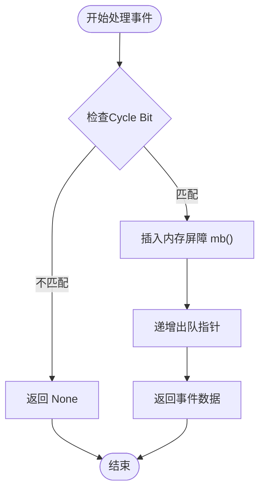

# 高级主题

<cite>
**Referenced Files in This Document**  
- [osal.rs](file://usb-host/src/osal.rs)
- [reg.rs](file://usb-host/src/backend/xhci/reg.rs)
- [event.rs](file://usb-host/src/backend/xhci/event.rs)
- [context.rs](file://usb-host/src/backend/xhci/context.rs)
- [ring/mod.rs](file://usb-host/src/backend/xhci/ring/mod.rs)
</cite>

## 目录
1. [操作系统适配层设计](#操作系统适配层设计)
2. [xHCI寄存器访问机制](#xhci寄存器访问机制)
3. [事件环与中断处理](#事件环与中断处理)
4. [DMA内存管理与上下文结构](#dma内存管理与上下文结构)
5. [定时器与超时控制](#定时器与超时控制)
6. [高负载性能调优策略](#高负载性能调优策略)
7. [调试技巧与监控手段](#调试技巧与监控手段)

## 操作系统适配层设计

CrabUSB通过`osal.rs`中的`Kernel` trait实现了操作系统抽象层，为驱动程序提供跨平台兼容性。该设计将平台相关的原语（如睡眠、页面大小）封装为异步接口，使上层代码无需关心底层操作系统的具体实现。

`Kernel` trait定义了两个核心方法：`sleep`用于实现非阻塞延时，返回一个`BoxFuture`以支持异步等待；`page_size`则提供内存对齐所需的基本单位。这种抽象使得驱动可以在不同运行时环境中无缝切换，例如从裸机环境迁移到具备完整操作系统的环境。

**Section sources**
- [osal.rs](file://usb-host/src/osal.rs#L1-L11)

## xHCI寄存器访问机制

在`reg.rs`中，`XhciRegisters`结构体负责封装对xHCI控制器寄存器的访问。它通过`MemMapper`实现物理地址到虚拟地址的映射，允许直接操作MMIO（Memory-Mapped I/O）区域。`new`构造函数接收非空指针形式的MMIO基地址，并初始化寄存器访问器。

关键的安全机制体现在`disable_irq_guard`方法中，该方法返回一个实现了`Drop` trait的`DisableIrqGuard`结构体。当此守卫超出作用域时，会自动恢复中断使能状态，确保中断不会因异常路径而永久关闭，从而提升系统的健壮性。

**Section sources**
- [reg.rs](file://usb-host/src/backend/xhci/reg.rs#L1-L89)

## 事件环与中断处理

`event.rs`实现了xHCI规范中的事件环（Event Ring），用于接收来自主机控制器的异步事件。`EventRing`结构包含一个TRB（Transfer Request Block）环和一个段表条目（STE）数组，二者均通过DMA安全地与硬件共享。

`next`方法是事件处理的核心，它检查当前TRB的周期位（Cycle Bit）是否匹配，若不匹配则返回`None`表示无新事件。一旦确认有效事件，即调用`mbarrier::mb()`插入内存屏障以保证可见性，并递增出队索引。`erdp`和`erstba`方法分别提供事件环当前指针和段表基址，供xHCI控制器轮询使用。

**Diagram sources**
- [event.rs](file://usb-host/src/backend/xhci/event.rs#L50-L65)

**Section sources**
- [event.rs](file://usb-host/src/backend/xhci/event.rs#L1-L66)

## DMA内存管理与上下文结构

`context.rs`实现了设备上下文列表（DCBA - Device Context Base Address Array）和输入/输出上下文的管理。所有上下文数据结构均通过`DBox`或`DVec`分配，这些类型由`dma_api`提供，确保内存位于DMA可访问的连续物理区域，并正确设置缓存一致性。

`DeviceContextList::new_ctx`方法为指定槽位（Slot ID）创建新的上下文，并将其基地址写入DCBAA。每个上下文包含输入和输出部分，分别用于向主机控制器发送命令和接收设备状态。此外，`ScratchpadBufferArray`用于支持需要额外缓冲区的设备，其页面地址同样通过DMA安全方式注册。

**Section sources**
- [context.rs](file://usb-host/src/backend/xhci/context.rs#L1-L195)

## 定时器与超时控制

虽然当前代码未显式展示定时器实现，但`osal.rs`中的`Kernel::sleep`为超时机制提供了基础。结合异步编程模型，可通过`BoxFuture`实现非阻塞等待，在高精度定时器支持下完成精确的传输超时控制。未来扩展可在此基础上集成周期性任务调度或延迟执行功能。

## 高负载性能调优策略

在高负载场景下，优化重点在于减少上下文切换和提升缓存命中率：

- **批量处理事件**：避免每次中断仅处理单个事件，应尽可能清空整个事件环。
- **预分配对象池**：频繁使用的结构体（如TRB、上下文）应预先分配并复用，减少运行时内存分配开销。
- **缓存友好布局**：将频繁访问的数据（如环形缓冲区头尾索引）置于独立缓存行，防止伪共享。
- **中断合并**：配置xHCI控制器以延迟中断生成，合并多个事件为一次通知，降低CPU中断频率。

## 调试技巧与监控手段

建议采用以下方法进行复杂环境下的问题排查：

- **日志追踪**：利用`log`宏记录关键路径（如TRB入队/出队、事件处理），便于回溯执行流程。
- **内存快照**：在故障点导出DCBAA、事件环等关键结构的物理内存内容，分析一致性。
- **硬件仿真对比**：使用QEMU等模拟器复现行为，与真实硬件对比差异。
- **性能计数器**：监控中断频率、平均延迟、DMA传输效率等指标，识别瓶颈。

**Section sources**
- [ring/mod.rs](file://usb-host/src/backend/xhci/ring/mod.rs#L1-L158)