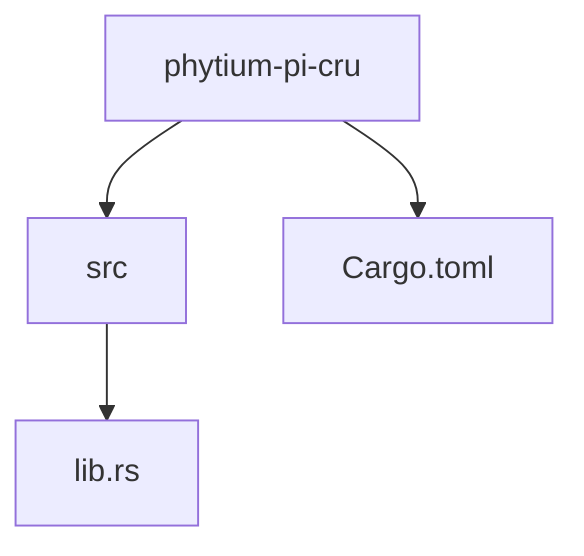
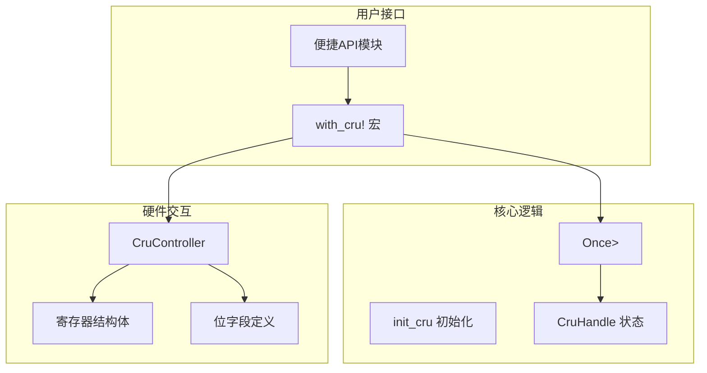
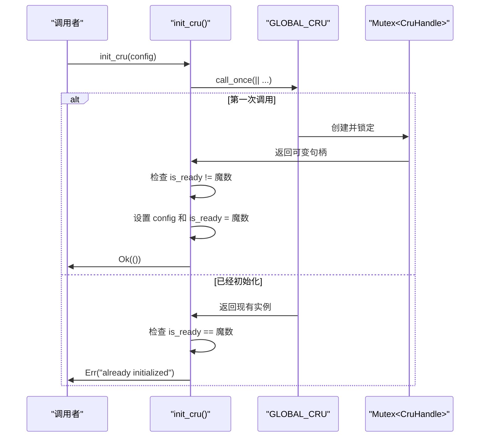
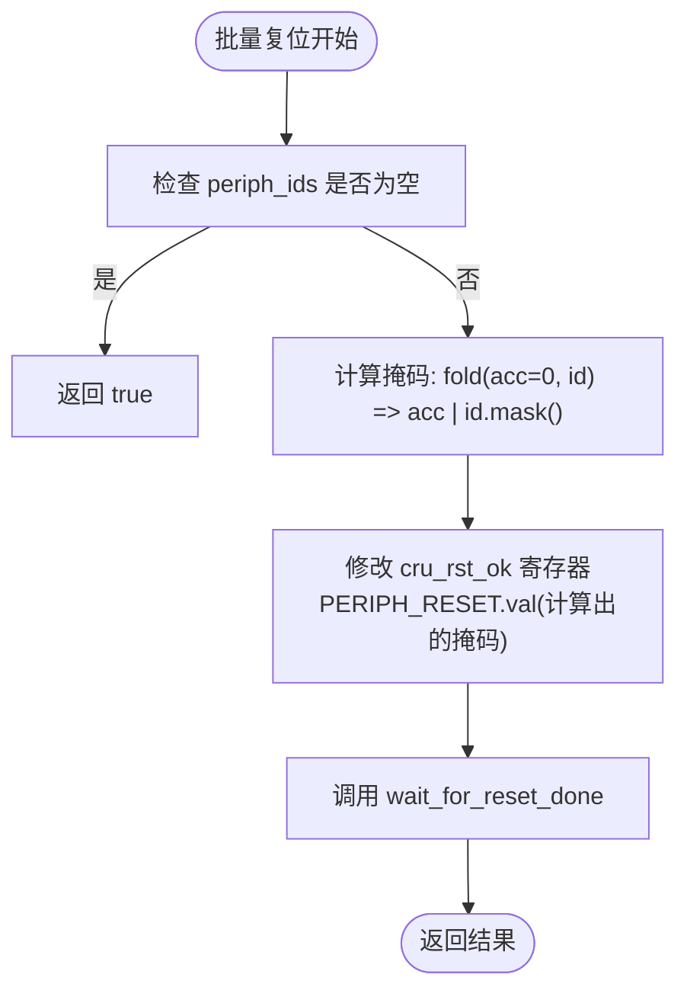
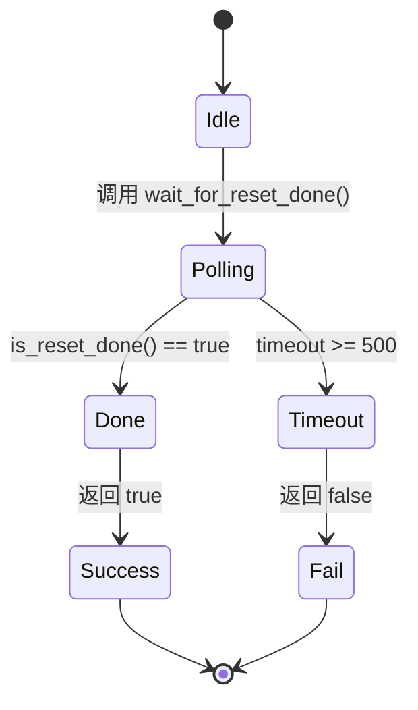
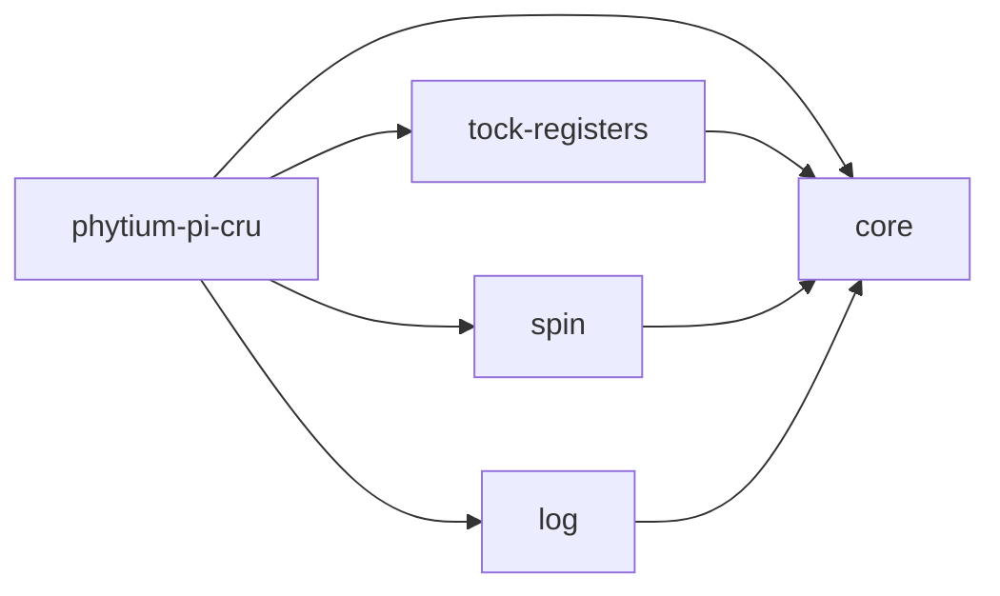

<cite>
**本文档中引用的文件**
- [lib.rs](file://src/lib.rs)
</cite>

## 目录
1. [引言](#引言)
2. [项目结构](#项目结构)
3. [核心组件](#核心组件)
4. [架构概述](#架构概述)
5. [详细组件分析](#详细组件分析)
6. [依赖分析](#依赖分析)
7. [性能考虑](#性能考虑)
8. [故障排除指南](#故障排除指南)
9. [结论](#结论)

## 引言

本文档深入阐述了飞腾平台时钟与复位单元（CRU）驱动的核心功能实现细节。该驱动为嵌入式系统提供关键的初始化、复位控制和状态查询能力，是确保硬件稳定运行的基础模块。文档将围绕三大核心子主题展开：首先，解析`init_cru`函数如何利用全局单例机制保证资源唯一性；其次，剖析系统与外设复位操作的底层寄存器交互逻辑；最后，阐明状态查询与超时等待的设计原理。通过结合宏生成的安全寄存器访问模式，全面展示驱动程序与硬件交互的可靠性保障。

## 项目结构

本驱动项目采用简洁的Rust库结构，核心逻辑集中于单一源文件中，便于维护和集成。

**Diagram sources**
- [lib.rs](file://src/lib.rs#L0-L284)

**Section sources**
- [lib.rs](file://src/lib.rs#L0-L284)

## 核心组件

本驱动的核心由三个主要部分构成：全局单例管理的`GLOBAL_CRU`、负责具体硬件操作的`CruController`以及封装配置与状态的`CruHandle`。`init_cru`函数作为初始化入口，确保驱动在系统启动时被正确且唯一地配置。复位控制功能通过`system_reset`、`reset_peripheral`和`reset_peripherals`等方法实现，直接操作硬件寄存器以触发不同粒度的复位。状态查询则依赖`is_reset_done`和`wait_for_reset_done`方法，通过轮询特定状态位来判断复位操作是否完成。

**Section sources**
- [lib.rs](file://src/lib.rs#L12-L284)

## 架构概述

该驱动遵循典型的硬件抽象层（HAL）设计模式，通过安全的Rust类型系统封装对底层内存映射寄存器的直接访问。

**Diagram sources**
- [lib.rs](file://src/lib.rs#L12-L284)

## 详细组件分析

### 初始化功能分析

#### `init_cru`工作机制
`init_cru`函数是驱动的初始化入口点，其核心在于利用`spin::Once<Mutex<CruHandle>>`这一同步原语来保证全局唯一性。`Once`确保`call_once`中的初始化代码在整个程序生命周期内仅执行一次，有效防止了重复初始化可能引发的资源冲突或状态不一致问题。内部的`Mutex`则提供了线程安全的访问控制，允许多个线程安全地获取和检查`CruHandle`的状态。

`is_ready`标志位被设计为一个魔数`0x11111111u32`，其设计意图明确：它不仅是一个简单的布尔值，更是一个强健的“已就绪”信号。使用非零魔数而非简单的`true/false`可以有效区分未初始化（默认为0）和已成功初始化两种状态，增加了状态判断的鲁棒性。此外，日志输出`log::info!("CRU controller initialized successfully")`具有重要的调试价值，它为系统启动过程提供了清晰的追踪线索，便于开发者确认驱动加载时机和排查初始化失败的问题。

**Diagram sources**
- [lib.rs](file://src/lib.rs#L230-L248)

**Section sources**
- [lib.rs](file://src/lib.rs#L230-L248)

### 复位控制分析

#### 内部逻辑与位操作
复位控制功能的核心在于对`cru_rst_ok`寄存器的精确位操作。`system_reset`方法通过`modify(RST_OK::SYSTEM_RESET::SET)`设置第0位来触发系统级复位。`reset_peripheral`和`reset_peripherals`则针对第1-5位，分别控制GPIO0至GPIO5等外设的复位。

`PeripheralId`枚举的`mask()`方法实现了掩码计算的关键过程：通过`1 << (self as u32)`将枚举值转换为对应的位掩码。例如，`Gpio2`（值为2）会生成掩码`0b100`（即4）。在`reset_peripherals`中，通过`fold`函数对传入的外设ID列表进行迭代，将所有单个掩码进行按位或（`|`）运算，从而高效地计算出一个能同时触发多个外设复位的复合掩码。对于空列表的边界处理，函数直接返回`true`，这是一种合理的短路优化，避免了对无效操作的尝试。

**Diagram sources**
- [lib.rs](file://src/lib.rs#L160-L190)

**Section sources**
- [lib.rs](file://src/lib.rs#L160-L190)

### 状态查询分析

#### 寄存器读取与超时策略
状态查询功能依赖于对`cru_rst_status`寄存器的`DONE`位（第9位）的读取。`is_reset_done`方法通过`read(RST_STATUS::DONE)`安全地提取该位的值，并将其与1比较以返回布尔结果。这是`tock_registers`宏提供的类型安全访问的直接体现。

`wait_for_reset_done`方法采用了经典的轮询加超时策略。其500次循环的超时设计是一种权衡：一方面，它足够长以覆盖大多数正常情况下的复位延迟，确保操作不会过早失败；另一方面，它又限制了无限等待的风险，保证了系统的响应性和可预测性。内部的`for _ in 0..1000`循环模拟了一个简单的延时，实际应用中应替换为平台特定的精确延时函数。这种设计在没有中断机制的情况下，提供了一种简单可靠的同步方式。

**Diagram sources**
- [lib.rs](file://src/lib.rs#L200-L220)

**Section sources**
- [lib.rs](file://src/lib.rs#L200-L220)

## 依赖分析

本驱动的外部依赖清晰且精简，主要依赖于几个关键的Rust crate。

**Diagram sources**
- [Cargo.toml](file://Cargo.toml)
- [lib.rs](file://src/lib.rs#L4-L6)

**Section sources**
- [Cargo.toml](file://Cargo.toml)
- [lib.rs](file://src/lib.rs#L4-L6)

## 性能考虑

从性能角度看，该驱动的设计有以下特点：
1.  **初始化开销**：`init_cru`的`Once`和`Mutex`引入了极小的运行时开销，但保证了初始化的原子性和唯一性，此代价是必要且可接受的。
2.  **复位操作**：复位本身是重量级的硬件操作，其耗时远大于软件层面的指令执行时间。驱动的性能影响微乎其微。
3.  **状态轮询**：`wait_for_reset_done`中的忙等待（busy-waiting）会消耗CPU周期。虽然500次循环的总时长可控，但在高实时性要求的场景下，若硬件支持中断通知，则应考虑改用中断驱动模型以释放CPU资源。

## 故障排除指南

当遇到驱动相关问题时，可参考以下步骤：
1.  **初始化失败**：检查`init_cru`是否被多次调用。查看日志输出，确认"CRU already initialized"信息是否出现。
2.  **复位无响应**：确认传递给`new`方法的基地址是否正确。验证`PeripheralId`枚举与硬件规格书定义的位偏移是否匹配。
3.  **状态查询超时**：如果`wait_for_reset_done`频繁超时，可能是硬件复位电路存在问题，或目标外设未能正常响应复位信号。检查硬件连接和电源状态。

**Section sources**
- [lib.rs](file://src/lib.rs#L230-L248)
- [lib.rs](file://src/lib.rs#L200-L220)

## 结论

本文档详细剖析了飞腾平台CRU驱动的实现。该驱动通过`Once<Mutex<T>>`模式确保了初始化的全局唯一性，利用`register_structs!`和`register_bitfields!`宏生成的类型安全接口与硬件寄存器进行交互，极大地提升了代码的安全性和可维护性。复位控制逻辑清晰，通过位掩码精确操作，支持单个及批量外设复位。状态查询采用带超时的轮询机制，平衡了可靠性和系统响应性。整体设计简洁高效，是嵌入式Rust开发中硬件驱动编写的良好范例。