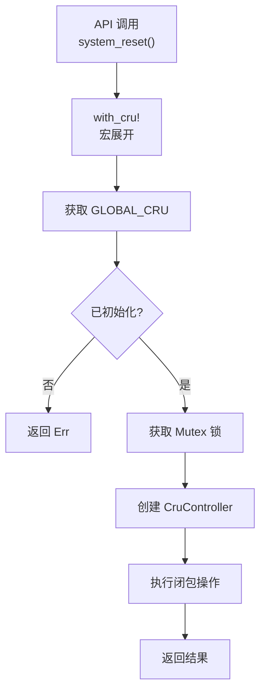
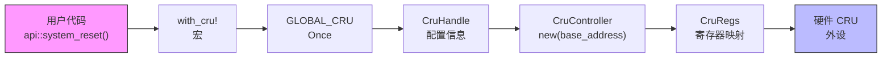

# 设计原理

<cite>
**Referenced Files in This Document **   
- [lib.rs](file://src/lib.rs)
- [Cargo.toml](file://Cargo.toml)
</cite>

## 目录
1. [单例模式设计决策](#单例模式设计决策)
2. [寄存器映射与内存安全](#寄存器映射与内存安全)
3. [并发安全性保障](#并发安全性保障)
4. [类型安全的寄存器操作](#类型安全的寄存器操作)
5. [资源管理宏设计](#资源管理宏设计)
6. [批量操作效率考量](#批量操作效率考量)
7. [扩展性分析](#扩展性分析)
8. [潜在改进方向](#潜在改进方向)
9. [数据流路径](#数据流路径)

## 单例模式设计决策

驱动采用全局静态 `Once<Mutex<CruHandle>>` 模式实现单例控制，这一设计决策基于嵌入式系统对初始化时序和资源独占性的严格要求。`Once` 类型确保 `CruHandle` 的初始化过程仅执行一次，防止重复初始化导致的硬件状态混乱。相比其他可能方案，该模式具有显著优势：

- **对比 Box::leak**：`Box::leak` 虽可创建静态引用，但缺乏运行时检查机制，无法验证初始化状态。而 `Once` 提供了 `call_once` 语义保证，结合 `get()` 方法可安全查询初始化状态。
- **对比编译时配置**：编译时配置将基地址等参数固化，牺牲了运行时灵活性。当前设计允许通过 `init_cru` 函数动态传入配置，在多实例场景下更具适应性。

此模式通过双重检查（`GLOBAL_CRU.get().is_some()` 和 `handle.is_ready` 标志位）确保线程安全的初始化流程，符合嵌入式驱动对可靠性和确定性的要求。

**Section sources**
- [lib.rs](file://src/lib.rs#L190-L215)

## 寄存器映射与内存安全

`NonNull` 指针在表示寄存器映射地址时提供了关键的安全优势。作为 `*mut T` 的非空包装器，`NonNull` 在编译期即排除了空指针解引用的风险，同时保持零成本抽象。其主要优势体现在：

- **非空保证**：构造函数 `NonNull::new(base)` 返回 `Option<NonNull<T>>`，强制调用者处理空指针情况，避免了直接使用裸指针可能导致的未定义行为。
- **可移植性**：`NonNull` 是标准库提供的稳定API，不依赖特定平台特性，增强了代码的可维护性。
- **类型转换安全**：通过 `.cast()` 方法进行指针类型转换，比传统的 `transmute` 更加安全且意图明确。

这种设计在 `no_std` 环境下尤为重要，它在不引入运行时开销的前提下，为硬件寄存器访问提供了基础内存安全保障。

**Section sources**
- [lib.rs](file://src/lib.rs#L60-L73)

## 并发安全性保障

`Send` 和 `Sync` 标记 trait 的应用是本驱动支持多线程环境的前提。`CruController` 被标记为 `unsafe impl Send + Sync`，其正确性建立在以下前提之上：

- **硬件资源独占**：CRU 外设在同一时间只允许一个逻辑实体访问，由 `Mutex` 在软件层面强制执行。
- **无内部可变状态**：`CruController` 本身不持有可变数据，所有状态变更均通过寄存器写入反映到硬件。
- **原子操作保证**：底层寄存器访问由硬件保证原子性，避免了竞态条件。

`Mutex<CruHandle>` 的嵌套结构（`Once<Mutex<T>>`）确保了即使在并发初始化尝试中，也只有一个线程能成功获取锁并完成初始化，其他线程将阻塞等待，从而实现了安全的全局状态管理。

**Section sources**
- [lib.rs](file://src/lib.rs#L63-L64)

## 类型安全的寄存器操作

`tock-registers` 库通过 Rust 的类型系统从根本上避免了常见的寄存器操作错误：

- **字段级访问控制**：`register_bitfields!` 宏生成的类型精确描述了每个比特位的含义和位置，如 `RST_OK::SYSTEM_RESET` 和 `RST_OK::PERIPH_RESET`，防止越界写入或误写保留位。
- **读写权限分离**：`ReadOnly` 和 `ReadWrite` 类型区分了只读和读写寄存器，编译器会阻止对只读寄存器的写入操作。
- **值域约束**：`val()` 方法接受枚举或位掩码，确保写入值在合法范围内，避免了魔术数字的使用。

例如，`modify(RST_OK::PERIPH_RESET.val(mask))` 调用不仅语义清晰，而且编译器会验证 `mask` 是否符合 `PERIPH_RESET` 字段的位宽限制，将运行时错误提前到编译期发现。

**Section sources**
- [lib.rs](file://src/lib.rs#L10-L15)

## 资源管理宏设计

`with_cru` 宏封装了资源获取与生命周期管理的复杂性，显著提升了调用安全性并减少了重复代码：

- **自动化资源获取**：宏内部自动获取 `GLOBAL_CRU` 实例和 `Mutex` 锁，用户无需显式处理这些样板代码。
- **状态检查集成**：内置对 `is_ready` 标志位的检查，确保仅在驱动初始化完成后才执行操作。
- **RAII 风格**：`controller` 实例在闭包结束后自动析构，符合 Rust 的所有权原则。
- **错误传播统一**：宏统一返回 `Result` 类型，简化了错误处理逻辑。

通过将 `CruController` 的创建（`unsafe new`）封装在宏内部，暴露给用户的 API 变得完全安全，降低了误用风险。

**Diagram sources **
- [lib.rs](file://src/lib.rs#L217-L270)

**Section sources**
- [lib.rs](file://src/lib.rs#L217-L270)

## 批量操作效率考量

`reset_peripherals` 函数中按位或合并掩码的设计体现了对硬件交互效率的深入考量：

- **减少寄存器写入次数**：将多个外设的复位请求合并为一次 `modify` 操作，最小化了总线事务数量，这对于低速外设总线尤为关键。
- **原子性保证**：单次写入确保所有外设复位信号同步触发，避免了逐个写入可能造成的时间差。
- **计算开销低廉**：`fold` 操作在栈上进行，其 O(n) 时间复杂度远低于多次硬件访问的延迟。

此设计平衡了软件复杂性和硬件性能，相较于循环调用 `reset_peripheral`，在复位多个外设时具有明显优势。

**Section sources**
- [lib.rs](file://src/lib.rs#L138-L155)

## 扩展性分析

当前设计对功能扩展表现出良好的支持程度：

- **外设枚举扩展**：新增外设只需在 `PeripheralId` 枚举中添加成员，并更新 `mask` 方法的实现，接口保持不变。
- **配置灵活性**：`CruConfig` 结构体预留了 `instance_id` 字段，为未来支持多 CRU 实例奠定了基础。
- **API 分层清晰**：`api` 模块提供了高层便捷接口，底层 `CruController` 方法保持细粒度控制，便于新功能的渐进式添加。

然而，硬编码的基地址（`0x2800_0000`）和实例数量限制（`instance_id >= 1` 返回 `None`）表明当前设计主要针对单实例场景优化，多实例支持需进一步重构。

**Section sources**
- [lib.rs](file://src/lib.rs#L167-L189)

## 蕴含改进方向

尽管当前设计已满足基本需求，但仍存在若干潜在改进方向：

- **精确延时机制**：`wait_for_reset_done` 中的 `spin_loop` 循环依赖固定迭代次数实现延时，精度受 CPU 频率影响。应引入基于定时器的精确延时函数，或提供超时回调机制。
- **错误类型细化**：目前错误信息为静态字符串，建议定义专用错误枚举类型，区分初始化、超时、硬件故障等不同错误类别。
- **异步支持**：对于长时间运行的操作（如等待复位完成），可考虑提供异步/await 接口，避免阻塞线程。

这些改进将进一步提升驱动的健壮性和适用性。

**Section sources**
- [lib.rs](file://src/lib.rs#L175-L185)

## 数据流路径

从 API 调用到硬件寄存器写入的完整数据流路径如下图所示，展示了各组件间的协作关系：

**Diagram sources **
- [lib.rs](file://src/lib.rs#L217-L270)
- [lib.rs](file://src/lib.rs#L190-L191)
- [lib.rs](file://src/lib.rs#L60-L61)