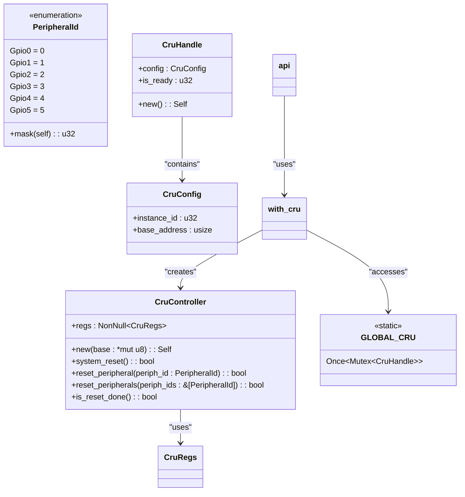
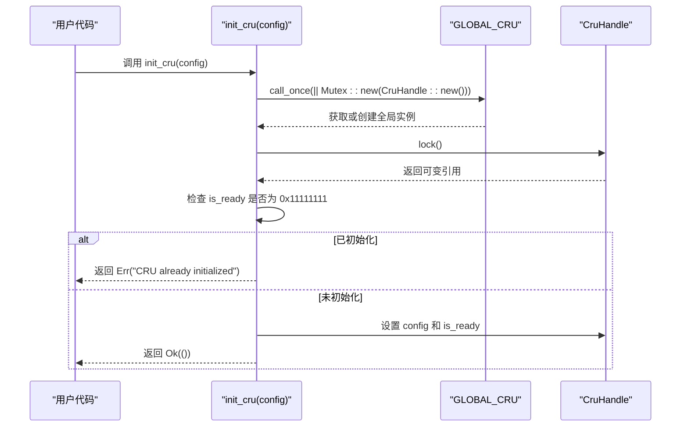

# 项目概述

<cite>
**Referenced Files in This Document **  
- [lib.rs](file://src/lib.rs)
- [Cargo.toml](file://Cargo.toml)
</cite>

## 目录
1. [引言](#引言)
2. [项目结构](#项目结构)
3. [核心组件](#核心组件)
4. [架构设计原则](#架构设计原则)
5. [关键类型与关系](#关键类型与关系)
6. [初始化流程分析](#初始化流程分析)
7. [API模块调用方式](#api模块调用方式)
8. [术语定义](#术语定义)
9. [性能考量建议](#性能考量建议)
10. [结论](#结论)

## 引言

Phytium Pi平台时钟与复位单元（CRU）驱动是一个专为嵌入式系统设计的硬件抽象层组件，旨在提供安全、高效的系统级和外设级别的复位控制功能。该库作为ArceOS驱动生态中的底层HAL组件，支持系统的初始化与故障恢复机制。其设计充分考虑了no-std环境下的运行需求，并通过tock-registers实现对寄存器的安全访问，利用Once<Mutex<T>>模式管理全局单例实例，同时采用宏封装简化错误处理逻辑。

**Section sources**  
- [lib.rs](file://src/lib.rs#L1-L285)  
- [Cargo.toml](file://Cargo.toml#L1-L41)

## 项目结构

本项目遵循标准Rust库结构，包含一个`src/lib.rs`源文件作为主要实现入口，以及`Cargo.toml`构建配置文件。`lib.rs`中定义了所有核心类型、功能函数及API接口，而`Cargo.toml`则声明了依赖项如`tock-registers`、`log`和`spin`等，确保在无标准库环境下正常运行。

```mermaid
graph TB
subgraph "Source Code"
LibRs[src/lib.rs]
end
subgraph "Configuration"
CargoToml[Cargo.toml]
end
LibRs --> CargoToml : "Dependencies"
```

**Diagram sources **  
- [lib.rs](file://src/lib.rs#L1-L285)  
- [Cargo.toml](file://Cargo.toml#L1-L41)

**Section sources**  
- [lib.rs](file://src/lib.rs#L1-L285)  
- [Cargo.toml](file://Cargo.toml#L1-L41)

## 核心组件

该驱动的核心在于`CruController`结构体，它封装了对CRU寄存器的直接操作，提供了执行系统复位和外设复位的功能。此外，`PeripheralId`枚举用于标识不同外设，`CruConfig`结构体承载初始化所需的配置信息。全局静态变量`GLOBAL_CRU`使用`Once<Mutex<CruHandle>>`确保线程安全的单例初始化。

**Section sources**  
- [lib.rs](file://src/lib.rs#L63-L165)  
- [lib.rs](file://src/lib.rs#L114-L165)  
- [lib.rs](file://src/lib.rs#L167-L215)

## 架构设计原则

### no-std环境适配
通过`#![no_std]`属性禁用标准库依赖，仅使用`core`和`alloc`子集，适用于资源受限的嵌入式设备。

### 寄存器安全访问
借助`tock-registers`库提供的`register_structs!`和`register_bitfields!`宏，以类型安全的方式读写硬件寄存器，避免裸指针误操作带来的风险。

### 全局单例管理
使用`spin::Once<Mutex<T>>`实现延迟初始化且线程安全的全局实例，防止多次初始化导致的状态冲突。

### 宏封装简化错误处理
`with_cru!`宏封装了获取锁、检查状态、创建控制器并执行操作的通用流程，减少重复代码并统一错误传播路径。

**Section sources**  
- [lib.rs](file://src/lib.rs#L1-L285)  
- [Cargo.toml](file://Cargo.toml#L15-L25)

## 关键类型与关系



**Diagram sources **  
- [lib.rs](file://src/lib.rs#L63-L165)  
- [lib.rs](file://src/lib.rs#L25-L58)  
- [lib.rs](file://src/lib.rs#L114-L165)  
- [lib.rs](file://src/lib.rs#L167-L215)

**Section sources**  
- [lib.rs](file://src/lib.rs#L25-L58)  
- [lib.rs](file://src/lib.rs#L63-L165)  
- [lib.rs](file://src/lib.rs#L114-L165)  
- [lib.rs](file://src/lib.rs#L167-L215)

## 初始化流程分析

`init_cru`函数负责初始化CRU控制器。首先调用`GLOBAL_CRU.call_once()`确保仅执行一次初始化；随后获取互斥锁，检查是否已初始化（通过`is_ready`标志位），若未初始化则设置配置信息并将状态标记为就绪。此过程保证了多线程环境下的安全性。



**Diagram sources **  
- [lib.rs](file://src/lib.rs#L167-L215)

**Section sources**  
- [lib.rs](file://src/lib.rs#L167-L215)

## API模块调用方式

`api`模块提供了一组便捷函数，如`system_reset`、`reset_peripheral`等，这些函数内部使用`with_cru!`宏自动处理上下文获取与错误传播。例如，调用`api::system_reset()`会尝试获取全局CRU实例，验证其就绪状态后创建临时`CruController`对象并执行复位操作。

```mermaid
flowchart TD
Start([开始]) --> CheckGlobal{"GLOBAL_CRU.get().is_some()?"}
CheckGlobal --> |否| ReturnErr1["返回 Err(\"CRU not initialized\")"]
CheckGlobal --> |是| LockHandle["获取 global_cru.lock()"]
LockHandle --> CheckReady{"is_ready == 0x11111111?"}
CheckReady --> |否| ReturnErr2["返回 Err(\"CRU not initialized\")"]
CheckReady --> |是| CreateCtrl["unsafe 创建 CruController"]
CreateCtrl --> ExecuteOp["执行传入的操作 $op"]
ExecuteOp --> End([结束])
ReturnErr1 --> End
ReturnErr2 --> End
```

**Diagram sources **  
- [lib.rs](file://src/lib.rs#L217-L270)

**Section sources**  
- [lib.rs](file://src/lib.rs#L217-L270)

## 术语定义

- **CRU (Clock and Reset Unit)**：时钟与复位单元，负责管理系统时钟分发与硬件复位信号。
- **复位机制**：通过写入特定寄存器触发系统或外设的软复位，使其恢复到初始状态。
- **寄存器映射**：将物理内存地址映射为可编程的寄存器结构，便于软件访问硬件资源。
- **no-std**：Rust中不链接标准库的编译模式，常用于嵌入式或操作系统开发。
- **HAL (Hardware Abstraction Layer)**：硬件抽象层，屏蔽底层硬件差异，提供统一接口供上层调用。

**Section sources**  
- [lib.rs](file://src/lib.rs#L1-L285)

## 性能考量建议

`wait_for_reset_done`函数采用自旋等待结合简单延时循环实现超时机制，默认最多等待500次，每次延时约1000个空转周期。虽然实现简单，但在高精度定时要求场景下可能不够精确。建议替换为平台特定的微秒级延时函数（如`udelay`），或引入中断通知机制以避免CPU空耗。此外，批量复位多个外设时应尽量合并操作，减少寄存器访问次数以提升效率。

**Section sources**  
- [lib.rs](file://src/lib.rs#L144-L165)

## 结论

Phytium Pi平台CRU驱动通过精心设计的类型系统与宏抽象，实现了安全、高效且易于使用的硬件复位控制接口。其在ArceOS生态中扮演着关键角色，不仅支持系统初始化，还为故障恢复提供了可靠保障。未来可通过优化等待机制进一步提升实时性表现。