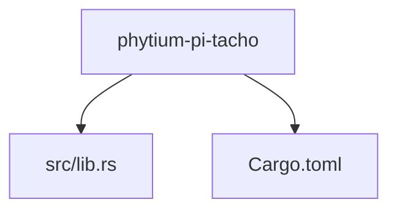

# 技术栈与依赖说明

<cite>
**Referenced Files in This Document**   
- [Cargo.toml](file://Cargo.toml)
- [src/lib.rs](file://src/lib.rs)
</cite>

## 目录
1. [引言](#引言)
2. [项目结构概览](#项目结构概览)
3. [核心依赖分析](#核心依赖分析)
4. [类型安全的寄存器访问：tock-registers](#类型安全的寄存器访问tock-registers)
5. [无标准库环境下的日志集成：log](#无标准库环境下的日志集成log)
6. [并发安全保障：spin库](#并发安全保障spin库)
7. [no_std属性对架构的影响](#no_std属性对架构的影响)
8. [依赖配置选择依据](#依赖配置选择依据)
9. [结论](#结论)

## 引言

本项目为飞腾派（Phytium Pi）平台开发了一个转速监控驱动组件，专注于实现高效、可靠且可移植的底层硬件交互。文档旨在深入解析该项目所依赖的关键Rust库及其在嵌入式驱动开发中的核心作用。通过分析`tock-registers`、`log`和`spin`等库的使用方式，阐明如何构建一个满足资源约束并具备高安全性的驱动程序。

## 项目结构概览

项目采用典型的Rust库结构，包含一个主源文件`lib.rs`和一个包管理配置文件`Cargo.toml`。这种简洁的结构反映了其作为专用驱动组件的定位，专注于提供特定功能而非复杂的应用逻辑。

**Diagram sources**
- [src/lib.rs](file://src/lib.rs)
- [Cargo.toml](file://Cargo.toml)

**Section sources**
- [src/lib.rs](file://src/lib.rs)
- [Cargo.toml](file://Cargo.toml)

## 核心依赖分析

项目的功能实现高度依赖于三个关键的第三方Rust库：`tock-registers`用于安全地访问硬件寄存器，`log`提供调试信息输出能力，`spin`则负责处理并发场景下的数据竞争问题。这些库的选择充分考虑了`#![no_std]`环境的特殊要求。

**Section sources**
- [Cargo.toml](file://Cargo.toml)

## 类型安全的寄存器访问：tock-registers

`tock-registers`库是实现安全硬件交互的基石。它通过Rust强大的类型系统，将传统的、易出错的volatile内存操作转换为类型安全的操作。该库利用宏和泛型来定义寄存器的布局、字段和访问权限，从而在编译时就能捕获诸如写入只读寄存器或访问未定义字段等错误。

在本项目中，`tock-registers`以版本0.8被引入，并明确禁用了默认特性，仅启用了`register_types`特性。这一配置确保了库的核心类型定义可用，同时避免了可能引入标准库依赖或其他不必要的功能，完美契合了嵌入式环境对精简性和确定性的要求。

**Section sources**
- [Cargo.toml](file://Cargo.toml#L12)

## 无标准库环境下的日志集成：log

在`#![no_std]`环境下，传统的基于标准库的打印和日志功能不可用。`log`库为此提供了一个灵活的日志抽象层。它本身不包含具体的日志记录后端，而是作为一个门面（facade），允许在运行时或编译时选择不同的日志实现（如`defmt`、`slog`等）。

本项目采用了`log`库的0.4版本，并通过设置`default-features = false`来剥离任何潜在的标准库依赖。这使得`log`宏可以在没有堆分配和标准I/O的情况下工作，开发者只需在最终的固件中链接一个兼容`no_std`的日志后端即可启用调试追踪功能，极大地提升了开发和调试效率。

**Section sources**
- [Cargo.toml](file://Cargo.toml#L13)

## 并发安全保障：spin库

在裸机或实时操作系统环境中，多核并发和中断处理是常见场景。`spin`库提供了`spin::Mutex`和`spin::Once`这两个关键的同步原语，用于保护共享数据和实现一次性初始化。

`spin::Mutex`是一种自旋锁，在锁被占用时会持续检查（自旋），适用于临界区很短的场景。`spin::Once`则确保一段代码在整个程序生命周期内只执行一次，常用于全局资源的初始化。本项目在`Cargo.toml`中明确启用了`spin_mutex`和`once`特性，表明其设计考虑到了并发安全的需求。需要注意的是，在中断上下文中使用自旋锁需格外谨慎，以避免死锁。

**Section sources**
- [Cargo.toml](file://Cargo.toml#L14)

## no_std属性对架构的影响

`#![no_std]`属性是整个项目架构的基石，它宣告了该项目不依赖于Rust的标准库（`std`）。这一决策带来了深远的影响：
- **内存管理**：禁止使用堆分配（`Box`, `Vec`等），所有内存必须在编译时静态分配或由调用者提供。
- **运行时缺失**：没有内置的panic处理、动态调度或多线程支持，这些功能需要由外部环境或专门的库提供。
- **依赖筛选**：所有依赖项都必须是`no_std`兼容的，这极大地限制了可选库的范围，但也保证了代码的轻量级和可预测性。

`src/lib.rs`文件的第一行`#![no_std]`正是这一设计理念的直接体现。

**Section sources**
- [src/lib.rs](file://src/lib.rs#L0)

## 依赖配置选择依据

项目在`Cargo.toml`中对每个依赖都进行了精细化的配置：
- `tock-registers`的`register_types`特性提供了必要的类型基础，而禁用默认特性保证了最小化依赖。
- `log`库的`default-features = false`确保了其在`no_std`环境下的纯净性。
- `spin`库的`spin_mutex`和`once`特性按需启用，避免了未使用代码的膨胀。

这些配置共同服务于一个目标：在严格受限的嵌入式平台上，构建一个高效、可靠、可验证且易于集成的驱动组件。

**Section sources**
- [Cargo.toml](file://Cargo.toml#L12-L14)

## 结论

通过对`tock-registers`、`log`和`spin`等关键库的合理选用和精确配置，本项目成功构建了一个符合现代Rust嵌入式开发最佳实践的驱动框架。`#![no_std]`的设计原则贯穿始终，确保了代码的安全性、效率和可移植性。这种技术栈的选择不仅满足了当前飞腾派平台的需求，也为未来向其他硬件平台的迁移奠定了坚实的基础。