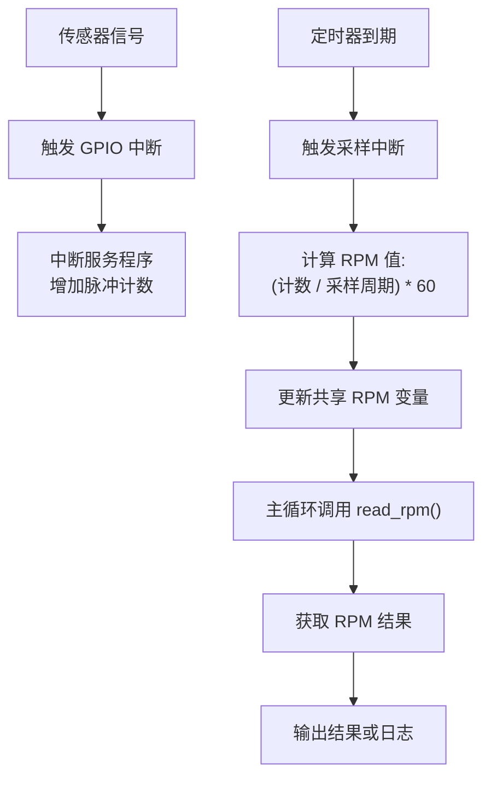

# 架构设计蓝图

<cite>
**本文档引用文件**
- [lib.rs](file://src/lib.rs)
- [Cargo.toml](file://Cargo.toml)
</cite>

## 目录
1. [引言](#引言)
2. [项目结构](#项目结构)
3. [核心依赖分析](#核心依赖分析)
4. [分层架构设计预测](#分层架构设计预测)
5. [组件交互流程图](#组件交互流程图)
6. [模块划分规划](#模块划分规划)
7. [零成本抽象原则贯彻](#零成本抽象原则贯彻)

## 引言

本驱动旨在为飞腾派（Phytium Pi）平台提供精确的转速监控功能，通过测量旋转设备产生的脉冲信号来计算每分钟转数（RPM）。尽管当前代码库尚为空白，但基于其依赖项和嵌入式系统开发惯例，可前瞻性地构建一个安全、高效且可维护的高层架构设计。该设计将遵循无标准库（`no_std`）环境下的最佳实践，确保在资源受限的硬件上实现可靠运行。

## 项目结构

当前项目结构极为简洁，仅包含基础配置文件与空的源码入口：

```
.
├── src
│   └── lib.rs
└── Cargo.toml
```

`Cargo.toml` 文件已声明了关键依赖：`tock-registers` 用于安全寄存器访问，`spin` 提供无阻塞互斥锁，`log` 支持日志输出。`src/lib.rs` 是未来所有驱动逻辑的载体，目前仅包含基本属性声明和待办事项注释。

**Section sources**
- [lib.rs](file://src/lib.rs#L1-L4)
- [Cargo.toml](file://Cargo.toml#L1-L15)

## 核心依赖分析

### tock-registers 宏机制
`tock-registers` 库是实现内存映射I/O安全访问的核心。它通过声明性宏（如 `register_bitfields!`, `register_structs!`）在编译时生成类型安全的寄存器映射结构体。这避免了直接进行裸指针操作的风险，确保对硬件寄存器的读写符合其定义的位域规范，从而防止非法访问和数据竞争。

### spin::Mutex 临界区保护
在 `no_std` 和中断上下文中，传统的基于操作系统的互斥锁不可用。`spin` crate 提供的 `spin::Mutex` 利用自旋锁机制，在多核或中断/主循环场景下保护共享数据。当驱动需要在GPIO中断服务程序(ISR)和主逻辑间共享计数器或状态变量时，`spin::Mutex` 将是确保数据一致性的首选方案。

**Section sources**
- [Cargo.toml](file://Cargo.toml#L10-L14)

## 分层架构设计预测

根据嵌入式驱动开发模式，预计本驱动将采用清晰的三层架构：

### 硬件抽象层 (HAL)
此层将利用 `tock-registers` 宏，根据飞腾派平台的技术参考手册(Technical Reference Manual)，定义与定时器、GPIO控制器相关的寄存器块。例如，`register_structs!` 将被用来创建代表特定外设寄存器组的结构体，每个字段对应一个寄存器，并带有正确的内存偏移量。这实现了对物理地址空间的安全、类型化访问。

### 驱动逻辑层
该层将封装核心业务逻辑：
- **Tachometer 结构体**：作为驱动的主要状态机，持有对寄存器的引用、采样周期配置、脉冲计数器及最终的RPM值。
- **状态管理**：管理驱动从初始化、启动采样到停止的不同状态。
- **共享数据保护**：使用 `spin::Mutex<T>` 包装在ISR中修改的数据（如脉冲计数），确保与主循环代码的并发访问安全。

### 外部接口层
此层暴露简洁的公共API：
- `init()`：初始化硬件外设和内部状态。
- `start(sample_period_ms: u32)`：启动转速监测，设定采样周期。
- `read_rpm() -> Result<u32, Error>`：非阻塞地读取当前计算出的RPM值。调用契约要求驱动必须已成功初始化并启动。错误处理将返回预定义的枚举类型，涵盖未初始化、硬件故障等场景。

**Section sources**
- [Cargo.toml](file://Cargo.toml#L10-L11)
- [lib.rs](file://src/lib.rs#L1-L4)

## 组件交互流程图



**Diagram sources**
- [lib.rs](file://src/lib.rs#L1-L4)

## 模块划分规划

鉴于 `lib.rs` 当前为空，建议未来的模块化组织如下，以增强代码的可读性和可维护性：

```rust
// src/lib.rs
pub mod registers; // HAL: tock-registers 宏定义
pub mod driver;    // 驱动逻辑层: Tachometer 结构体与 API
// pub mod utils;  // 可选: 辅助函数

// 初始化函数和公共 API 入口
```

这种划分明确分离了硬件细节、业务逻辑和公共接口，符合单一职责原则。

**Section sources**
- [lib.rs](file://src/lib.rs#L1-L4)

## 零成本抽象原则贯彻

整个设计严格遵循零成本抽象原则：
- `tock-registers` 生成的访问代码在编译后会内联为直接的内存加载/存储指令，无运行时开销。
- `spin::Mutex` 在单核系统上通常编译为简单的临界区禁用（如 `cortex_m::interrupt::free`），同样无额外性能损耗。
- 所有状态机和数据结构的设计都力求最小化内存占用和CPU周期消耗，确保驱动在实时环境中高效运行。

**Section sources**
- [Cargo.toml](file://Cargo.toml#L10-L14)
- [lib.rs](file://src/lib.rs#L1-L4)