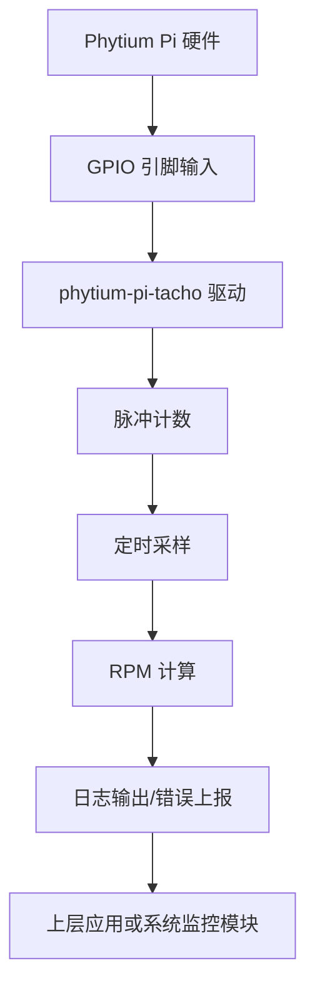

# 项目概述

<cite>
**Referenced Files in This Document **   
- [Cargo.toml](file://Cargo.toml)
- [src/lib.rs](file://src/lib.rs)
</cite>

## 目录
1. [简介](#简介)
2. [项目定位与核心功能](#项目定位与核心功能)
3. [技术背景：no_std环境设计](#技术背景no_std环境设计)
4. [当前开发状态](#当前开发状态)
5. [依赖项分析](#依赖项分析)
6. [开源属性与目标用户](#开源属性与目标用户)
7. [未来功能展望](#未来功能展望)

## 简介

`phytium-pi-tacho` 是一个专为 Phytium Pi 平台设计的转速监控驱动程序，旨在实现对风扇、电机等旋转设备的 RPM（每分钟转数）信号进行精确采集与监控。该项目作为 ArceOS 驱动生态的一部分，专注于提供底层硬件接口支持，适用于资源受限的嵌入式系统环境。

本项目目前处于初始骨架阶段，代码结构已搭建完成，但具体功能尚未实现。其设计遵循模块化与可扩展性原则，为后续开发奠定了坚实基础。

**Section sources**
- [Cargo.toml](file://Cargo.toml#L1-L14)
- [src/lib.rs](file://src/lib.rs#L1-L4)

## 项目定位与核心功能

`phytium-pi-tacho` 的主要作用是作为 Phytium Pi 嵌入式平台上的测速传感器驱动，负责从硬件引脚读取脉冲信号，并将其转换为有意义的转速数据。该驱动的核心功能规划包括：

- **脉冲计数**：实时捕获来自测速传感器的脉冲信号。
- **定时采样**：通过定时器机制周期性地获取脉冲数量。
- **RPM 计算**：基于脉冲频率和时间间隔计算设备的实际转速。
- **错误上报**：检测并报告信号异常、通信故障或硬件错误。

此驱动将直接与 SoC 的 GPIO 和定时器外设交互，确保低延迟和高可靠性，满足工业控制、散热管理等应用场景的需求。

**Section sources**
- [Cargo.toml](file://Cargo.toml#L6-L7)
- [src/lib.rs](file://src/lib.rs#L2)

## 技术背景：no_std环境设计

项目在 `lib.rs` 文件中明确声明了 `#![no_std]` 属性，表明其运行于 `no_std` 环境。这一设计选择具有重要意义：

- **无标准库依赖**：不依赖 Rust 标准库（`std`），仅使用核心库（`core`），从而避免动态内存分配、文件系统、线程等重量级运行时服务。
- **适用场景广泛**：可在裸机（bare-metal）系统或轻量级操作系统（如 ArceOS）上运行，特别适合资源受限的嵌入式设备。
- **确定性行为**：减少运行时不确定性，提升系统的可预测性和实时性。

这种架构使得 `phytium-pi-tacho` 能够无缝集成到微控制器或定制化内核模块中，成为构建可靠嵌入式系统的关键组件。

**Diagram sources **
- [src/lib.rs](file://src/lib.rs#L1)
- [Cargo.toml](file://Cargo.toml#L10-L13)

## 当前开发状态

目前，代码库仍处于初始开发阶段，仅完成了基本的项目结构和元信息配置。`lib.rs` 文件中仅包含必要的 `#![no_std]` 属性和简要文档注释，实际的驱动逻辑尚未实现。

尽管功能尚未完备，但项目的整体方向和技术栈已明确。开发者可通过预留的 TODO 注释（`// TODO: 实现完整的转速监控驱动功能`）了解下一步开发重点，逐步填充脉冲处理、寄存器操作和中断响应等关键模块。

**Section sources**
- [src/lib.rs](file://src/lib.rs#L1-L4)

## 依赖项分析

项目依赖以下关键 crate，均针对 `no_std` 环境进行了优化：

- **tock-registers**：用于安全访问硬件寄存器，提供类型安全的寄存器读写接口。
- **log**：提供日志记录能力，便于调试和运行时状态追踪。
- **spin**：提供 `SpinMutex` 和 `Once` 原语，支持在无操作系统环境下实现同步与初始化控制。

这些依赖共同构成了一个轻量、高效且安全的驱动开发基础。

**Section sources**
- [Cargo.toml](file://Cargo.toml#L10-L13)

## 开源属性与目标用户

根据 `Cargo.toml` 中的元数据，本项目采用 **GPL-2.0 或 Apache-2.0** 双许可证模式发布，兼顾了自由软件社区与商业应用的兼容性。作者团队为“Phytium Pi Driver Team”，并通过指定仓库地址支持公开协作。

关键词（`keywords`）如 `"embedded"`、`"driver"`、`"no-std"` 明确指向其技术领域，目标用户主要包括：
- 嵌入式系统开发者
- 内核模块维护人员
- Phytium Pi 平台使用者
- ArceOS 生态贡献者

**Section sources**
- [Cargo.toml](file://Cargo.toml#L5-L9)

## 未来功能展望

未来版本计划实现完整的驱动功能链路，包括：
- GPIO 输入捕获中断处理
- 定时器驱动的周期性采样机制
- 基于脉冲频率的 RPM 数学模型
- 错误检测与恢复机制
- 与其他 ArceOS 驱动模块的集成接口

开发工作将以 `lib.rs` 中的文档注释为起点，逐步推进至稳定可用状态。最终目标是提供一个高性能、可复用的开源驱动，服务于广泛的 Phytium Pi 应用场景。

**Section sources**
- [src/lib.rs](file://src/lib.rs#L2-L4)