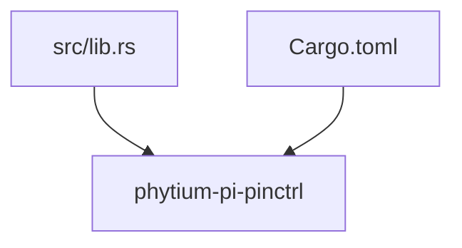
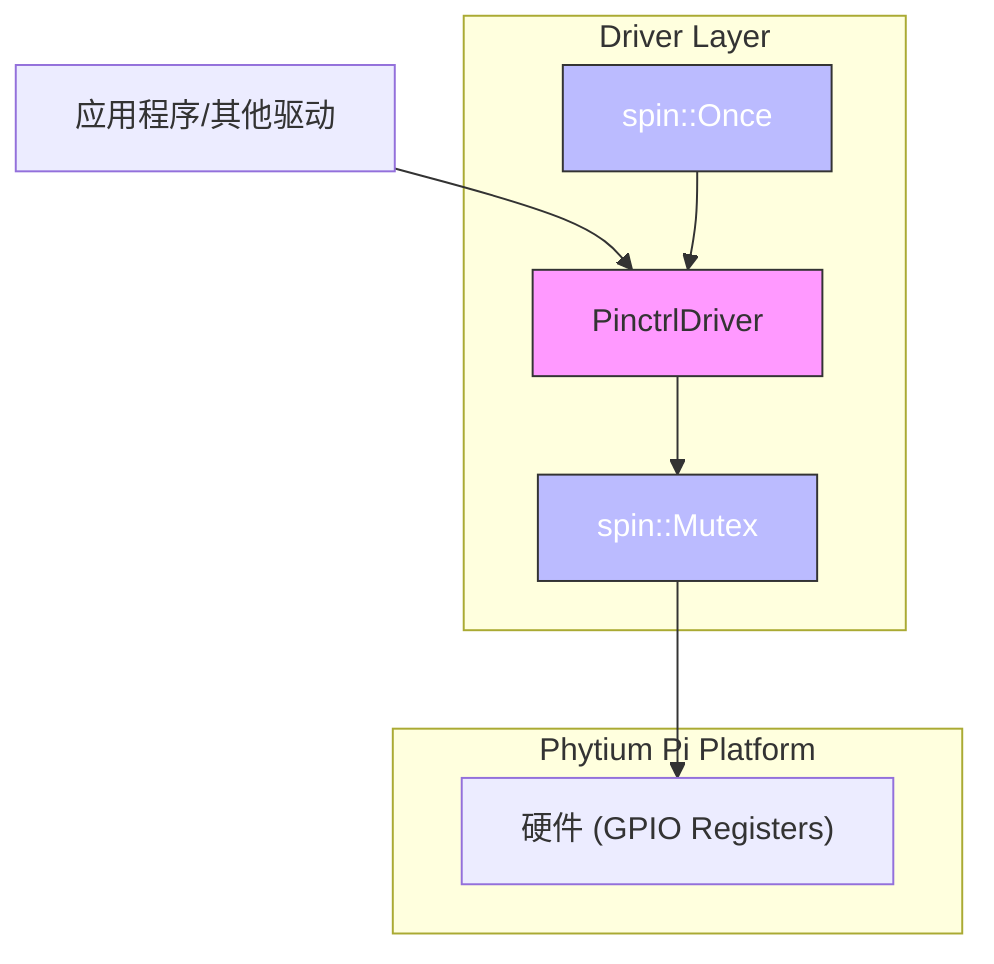
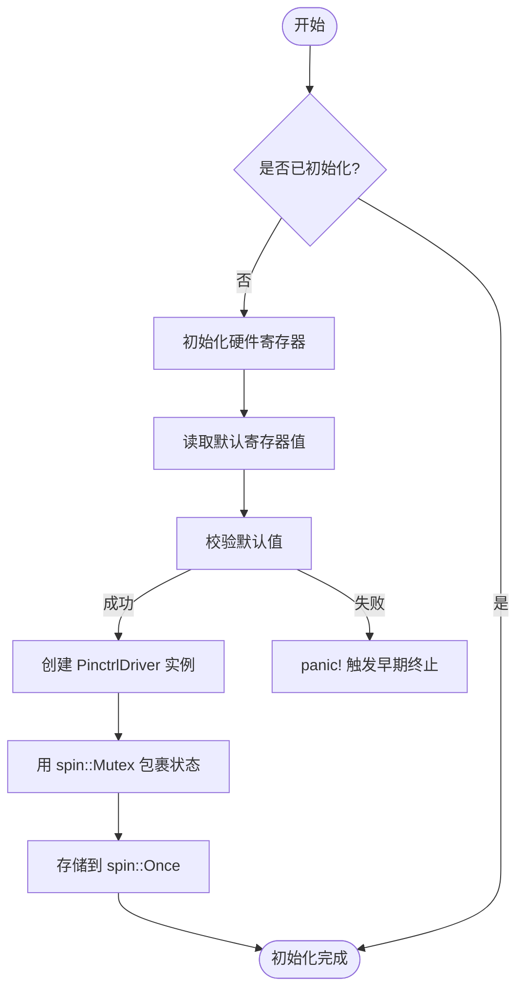
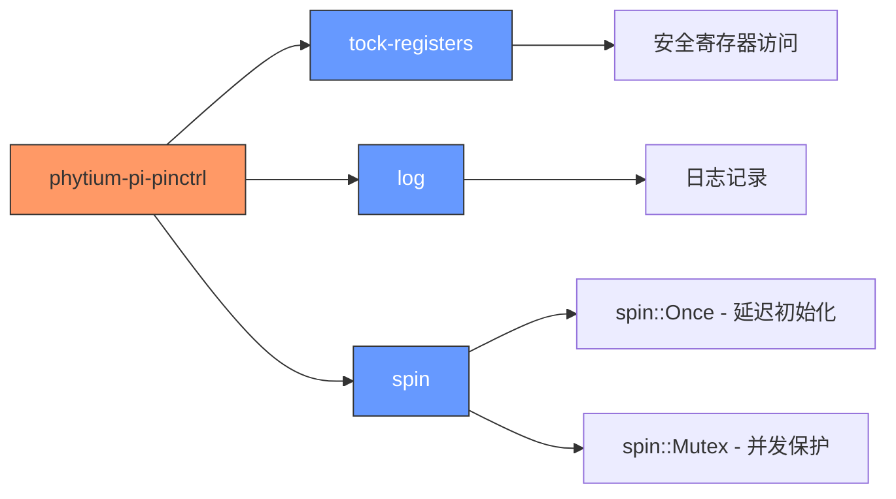

# 初始化与状态管理

<cite>
**本文档引用的文件**
- [lib.rs](file://src/lib.rs)
- [Cargo.toml](file://Cargo.toml)
</cite>

## 目录
1. [引言](#引言)
2. [项目结构](#项目结构)
3. [核心组件](#核心组件)
4. [架构概述](#架构概述)
5. [详细组件分析](#详细组件分析)
6. [依赖分析](#依赖分析)
7. [性能考虑](#性能考虑)
8. [故障排除指南](#故障排除指南)
9. [结论](#结论)

## 引言

本文档旨在分析基于 `spin::Once` 和 `spin::Mutex` 的 Pinctrl 驱动初始化流程与全局状态管理机制的设计。目标是在无操作系统环境下实现线程安全的静态单例 `PinctrlDriver` 延迟初始化，并通过互斥锁保护共享寄存器状态和引脚分配表，防止并发访问引发的数据竞争问题。同时，文档将探讨内部状态结构体设计、初始化校验步骤以及错误恢复策略。

然而，根据当前代码库的实际内容，该驱动尚处于初始开发阶段，核心功能尚未实现。

## 项目结构

本项目采用典型的 Rust 驱动程序结构，包含一个源码目录和一个构建配置文件：

```
.
├── src
│   └── lib.rs
└── Cargo.toml
```

源代码位于 `src/lib.rs`，是整个驱动的核心入口点。构建和依赖信息由 `Cargo.toml` 文件定义。



**Diagram sources**
- [lib.rs](file://src/lib.rs)
- [Cargo.toml](file://Cargo.toml)

**Section sources**
- [lib.rs](file://src/lib.rs)
- [Cargo.toml](file://Cargo.toml)

## 核心组件

目前，项目中声明了驱动的基本模块（`PinctrlDriver`）并引入了必要的同步原语依赖（`spin::Once`, `spin::Mutex`），但这些组件的具体实现为空。预期的核心组件包括：
- 全局唯一的 `PinctrlDriver` 实例，通过 `spin::Once` 进行延迟初始化。
- 使用 `spin::Mutex` 包裹的共享状态，如寄存器映射和引脚分配表。
- 用于跟踪引脚配置状态的内部数据结构。

由于实际代码未实现，上述组件仅存在于设计层面。

**Section sources**
- [lib.rs](file://src/lib.rs#L1-L3)

## 架构概述

从依赖项和注释来看，预期的系统架构如下图所示。驱动将在裸机或类内核环境中运行（`#![no_std]`），利用 `spin` 库提供的同步机制来确保对硬件寄存器的独占访问。



此架构依赖于 `tock-registers` 安全地访问内存映射的寄存器，并使用 `log` 进行诊断输出。

**Diagram sources**
- [lib.rs](file://src/lib.rs)
- [Cargo.toml](file://Cargo.toml)

## 详细组件分析

### 组件A分析

当前代码库中不存在可分析的具体组件。`src/lib.rs` 文件仅包含一个 TODO 注释，指示需要实现完整的引脚控制功能。

#### 概念性工作流
以下为预期的初始化流程概念图：



该流程体现了文档目标中提到的关键设计点：延迟初始化、默认值校验和失败恢复。

[无来源，此图为概念性工作流]

[无来源，此节不分析具体文件]

## 依赖分析

项目的依赖关系清晰地反映了其设计目标和运行环境。



**Diagram sources**
- [Cargo.toml](file://Cargo.toml#L10-L14)

**Section sources**
- [Cargo.toml](file://Cargo.toml#L10-L14)

## 性能考虑

在无操作系统的嵌入式环境中，使用 `spin::Mutex` 和 `spin::Once` 是合理的选择，因为它们不依赖于内核调度。自旋锁适用于临界区极短的场景，避免了上下文切换开销。然而，开发者必须确保锁定时间尽可能短，以防止优先级反转或死锁。

由于驱动尚未实现，无法进行具体的性能评估。

[无来源，此节提供一般性指导]

## 故障排除指南

根据设计目标，初始化失败时应通过 `panic!` 宏触发早期错误终止。这有助于在系统启动早期捕获硬件或配置错误，防止后续不可预测的行为。建议的排查步骤包括：
1. 确认硬件连接和电源正常。
2. 检查寄存器基地址映射是否正确。
3. 验证默认值读取逻辑是否与硬件手册一致。
4. 确保 `spin` 库的特性（`once`, `spin_mutex`）已在 `Cargo.toml` 中正确启用。

**Section sources**
- [lib.rs](file://src/lib.rs#L3)
- [Cargo.toml](file://Cargo.toml#L14)

## 结论

尽管文档目标详细描述了一个健壮的 Pinctrl 驱动初始化与状态管理方案，但当前代码库的状态表明该项目仍处于规划和初始搭建阶段。`src/lib.rs` 中的 TODO 注释明确指出了完整功能的缺失。要实现所述设计，需要在现有基础上进行大量开发工作，包括定义 `PinctrlDriver` 结构体、实现 `spin::Once` 的初始化逻辑、设计受 `spin::Mutex` 保护的内部状态，并编写与硬件交互的具体代码。目前，所有关于 `PinctrlDriver`、`spin::Once` 和 `spin::Mutex` 的讨论均基于 `Cargo.toml` 中的依赖声明和设计文档的目标，而非实际的代码实现。