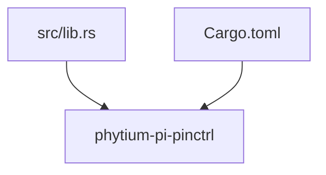
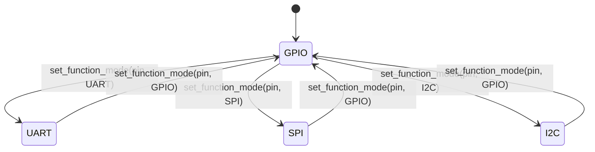
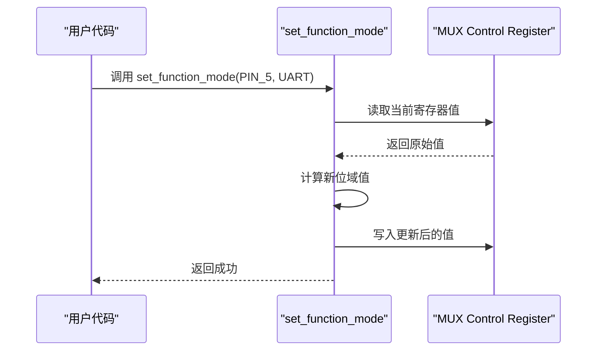
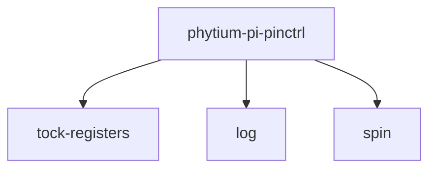

# 引脚复用控制

<cite>
**本文档引用的文件**  
- [lib.rs](file://src/lib.rs)
- [Cargo.toml](file://Cargo.toml)
</cite>

## 目录
1. [引言](#引言)  
2. [项目结构](#项目结构)  
3. [核心组件设计](#核心组件设计)  
4. [架构概述](#架构概述)  
5. [详细组件分析](#详细组件分析)  
6. [依赖关系分析](#依赖关系分析)  
7. [性能考量](#性能考量)  
8. [调试建议](#调试建议)  
9. [结论](#结论)

## 引言
本文档旨在为Phytium Pi平台的引脚复用（Multiplexing）功能提供详细的实现方案。通过定义类型安全的接口与寄存器访问机制，确保引脚能够可靠地切换至UART、SPI、I2C等外设模式。文档将结合`tock-registers`库提供的类型安全特性，阐述如何构建安全且可维护的引脚控制逻辑，并提出用于状态管理的功能枚举设计和调试支持策略。

## 项目结构
本驱动项目采用典型的Rust嵌入式无标准库（no_std）结构，包含一个主源文件`lib.rs`和配置文件`Cargo.toml`。整体结构简洁，专注于引脚控制功能的实现。



**图示来源**  
- [lib.rs](file://src/lib.rs)
- [Cargo.toml](file://Cargo.toml)

**本节来源**  
- [lib.rs](file://src/lib.rs#L0-L3)
- [Cargo.toml](file://Cargo.toml#L1-L14)

## 核心组件设计
尽管当前`lib.rs`中尚无具体实现代码，仅存在待完成的注释提示，但根据文档目标，核心组件应围绕引脚功能模式切换展开。关键设计包括：
- 定义引脚编号与功能模式的映射关系
- 实现对多路复用控制寄存器的安全读-改-写操作
- 提供公共API `set_function_mode(pin, mode)` 以统一配置入口
- 使用枚举类型保证功能模式的状态合法性

这些组件将在后续开发中逐步填充至`lib.rs`中。

**本节来源**  
- [lib.rs](file://src/lib.rs#L0-L3)

## 架构概述
整个引脚复用控制系统基于SoC硬件寄存器进行抽象建模。软件层通过内存映射访问特定的复用控制寄存器，利用位域操作选择对应引脚的功能模式。系统依赖`tock-registers`库实现类型安全的寄存器读写，避免直接裸指针操作带来的风险。

```mermaid
graph LR
App[应用层] --> API[set_function_mode(pin, mode)]
API --> Reg[复用控制寄存器]
Reg --> HW[物理引脚]
tock_registers[tock-registers] -.-> Reg
log[log] -.-> API
```

**图示来源**  
- [lib.rs](file://src/lib.rs)
- [Cargo.toml](file://Cargo.toml#L12)

**本节来源**  
- [lib.rs](file://src/lib.rs)
- [Cargo.toml](file://Cargo.toml)

## 详细组件分析

### 功能模式枚举设计
为确保类型安全性，应定义一个功能模式枚举类型，涵盖所有合法外设模式，如UART、SPI、I2C、GPIO等。该枚举将作为`set_function_mode`的输入参数，防止传入非法值。

#### 枚举状态转换流程


**图示来源**  
- [lib.rs](file://src/lib.rs)

**本节来源**  
- [lib.rs](file://src/lib.rs)

### 寄存器访问逻辑实现
使用`tock-registers`库提供的`ReadWrite`、`WriteOnly`等类型安全寄存器包装器，构建对复用控制寄存器的读-改-写序列。每个引脚对应特定寄存器中的若干位，需原子性地完成修改，避免竞争条件。

#### 寄存器操作序列图


**图示来源**  
- [lib.rs](file://src/lib.rs)
- [Cargo.toml](file://Cargo.toml#L12)

**本节来源**  
- [lib.rs](file://src/lib.rs)
- [Cargo.toml](file://Cargo.toml#L12)

## 依赖关系分析
本项目依赖三个核心外部crate：`tock-registers`用于安全寄存器访问，`log`用于输出调试信息，`spin`用于提供无锁同步原语（如`Once`或`Mutex`），在`no_std`环境下保障并发安全。



**图示来源**  
- [Cargo.toml](file://Cargo.toml#L12-L14)

**本节来源**  
- [Cargo.toml](file://Cargo.toml#L12-L14)

## 性能考量
由于引脚复用配置通常在初始化阶段执行，运行时调用频率较低，因此主要关注操作的原子性和正确性而非极致性能。使用`spin::Mutex`保护共享寄存器状态可避免竞态，虽引入轻微开销，但在初始化场景下可接受。未来若需频繁切换，可考虑按引脚分片加锁以提升并发能力。

## 调试建议
建议在`set_function_mode`函数中加入日志输出，记录引脚号、目标模式及操作结果。例如：

```rust
info!("Setting pin {} to mode {:?}", pin, mode);
```

此日志可通过串口或JTAG捕获，便于验证配置是否按预期生效。同时可在仿真环境中注入故障路径测试错误处理逻辑。

**本节来源**  
- [lib.rs](file://src/lib.rs)
- [Cargo.toml](file://Cargo.toml#L13)

## 结论
本文档规划了Phytium Pi平台引脚复用功能的完整实现路径，强调类型安全、可维护性与调试友好性。通过合理利用`tock-registers`和Rust的类型系统，可构建健壮的底层驱动。下一步应在`lib.rs`中逐步实现所描述的接口与逻辑，完成从设计到代码的转化。