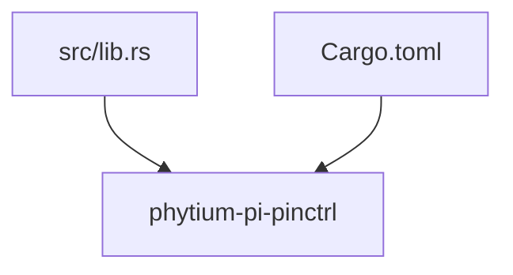
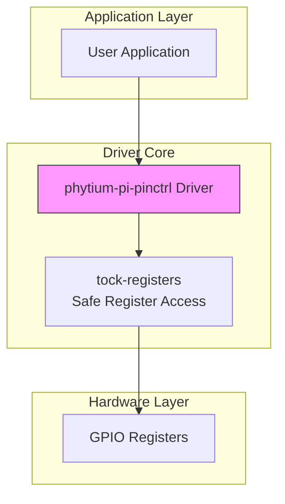
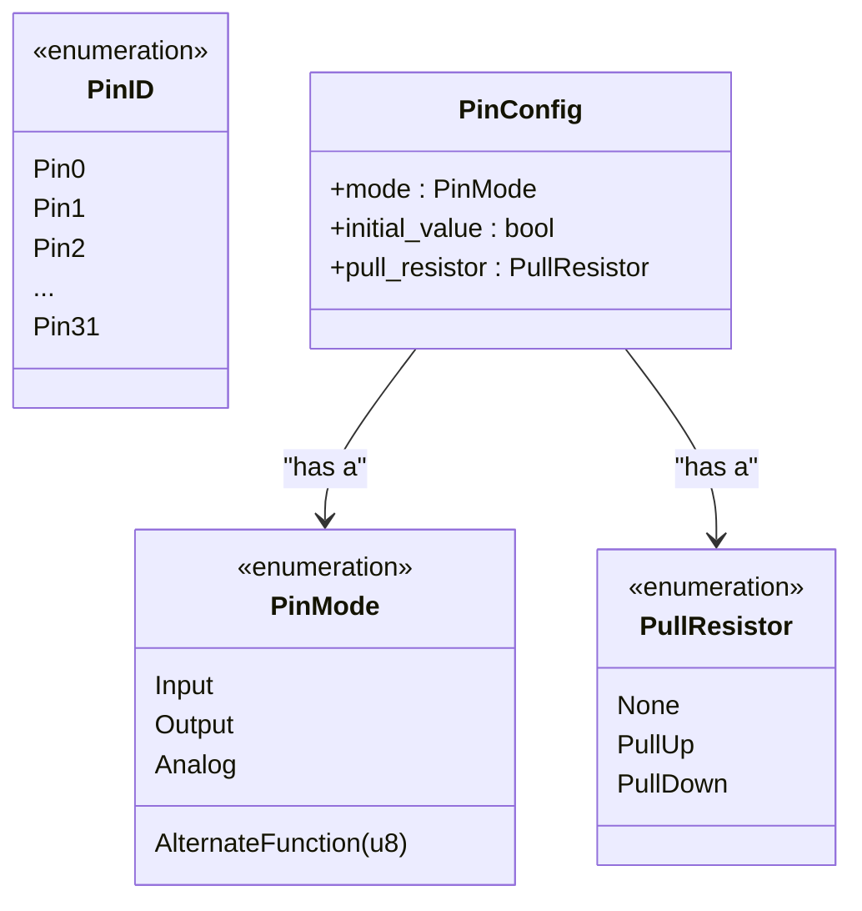
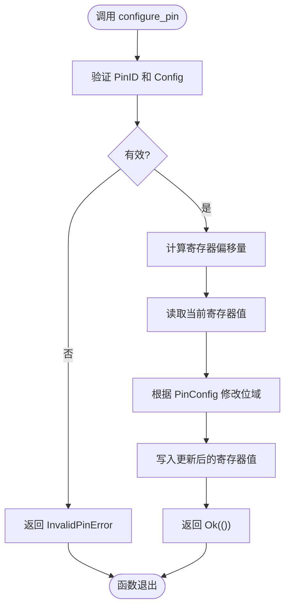
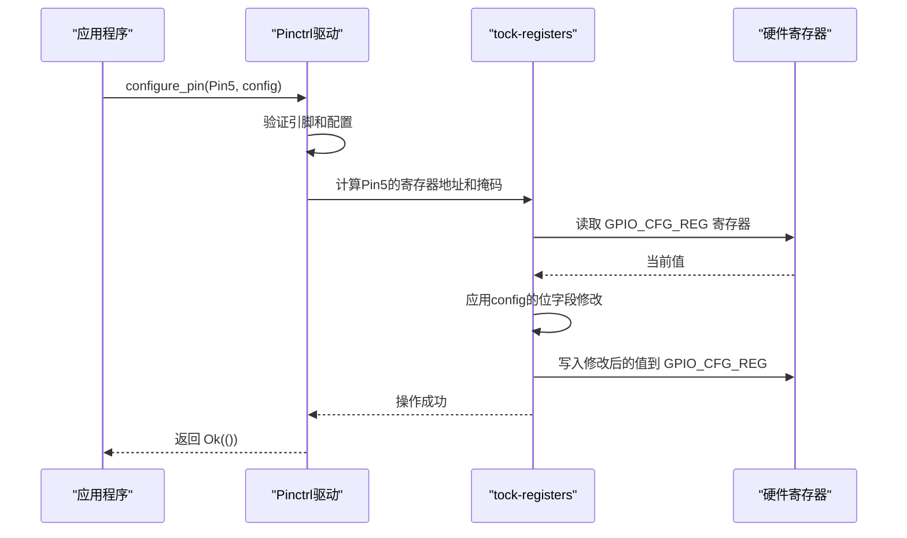
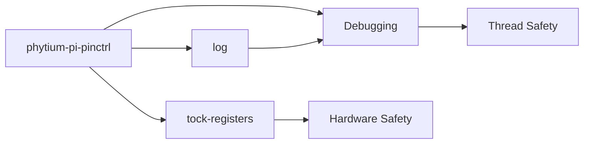

<cite>
**Referenced Files in This Document**   
- [lib.rs](file://src/lib.rs)
- [Cargo.toml](file://Cargo.toml)
</cite>

## 目录
1. [引言](#引言)
2. [项目结构](#项目结构)
3. [核心组件](#核心组件)
4. [架构概述](#架构概述)
5. [详细组件分析](#详细组件分析)
6. [依赖分析](#依赖分析)
7. [性能考虑](#性能考虑)
8. [故障排除指南](#故障排除指南)
9. [结论](#结论)

## 引言

本文档旨在深入阐述`phytium-pi-pinctrl`驱动中引脚配置机制的设计方案。尽管当前代码库尚处于初始阶段，但基于其目标功能和依赖项，可以推导出一个完整的、符合嵌入式Rust最佳实践的引脚控制驱动设计蓝图。该设计将围绕安全的寄存器操作、清晰的API抽象和健壮的错误处理来构建。

## 项目结构

该项目遵循典型的Rust crate结构，包含一个源代码目录`src/`和一个包管理文件`Cargo.toml`。主源文件`lib.rs`作为整个驱动的入口点，目前仅包含基本的模块声明和一个待实现的功能注释。这种简洁的结构为构建一个模块化、可维护的驱动程序提供了良好的基础。

**Diagram sources**
- [lib.rs](file://src/lib.rs)
- [Cargo.toml](file://Cargo.toml)

**Section sources**
- [lib.rs](file://src/lib.rs)
- [Cargo.toml](file://Cargo.toml)

## 核心组件

根据文档目标，本节定义了驱动中预期的核心组件。这些组件目前在代码中尚未实现，但它们是完成`// TODO: 实现完整的引脚控制驱动功能`所必需的逻辑单元。核心组件包括用于表示硬件引脚的`PinID`枚举、描述引脚配置的`PinConfig`结构体、以及提供高层操作的`configure_pin`函数。

**Section sources**
- [lib.rs](file://src/lib.rs#L3)

## 架构概述

该驱动的架构设计为分层模式，上层提供安全、易用的Rust API，下层通过`tock-registers`库与硬件寄存器进行交互。这种设计隔离了复杂的硬件细节，使得上层逻辑更加清晰和安全。驱动将利用`spin`库中的同步原语来确保在`no_std`环境下的线程安全，并使用`log`库进行调试信息输出。

**Diagram sources**
- [lib.rs](file://src/lib.rs)
- [Cargo.toml](file://Cargo.toml#L12-L15)

## 详细组件分析

### `PinID`与`PinMode`的设计分析

为了对平台支持的物理引脚进行抽象，应定义一个`PinID`枚举类型。每个枚举变体代表一个具体的物理引脚（例如`Pin0`, `Pin1`等），这比使用原始整数更安全，能有效防止无效引脚编号的传入。同时，应定义`PinMode`枚举来表示引脚的工作模式，如`Input`, `Output`, `AlternateFunction(u8)`（复用功能可能需要一个参数来指定功能号）和`Analog`。

#### 对于对象导向的组件：

**Diagram sources**
- [lib.rs](file://src/lib.rs)

### `configure_pin` API与数据结构设计

`configure_pin`函数是驱动的高层API，其签名应设计为`pub fn configure_pin(pin: PinID, config: PinConfig) -> Result<(), Error>`。它接受一个`PinID`和一个`PinConfig`结构体作为输入，并返回一个`Result`类型以进行错误处理。`PinConfig`结构体应使用Rust的结构体来组织配置数据，而不是位字段或联合体，以保持内存安全和可读性。内部可以包含`mode`、`initial_value`（用于输出引脚）、`pull_resistor`等字段。

#### 对于复杂逻辑组件：

**Diagram sources**
- [lib.rs](file://src/lib.rs)

### 基于`tock-registers`的底层操作

`tock-registers`库允许通过定义寄存器结构和字段来安全地生成寄存器读写操作。驱动应定义代表GPIO控制寄存器的结构体（例如`GPIO_CFG_REG`），并使用`register_bitfields!`宏来定义各个配置位（如模式位、上下拉位）。当`configure_pin`被调用时，驱动会查询`PinID`对应的寄存器地址和位偏移，然后使用`tock-registers`提供的`.modify()`方法，结合预定义的位字段，来原子地更新寄存器，从而避免竞态条件。

#### 对于API/服务组件：

**Diagram sources**
- [lib.rs](file://src/lib.rs)
- [Cargo.toml](file://Cargo.toml#L12)

## 依赖分析

该项目依赖于三个关键的第三方库。`tock-registers`是核心，它提供了对硬件寄存器进行安全、无竞争访问的能力，是实现可靠驱动的基础。`log`库用于在开发和调试过程中输出诊断信息，对于排查硬件相关问题至关重要。`spin`库提供了`Mutex`和`Once`等同步原语，这对于在没有操作系统支持的`no_std`环境中保护共享资源（如全局寄存器状态）是必不可少的。

**Diagram sources**
- [Cargo.toml](file://Cargo.toml#L12-L15)

**Section sources**
- [Cargo.toml](file://Cargo.toml#L12-L15)

## 性能考虑

由于这是一个运行在裸机环境下的驱动，性能和确定性至关重要。使用`tock-registers`进行的寄存器操作通常是内联的，会产生高效的汇编代码。通过在编译时计算寄存器偏移和位掩码，可以最大限度地减少运行时开销。此外，使用`spin::Mutex`虽然在高争用情况下可能导致优先级反转，但在大多数引脚配置场景中，配置操作是短暂且不频繁的，因此其简单性和零分配特性使其成为合适的选择。

## 故障排除指南

驱动应实现健全的错误处理策略。`configure_pin`函数应返回一个自定义的`Error`枚举，可能包含`InvalidPinID`、`InvalidConfiguration`或`HardwareFault`等变体。通过`log`库记录详细的错误信息（例如，尝试配置哪个引脚时失败），可以极大地简化调试过程。在开发阶段，可以使用断点和日志来验证从高级API调用到实际寄存器写入的完整流程是否正确。

**Section sources**
- [lib.rs](file://src/lib.rs#L3)
- [Cargo.toml](file://Cargo.toml#L14)

## 结论

尽管`phytium-pi-pinctrl`驱动的当前实现为空，但其设计蓝图已清晰可见。通过结合Rust语言的安全特性、`tock-registers`库的强大功能以及合理的分层架构，可以构建一个既安全又高效的引脚控制驱动。下一步工作应集中在实现`PinID`、`PinConfig`等数据结构，定义寄存器映射，并最终完成`configure_pin`等核心API的逻辑，从而将“TODO”变为一个功能完备的生产级驱动。