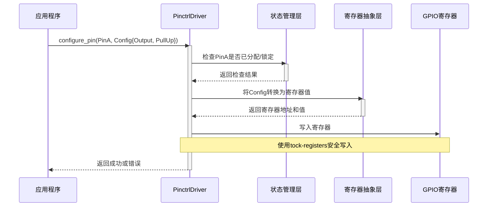

# 核心功能设计

<cite>
**本文档引用的文件**
- [lib.rs](file://src/lib.rs)
- [Cargo.toml](file://Cargo.toml)
</cite>

## 目录
1. [引言](#引言)
2. [项目结构](#项目结构)
3. [核心组件](#核心组件)
4. [架构概述](#架构概述)
5. [详细组件分析](#详细组件分析)
6. [依赖分析](#依赖分析)
7. [性能考量](#性能考量)
8. [故障排除指南](#故障排除指南)
9. [结论](#结论)

## 引言

本文档旨在深入探讨`phytium-pi-pinctrl`驱动计划实现的核心功能模块。尽管当前代码库尚处于初始阶段，仅包含基础框架和待办事项，但基于典型pinctrl驱动架构与现有依赖项，可前瞻性地规划其设计蓝图。本设计将围绕引脚配置机制、模块化分层结构、单例模式实现、数据流路径及并发安全性等关键方面展开，为后续开发提供清晰的技术路线图。

## 项目结构

该项目采用标准的Rust crate结构，核心源码位于`src/lib.rs`，构建与依赖配置由`Cargo.toml`管理。整体结构简洁，专注于单一职责——为Phytium Pi平台提供引脚控制功能。


**Diagram sources**
- [lib.rs](file://src/lib.rs)
- [Cargo.toml](file://Cargo.toml)

**Section sources**
- [lib.rs](file://src/lib.rs)
- [Cargo.toml](file://Cargo.toml)

## 核心组件

目前，代码库中的核心组件尚未编码实现。`src/lib.rs`文件仅声明了`#![no_std]`属性并包含一个TODO注释，表明完整的驱动功能有待开发。然而，根据文档目标，未来的核心组件将包括`PinctrlDriver`单例对象、引脚配置接口（如`configure_pin`）以及底层寄存器操作逻辑。

**Section sources**
- [lib.rs](file://src/lib.rs#L1-L4)

## 架构概述

未来的系统架构预计将采用分层设计，以解耦硬件细节与高层应用逻辑。


**Diagram sources**
- [lib.rs](file://src/lib.rs)

## 详细组件分析

### PinctrlDriver 单例对象分析

`PinctrlDriver`的设计将利用`spin::Once`类型来实现静态初始化，确保在整个系统运行期间该驱动实例的全局唯一性。此设计符合嵌入式系统对资源严格管控的要求，避免了多个驱动实例对同一组物理引脚造成冲突。

#### 对象关系图
```mermaid
classDiagram
class PinctrlDriver {
+static INSTANCE : spin : : Once<PinctrlDriver>
-pin_states : HashMap<PinId, PinState>
+new() -> Self
+configure_pin(pin_id : PinId, config : PinConfig) -> Result<(), Error>
+get_pin_state(pin_id : PinId) -> Option<PinState>
}
class PinConfig {
+function : PinFunction
+pull : PullResistor
+drive_strength : u8
+slew_rate : SlewRate
}
class PinState {
+current_config : PinConfig
+is_locked : bool
}
enum PinFunction {
Input
Output
Alternate(u8)
Analog
}
enum PullResistor {
None
PullUp
PullDown
}
enum SlewRate {
Slow
Fast
}
PinctrlDriver --> PinState : "管理"
PinctrlDriver --> PinConfig : "使用"
PinState --> PinConfig : "包含"
```

**Diagram sources**
- [lib.rs](file://src/lib.rs)

**Section sources**
- [lib.rs](file://src/lib.rs)

### 配置接口层分析

#### 数据流序列图


**Diagram sources**
- [lib.rs](file://src/lib.rs)

**Section sources**
- [lib.rs](file://src/lib.rs)

## 依赖分析

项目的依赖关系清晰，主要依赖于三个关键crate：


**Diagram sources**
- [Cargo.toml](file://Cargo.toml#L10-L14)

**Section sources**
- [Cargo.toml](file://Cargo.toml#L10-L14)

### 外部依赖说明
- **tock-registers**: 提供类型安全的寄存器读写操作，是实现底层硬件交互的基础。
- **log**: 用于在运行时输出调试信息和错误日志，便于问题追踪。
- **spin**: 提供`spin::Mutex`和`spin::Once`，是实现线程安全和单例模式的关键。

## 性能考量

由于该驱动运行在`no_std`环境下且面向嵌入式平台，性能和资源占用是首要考虑因素：
- **零成本抽象**：利用Rust的编译时特性，确保高层API不会引入运行时开销。
- **内存效率**：`HashMap`等数据结构的选择需权衡查询速度与内存占用，可能针对固定数量的引脚采用更紧凑的数组或位图结构。
- **执行延迟**：寄存器访问应尽可能直接，避免不必要的中间计算，保证实时性。

## 故障排除指南

虽然当前无实际错误处理代码，但未来设计中应包含以下常见问题的排查思路：
- **引脚配置失败**：检查目标引脚是否已被其他功能锁定，或配置参数是否超出硬件支持范围。
- **并发访问冲突**：确保所有对`PinctrlDriver`内部状态的修改都通过`spin::Mutex`保护。
- **寄存器写入无效**：验证`tock-registers`的调用是否正确，确认寄存器地址映射无误。

**Section sources**
- [lib.rs](file://src/lib.rs)
- [Cargo.toml](file://Cargo.toml)

## 结论

尽管`phytium-pi-pinctrl`驱动目前尚未实现具体功能，但其设计蓝图已具备坚实的基础。通过采用分层架构、单例模式和Rust的安全并发原语，该驱动有望成为一个高效、可靠且易于维护的组件。后续开发应严格遵循此设计规范，优先实现`PinctrlDriver`的核心API和底层寄存器绑定，逐步构建完整的引脚控制能力。