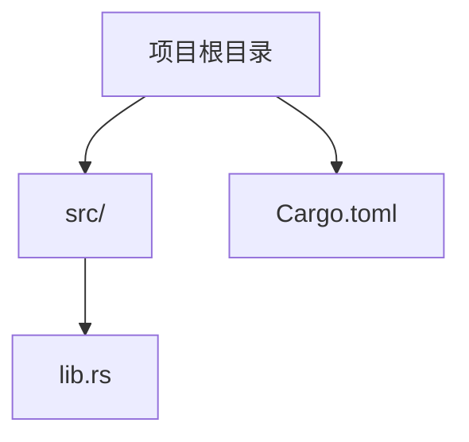
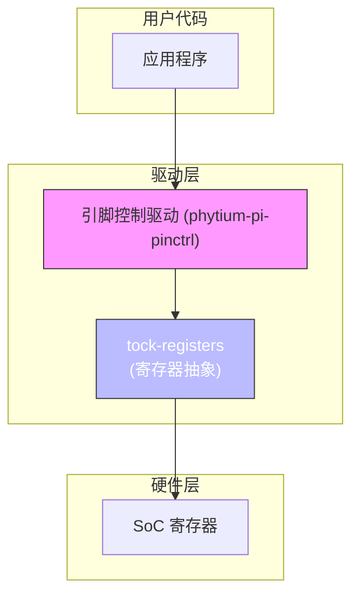
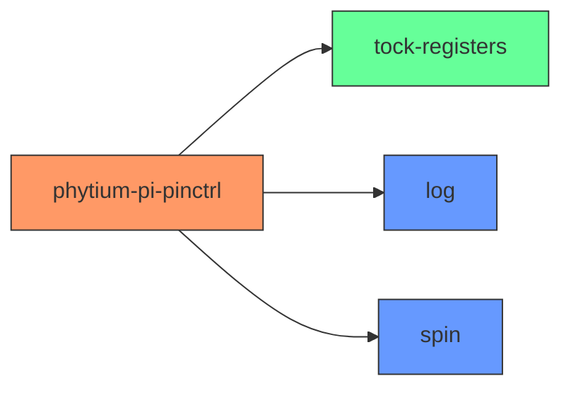

<cite>
**本文档中引用的文件**
- [lib.rs](file://src/lib.rs)
- [Cargo.toml](file://Cargo.toml)
</cite>

## 目录
1. [引言](#引言)
2. [项目结构](#项目结构)
3. [核心组件](#核心组件)
4. [架构概述](#架构概述)
5. [详细组件分析](#详细组件分析)
6. [依赖分析](#依赖分析)
7. [性能考量](#性能考量)
8. [故障排除指南](#故障排除指南)
9. [结论](#结论)

## 引言

本文档旨在系统化地设计和实现飞腾平台（Phytium Pi）引脚控制驱动中的电气特性配置能力。文档聚焦于对上下拉电阻、驱动强度及开漏模式等关键电气参数的抽象与实现方法，定义相应的配置类型，并探讨其与硬件寄存器的映射关系。同时，文档将说明如何通过统一接口批量应用这些配置，并确保其与引脚模式设置的兼容性。此外，考虑到嵌入式环境的特殊性，文档强调了在 `no-std` 环境下内存效率的重要性，并推荐使用零成本抽象来优化运行时开销。

## 项目结构

该项目是一个典型的 Rust 嵌入式库，遵循 Cargo 标准布局。其核心功能实现在 `src/lib.rs` 文件中，而项目的元数据和依赖项则在 `Cargo.toml` 文件中定义。整个项目结构简洁，专注于提供一个无标准库（`no-std`）的引脚控制（pinctrl）驱动。



**Diagram sources**
- [lib.rs](file://src/lib.rs)
- [Cargo.toml](file://Cargo.toml)

**Section sources**
- [lib.rs](file://src/lib.rs)
- [Cargo.toml](file://Cargo.toml)

## 核心组件

根据项目目标，核心组件应包括用于描述引脚电气特性的配置结构体或枚举类型（如 `PullConfig` 和 `DriveStrength`），以及用于操作底层硬件寄存器的机制。然而，当前代码库中的 `lib.rs` 文件仅包含一个 `TODO` 注释，表明完整的驱动功能尚未实现。因此，目前不存在可分析的具体核心组件。

**Section sources**
- [lib.rs](file://src/lib.rs#L0-L3)

## 架构概述

从现有信息推断，该驱动的预期架构是基于 Rust 的 `tock-registers` 库来安全地访问和操作硬件寄存器。`Cargo.toml` 文件明确列出了 `tock-registers` 作为依赖项，这表明开发者计划使用位域（bitfield）抽象来映射物理寄存器。整体架构将围绕一个或多个模块展开，这些模块负责将高级别的引脚配置（如“启用上拉”）转换为对特定寄存器位的写入操作。



**Diagram sources**
- [Cargo.toml](file://Cargo.toml#L12)
- [lib.rs](file://src/lib.rs)

## 详细组件分析

### 电气参数抽象分析

#### 预期的配置结构体与枚举
尽管代码尚未实现，但根据文档目标，可以预见以下类型的定义：
- **`enum PullConfig`**: 用于表示引脚的上下拉状态，可能包含 `None`, `PullUp`, `PullDown` 等变体。
- **`enum DriveStrength`**: 用于表示输出驱动能力，可能以毫安（mA）为单位或按等级（如 `Low`, `Medium`, `High`）划分。
- **`enum OpenDrain`**: 用于表示是否启用开漏模式，通常为布尔值的枚举（`Disabled`, `Enabled`）。

这些类型将被设计为“零成本抽象”，即它们在编译后不会产生任何运行时开销，其值会直接内联到生成的机器码中。

#### 与硬件寄存器的映射
`tock-registers` 库允许通过声明宏（如 `register_bitfields!`）来定义寄存器的位域。例如，一个控制引脚的寄存器可能会被映射为：
```rust
// 预期的伪代码示例
register_bitfields![u32,
    PinControl [
        pull OFFSET(0) NUMBITS(2) [
            None = 0,
            Up = 1,
            Down = 2
        ],
        drive_strength OFFSET(2) NUMBITS(2) [
            Low = 0,
            Medium = 1,
            High = 2
        ],
        open_drain OFFSET(4) NUMBITS(1) []
    ]
];
```
此映射将 `PullConfig` 和 `DriveStrength` 等软件抽象直接关联到硬件寄存器的特定比特位。

**Section sources**
- [lib.rs](file://src/lib.rs)
- [Cargo.toml](file://Cargo.toml)

### 统一配置接口分析

#### 批量配置应用
为了高效地配置多个引脚，驱动应提供一个统一的接口，例如一个 `configure_pins()` 函数，它接受一个引脚配置数组。该函数会遍历数组，将每个引脚的抽象配置（`PullConfig`, `DriveStrength` 等）转换为对应的寄存器值，并一次性或分批写入硬件。

#### 兼容性保证
此接口的设计必须确保电气参数的设置与引脚的功能模式（如 GPIO 输入、GPIO 输出、I2C 功能等）相兼容。例如，在将引脚配置为 I2C 总线时，驱动应自动或强制要求启用开漏模式。这种逻辑应在配置接口内部进行验证和处理。

**Section sources**
- [lib.rs](file://src/lib.rs)

### 日志记录机制分析

#### 关键配置日志
`Cargo.toml` 文件显示项目已引入 `log` 库。虽然当前代码中未使用，但其预期用途是在关键配置变更时（如 `configure_pins()` 调用成功或失败）输出调试日志。这对于在开发和调试阶段排查信号完整性问题（如因错误的上下拉配置导致的电平不稳定）至关重要。

#### `no-std` 环境下的日志
在 `no-std` 环境中，`log` 库需要一个具体的日志记录器（logger）实现才能输出信息。驱动本身不提供 logger，而是依赖于集成它的操作系统或固件框架来提供。因此，日志功能是可选的，且其实际输出取决于运行时环境。

**Section sources**
- [Cargo.toml](file://Cargo.toml#L13)

## 依赖分析

本项目的关键外部依赖是 `tock-registers` 和 `log`。



**Diagram sources**
- [Cargo.toml](file://Cargo.toml#L12-L14)

**Section sources**
- [Cargo.toml](file://Cargo.toml)

## 性能考量

在 `no-std` 嵌入式环境中，性能和资源效率至关重要。本项目通过以下方式满足这一要求：
1.  **零成本抽象**: 使用 `enum` 和 `const fn` 等 Rust 特性来创建编译时解析的抽象，确保运行时没有函数调用开销或动态分发。
2.  **最小化依赖**: 选择的依赖库（`tock-registers`, `spin`）都是专为嵌入式设计的，体积小且不依赖标准库。
3.  **栈分配优先**: 在驱动代码中，应避免堆分配（heap allocation），尽可能使用栈分配的变量和固定大小的数组，以减少内存碎片和不确定性。

**Section sources**
- [Cargo.toml](file://Cargo.toml)
- [lib.rs](file://src/lib.rs#L0)

## 故障排除指南

由于代码尚未实现，目前无法提供具体的故障排除步骤。但基于设计原则，未来的故障排查应遵循以下思路：
- **检查日志输出**: 如果启用了 `log`，首先查看是否有配置失败或警告的日志信息。
- **验证寄存器映射**: 确认代码中定义的寄存器地址和位域偏移量与硬件手册完全一致。
- **审查配置兼容性**: 检查是否尝试设置了相互冲突的引脚属性（如在推挽模式下启用开漏）。

**Section sources**
- [lib.rs](file://src/lib.rs)
- [Cargo.toml](file://Cargo.toml)

## 结论

当前的 `phytium-pi-pinctrl` 项目处于初始阶段，其源文件 `lib.rs` 仅包含一个待办事项注释。然而，通过分析 `Cargo.toml` 文件，我们可以清晰地看到项目的技术选型：利用 `tock-registers` 库进行安全的寄存器操作，并计划使用 `log` 库进行调试。项目的设计目标是创建一个高效、安全的引脚控制驱动，通过定义 `PullConfig`、`DriveStrength` 等抽象类型来系统化管理引脚的电气特性，并通过统一接口实现批量配置。未来的工作重点是实现这些抽象类型，建立与硬件寄存器的精确映射，并完成配置逻辑的编码。