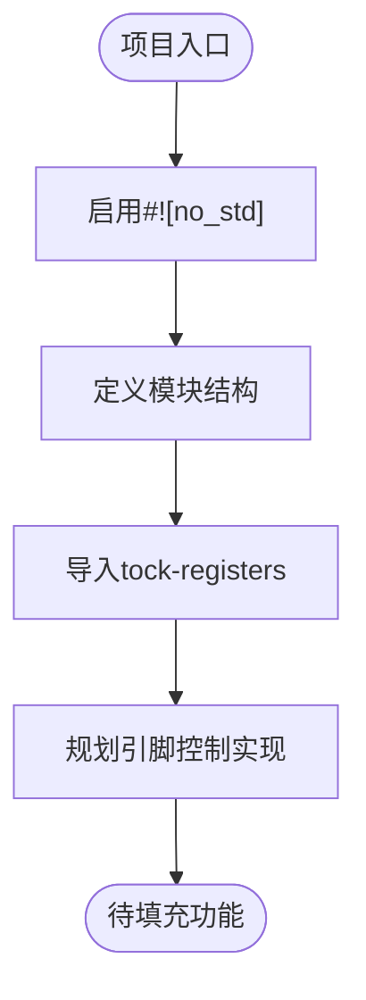

# 项目概述

<cite>
**本文档引用文件**  
- [lib.rs](file://src/lib.rs)
- [Cargo.toml](file://Cargo.toml)
</cite>

## 目录
1. [引言](#引言)
2. [项目定位与目标](#项目定位与目标)
3. [技术特性分析](#技术特性分析)
4. [硬件平台背景](#硬件平台背景)
5. [代码结构解析](#代码结构解析)
6. [依赖组件说明](#依赖组件说明)
7. [未来功能方向](#未来功能方向)
8. [集成关系与协同模式](#集成关系与协同模式)
9. [学习路径建议](#学习路径建议)
10. [结论](#结论)

## 引言
本项目为Phytium Pi平台的引脚控制（pinctrl）驱动模块，是ArceOS操作系统在嵌入式领域的重要组成部分。该驱动旨在为Phytium Pi开发板提供底层引脚配置能力，支持GPIO模式设置、引脚复用选择及电气参数调节等关键功能。当前项目处于初始框架阶段，尚未实现具体功能逻辑，主要用于构建no-std环境下的安全寄存器访问基础。

## 项目定位与目标
`phytium-pi-pinctrl`作为ArceOS驱动生态中的专用硬件抽象层组件，专注于解决Phytium Pi平台的引脚管理需求。其核心目标是在无标准库（no-std）环境下实现对引脚控制器的安全、可靠访问，确保上层系统能够通过统一接口进行硬件资源配置。该项目遵循模块化设计原则，未来将作为HAL（硬件抽象层）的关键组成部分，服务于操作系统对物理引脚的精细化控制。

**Section sources**
- [lib.rs](file://src/lib.rs#L1-L3)
- [Cargo.toml](file://Cargo.toml#L1-L5)

## 技术特性分析
项目采用Rust语言编写，并明确声明`#![no_std]`属性，表明其运行于无标准库的嵌入式环境。这一设计使得代码可在资源受限的裸机系统中执行，避免依赖动态内存分配和操作系统服务。通过引入`tock-registers`库，项目实现了对硬件寄存器的安全访问机制，利用类型系统防止非法读写操作，提升代码安全性与可维护性。

**Section sources**
- [lib.rs](file://src/lib.rs#L1)
- [Cargo.toml](file://Cargo.toml#L12)

## 硬件平台背景
Phytium Pi是一款基于国产飞腾处理器的嵌入式开发平台，广泛应用于工业控制、边缘计算等领域。其引脚控制系统需支持多种外设接口（如I2C、SPI、UART）的复用配置，并具备灵活的电气特性调节能力（如驱动强度、上下拉电阻）。引脚控制驱动需准确映射芯片手册中的寄存器布局，实现对每个物理引脚工作模式的精确控制。

## 代码结构解析
项目源码结构简洁，仅包含一个`lib.rs`入口文件和`Cargo.toml`配置文件。主模块文件中已标注`#![no_std]`属性并添加基本文档注释，但实际功能代码尚为空白，仅保留待实现提示。整体架构预留了扩展空间，便于后续添加寄存器定义、引脚描述符结构及配置方法。

**Diagram sources**
- [lib.rs](file://src/lib.rs#L1-L3)

**Section sources**
- [lib.rs](file://src/lib.rs#L1-L3)

## 依赖组件说明
项目依赖项经过精心裁剪以适应嵌入式环境：
- `tock-registers`：提供类型安全的寄存器访问接口，支持只读、只写、读写及修改操作。
- `log`：轻量级日志输出，用于调试信息追踪。
- `spin`：提供自旋锁和一次性初始化原语，适用于中断禁用场景下的同步控制。

这些依赖均关闭默认特性，仅启用必要功能，最大限度减少二进制体积与运行时开销。

**Section sources**
- [Cargo.toml](file://Cargo.toml#L12-L14)

## 未来功能方向
后续开发将围绕以下核心功能展开：
- GPIO输入/输出模式配置
- 多功能引脚复用选择（MUX）
- 驱动电流、上下拉电阻等电气参数设置
- 引脚状态查询与错误检测
- 与其他外设驱动的协同管理机制

所有功能将基于硬件数据手册定义寄存器映射，并通过安全抽象接口暴露给上层调用者。

## 集成关系与协同模式
本驱动将作为ArceOS HAL层的一部分，与GPIO驱动、时钟控制器及其他外设模块协同工作。典型交互流程包括：在初始化阶段由系统调用pinctrl驱动配置引脚功能；在设备使能前完成引脚复用设置；在运行时响应引脚状态变更请求。通过统一的驱动接口，实现跨平台兼容性与模块解耦。

## 学习路径建议
理解本项目需要掌握以下基础知识：
- **Rust所有权机制**：理解借用、生命周期与移动语义，确保内存安全。
- **嵌入式系统概念**：熟悉裸机编程、中断处理与外设通信原理。
- **硬件数据手册阅读能力**：能解析寄存器地址、位域定义与时序要求。
- **no-std开发实践**：掌握无堆栈环境下的编程技巧与工具链使用。
- **Tock寄存器库用法**：了解如何定义寄存器结构并执行安全访问操作。

推荐学习资源包括《Programming Rust》、Tock OS官方文档及ARM Cortex-A系列技术参考手册。

## 结论
`phytium-pi-pinctrl`项目虽处于初期框架阶段，但已确立清晰的技术路线与架构方向。通过采用Rust语言与no-std设计理念，项目为Phytium Pi平台提供了高安全性、可验证的引脚控制解决方案。随着功能逐步完善，该驱动将成为ArceOS在国产嵌入式平台上稳定运行的重要基石。