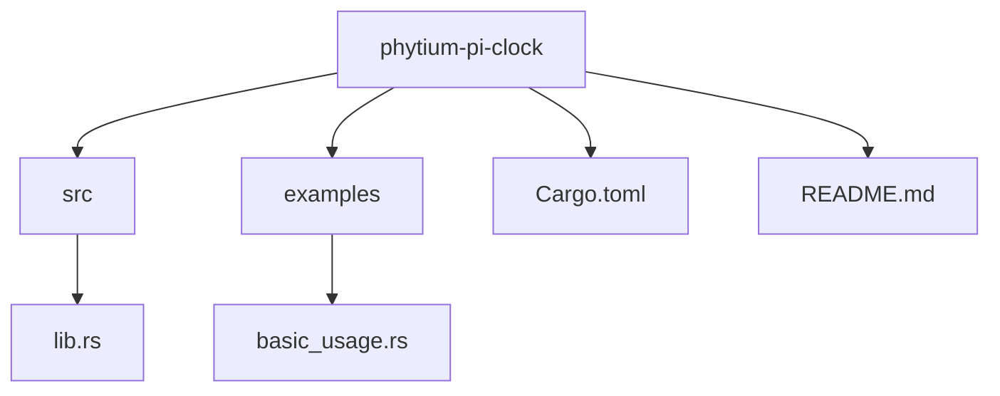
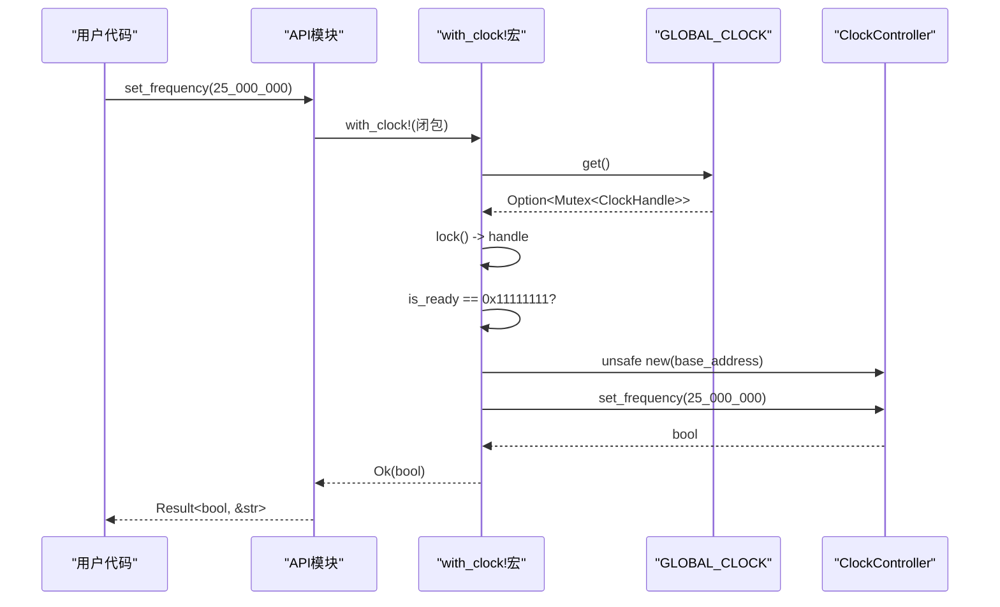
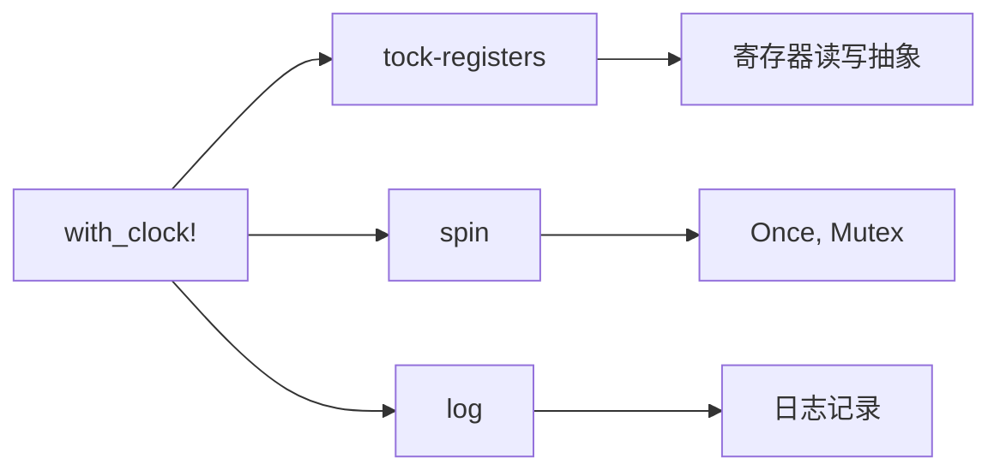

<cite>
**本文档中引用的文件**
- [lib.rs](file://src/lib.rs)
- [Cargo.toml](file://Cargo.toml)
- [README.md](file://README.md)
- [basic_usage.rs](file://examples/basic_usage.rs)
</cite>

## 目录
1. [引言](#引言)
2. [项目结构](#项目结构)
3. [核心组件](#核心组件)
4. [with_clock! 宏设计解析](#with_clock-宏设计解析)
5. [使用场景与示例](#使用场景与示例)
6. [依赖分析](#依赖分析)
7. [性能考量](#性能考量)
8. [故障排除指南](#故障排除指南)
9. [结论](#结论)

## 引言

`with_clock!` 宏是飞腾派平台时钟驱动中的核心便利工具，旨在简化对全局时钟实例的访问。该宏通过封装复杂的锁获取、状态检查和错误处理逻辑，为开发者提供了一种简洁、安全的方式来执行时钟控制操作。本文档将深入剖析该宏的设计原理、展开机制、使用限制及其在实际应用中的优势与潜在问题。

## 项目结构

该项目遵循典型的 Rust 驱动库结构，包含源代码、示例、配置和文档。

**Diagram sources**
- [lib.rs](file://src/lib.rs#L0-L274)
- [basic_usage.rs](file://examples/basic_usage.rs#L0-L64)

**Section sources**
- [lib.rs](file://src/lib.rs#L0-L274)
- [Cargo.toml](file://Cargo.toml#L0-L40)
- [README.md](file://README.md#L0-L119)

## 核心组件

`with_clock!` 宏的设计围绕几个关键组件构建：`GLOBAL_CLOCK` 全局静态变量、`ClockController` 硬件抽象层以及 `api` 模块提供的便捷函数。

**Section sources**
- [lib.rs](file://src/lib.rs#L150-L274)

## with_clock! 宏设计解析

### 设计目的与展开机制

`with_clock!` 宏的主要设计目的是消除重复的样板代码。在嵌入式系统中，访问硬件资源通常需要经过一系列固定的步骤：获取全局实例、加锁、检查初始化状态、创建控制器、执行操作、处理返回值。`with_clock!` 宏将这些步骤封装在一个简洁的语法结构中。

该宏接受一个闭包作为参数 `$op`，并在编译期将其展开为完整的操作序列。其核心逻辑如下：
1.  **访问全局实例**：通过 `GLOBAL_CLOCK.get()` 安全地获取全局时钟句柄的引用。
2.  **获取互斥锁**：调用 `.lock()` 获取 `Mutex` 的独占访问权，确保线程安全。
3.  **状态验证**：检查 `handle.is_ready` 是否等于预设的魔术值 `0x11111111u32`，以确认时钟已正确初始化。
4.  **创建控制器**：在运行时使用存储在 `handle.config.base_address` 中的基地址，通过 `unsafe` 块创建一个临时的 `ClockController` 实例。
5.  **执行操作**：将新创建的控制器实例传递给用户提供的闭包 `$op` 执行具体的操作。
6.  **结果处理**：根据闭包的执行结果（通常是 `Result<T, &str>`）进行返回，或在任何前置条件失败时返回 `"Clock not initialized"` 错误。

这种设计使得开发者无需关心底层的同步和安全细节，只需专注于具体的时钟操作逻辑。

### 语法形式与安全性契约

宏的语法形式为 `with_clock!(|controller| { /* 操作 */ })`，其中 `controller` 是由宏内部创建并传递给闭包的 `ClockController` 可变或不可变引用。

该宏的安全性建立在一个关键的契约之上：**调用者必须确保 `init_clock` 函数已被成功调用**。如果全局时钟未被初始化，宏会直接返回错误，避免了对无效内存地址的访问。然而，一旦初始化完成，宏内部的 `unsafe { ClockController::new(...) }` 调用则假设 `base_address` 是有效的。如果此地址不正确，将导致未定义行为（Undefined Behavior），这属于调用者的责任范畴。

### 优势与潜在缺点

**优势**：
- **减少样板代码**：显著减少了每次访问时钟时所需的冗长代码。
- **提高安全性**：强制执行了状态检查和锁管理，降低了因疏忽导致的并发错误风险。
- **统一错误处理**：为所有时钟操作提供了统一的错误返回路径。

**潜在缺点**：
- **调试困难**：宏展开后的代码堆栈可能较长且复杂，当发生 panic 时，定位原始错误位置可能比较困难。
- **堆栈追踪不清晰**：由于宏在运行时创建 `ClockController`，堆栈信息可能不如直接调用函数那样直观。
- **灵活性降低**：对于需要精细控制锁生命周期或多次复用同一控制器实例的高级场景，直接使用底层 API 可能更合适。

**Section sources**
- [lib.rs](file://src/lib.rs#L216-L245)

## 使用场景与示例

### 同步执行频率设置

最常见的使用场景是通过 `api::set_frequency` 函数来动态调整系统时钟。该函数本身就是 `with_clock!` 宏的一个典型应用，它将设置频率的逻辑封装在一个闭包中，简化了用户的调用。

### 链式状态查询

宏也适用于需要连续查询多个状态的场景。例如，可以先检查时钟是否就绪，再获取当前频率，所有这些操作都可以在单个 `with_clock!` 调用中完成，从而最小化锁的持有时间。

### 示例代码分析

`examples/basic_usage.rs` 文件展示了宏的实际应用。它首先初始化时钟，然后循环尝试设置不同的频率，并使用 `api::get_frequency` 和 `api::is_ready` 来验证操作结果。这个例子完美地体现了宏如何让代码保持简洁和可读。

**Diagram sources**
- [lib.rs](file://src/lib.rs#L216-L245)
- [basic_usage.rs](file://examples/basic_usage.rs#L15-L30)

**Section sources**
- [lib.rs](file://src/lib.rs#L247-L274)
- [basic_usage.rs](file://examples/basic_usage.rs#L10-L64)

## 依赖分析

`with_clock!` 宏的功能实现依赖于几个关键的外部 crate。

**Diagram sources**
- [Cargo.toml](file://Cargo.toml#L15-L25)
- [lib.rs](file://src/lib.rs#L3-L10)

**Section sources**
- [Cargo.toml](file://Cargo.toml#L15-L25)

## 性能考量

`with_clock!` 宏引入的性能开销主要来自以下几个方面：
- **锁竞争**：每次调用都会尝试获取 `Mutex`，在高并发场景下可能成为瓶颈。
- **运行时检查**：每次都会检查 `is_ready` 状态，虽然代价很小，但仍是额外开销。
- **临时对象创建**：每次都在运行时创建 `ClockController` 实例，尽管其本身很轻量。

总体而言，这些开销在大多数嵌入式应用场景中是可以接受的，因为时钟配置通常不是高频操作。宏带来的代码安全性和简洁性远超过其微小的性能成本。

## 故障排除指南

### 时钟未初始化错误

最常见的问题是收到 `"Clock not initialized"` 错误。这表明 `init_clock` 函数尚未被调用，或者调用失败。请确保在任何时钟操作之前，已经成功调用了 `init_clock` 并传入了正确的 `ClockConfig`。

### 宏无法找到

如果编译器报告找不到 `with_clock!` 宏，请检查是否正确导入了 `phytium_pi_clock` 库，并确认版本兼容性。该宏通过 `#[macro_export]` 导出，应能被直接使用。

**Section sources**
- [lib.rs](file://src/lib.rs#L150-L170)
- [README.md](file://README.md#L20-L30)

## 结论

`with_clock!` 宏是飞腾派时钟驱动中一个精心设计的抽象，它有效地平衡了安全性、易用性和性能。通过深入理解其工作原理和安全契约，开发者可以充分利用这一工具，编写出既简洁又可靠的嵌入式代码。尽管存在一些调试上的挑战，但其在减少错误和提升开发效率方面的价值使其成为一个不可或缺的组件。