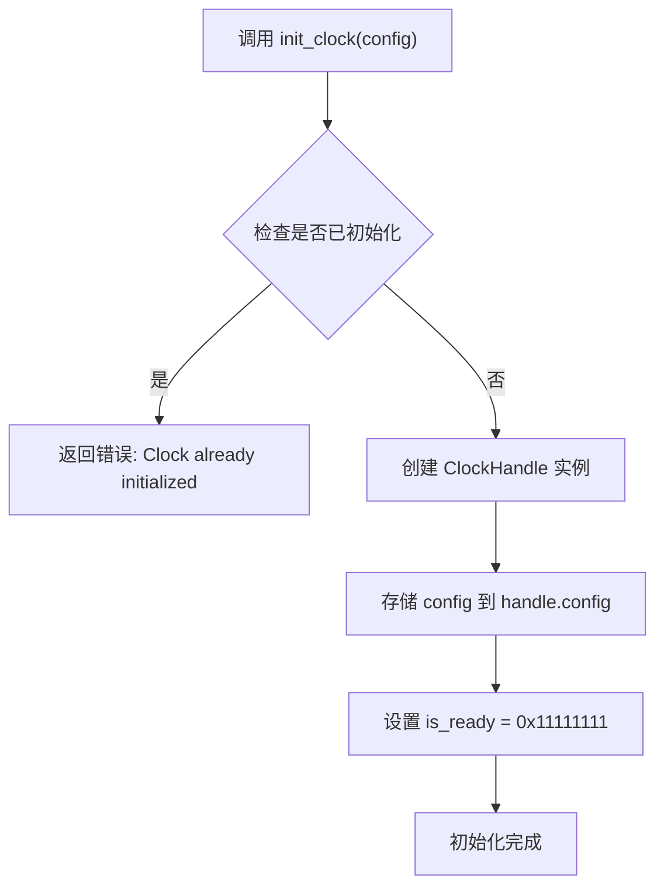

# 核心类型

<cite>
**本文档中引用的文件**
- [lib.rs](file://src/lib.rs)
- [basic_usage.rs](file://examples/basic_usage.rs)
- [Cargo.toml](file://Cargo.toml)
- [README.md](file://README.md)
</cite>

## 目录
1. [ClockController](#clockcontroller)
2. [ClockConfig](#clockconfig)
3. [ClockHandle](#clockhandle)
4. [初始化流程与协作关系](#初始化流程与协作关系)

## ClockController

`ClockController` 是飞腾派平台时钟控制器的硬件抽象层，负责通过内存映射I/O直接操作底层寄存器。该类型封装了对时钟控制寄存器的读写逻辑，提供高级API用于配置和管理时钟频率。

### 字段说明
- `regs`: 类型为 `NonNull<ClockRegs>`，指向时钟控制器寄存器结构体的非空指针。此字段在构造函数中由基地址初始化，并在整个生命周期内保持有效。

### 生命周期管理
`ClockController` 的生命周期与其所管理的硬件寄存器区域绑定。调用者需确保其生存期不超过对应内存区域的有效性。该类型实现了 `Send` 和 `Sync` trait（通过 `unsafe impl`），表明其实例可在多线程间安全传递和共享，前提是外部同步机制得到保证。

### 系统角色
作为核心驱动组件，`ClockController` 扮演着软硬件之间的桥梁角色。它将高层频率设置请求转换为具体的寄存器操作，包括分频系数设置、时钟使能/禁用以及状态监控。

### 内存映射I/O操作机制
该类型通过 `tock-registers` 库提供的类型安全接口访问硬件寄存器：
- 使用 `register_structs!` 宏定义寄存器布局（`clk_con`, `clk_div`, `clk_status`）
- 通过 `regs()` 和 `regs_mut()` 方法获取寄存器引用，内部使用 `unsafe` 操作原始指针
- 所有寄存器访问均基于偏移量计算，如 `clk_div` 位于基地址 + 0x04 处

### 构造函数安全性
`new` 构造函数被标记为 `unsafe`，因为调用者必须确保传入的 `base: *mut u8` 参数指向有效的、可访问的时钟控制器寄存器物理地址。若地址无效或未正确映射到虚拟内存空间，则会导致未定义行为。

### 方法签名列表
| 方法名 | 参数 | 返回值 | 错误码 | 调用上下文要求 |
|-------|------|--------|--------|----------------|
| `set_frequency` | `freq: u32` (目标频率Hz) | `bool` (成功为true) | 无显式错误码；返回false表示失败 | 需持有可变引用；可能涉及并发访问，建议在锁保护下调用 |
| `get_frequency` | 无 | `u32` (当前频率Hz) | 无 | 可在任意上下文调用，但应确保控制器已初始化 |
| `enable` | 无 | 无 | 无 | 需持有可变引用；修改硬件状态 |
| `disable` | 无 | 无 | 无 | 需持有可变引用；修改硬件状态 |
| `is_ready` | 无 | `bool` (是否就绪) | 无 | 可在任意上下文调用 |

**Section sources**
- [lib.rs](file://src/lib.rs#L39-L103)

## ClockConfig

`ClockConfig` 结构体用于描述时钟控制器的静态配置信息，在系统初始化阶段使用。

### 字段含义
- `instance_id`: 实例标识符，目前系统仅支持单个实例（ID为0）。其他值将导致配置查找失败。
- `base_address`: 寄存器块的物理基地址，对于飞腾派平台固定为 `0x2800_0000`。

### 配置方式与有效性约束
配置通常通过 `lookup_config(instance_id)` 函数获取预定义配置。有效性约束如下：
- `instance_id` 必须小于1，否则返回 `None`
- `base_address` 固定为平台指定值，不可更改
- 配置对象本身不包含运行时状态，仅为初始化参数载体

**Section sources**
- [lib.rs](file://src/lib.rs#L138-L146)

## ClockHandle

`ClockHandle` 封装了时钟子系统的初始化状态和配置信息，是全局时钟实例的管理句柄。

### 初始化状态封装
该类型包含两个关键字段：
- `config`: 存储从 `ClockConfig` 继承而来的配置数据
- `is_ready`: 标志位，初始化成功后设为 `0x11111111u32`，用于防止重复初始化

### 线程安全机制
`ClockHandle` 自身是 `Copy` 类型，不提供内在线程安全。其线程安全性依赖于外部包装：
- 全局实例 `GLOBAL_CLOCK` 使用 `Once<Mutex<ClockHandle>>` 包装
- `Once` 确保初始化仅执行一次
- `Mutex` 提供运行时互斥访问，确保多线程环境下对 `ClockHandle` 的安全读取

### 方法签名列表
| 方法名 | 参数 | 返回值 | 错误码 | 调用上下文要求 |
|-------|------|--------|--------|----------------|
| `new` | 无 | `Self` (新实例) | 无 | 常量上下文中可用（`const fn`） |

**Section sources**
- [lib.rs](file://src/lib.rs#L147-L157)

## 初始化流程与协作关系

三个核心类型通过 `init_clock()` 函数协同工作完成系统初始化：

具体协作步骤如下：
1. 用户调用 `lookup_config(0)` 获取默认配置
2. 将配置传入 `init_clock()` 进行初始化
3. `init_clock()` 创建并初始化 `ClockHandle`，存储于全局 `Once<Mutex<>>` 中
4. 后续操作通过 `with_clock!` 宏访问全局句柄，提取配置中的 `base_address`
5. 使用地址创建临时 `ClockController` 实例执行实际硬件操作

### 涉及底层硬件访问的操作
- `ClockController::new()`：建立内存映射I/O连接
- `set_frequency()`, `enable()`, `disable()`：写入控制寄存器
- `get_frequency()`, `is_ready()`：读取状态寄存器

### 涉及并发控制的操作
- `init_clock()`：通过 `Once` 和 `Mutex` 实现一次性初始化和互斥访问
- 所有 `api::*` 函数：通过 `with_clock!` 宏间接使用 `Mutex` 锁保护全局状态

开发者应注意：所有涉及硬件寄存器访问的操作均为 `unsafe` 上下文的一部分，必须确保内存映射正确且无竞争条件。

**Section sources**
- [lib.rs](file://src/lib.rs#L167-L211)
- [lib.rs](file://src/lib.rs#L213-L274)
- [basic_usage.rs](file://examples/basic_usage.rs#L0-L64)