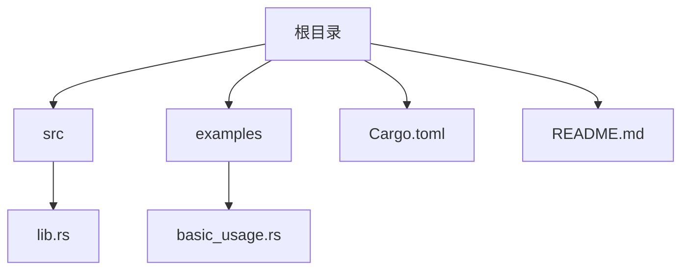
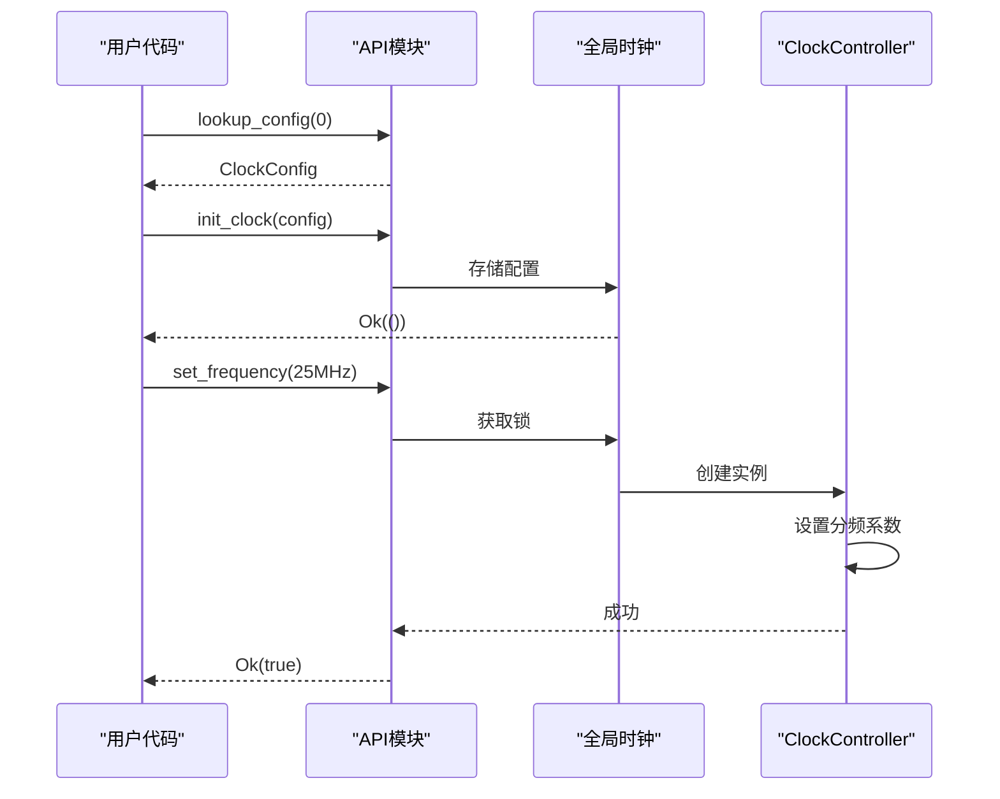
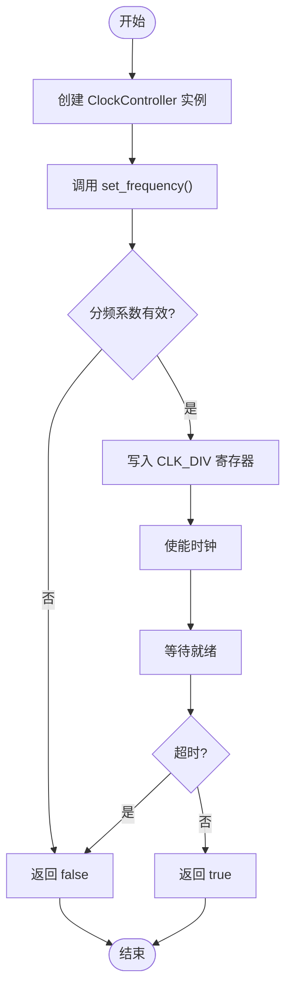
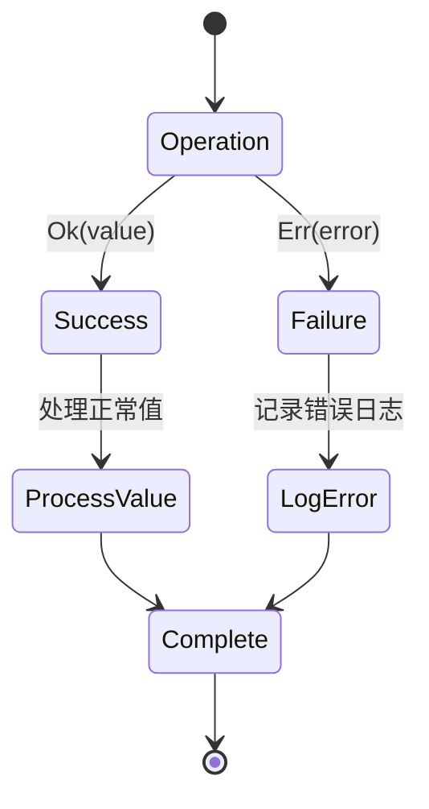
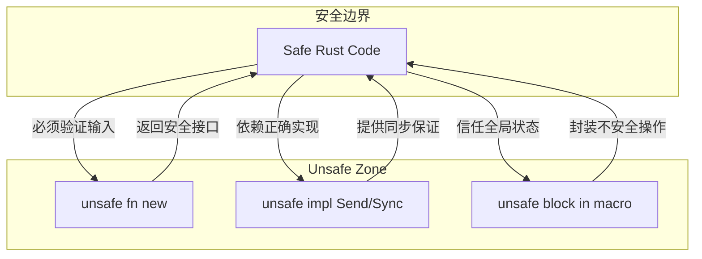

# 快速开始

<cite>
**Referenced Files in This Document**   
- [basic_usage.rs](file://examples/basic_usage.rs)
- [lib.rs](file://src/lib.rs)
</cite>

## 目录
1. [简介](#简介)
2. [项目结构](#项目结构)
3. [核心组件](#核心组件)
4. [高层API使用路径](#高层api使用路径)
5. [底层控制器直接控制路径](#底层控制器直接控制路径)
6. [错误处理模式分析](#错误处理模式分析)
7. [完整示例流程](#完整示例流程)
8. [安全注意事项](#安全注意事项)

## 简介
本文档旨在为开发者提供一份详细的入门指南，指导如何在实际项目中快速集成和使用飞腾派时钟驱动。内容涵盖通过高层API进行便捷操作和直接使用`ClockController`进行底层控制两种关键路径，帮助新手在5分钟内完成首次成功调用。

## 项目结构
飞腾派时钟驱动项目采用标准的Rust库结构，包含源代码、示例和配置文件。主要目录包括：
- `src/`: 核心驱动实现
- `examples/`: 使用示例
- 根目录: 配置文件

**Diagram sources**
- [Cargo.toml](file://Cargo.toml)
- [src/lib.rs](file://src/lib.rs)

**Section sources**
- [Cargo.toml](file://Cargo.toml)
- [README.md](file://README.md)

## 核心组件
本驱动的核心由三个主要组件构成：`ClockController`（硬件抽象层）、`ClockConfig`（配置管理）和全局时钟管理机制。这些组件协同工作，提供稳定可靠的时钟控制功能。

**Section sources**
- [src/lib.rs](file://src/lib.rs#L40-L274)

## 高层API使用路径
高层API提供了简洁易用的接口，使开发者能够快速集成时钟功能而无需关注底层细节。

### 初始化流程
首先需要获取默认配置并初始化时钟控制器：

[SPEC SYMBOL](file://src/lib.rs#L209-L228) 获取预定义的时钟配置实例。

[SPEC SYMBOL](file://src/lib.rs#L188-L207) 使用配置初始化全局时钟实例。

### 基本操作
初始化完成后，可通过API模块执行各种操作：

[SPEC SYMBOL](file://src/lib.rs#L238-L241) 设置目标时钟频率。

[SPEC SYMBOL](file://src/lib.rs#L243-L246) 获取当前时钟频率。

[SPEC SYMBOL](file://src/lib.rs#L248-L252) 使能时钟输出。

[SPEC SYMBOL](file://src/lib.rs#L254-L258) 禁用时钟输出。

[SPEC SYMBOL](file://src/lib.rs#L260-L264) 检查时钟是否处于稳定状态。

**Diagram sources**
- [src/lib.rs](file://src/lib.rs#L188-L264)
- [examples/basic_usage.rs](file://examples/basic_usage.rs#L10-L15)

**Section sources**
- [src/lib.rs](file://src/lib.rs#L188-L264)
- [examples/basic_usage.rs](file://examples/basic_usage.rs#L10-L15)

## 底层控制器直接控制路径
对于需要更精细控制的场景，可以直接创建和使用`ClockController`实例。

### 实例创建
[SPEC SYMBOL](file://src/lib.rs#L51-L57) 创建新的时钟控制器实例，接受寄存器基地址指针作为参数。

### 直接操作
与高层API类似，但绕过全局管理机制：

[SPEC SYMBOL](file://src/lib.rs#L75-L115) 直接设置时钟频率。

[SPEC SYMBOL](file://src/lib.rs#L117-L130) 直接获取当前频率。

[SPEC SYMBOL](file://src/lib.rs#L132-L136) 使能时钟。

[SPEC SYMBOL](file://src/lib.rs#L138-L142) 禁用时钟。

[SPEC SYMBOL](file://src/lib.rs#L144-L148) 检查时钟状态。

**Diagram sources**
- [src/lib.rs](file://src/lib.rs#L51-L148)

**Section sources**
- [src/lib.rs](file://src/lib.rs#L51-L148)
- [README.md](file://README.md#L35-L45)

## 错误处理模式分析
驱动采用Rust的`Result`类型进行错误处理，确保操作的安全性和可预测性。

### 初始化阶段错误
[SPEC SYMBOL](file://src/lib.rs#L197-L205) 返回字符串切片表示的错误信息，如"Clock already initialized"。

### 运行时错误
所有API函数返回`Result<T, &'static str>`类型，封装了操作结果和可能的错误原因。

### 错误匹配模式
[SPEC SYMBOL](file://examples/basic_usage.rs#L17-L21) 展示了典型的错误处理模式，使用match表达式处理不同情况。

**Diagram sources**
- [src/lib.rs](file://src/lib.rs#L238-L264)
- [examples/basic_usage.rs](file://examples/basic_usage.rs#L17-L35)

**Section sources**
- [src/lib.rs](file://src/lib.rs#L238-L264)
- [examples/basic_usage.rs](file://examples/basic_usage.rs#L17-L35)

## 完整示例流程
结合`basic_usage.rs`中的实践模式，以下是完整的开发流程：

[SPEC SYMBOL](file://examples/basic_usage.rs#L10-L12) 获取配置并初始化时钟。

[SPEC SYMBOL](file://examples/basic_usage.rs#L17-L21) 设置目标频率并处理结果。

[SPEC SYMBOL](file://examples/basic_usage.rs#L23-L27) 获取并验证当前频率。

[SPEC SYMBOL](file://examples/basic_usage.rs#L29-L33) 检查时钟状态。

[SPEC SYMBOL](file://examples/basic_usage.rs#L35-L55) 循环测试多个频率点。

**Section sources**
- [examples/basic_usage.rs](file://examples/basic_usage.rs#L10-L64)

## 安全注意事项
由于涉及硬件寄存器操作，本驱动包含多处`unsafe`代码，使用时需特别注意。

### unsafe 函数
[SPEC SYMBOL](file://src/lib.rs#L51) 的`new`方法标记为`unsafe`，要求调用者确保基地址的有效性。

### unsafe 实现
[SPEC SYMBOL](file://src/lib.rs#L43-L44) 的`Send`和`Sync`实现需要保证线程安全。

### 宏中的 unsafe
[SPEC SYMBOL](file://src/lib.rs#L223) 在`with_clock!`宏中使用`unsafe`创建控制器实例。

**Diagram sources**
- [src/lib.rs](file://src/lib.rs#L43-L51)
- [src/lib.rs](file://src/lib.rs#L223)

**Section sources**
- [src/lib.rs](file://src/lib.rs#L43-L51)
- [src/lib.rs](file://src/lib.rs#L223)