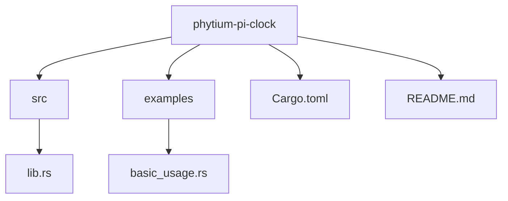
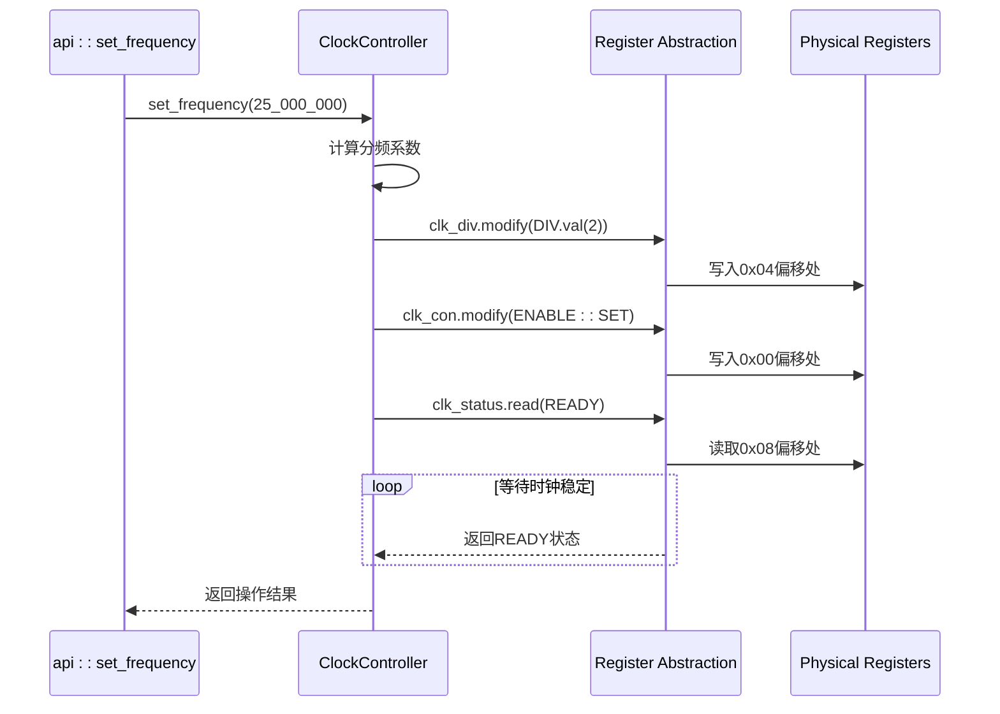

<cite>
**本文档引用的文件**
- [lib.rs](file://src/lib.rs)
- [Cargo.toml](file://Cargo.toml)
- [README.md](file://README.md)
- [basic_usage.rs](file://examples/basic_usage.rs)
</cite>

# 寄存器抽象机制

## 目录
1. [简介](#简介)
2. [项目结构](#项目结构)
3. [核心组件](#核心组件)
4. [寄存器类型安全抽象](#寄存器类型安全抽象)
5. [位域语义定义](#位域语义定义)
6. [读写权限编译期检查](#读写权限编译期检查)
7. [硬件交互流程分析](#硬件交互流程分析)
8. [代码可读性与安全性优势](#代码可读性与安全性优势)
9. [结论](#结论)

## 简介

本文档详细阐述了基于`tock-registers`库实现的类型安全寄存器抽象机制。该机制通过宏系统将内存偏移映射为结构体字段，定义位域语义，并在编译期防止非法写入只读寄存器，从而显著提高嵌入式系统开发的代码可读性和安全性。

## 项目结构

飞腾派时钟驱动项目采用标准的Rust库结构，包含源码、示例和配置文件。



**Diagram sources**
- [lib.rs](file://src/lib.rs#L1-L275)
- [Cargo.toml](file://Cargo.toml#L1-L41)

**Section sources**
- [lib.rs](file://src/lib.rs#L1-L275)
- [Cargo.toml](file://Cargo.toml#L1-L41)

## 核心组件

本驱动的核心组件包括时钟控制器结构体、寄存器定义和全局时钟管理机制。`ClockController`提供对硬件寄存器的安全访问，而`api`模块则封装了便捷的操作接口。

**Section sources**
- [lib.rs](file://src/lib.rs#L39-L275)
- [lib.rs](file://src/lib.rs#L200-L248)

## 寄存器类型安全抽象

`register_structs!`宏是实现类型安全寄存器访问的核心。它将物理内存中的寄存器布局映射为Rust结构体字段，每个字段对应一个特定偏移量的寄存器。

该宏将寄存器地址偏移（如0x00、0x04）转换为结构体成员，使得开发者可以通过直观的字段访问语法操作硬件寄存器，而不是使用易错的裸指针计算。

```rust
register_structs! {
    pub ClockRegs {
        (0x00 => clk_con: ReadWrite<u32, CLK_CON::Register>),
        (0x04 => clk_div: ReadWrite<u32, CLK_DIV::Register>),
        (0x08 => clk_status: ReadOnly<u32, CLK_STATUS::Register>),
        (0x0c => @END),
    }
}
```

这种抽象确保了寄存器访问的类型安全和内存安全，避免了手动计算内存偏移可能引入的错误。

**Section sources**
- [lib.rs](file://src/lib.rs#L12-L19)

## 位域语义定义

`register_bitfields!`宏用于定义寄存器中各个位域的语义，将底层的位操作转换为具有明确含义的符号常量。

通过此宏，可以清晰地定义每个位域的名称、位置、宽度和可能的值，例如：
- `CLK_CON::ENABLE`：控制时钟使能状态
- `CLK_DIV::DIV`：设置分频系数

这种定义方式消除了直接进行位运算（如左移、按位或）的需求，使代码更加可读和可维护。

**Section sources**
- [lib.rs](file://src/lib.rs#L21-L37)

## 读写权限编译期检查

类型系统通过`ReadOnly`和`ReadWrite`类型在编译期强制执行寄存器的访问权限：

- `ReadOnly<T, R>`：仅允许读取操作，禁止任何写入
- `ReadWrite<T, R>`：允许读取和写入操作

在`ClockRegs`定义中，`clk_status`寄存器被声明为`ReadOnly`，这意味着任何尝试修改它的代码都会在编译时被拒绝，有效防止了对只读寄存器的非法写入。

**Section sources**
- [lib.rs](file://src/lib.rs#L12-L19)
- [lib.rs](file://src/lib.rs#L21-L37)

## 硬件交互流程分析

`set_frequency()`方法展示了从高级API到硬件操作的完整调用链：

1. 计算所需的分频系数
2. 通过`regs_mut().clk_div.modify()`设置分频寄存器
3. 通过`regs_mut().clk_con.modify()`使能时钟
4. 轮询`regs().clk_status.read()`等待时钟稳定

这一流程体现了抽象层如何将复杂的硬件操作封装为简单的函数调用，同时保持了对底层细节的精确控制。



**Diagram sources**
- [lib.rs](file://src/lib.rs#L74-L120)

**Section sources**
- [lib.rs](file://src/lib.rs#L74-L120)

## 代码可读性与安全性优势

此寄存器抽象机制带来了显著的优势：

### 可读性提升
- 使用`CLK_CON::ENABLE::SET`代替`write_reg(0x00, 1 << 0)`
- 字段名和位域名提供了自文档化的代码
- 类型签名明确了操作的意图

### 安全性增强
- 编译期检查防止越界访问
- 类型系统阻止对只读寄存器的写入
- 位域定义防止无效的位组合

### 维护性改善
- 寄存器布局变更只需修改宏定义
- 位域语义集中管理，易于更新
- 错误处理逻辑统一

这些优势共同构成了一个健壮、可靠的硬件抽象层，大大降低了嵌入式系统开发的风险。

**Section sources**
- [lib.rs](file://src/lib.rs#L1-L275)
- [README.md](file://README.md#L1-L120)

## 结论

基于`tock-registers`库的类型安全寄存器抽象机制成功地将低级的硬件操作转化为高级的、类型安全的Rust代码。通过`register_structs!`和`register_bitfields!`宏，实现了内存偏移到结构体字段的映射和位域语义的定义。`ReadOnly`与`ReadWrite`类型在编译期防止了非法写入，而`set_frequency()`等方法展示了抽象层到硬件的实际交互流程。这一机制不仅提高了代码的可读性，还显著减少了硬件相关的错误，为嵌入式系统开发提供了一个可靠的基础。