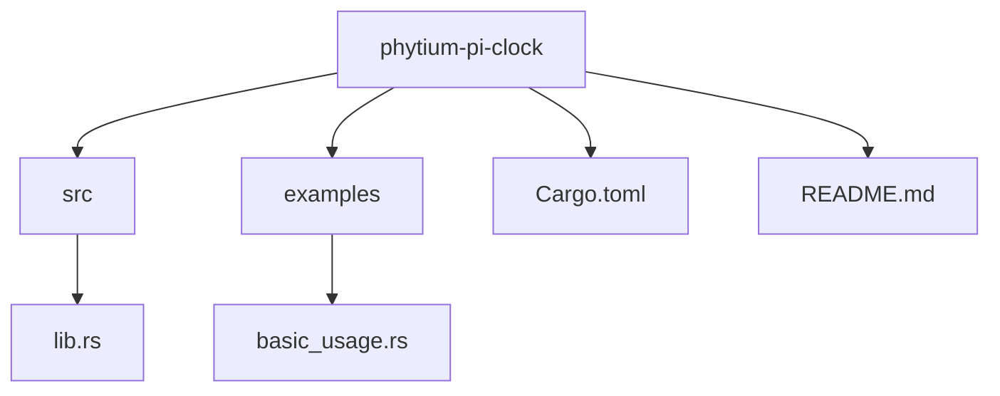
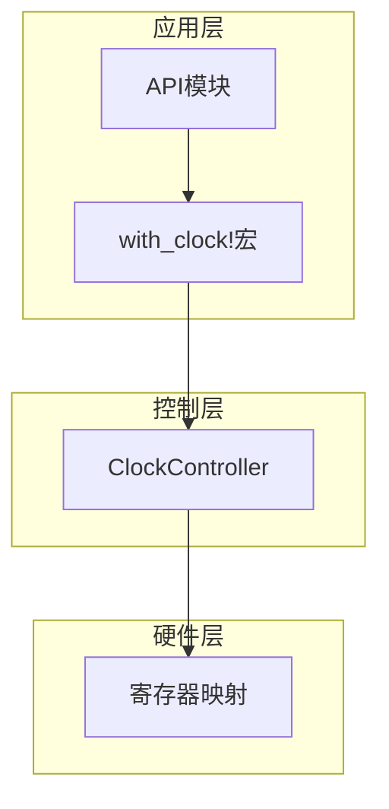
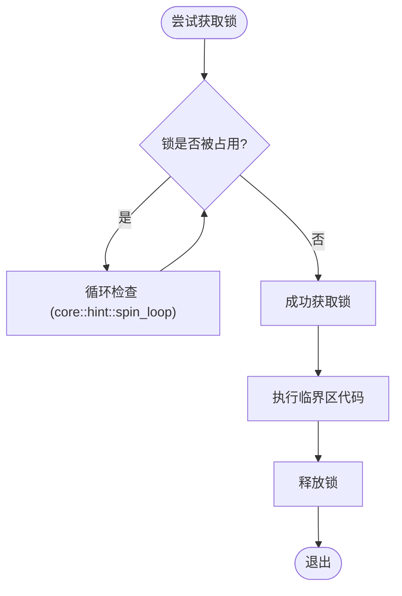
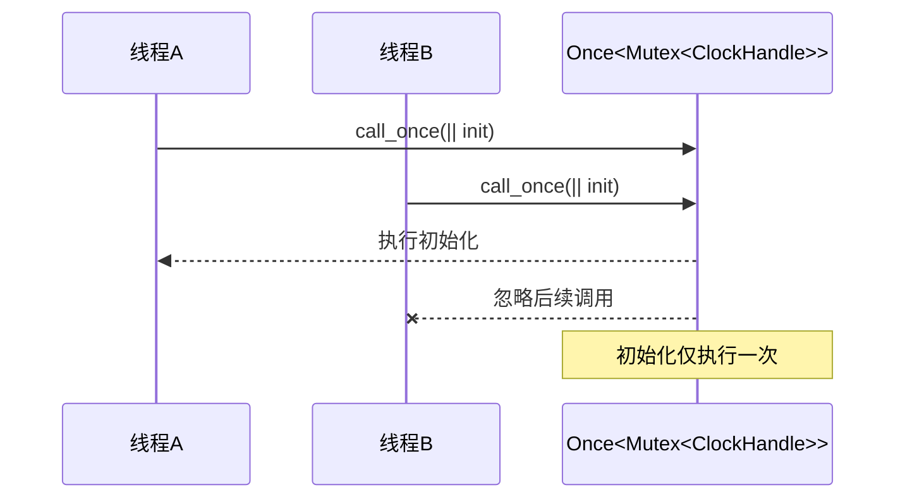
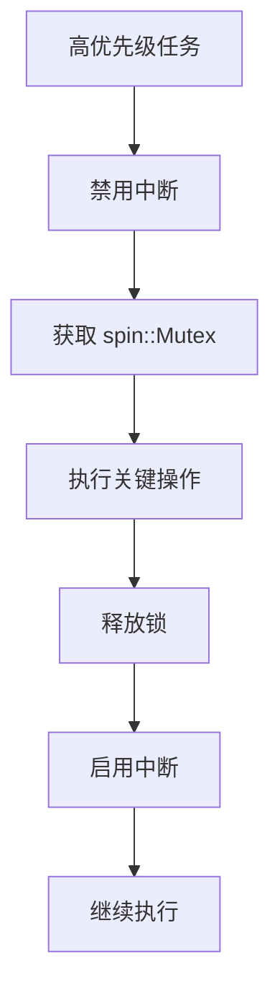
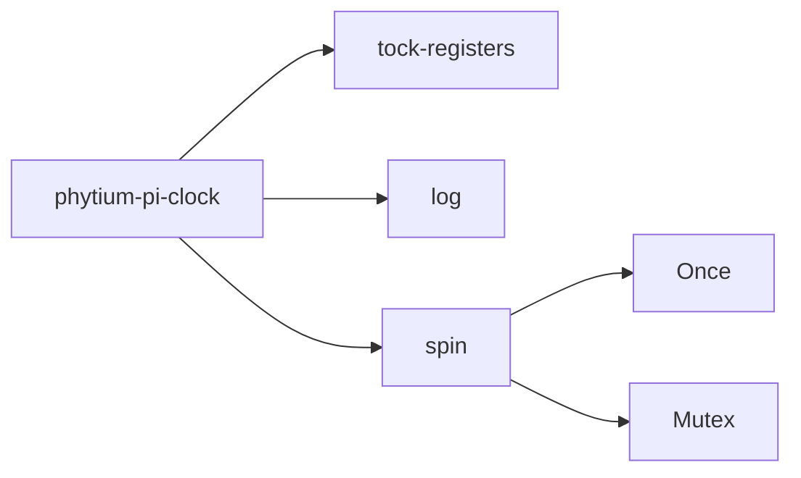

# 并发控制策略

<cite>
**Referenced Files in This Document**   
- [lib.rs](file://src/lib.rs)
- [Cargo.toml](file://Cargo.toml)
</cite>

## 目录
1. [引言](#引言)
2. [项目结构](#项目结构)
3. [核心组件](#核心组件)
4. [架构概述](#架构概述)
5. [详细组件分析](#详细组件分析)
6. [依赖分析](#依赖分析)
7. [性能考量](#性能考量)
8. [故障排除指南](#故障排除指南)
9. [结论](#结论)

## 引言
本文档旨在深入分析`phytium-pi-clock`驱动库中的并发控制机制，重点解释为何在`no_std`环境下选择`spin::Mutex`作为同步原语，并探讨`Once<Mutex<ClockHandle>>`如何确保全局时钟句柄的安全初始化。同时，文档将讨论潜在的优先级反转问题及其缓解措施。

## 项目结构
该项目是一个为Phytium Pi平台设计的时钟控制驱动程序，采用典型的Rust嵌入式项目布局。核心功能实现在`src/lib.rs`中，通过`Cargo.toml`管理依赖项和构建配置。`examples/basic_usage.rs`提供了基本使用示例，而`README.md`则包含项目介绍和使用说明。

**Diagram sources**
- [lib.rs](file://src/lib.rs)
- [Cargo.toml](file://Cargo.toml)

**Section sources**
- [lib.rs](file://src/lib.rs)
- [Cargo.toml](file://Cargo.toml)

## 核心组件
本项目的核心是`ClockController`结构体，它封装了对硬件寄存器的访问逻辑。`GLOBAL_CLOCK`静态变量通过`Once<Mutex<ClockHandle>>`模式实现了全局单例的延迟安全初始化。`with_clock!`宏简化了对全局时钟实例的安全访问，确保所有操作都在持有锁的情况下进行。

**Section sources**
- [lib.rs](file://src/lib.rs#L1-L275)

## 架构概述
该驱动程序采用分层架构，底层直接操作硬件寄存器，中间层提供`ClockController`抽象接口，上层通过`api`模块暴露便捷的函数调用，并利用`with_clock!`宏自动处理并发控制。

**Diagram sources**
- [lib.rs](file://src/lib.rs#L1-L275)

## 详细组件分析

### 自旋锁的选择与实现
在`#![no_std]`环境中，系统缺乏操作系统提供的线程调度和上下文切换能力，因此传统的阻塞式互斥锁（如标准库中的`std::sync::Mutex`）无法使用。`spin::Mutex`作为一种自旋锁，在尝试获取已被占用的锁时会持续循环检查，直到锁被释放。这种机制虽然消耗CPU周期，但在无操作系统支持的嵌入式环境中是唯一可行的互斥方案。

**Diagram sources**
- [lib.rs](file://src/lib.rs#L168)
- [Cargo.toml](file://Cargo.toml#L20-L22)

### 全局时钟句柄的一次性安全初始化
`Once<Mutex<ClockHandle>>`模式结合了延迟初始化和线程安全两大优势。`Once`确保`call_once`中的初始化代码仅执行一次，即使在多线程竞争条件下也能保证全局状态的正确性。内部嵌套的`Mutex`则保护了`ClockHandle`数据结构，防止在初始化后被并发修改。

**Diagram sources**
- [lib.rs](file://src/lib.rs#L168)
- [lib.rs](file://src/lib.rs#L170-L172)

### 优先级反转问题与缓解措施
在中断处理或高优先级任务中使用`spin::Mutex`可能导致优先级反转：低优先级任务持有锁时，高优先级任务将无限期自旋等待，导致系统响应延迟。缓解此问题的常见方法是在进入临界区前临时禁用中断，确保关键代码段原子执行。

**Diagram sources**
- [lib.rs](file://src/lib.rs#L168)
- [lib.rs](file://src/lib.rs#L210-L215)

### 临界区最小化设计
`with_clock!`宏的设计体现了临界区最小化的最佳实践。该宏将`lock()`调用封装在自身作用域内，确保锁的生命周期严格限制在宏展开后的代码块中。一旦操作完成，锁会立即自动释放，最大限度地减少了其他线程的等待时间。

**Diagram sources**
- [lib.rs](file://src/lib.rs#L210-L215)
- [lib.rs](file://src/lib.rs#L168)

## 依赖分析
项目依赖于`tock-registers`库进行安全的寄存器访问，`log`库用于日志输出，以及`spin`库提供`no_std`环境下的同步原语。这些依赖均针对嵌入式场景进行了优化，不包含标准库的运行时开销。

**Diagram sources**
- [Cargo.toml](file://Cargo.toml#L15-L22)
- [lib.rs](file://src/lib.rs#L4)

**Section sources**
- [Cargo.toml](file://Cargo.toml#L15-L22)

## 性能考量
自旋锁在短临界区场景下表现良好，但长时间持有会导致CPU资源浪费。建议保持临界区内操作尽可能轻量，避免复杂计算或延时操作。对于可能耗时的操作，应考虑重新设计以减少锁的持有时间。

## 故障排除指南
若遇到系统挂起或响应迟缓，应检查是否存在长时间持有`spin::Mutex`的情况。使用`with_clock!`宏有助于避免忘记释放锁的问题。此外，确保在初始化完成后不再调用`init_clock`，否则会因重复初始化检查而返回错误。

**Section sources**
- [lib.rs](file://src/lib.rs#L173-L185)

## 结论
`phytium-pi-clock`驱动通过精心设计的并发控制策略，在`no_std`环境中实现了安全可靠的全局状态管理。`spin::Mutex`与`Once`的组合既满足了无操作系统支持下的同步需求，又通过宏抽象降低了使用者的认知负担。未来可进一步优化中断处理路径，以完全消除优先级反转风险。