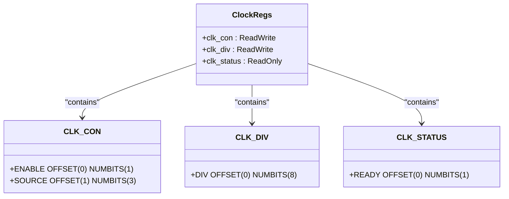

# 技术设计

<cite>
**Referenced Files in This Document**  
- [lib.rs](file://src/lib.rs)
- [Cargo.toml](file://Cargo.toml)
- [README.md](file://README.md)
</cite>

## 目录
1. [引言](#引言)
2. [分层架构模型](#分层架构模型)
3. [关键设计模式分析](#关键设计模式分析)
4. [寄存器抽象机制](#寄存器抽象机制)
5. [并发控制策略](#并发控制策略)
6. [超时重试机制](#超时重试机制)
7. [API接口层设计](#api接口层设计)
8. [全局管理层实现](#全局管理层实现)
9. [结论](#结论)

## 引言

飞腾派平台时钟驱动采用分层架构设计，旨在为嵌入式系统提供稳定、安全且易于使用的时钟控制功能。该驱动专为`no_std`环境优化，适用于无操作系统或实时操作系统场景。其核心目标是通过硬件抽象、状态管理和线程安全机制，实现对时钟控制器的可靠访问与配置。

本设计文档深入剖析驱动的内部工作原理，揭示其技术决策背后的考量。从底层寄存器操作到顶层API封装，每一层都体现了对安全性、可维护性和性能的权衡。驱动的关键特性包括：类型安全的寄存器访问、基于自旋锁的并发控制、单例模式的全局管理以及宏定义的便捷接口。

**Section sources**
- [lib.rs](file://src/lib.rs#L1-L20)
- [README.md](file://README.md#L1-L10)

## 分层架构模型

该驱动遵循清晰的分层架构，将复杂性分解为四个逻辑层次，每一层都有明确的职责和抽象边界。

### 硬件抽象层（HAL）

硬件抽象层由`ClockController`结构体构成，直接负责与物理寄存器交互。它通过`tock-registers`库提供的宏，将内存映射的I/O空间抽象为类型安全的Rust结构体。此层屏蔽了底层指针操作和位域计算的细节，开发者无需手动进行偏移量计算或位掩码操作，即可安全地读写寄存器。

### 控制逻辑层

控制逻辑层实现了具体的业务功能，如频率设置、使能/禁用时钟等。`ClockController`的方法（例如`set_frequency`）在此层中执行。这些方法包含输入验证、状态转换逻辑和错误处理，确保所有对硬件的操作都是合法且有序的。例如，在设置新频率前，会先检查目标值是否在有效范围内。

### API接口层

API接口层由`api`模块提供，作为用户与驱动交互的主要入口。它通过一组简洁的函数（如`api::set_frequency`）封装了复杂的初始化和同步逻辑。这一层极大地简化了用户的使用负担，用户无需关心`ClockController`的创建、生命周期管理或并发问题，只需调用高层API即可完成所需操作。

### 全局管理层

全局管理层以`GLOBAL_CLOCK`静态变量为核心，采用单例模式管理整个系统的时钟状态。它存储了`ClockHandle`，其中包含了初始化后的配置信息和就绪状态。此层确保了驱动在整个应用生命周期内只能被初始化一次，防止了资源冲突和重复配置。

```mermaid
graph TB
subgraph "用户代码"
User[用户应用]
end
subgraph "API接口层"
API[api模块<br>set_frequency()<br>get_frequency()]
end
subgraph "全局管理层"
GLOBAL[GLOBAL_CLOCK<br>Once<Mutex<ClockHandle>>]
end
subgraph "控制逻辑层"
Controller[ClockController<br>set_frequency(freq)]
end
subgraph "硬件抽象层"
Regs[ClockRegs<br>clk_con, clk_div, clk_status]
HW[物理时钟硬件]
end
User --> API
API --> GLOBAL
GLOBAL --> Controller
Controller --> Regs
Regs --> HW
style User fill:#f9f,stroke:#333
style API fill:#bbf,stroke:#333
style GLOBAL fill:#f96,stroke:#333
style Controller fill:#6f9,stroke:#333
style Regs fill:#ff9,stroke:#333
style HW fill:#ccc,stroke:#333
```

**Diagram sources**
- [lib.rs](file://src/lib.rs#L50-L274)

**Section sources**
- [lib.rs](file://src/lib.rs#L50-L274)

## 关键设计模式分析

驱动的设计巧妙地运用了多种经典设计模式，以解决嵌入式开发中的常见挑战。

### 门面模式（Facade Pattern）

`api`模块是门面模式的典型应用。它为复杂的子系统（即`ClockController`和`GLOBAL_CLOCK`的组合）提供了一个统一且简化的接口。用户不再需要了解如何获取全局句柄、加锁、创建控制器实例等一系列繁琐步骤。一个简单的`api::set_frequency(25_000_000)`调用背后，隐藏了完整的初始化检查、互斥锁获取和硬件操作流程。这不仅降低了使用门槛，也减少了出错的可能性。

### RAII（Resource Acquisition Is Initialization）

尽管在`no_std`环境中无法使用标准库的`Drop` trait，但驱动依然体现了RAII的核心思想——资源的生命周期与对象的生命周期绑定。`Mutex`守护的`ClockHandle`确保了在持有锁期间，相关的配置数据是有效的。当`with_clock!`宏展开后，`controller`对象的作用域仅限于闭包内部，一旦闭包执行完毕，临时的`ClockController`实例就会被丢弃，从而保证了资源的及时“释放”（在此语境下，主要是避免了悬空引用）。这种基于作用域的管理方式，是RAII原则在受限环境下的有效实践。

### 单例模式（Singleton Pattern）

`GLOBAL_CLOCK`静态变量利用`spin::Once`实现了单例模式。`Once`类型保证了其内部的初始化代码块只会被执行一次，无论有多少个线程尝试调用`call_once`。这是防止驱动被重复初始化的关键。如果用户多次调用`init_clock`，后续的调用将立即返回错误，保护了硬件状态的一致性。这种设计对于系统级资源（如时钟、中断控制器）至关重要，因为它们通常在整个系统中是唯一的。

**Section sources**
- [lib.rs](file://src/lib.rs#L150-L274)

## 寄存器抽象机制

驱动通过`tock-registers`库的两个核心宏——`register_structs!`和`register_bitfields!`——实现了类型安全的寄存器操作，这是现代嵌入式Rust开发的最佳实践。

### `register_structs!` 宏

该宏用于定义寄存器块的内存布局。在代码中，`ClockRegs`结构体被声明为一系列字段的集合，每个字段对应一个寄存器及其相对于基地址的偏移量。例如，`clk_con`位于偏移`0x00`处，类型为`ReadWrite<u32, CLK_CON::Register>`。这个宏在编译时生成了正确的内存布局，使得对`self.regs.as_ref().clk_con`的访问，会被精确地翻译成对基地址+0x00处的32位字的读写操作。这完全避免了手动计算偏移量可能导致的错误。

### `register_bitfields!` 宏

该宏用于定义寄存器内部各个比特位的含义。以`CLK_CON`寄存器为例，它定义了`ENABLE`位（第0位）和`SOURCE`位（第1-3位）。通过此宏，开发者可以使用语义化的名字来操作位域，而不是直接使用魔法数字。例如，`CLK_CON::ENABLE::SET`比直接写`1 << 0`要清晰得多。更重要的是，`tock-registers`库提供了`modify`、`read`、`write`等方法，这些方法在编译时就能检查位域操作的合法性，防止越界或类型不匹配的错误。

这种双重抽象机制将传统的、易错的“裸指针+位运算”编程模式，转变为类型安全、可读性强的Rust代码，极大地提升了代码的健壮性和可维护性。



**Diagram sources**
- [lib.rs](file://src/lib.rs#L12-L45)

**Section sources**
- [lib.rs](file://src/lib.rs#L12-L45)

## 并发控制策略

驱动选择`spin::Mutex`而非标准库的`std::sync::Mutex`，是针对`no_std`环境做出的关键技术决策。

### 为何选择 `spin::Mutex`

在没有操作系统的嵌入式环境中，标准库的互斥锁依赖于操作系统的调度器和线程阻塞机制。当一个线程在`std::sync::Mutex`上等待时，它期望被挂起，让出CPU给其他线程。然而，在`no_std`环境下，这种调度机制通常不存在。`spin::Mutex`则采用自旋等待（busy-waiting）策略：当一个线程无法获取锁时，它会在一个循环中持续检查锁的状态，直到锁被释放。

### 在 `no_std` 环境下的适用性

这种看似低效的策略在`no_std`环境中反而是合适的：
1.  **无依赖性**：`spin::Mutex`不依赖任何操作系统服务，完全在用户空间实现，符合`no_std`的要求。
2.  **确定性延迟**：自旋锁的等待时间是可预测的，因为它只涉及CPU指令循环。这对于实时系统至关重要，避免了因线程调度不确定性带来的延迟波动。
3.  **短临界区适用**：驱动中的临界区（如`init_clock`和`with_clock!`宏内的操作）都非常短暂。它们主要涉及内存读写和简单的逻辑判断，执行时间极短。因此，即使发生竞争，自旋等待的时间也非常有限，不会造成显著的性能浪费。

综上所述，`spin::Mutex`以其简单、独立和确定性的特点，成为`no_std`环境下并发控制的理想选择。

**Section sources**
- [lib.rs](file://src/lib.rs#L145-L150)
- [Cargo.toml](file://Cargo.toml#L25-L28)

## 超时重试机制

`set_frequency`方法中实现的超时重试机制，是保障系统可靠性的关键环节。

### 实现细节

在成功修改分频系数并使能时钟后，硬件需要一定时间才能稳定到新的频率。为此，`set_frequency`方法进入一个轮询循环，通过读取`CLK_STATUS`寄存器的`READY`位来检查时钟是否已就绪。为了防止程序无限期地卡死在循环中，代码设置了`timeout`计数器，最大值为500次。每次循环内部还有一个嵌套的延时循环（`for _ in 0..1000`），模拟一个微小的延时，以避免过快地轮询硬件。

### 可靠性权衡

此机制在可靠性方面做出了明确的权衡：
- **优点**：它提供了一种主动的健康检查。如果硬件因某种原因未能响应（如电源故障、硬件损坏），函数会在合理时间内失败（返回`false`），而不是永远阻塞，这使得上层应用能够感知到故障并采取相应措施（如记录日志、切换备用路径）。
- **缺点**：当前的延时实现（`core::hint::spin_loop()`）是固定的，不够精确。实际应用中应替换为平台特定的、更精确的延时函数（如基于定时器的延时）。此外，500次的上限是一个经验值，可能需要根据具体硬件的响应时间进行调整。过于激进的超时可能导致误判（硬件其实很快就好，但软件没等到），而过于宽松的超时则会延长故障恢复时间。

尽管存在改进空间，但引入超时机制本身就是一个重要的可靠性设计，它将一个潜在的“硬死锁”问题转化为一个可处理的“软故障”。

**Section sources**
- [lib.rs](file://src/lib.rs#L75-L100)

## API接口层设计

`api`模块的设计充分考虑了易用性和安全性，是驱动用户体验的核心。

### 功能封装

`api`模块导出了`set_frequency`、`get_frequency`、`enable`、`disable`和`is_ready`五个函数。这些函数的签名非常干净，只关注用户最关心的参数和结果。例如，`set_frequency`只需要一个`freq`参数，并返回一个`Result<bool, &'static str>`，清晰地表达了操作的成功与否及可能的错误原因。

### 错误处理

所有API函数都返回`Result`类型，强制调用者处理潜在的错误。最常见的错误是`"Clock not initialized"`，这发生在`GLOBAL_CLOCK`尚未被`init_clock`初始化的情况下。这种设计迫使用户必须先正确初始化驱动，然后再使用其功能，从而避免了在未初始化状态下操作硬件的危险。

### 宏辅助

`with_clock!`宏是API层得以简洁实现的基础。它封装了所有重复的样板代码：获取全局实例、加锁、检查初始化状态、创建临时控制器、执行操作并返回结果。通过宏，开发者可以专注于业务逻辑（`$op(controller)`），而将复杂的控制流交给宏来处理。这不仅减少了代码冗余，也保证了所有API函数在并发和初始化检查方面的行为一致性。

**Section sources**
- [lib.rs](file://src/lib.rs#L200-L274)

## 全局管理层实现

`GLOBAL_CLOCK`的实现是驱动稳定运行的基石。

### 静态初始化

`GLOBAL_CLOCK`被声明为`static Once<Mutex<ClockHandle>>`。`static`关键字使其拥有程序的整个生命周期。`Once`确保了内部的`Mutex<ClockHandle>`只会被初始化一次。`Mutex`则提供了多线程环境下的安全访问。

### 初始化状态机

`ClockHandle`结构体中的`is_ready`字段充当了一个简单的状态机。在`init_clock`函数中，成功初始化后，`is_ready`被设置为一个魔数`0x11111111u32`。任何后续的初始化尝试都会检查这个值，如果发现它已被设置，则立即返回错误。这种设计简单而有效，完美地实现了“一次性初始化”的需求。

### 内存安全

`ClockConfig`结构体包含了`base_address`，这是一个`usize`类型的物理内存地址。`ClockController`的`new`方法接受一个`*mut u8`指针，这被标记为`unsafe`，因为它要求调用者保证该地址指向有效的、未被其他设备占用的内存区域。这种设计将内存安全的责任明确地交给了调用者，符合Rust的安全哲学。

**Section sources**
- [lib.rs](file://src/lib.rs#L145-L195)

## 结论

飞腾派时钟驱动通过精心设计的分层架构和现代Rust特性，构建了一个安全、可靠且易于使用的硬件控制接口。其成功之处在于：

1.  **分层清晰**：从硬件抽象到API封装，各层职责分明，降低了系统的耦合度。
2.  **模式得当**：门面、单例等设计模式的应用，解决了易用性和资源管理的核心问题。
3.  **安全优先**：利用`tock-registers`宏实现类型安全的寄存器访问，最大限度地减少了运行时错误。
4.  **环境适配**：选择`spin::Mutex`是针对`no_std`环境的明智之举，平衡了功能与约束。
5.  **健壮可靠**：超时重试机制为系统稳定性提供了重要保障。

未来的工作可以集中在优化延时精度、增加更多时钟源的支持以及完善测试覆盖率上。总体而言，该驱动是嵌入式Rust开发的一个优秀范例。