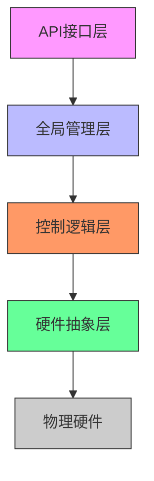
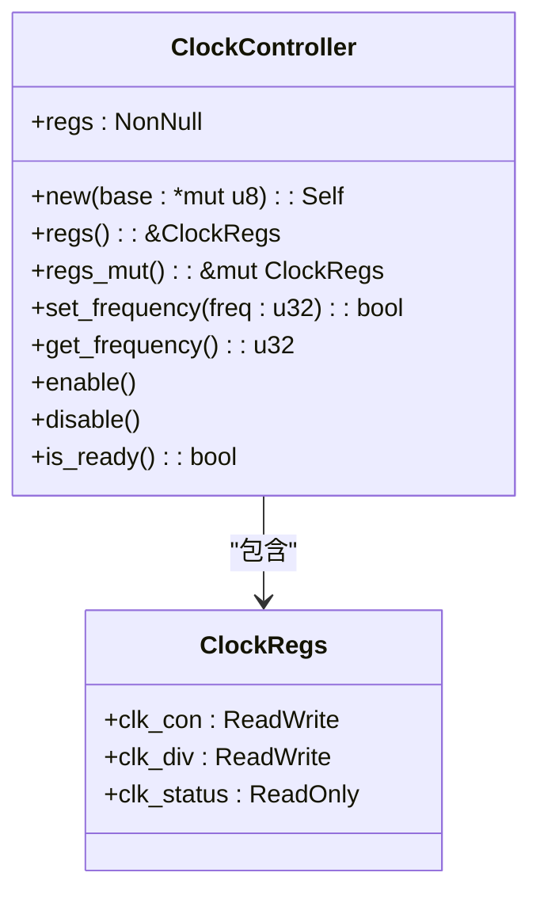
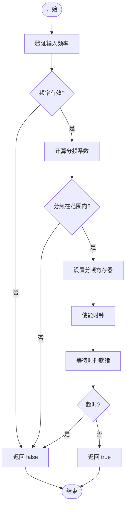
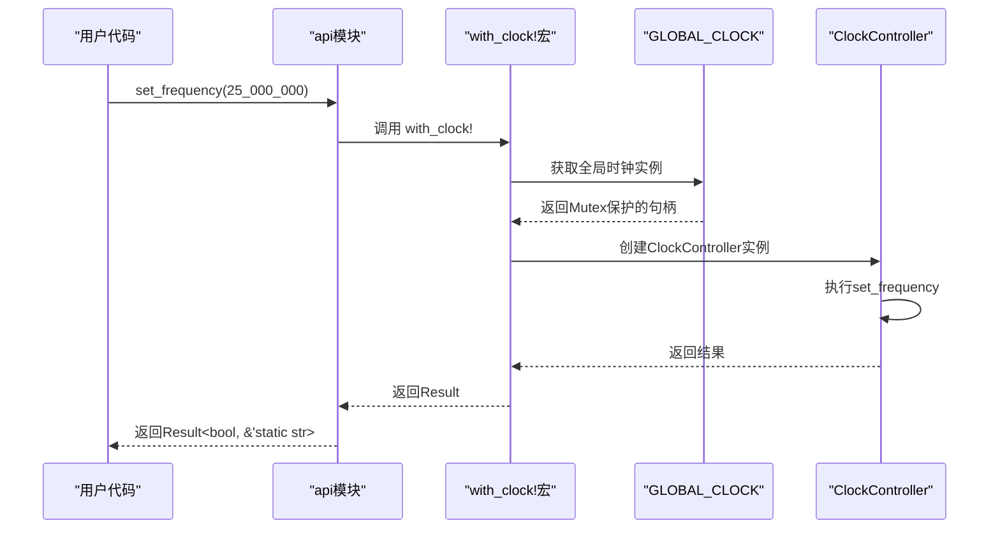
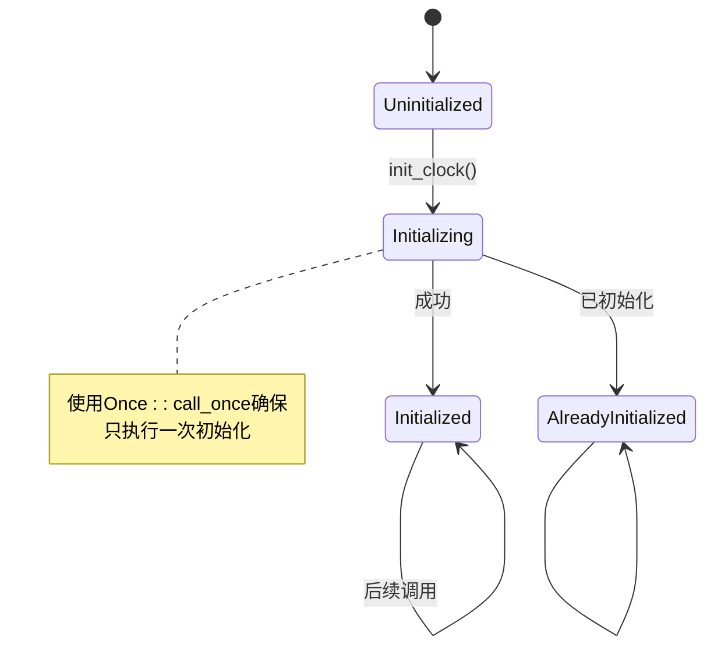
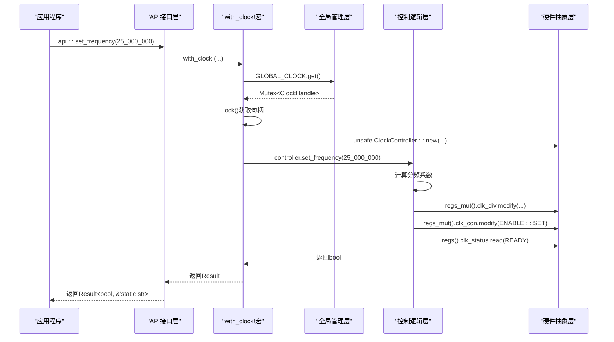
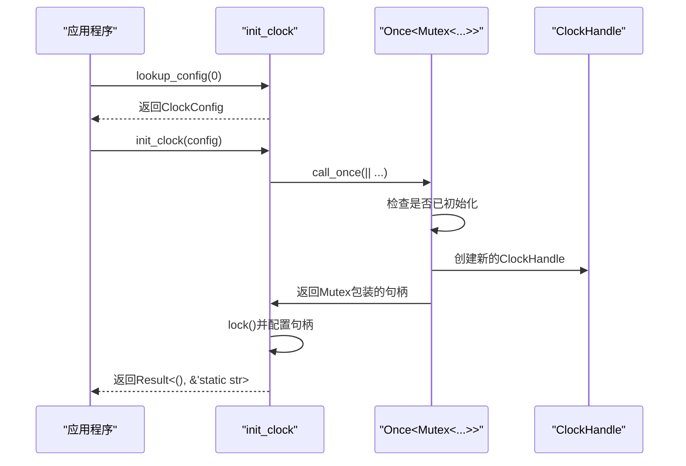

# 架构分层

<cite>
**Referenced Files in This Document **  
- [lib.rs](file://src/lib.rs)
- [Cargo.toml](file://Cargo.toml)
- [README.md](file://README.md)
- [basic_usage.rs](file://examples/basic_usage.rs)
</cite>

## 目录
1. [引言](#引言)
2. [四层架构设计](#四层架构设计)
3. [硬件抽象层](#硬件抽象层)
4. [控制逻辑层](#控制逻辑层)
5. [API接口层](#api接口层)
6. [全局管理层](#全局管理层)
7. [层级协作机制](#层级协作机制)
8. [代码可维护性与安全性](#代码可维护性与安全性)
9. [no_std环境下的设计考量](#no_std环境下的设计考量)
10. [结论](#结论)

## 引言

飞腾派平台时钟驱动采用清晰的四层架构设计，旨在提供安全、可靠且易于使用的时钟控制功能。该驱动专为`no_std`环境设计，避免了动态内存分配，适用于嵌入式系统和操作系统内核开发。本文档详细阐述其硬件抽象层、控制逻辑层、API接口层和全局管理层的设计原理与实现细节。

## 四层架构设计

飞腾派时钟驱动采用分层架构设计，将不同职责分离到独立的层次中：



**Diagram sources **  
- [lib.rs](file://src/lib.rs#L39-L167)  
- [lib.rs](file://src/lib.rs#L168-L210)  
- [lib.rs](file://src/lib.rs#L238-L260)  

**Section sources**  
- [lib.rs](file://src/lib.rs#L1-L274)  

## 硬件抽象层

硬件抽象层（HAL）通过`ClockController`结构体安全封装寄存器访问，实现了对底层硬件的直接控制。

### 寄存器安全封装

该层使用`NonNull<ClockRegs>`来安全地表示寄存器基地址，确保指针不为空且提供类型安全的寄存器访问。



**Diagram sources **  
- [lib.rs](file://src/lib.rs#L39-L70)  
- [lib.rs](file://src/lib.rs#L10-L25)  

**Section sources**  
- [lib.rs](file://src/lib.rs#L39-L167)  

### 安全性保证

`ClockController`通过以下方式确保安全性：
- 使用`NonNull`避免空指针解引用
- 通过`unsafe fn new`明确标记不安全操作的责任边界
- 提供安全的`regs()`和`regs_mut()`方法进行寄存器访问
- 实现`Send`和`Sync` trait以支持跨线程使用

## 控制逻辑层

控制逻辑层实现了频率计算、分频设置和状态轮询等核心业务逻辑。

### 频率计算与验证

该层负责将目标频率转换为合适的分频系数，并进行有效性验证。



**Diagram sources **  
- [lib.rs](file://src/lib.rs#L74-L108)  

**Section sources**  
- [lib.rs](file://src/lib.rs#L74-L167)  

### 状态轮询机制

实现健壮的状态轮询逻辑，确保时钟稳定后再返回成功状态。

## API接口层

API接口层通过`api`模块提供高层函数，隐藏了复杂的句柄管理和错误处理。

### 高层函数设计

`api`模块提供了简洁易用的接口函数，无需手动管理底层句柄。



**Diagram sources **  
- [lib.rs](file://src/lib.rs#L238-L260)  
- [lib.rs](file://src/lib.rs#L220-L235)  

**Section sources**  
- [lib.rs](file://src/lib.rs#L238-L260)  

### 错误处理封装

将底层布尔返回值转换为更丰富的`Result`类型，提供详细的错误信息。

## 全局管理层

全局管理层利用`Once<Mutex<ClockHandle>>`确保单例初始化，防止重复初始化。

### 单例模式实现

使用`spin::Once`确保全局时钟实例只被初始化一次。



**Diagram sources **  
- [lib.rs](file://src/lib.rs#L168-L210)  

**Section sources**  
- [lib.rs](file://src/lib.rs#L168-L210)  

### 线程安全保障

通过`Mutex`保护共享状态，确保多线程环境下的数据一致性。

## 层级协作机制

各层通过明确定义的接口协同工作，形成完整的时钟控制流程。

### `api::set_frequency()`调用流程

当调用`api::set_frequency()`时，各层按特定顺序协作完成操作。



**Diagram sources **  
- [lib.rs](file://src/lib.rs#L242-L244)  
- [lib.rs](file://src/lib.rs#L220-L235)  
- [lib.rs](file://src/lib.rs#L74-L108)  
- [lib.rs](file://src/lib.rs#L39-L70)  

**Section sources**  
- [lib.rs](file://src/lib.rs#L220-L260)  

### 初始化流程

系统启动时的完整初始化过程。



**Diagram sources **  
- [lib.rs](file://src/lib.rs#L177-L210)  
- [lib.rs](file://src/lib.rs#L202-L210)  

**Section sources**  
- [lib.rs](file://src/lib.rs#L177-L210)  

## 代码可维护性与安全性

分层架构显著提升了代码的可维护性和安全性。

### 可维护性优势

| 特性 | 描述 |
|------|------|
| **关注点分离** | 每层专注于特定职责，降低复杂度 |
| **易于测试** | 各层可独立测试，提高覆盖率 |
| **便于扩展** | 新功能可在适当层级添加 |
| **减少耦合** | 明确的接口定义降低模块间依赖 |

### 安全性保障

| 安全机制 | 实现方式 | 作用 |
|---------|---------|------|
| **内存安全** | 使用NonNull避免空指针 | 防止解引用空指针 |
| **并发安全** | Mutex保护共享状态 | 避免数据竞争 |
| **初始化安全** | Once确保单次初始化 | 防止重复初始化 |
| **类型安全** | tock-registers类型化访问 | 避免位操作错误 |

**Section sources**  
- [lib.rs](file://src/lib.rs#L1-L274)  

## no_std环境下的设计考量

针对`no_std`环境进行了专门优化，避免动态内存分配。

### 静态内存管理

所有数据结构均使用静态分配，不依赖堆内存。

```mermaid
erDiagram
CLOCK_CONTROLLER ||--|| CLOCK_REGS : "一对一"
GLOBAL_CLOCK ||--|| CLOCK_HANDLE : "一对一"
CLOCK_HANDLE ||--|| CLOCK_CONFIG : "一对一"
class CLOCK_CONTROLLER {
NonNull<ClockRegs> regs
}
class CLOCK_REGS {
ReadWrite<u32> clk_con
ReadWrite<u32> clk_div
ReadOnly<u32> clk_status
}
class CLOCK_HANDLE {
ClockConfig config
u32 is_ready
}
class CLOCK_CONFIG {
u32 instance_id
usize base_address
}
class GLOBAL_CLOCK {
Once<Mutex<ClockHandle>>
}
```

**Diagram sources **  
- [lib.rs](file://src/lib.rs#L39-L210)  

**Section sources**  
- [lib.rs](file://src/lib.rs#L1-L274)  

### 关键设计决策

1. **使用`Once<Mutex<T>>`替代`Box<T>`**
   - 避免堆分配
   - 提供延迟初始化能力
   - 保证线程安全

2. **`NonNull`代替裸指针**
   - 编译时保证非空
   - 更安全的指针操作

3. **固定大小的数据结构**
   - 所有结构体均为`Copy`
   - 无动态容器使用

4. **编译时常量**
   - 系统时钟频率定义为常量
   - 减少运行时计算

## 结论

飞腾派时钟驱动的四层架构设计体现了良好的软件工程实践。通过清晰的职责划分，实现了安全性、可维护性和易用性的平衡。硬件抽象层提供了安全的寄存器访问，控制逻辑层封装了复杂的业务规则，API接口层简化了用户交互，而全局管理层确保了系统的稳定性和一致性。在`no_std`环境下，通过精心设计避免了动态内存分配，适合资源受限的嵌入式场景。这种分层方法不仅提高了代码质量，也为未来的功能扩展和维护奠定了坚实基础。