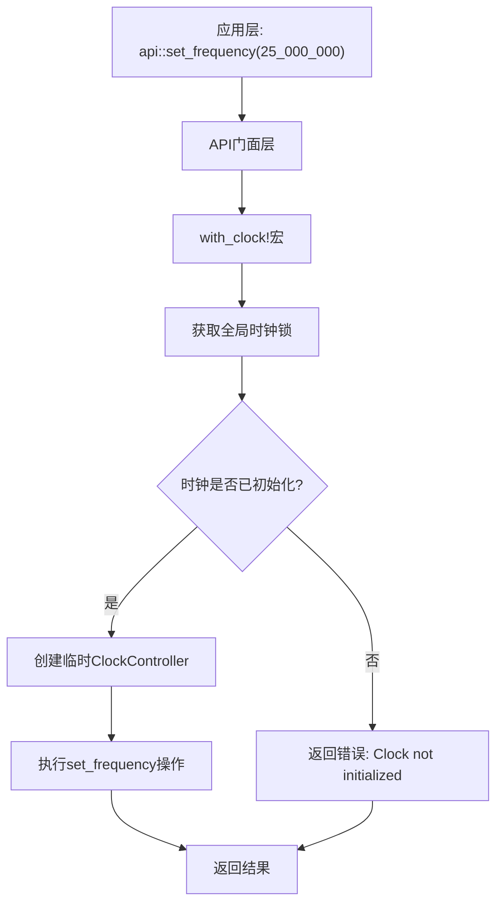
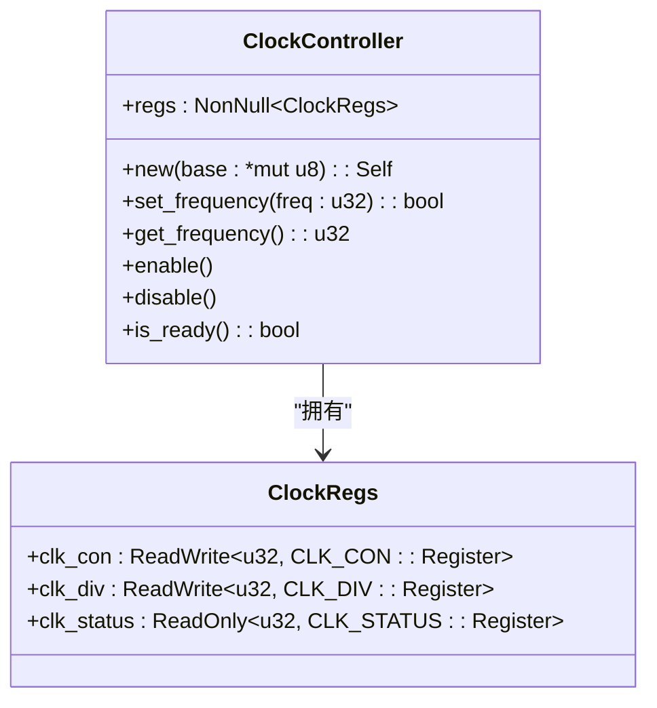
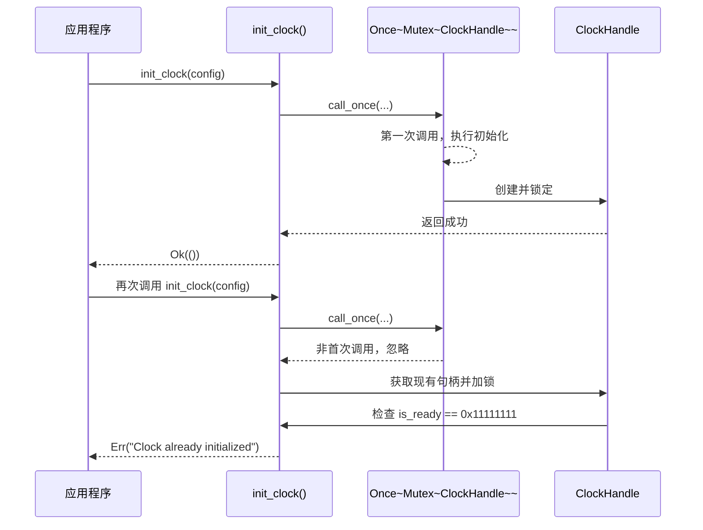

# 设计模式应用

<cite>
**Referenced Files in This Document **   
- [lib.rs](file://src/lib.rs)
- [Cargo.toml](file://Cargo.toml)
- [README.md](file://README.md)
- [basic_usage.rs](file://examples/basic_usage.rs)
</cite>

## 目录
1. [门面模式在API模块中的应用](#门面模式在api模块中的应用)
2. [RAII原则与ClockController资源管理](#raii原则与clockcontroller资源管理)
3. [单例模式的实现与硬件冲突防护](#单例模式的实现与硬件冲突防护)
4. [静态全局实例的设计考量](#静态全局实例的设计考量)

## 门面模式在API模块中的应用

`api` 模块通过提供一组简洁的函数接口，对底层复杂的时钟控制器操作进行了封装。该模块隐藏了直接操作 `ClockController` 所需的初始化检查、锁获取和错误处理等细节，为上层应用提供了统一且易于使用的接口。

这种设计模式显著降低了使用复杂性的认知负担。用户无需了解 `GLOBAL_CLOCK` 的存在或 `with_clock!` 宏的内部机制，即可安全地调用 `api::set_frequency()` 或 `api::get_frequency()` 等函数。这不仅提高了代码的可读性，也减少了因误用底层API而导致的潜在错误。

**Diagram sources**
- [lib.rs](file://src/lib.rs#L213-L274)

**Section sources**
- [lib.rs](file://src/lib.rs#L213-L274)
- [README.md](file://README.md#L68-L73)

## RAII原则与ClockController资源管理

`ClockController` 结构体严格遵循了RAII（Resource Acquisition Is Initialization）原则。其构造函数 `new` 接收一个指向硬件寄存器基地址的裸指针，并将其包装在 `NonNull` 中，这标志着对特定内存区域（即硬件寄存器）所有权的获取。

在整个 `ClockController` 实例的生命周期内，它都持有对该寄存器区域的引用。所有对硬件的操作（如 `set_frequency`, `enable`, `disable`）都是通过这个受控的引用来完成的。当 `ClockController` 实例离开作用域被销毁时，其持有的 `NonNull<ClockRegs>` 也会随之释放，从而确保了资源的自动清理。

这种设计将资源管理的责任与对象的生命周期绑定在一起，避免了手动释放资源可能带来的悬空指针或内存泄漏问题，在嵌入式系统中尤为重要。

**Diagram sources**
- [lib.rs](file://src/lib.rs#L55-L105)

**Section sources**
- [lib.rs](file://src/lib.rs#L55-L105)

## 单例模式的实现与硬件冲突防护

系统通过 `static GLOBAL_CLOCK: Once<Mutex<ClockHandle>> = Once::new();` 实现了严格的单例模式。`Once<T>` 类型保证了其中的值只会被初始化一次，后续的 `call_once` 调用将被忽略。

在 `init_clock` 函数中，`GLOBAL_CLOCK.call_once(|| Mutex::new(ClockHandle::new()));` 这一行代码是防止重复初始化的关键。无论 `init_clock` 被调用多少次，`Mutex<ClockHandle>` 只会被创建一次。此外，`ClockHandle` 内部还包含一个 `is_ready` 标志位（设置为魔术数 `0x11111111u32`），在 `init_clock` 函数中会进行二次检查，进一步确保了硬件不会被意外地重新配置。

这种双重保护机制（`Once` 和状态标志）极大地增强了系统的可靠性。在多核或中断环境中，它可以有效防止多个线程或任务同时尝试初始化同一个硬件外设，从而避免了可能导致系统崩溃的硬件冲突。

**Diagram sources**
- [lib.rs](file://src/lib.rs#L167-L211)

**Section sources**
- [lib.rs](file://src/lib.rs#L167-L211)
- [basic_usage.rs](file://examples/basic_usage.rs#L9-L11)

## 静态全局实例的设计考量

项目未采用依赖注入（DI），而是选择了静态全局实例（`static GLOBAL_CLOCK`），这一决策在嵌入式场景下具有充分的合理性：

1.  **资源受限环境**: 嵌入式系统通常内存有限，依赖注入框架会引入额外的运行时开销和代码体积，而静态实例在编译期就已确定，零运行时成本。
2.  **确定性行为**: 全局实例的生命周期与程序相同，其初始化和销毁时间点明确，符合嵌入式系统对确定性和可预测性的要求。DI 的动态性在此场景下反而是一种不必要的复杂性。
3.  **硬件抽象需求**: 时钟控制器这类硬件资源本质上是全局唯一的。使用单个全局实例来代表这个物理实体，比通过 DI 在各处传递实例引用更加直观和自然。
4.  **简化启动流程**: 在系统启动初期，许多组件尚未初始化，构建一个完整的 DI 容器本身就是一个挑战。静态实例可以独立于其他服务进行初始化，简化了启动序列。
5.  **性能优先**: 访问静态全局变量是最快的内存访问方式之一，对于需要频繁调用的驱动API来说，这是关键优势。

综上所述，虽然依赖注入在大型应用中能提高可测试性和解耦，但在本项目的嵌入式驱动上下文中，静态全局实例结合 `Once` 和 `Mutex` 提供了一种更轻量、更可靠且性能更优的解决方案。