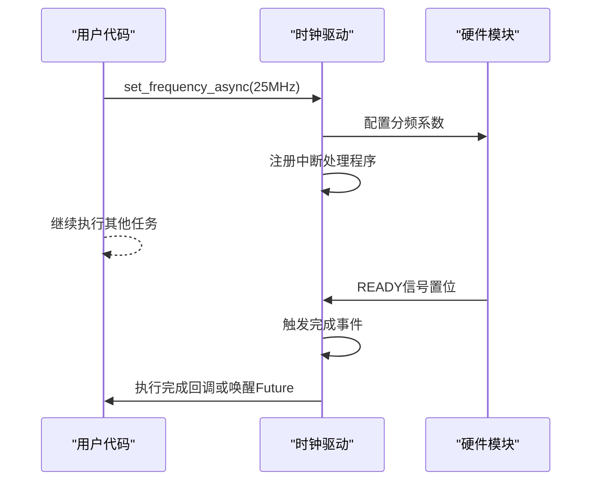

# 超时重试机制

<cite>
**Referenced Files in This Document **  
- [lib.rs](file://src/lib.rs)
</cite>

## 目录
1. [超时等待逻辑实现](#超时等待逻辑实现)
2. [响应速度与CPU占用率的平衡分析](#响应速度与cpu占用率的平衡分析)
3. [硬编码延时的可移植性缺陷](#硬编码延时的可移植性缺陷)
4. [改进建议：回调与异步通知机制](#改进建议回调与异步通知机制)
5. [失败返回值语义清晰度评估](#失败返回值语义清晰度评估)
6. [对上层错误处理的影响](#对上层错误处理的影响)

## 超时等待逻辑实现

`set_frequency()`函数在设置分频系数后，通过轮询`clk_status.READY`信号来确认硬件是否完成配置。该机制采用固定次数（500次）循环配合`core::hint::spin_loop()`进行非阻塞轮询。


**Diagram sources**
- [lib.rs](file://src/lib.rs#L85-L103)

**Section sources**
- [lib.rs](file://src/lib.rs#L85-L103)

## 响应速度与CPU占用率的平衡分析

当前实现通过内层1000次`spin_loop()`调用构成基本延时单元，外层最多执行500次循环，形成有限的等待窗口。

这种设计在一定程度上平衡了响应速度与CPU资源消耗：
- **响应速度**：最短等待时间约为一次`spin_loop()`周期，能够快速响应硬件就绪信号
- **CPU占用率**：由于使用忙等待（busy-waiting），在等待期间CPU利用率接近100%，但总等待时间受限于500次循环上限

该机制确保了操作不会无限期阻塞，同时避免了操作系统级睡眠可能带来的调度开销，在嵌入式实时场景中有其合理性。

**Section sources**
- [lib.rs](file://src/lib.rs#L93-L98)

## 硬编码延时的可移植性缺陷

当前实现存在显著的可移植性问题：

1. **平台依赖性强**：`for _ in 0..1000 { core::hint::spin_loop(); }`的延时效果高度依赖于目标平台的CPU频率和编译器优化策略
2. **缺乏精确计时**：未使用平台特定的高精度定时器或纳秒级延时函数，导致实际等待时间不确定
3. **固定阈值不合理**：500次循环的超时限制未考虑不同硬件环境下时钟稳定所需的真实时间差异

这些硬编码参数使得驱动在不同Phytium Pi变体或其他RISC-V平台上可能表现不一致，甚至导致误判。

**Section sources**
- [lib.rs](file://src/lib.rs#L93-L98)

## 改进建议：回调与异步通知机制

为提升代码质量和可维护性，建议重构超时等待逻辑：

### 方案一：引入回调函数
```rust
pub fn set_frequency_with_callback<F>(&mut self, freq: u32, callback: F) -> Result<(), &'static str>
where
    F: FnMut(&ClockController),
{
    // ... 配置寄存器 ...
    
    // 注册回调而非轮询
    register_ready_callback(callback);
    Ok(())
}
```

### 方案二：异步通知机制


**Diagram sources**
- [lib.rs](file://src/lib.rs#L85-L103)

**Section sources**
- [lib.rs](file://src/lib.rs#L85-L103)

## 失败返回值语义清晰度评估

`set_frequency()`函数返回`bool`类型表示成败，存在语义模糊问题：

- `false`可能由多种原因导致：无效参数、分频超出范围、超时未就绪等
- 上层无法区分是配置错误还是硬件响应超时
- 缺乏详细的错误分类，不利于精准诊断

建议采用枚举型错误码或`Result<bool, ClockError>`类型明确区分故障模式。

**Section sources**
- [lib.rs](file://src/lib.rs#L85-L103)

## 对上层错误处理的影响

当前的布尔返回值设计对上层错误处理造成以下影响：

1. **诊断困难**：应用层难以判断失败根本原因，无法采取针对性恢复措施
2. **重试策略受限**：无法根据错误类型决定是否重试或如何调整重试参数
3. **日志记录不充分**：只能记录"设置失败"而无法提供具体原因

改进后的错误处理应提供结构化错误信息，支持：
- 错误分类（参数错误、超时、硬件故障等）
- 上下文信息（目标频率、实际分频值等）
- 可恢复性指示

**Section sources**
- [lib.rs](file://src/lib.rs#L85-L103)