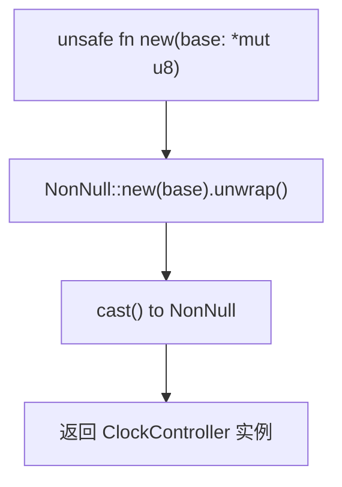
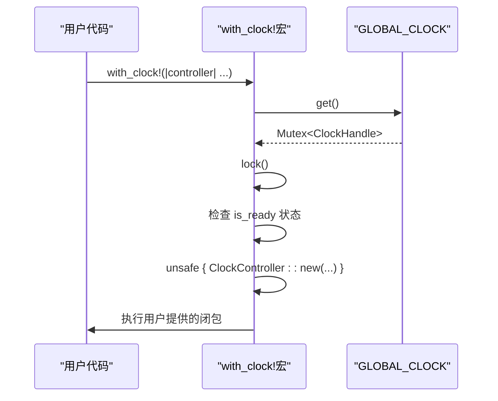
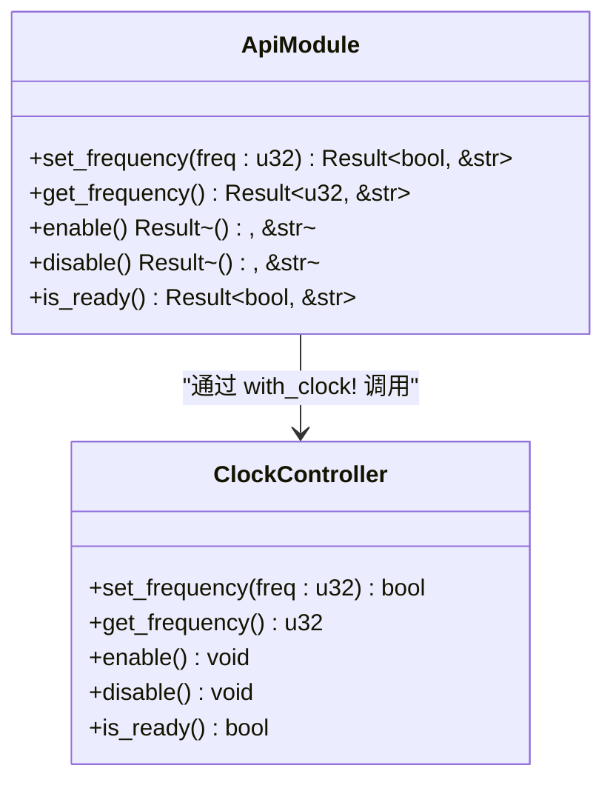

# 不安全代码边界

<cite>
**Referenced Files in This Document**   
- [lib.rs](file://src/lib.rs)
- [Cargo.toml](file://Cargo.toml)
- [README.md](file://README.md)
</cite>

## 目录
1. [引言](#引言)
2. [不安全代码使用分析](#不安全代码使用分析)
3. [安全假设与调用者责任](#安全假设与调用者责任)
4. [初始化流程的重要性](#初始化流程的重要性)
5. [安全接口设计](#安全接口设计)
6. [结论](#结论)

## 引言

本文档旨在阐明飞腾派时钟驱动中`unsafe`代码的使用边界及其安全假设。该驱动通过精心设计的封装，将底层硬件操作的危险性隔离在内部，为上层应用提供完全安全的API接口。核心的不安全操作主要集中在`ClockController::new(base: *mut u8)`构造函数和`with_clock!`宏中对它的调用。

## 不安全代码使用分析

驱动中的不安全代码主要出现在以下几个关键位置：

### `ClockController::new` 构造函数

`ClockController::new`是创建时钟控制器实例的核心方法，它接受一个指向硬件寄存器基地址的裸指针（`*mut u8`）。此方法被标记为`unsafe`，因为它直接操作原始内存指针。



**Diagram sources**
- [lib.rs](file://src/lib.rs#L50-L57)

### `with_clock!` 宏中的 `unsafe` 调用

`with_clock!`宏是访问全局时钟实例的主要方式。在宏展开后，它会在确保时钟已正确初始化的前提下，执行一次`unsafe { ClockController::new(...) }`调用。



**Diagram sources**
- [lib.rs](file://src/lib.rs#L223-L225)

### 内部寄存器访问

`ClockController`内部通过`regs()`和`regs_mut()`方法获取寄存器引用，这两个方法也包含`unsafe`块，用于将`NonNull`指针转换为有效的引用。

**Section sources**
- [lib.rs](file://src/lib.rs#L59-L67)

## 安全假设与调用者责任

`unsafe`代码的安全性依赖于明确的安全假设和调用者的严格遵守。

### 传入正确的物理地址

`ClockController::new`方法要求调用者必须保证传入的基地址（如`0x2800_0000`）正确映射到物理硬件寄存器空间。这意味着：
- 地址必须是平台文档中指定的有效时钟控制器寄存器地址。
- 该内存区域必须已被操作系统或固件配置为可读写，并且不会与其他设备发生冲突。

### 内存区域的可读写性

调用者必须确保传入的指针所指向的内存区域是可读写的。如果尝试访问只读或未映射的内存，将导致系统异常或未定义行为。

### 避免数据竞争

虽然`ClockController`本身实现了`Send`和`Sync`，但直接创建多个实例并同时操作同一组寄存器可能导致数据竞争。因此，应通过`init_clock`和`with_clock!`等机制来管理单个全局实例。

**Section sources**
- [lib.rs](file://src/lib.rs#L50-L57)
- [README.md](file://README.md#L75-L80)

## 初始化流程的重要性

驱动强制要求通过`init_clock`流程来初始化时钟控制器，这是保障安全的关键环节。

### `init_clock` 函数的作用

`init_clock`函数负责初始化全局的`GLOBAL_CLOCK`静态变量。它接收一个`ClockConfig`，其中包含了正确的基地址信息，并将其存储在`ClockHandle`中。

```mermaid
flowchart TD
Start([init_clock(config)]) --> CheckOnce["call_once(|| Mutex::new())"]
CheckOnce --> GetLock["get().unwrap().lock()"]
GetLock --> CheckReady["检查 is_ready 状态"]
CheckReady --> |已初始化| ReturnErr["返回错误"]
CheckReady --> |未初始化| StoreConfig["存储 config 和 is_ready 标志"]
StoreConfig --> LogSuccess["记录成功日志"]
LogSuccess --> End([返回 Ok(())])
```

**Diagram sources**
- [lib.rs](file://src/lib.rs#L170-L185)

### 禁止绕过初始化

警告：用户不得绕过`init_clock`流程直接创建`ClockController`实例。这样做会破坏驱动的设计契约，因为：
1. **缺乏验证**：`init_clock`提供了必要的状态检查，防止重复初始化。
2. **配置集中管理**：所有配置都通过`lookup_config`等函数统一管理，避免硬编码错误地址。
3. **生命周期控制**：全局实例由`Once`和`Mutex`管理，确保了线程安全和单一实例。

**Section sources**
- [lib.rs](file://src/lib.rs#L170-L185)
- [README.md](file://README.md#L65-L70)

## 安全接口设计

尽管底层存在`unsafe`代码，但驱动为上层应用提供了完全安全的接口。

### 封装与隔离

所有危险的硬件操作都被封装在`ClockController`内部。一旦实例通过`with_clock!`宏安全地创建，用户就可以通过一系列`safe`的公共方法（如`set_frequency`、`enable`等）来操作时钟，而无需关心底层细节。

### 提供便捷的 API 模块

`api`模块导出了所有常用功能，这些函数都基于`with_clock!`宏实现，自动处理了实例获取和安全性检查，使得上层调用变得简单且安全。



**Diagram sources**
- [lib.rs](file://src/lib.rs#L230-L255)

### 错误处理

安全接口通过`Result`类型返回错误，而不是让程序崩溃。例如，`init_clock`会检查是否已初始化，`api`函数会检查时钟是否处于就绪状态。

**Section sources**
- [lib.rs](file://src/lib.rs#L230-L255)

## 结论

本驱动中的`unsafe`代码使用是必要且受控的。其安全模型建立在以下原则之上：
1. **明确的责任划分**：`unsafe`的使用边界清晰，责任在于调用者提供正确的物理地址。
2. **强制的初始化流程**：通过`init_clock`和全局状态管理，确保了硬件资源的正确配置和唯一访问。
3. **全面的封装**：所有危险操作被隔离在内部，对外暴露的是经过充分验证的`safe` API。

开发者在使用此驱动时，应始终遵循推荐的初始化流程，利用`api`模块进行操作，从而在享受高性能硬件控制的同时，保持Rust语言的安全性优势。