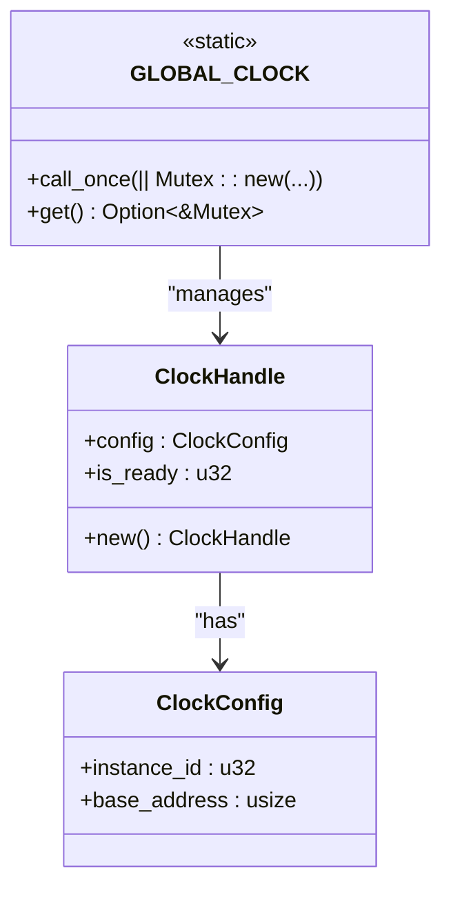
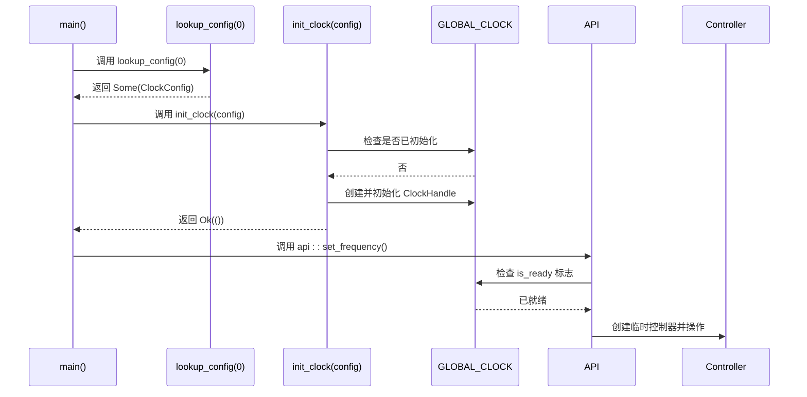

# 初始化顺序

<cite>
**Referenced Files in This Document **   
- [lib.rs](file://src/lib.rs)
- [basic_usage.rs](file://examples/basic_usage.rs)
</cite>

## 目录
1. [引言](#引言)
2. [核心初始化流程](#核心初始化流程)
3. [配置查找机制](#配置查找机制)
4. [全局实例管理](#全局实例管理)
5. [标准使用模式](#标准使用模式)
6. [错误处理与预防](#错误处理与预防)
7. [系统集成建议](#系统集成建议)

## 引言
本文档详细说明飞腾派（Phytium Pi）平台时钟驱动的正确初始化流程。重点阐述了`lookup_config`和`init_clock`两个核心函数的调用顺序、依赖关系以及潜在的错误情况。通过分析源码和示例，为开发者提供清晰、安全的初始化指导。

## 核心初始化流程

时钟驱动的正确初始化必须遵循严格的两步顺序：

1.  **配置查找**：首先调用 `lookup_config(instance_id)` 函数。
2.  **实例初始化**：将上一步返回的有效 `ClockConfig` 结构体传递给 `init_clock(config)` 函数进行全局初始化。

这个顺序是强制性的，因为 `init_clock` 函数本身不包含任何硬件特定的配置信息（如寄存器基地址），它完全依赖于外部传入的 `ClockConfig`。跳过 `lookup_config` 步骤将导致无法获取正确的硬件配置，从而使初始化失败或行为异常。

**Section sources**
- [lib.rs](file://src/lib.rs#L200-L218)
- [lib.rs](file://src/lib.rs#L221-L239)

## 配置查找机制

`lookup_config` 函数负责根据提供的 `instance_id` 查询并返回对应的 `ClockConfig`。

```mermaid
flowchart TD
A["lookup_config(instance_id)"] --> B{"instance_id >= 1?"}
B --> |是| C[返回 None]
B --> |否| D[构造 ClockConfig]
D --> E[设置 instance_id]
D --> F[设置 base_address = 0x2800_0000]
E --> G[返回 Some(ClockConfig)]
F --> G
```

**Diagram sources **
- [lib.rs](file://src/lib.rs#L221-L239)

目前，该驱动仅支持 `instance_id` 为 0 的单个时钟实例。如果传入的 `instance_id` 大于等于 1，函数将返回 `None`，表示配置查找失败。这限制了驱动在多实例场景下的应用，但确保了在当前硬件平台上的简单性和安全性。

**Section sources**
- [lib.rs](file://src/lib.rs#L221-L239)

## 全局实例管理

驱动使用 `spin::Once<Mutex<ClockHandle>>` 来管理全局唯一的时钟句柄实例。`ClockHandle` 结构体不仅包含从 `lookup_config` 获取的 `config`，还包含一个 `is_ready` 标志位，用于跟踪初始化状态。



**Diagram sources **
- [lib.rs](file://src/lib.rs#L150-L165)
- [lib.rs](file://src/lib.rs#L168-L180)

`GLOBAL_CLOCK` 是整个驱动的核心。`init_clock` 函数通过 `call_once` 确保全局句柄只被创建一次，并通过检查 `is_ready` 标志来防止重复初始化。

**Section sources**
- [lib.rs](file://src/lib.rs#L168-L180)
- [lib.rs](file://src/lib.rs#L200-L218)

## 标准使用模式

`basic_usage.rs` 示例代码展示了推荐的标准初始化模式。此模式应在系统启动早期执行，在任何其他模块尝试使用时钟 API 之前完成。



**Diagram sources **
- [basic_usage.rs](file://examples/basic_usage.rs#L10-L13)
- [lib.rs](file://src/lib.rs#L200-L218)
- [lib.rs](file://src/lib.rs#L242-L280)

该序列图清晰地描绘了从主函数开始，到成功初始化并使用时钟服务的完整流程。关键点在于 `init_clock` 成功后，后续所有 API 调用（如 `api::set_frequency`）都能通过 `with_clock!` 宏安全地访问已初始化的全局状态。

**Section sources**
- [basic_usage.rs](file://examples/basic_usage.rs#L10-L13)

## 错误处理与预防

驱动中定义了两种主要的初始化错误，开发者必须了解其成因以避免：

1.  **配置查找失败**：当调用 `lookup_config` 时传入无效的 `instance_id`（例如 `1` 或更大值），函数返回 `None`。如果未对此结果进行 `expect` 或 `unwrap` 处理，程序会在此处崩溃。
2.  **重复初始化错误**：这是由 `init_clock` 函数主动抛出的错误。当 `GLOBAL_CLOCK` 已经被创建，并且其内部 `ClockHandle` 的 `is_ready` 标志已被设置为 `0x11111111u32` 时，再次调用 `init_clock` 将直接返回 `Err("Clock already initialized")`。

```mermaid
flowchart LR
A["init_clock(config)"] --> B{"is_ready == 0x11111111?"}
B --> |是| C[返回 Err("Clock already initialized")]
B --> |否| D[设置 config 和 is_ready]
D --> E[返回 Ok(())]
```

**Diagram sources **
- [lib.rs](file://src/lib.rs#L205-L215)

这种设计有效地防止了对硬件寄存器的意外重写，保护了系统的稳定性。

**Section sources**
- [lib.rs](file://src/lib.rs#L205-L215)

## 系统集成建议

为了确保系统的可靠运行，强烈建议将时钟驱动的初始化过程放在系统启动流程的极早期阶段。最佳实践是在 `main` 函数的最开始部分，甚至在日志系统完全初始化之前就完成此项工作。

*   **单一入口**：确保整个系统只有一个地方调用 `init_clock`。
*   **错误传播**：在初始化阶段，应使用 `expect` 或 `unwrap` 使配置错误立即暴露，而不是静默失败。
*   **ID 范围**：严格遵守 `instance_id` 只能为 `0` 的约定，避免未来兼容性问题。

遵循这些指南可以最大限度地减少因时钟初始化不当而导致的系统级故障。