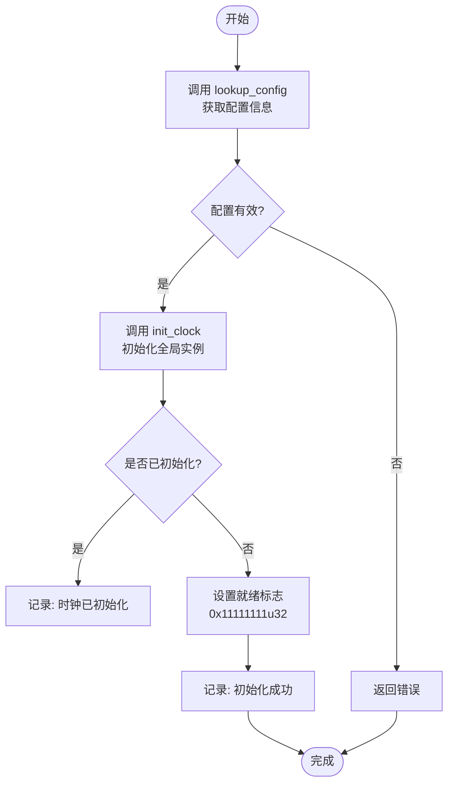
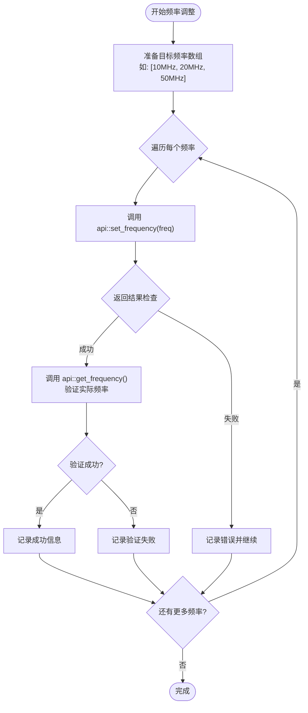
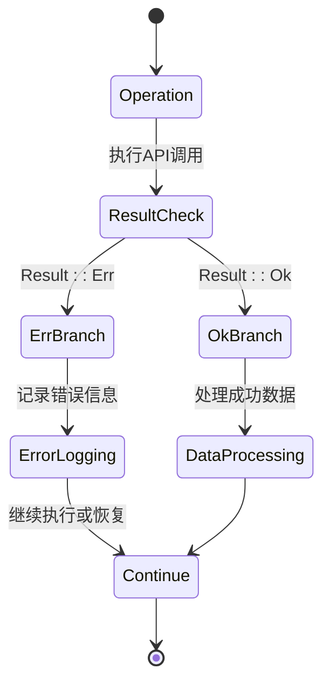
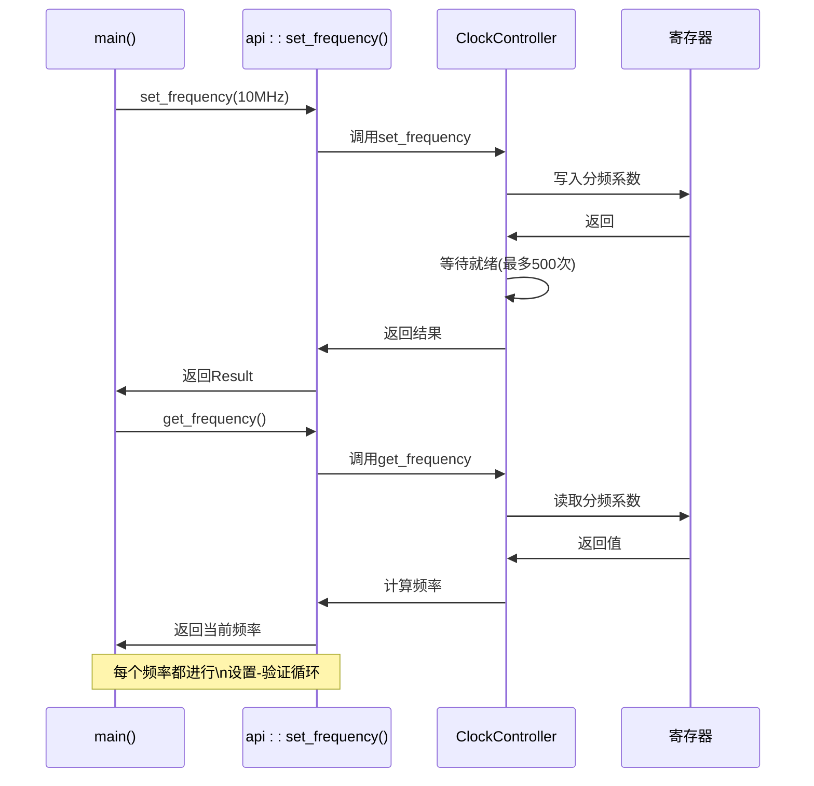

<cite>
**本文档中引用的文件**
- [lib.rs](file://src/lib.rs)
- [basic_usage.rs](file://examples/basic_usage.rs)
</cite>

## 目录
1. [引言](#引言)
2. [初始化顺序的重要性](#初始化顺序的重要性)
3. [频率设置策略](#频率设置策略)
4. [错误处理模式](#错误处理模式)
5. [日志调试技巧](#日志调试技巧)
6. [多线程安全注意事项](#多线程安全注意事项)
7. [unsafe代码边界](#unsafe代码边界)
8. [循环测试案例分析](#循环测试案例分析)
9. [总结](#总结)

## 引言

本指南旨在为飞腾派时钟驱动的开发者提供一套完整的最佳实践方案。通过深入分析驱动的核心机制和实际使用场景，本文将帮助开发者避免常见陷阱，优化系统性能，并确保代码的稳定性和安全性。内容涵盖从初始化到日常操作的各个方面，特别强调了正确使用API的关键要点。

## 初始化顺序的重要性

在使用本驱动时，正确的初始化顺序至关重要。必须首先调用`lookup_config`函数获取有效的时钟配置，然后才能执行`init_clock`进行实际初始化。



**Diagram sources**
- [lib.rs](file://src/lib.rs#L245-L260)
- [lib.rs](file://src/lib.rs#L263-L274)

**Section sources**
- [lib.rs](file://src/lib.rs#L245-L274)
- [basic_usage.rs](file://examples/basic_usage.rs#L13-L15)

此顺序确保了硬件基地址和实例ID等关键参数被正确设置。如果跳过`lookup_config`直接调用`init_clock`，可能导致使用无效或错误的基地址，从而引发硬件访问异常。

## 频率设置策略

推荐的频率设置策略应避免频繁切换频率，以防止系统不稳定。建议采用批量调整和状态验证相结合的方法。

### 推荐的频率调整流程



**Diagram sources**
- [lib.rs](file://src/lib.rs#L105-L135)
- [basic_usage.rs](file://examples/basic_usage.rs#L37-L54)

**Section sources**
- [lib.rs](file://src/lib.rs#L105-L135)
- [basic_usage.rs](file://examples/basic_usage.rs#L37-L54)

避免在短时间内连续调用`set_frequency`，因为每次频率切换都需要等待硬件稳定（最多500个超时周期）。频繁切换可能导致时钟信号抖动，影响依赖该时钟的外设正常工作。

## 错误处理模式

必须始终检查`Result`返回值，而不是直接使用`unwrap`。这能有效防止程序因未处理的错误而崩溃。

### 正确的错误处理模式



**Diagram sources**
- [lib.rs](file://src/lib.rs#L200-L215)
- [basic_usage.rs](file://examples/basic_usage.rs#L17-L32)

**Section sources**
- [lib.rs](file://src/lib.rs#L200-L215)
- [basic_usage.rs](file://examples/basic_usage.rs#L17-L32)

所有API函数都返回`Result<T, &str>`类型，其中包含详细的错误信息。例如，`init_clock`会在时钟已初始化时返回明确的错误消息"Clock already initialized"，而不是让程序panic。

## 日志调试技巧

充分利用`log`设施可以有效跟踪初始化和操作流程，快速定位问题。

### 关键日志点分布

```mermaid
erDiagram
LOG_POINT {
string level PK
string message UK
string condition UK
string file FK
}
LOG_POINT ||--o{ INIT : "初始化"
LOG_POINT ||--o{ OPERATION : "操作"
class INIT {
info: "Clock controller initialized successfully"
error: "Failed to initialize clock"
}
class OPERATION {
info: "Frequency set successfully"
warn: "Clock is not ready"
error: "Failed to set frequency"
}
```

**Diagram sources**
- [lib.rs](file://src/lib.rs#L184-L191)
- [basic_usage.rs](file://examples/basic_usage.rs#L17-L56)

**Section sources**
- [lib.rs](file://src/lib.rs#L184-L191)
- [basic_usage.rs](file://examples/basic_usage.rs#L17-L56)

在调试时，建议启用`info`级别以上的日志输出。关键日志包括：
- `Clock controller initialized successfully`: 表明初始化成功
- `Clock already initialized`: 提示重复初始化尝试
- 各种操作的成功/失败状态信息

## 多线程环境中使用API的安全注意事项

驱动通过`Once<Mutex<ClockHandle>>`实现了线程安全的全局时钟管理。

```mermaid
classDiagram
class Once~T~ {
+call_once(init_fn) : T
-initialized : bool
-value : Option<T>
}
class Mutex~T~ {
+lock() : Guard~T~
-locked : bool
-data : T
}
class ClockHandle {
+config : ClockConfig
+is_ready : u32
}
class GLOBAL_CLOCK {
-instance : Once~Mutex~ClockHandle~~
}
GLOBAL_CLOCK --> Once : "包含"
Once --> Mutex : "初始化为"
Mutex --> ClockHandle : "保护"
note right of GLOBAL_CLOCK
全局静态实例
确保单次初始化
end note
note right of Mutex
提供互斥访问
线程安全
end note
```

**Diagram sources**
- [lib.rs](file://src/lib.rs#L235-L243)
- [lib.rs](file://src/lib.rs#L217-L233)

**Section sources**
- [lib.rs](file://src/lib.rs#L217-L243)

`with_clock!`宏封装了安全的锁获取和释放过程，开发者无需手动管理锁。只要`GLOBAL_CLOCK`已被初始化，任何线程都可以安全地调用API函数。

## unsafe代码边界

驱动中的`unsafe`代码主要集中在`ClockController::new`和`with_clock!`宏中。


**Diagram sources**
- [lib.rs](file://src/lib.rs#L75-L80)
- [lib.rs](file://src/lib.rs#L10-L25)

**Section sources**
- [lib.rs](file://src/lib.rs#L75-L80)

用户不得随意更改基地址或绕过初始化流程。基地址由`lookup_config`函数固定为`0x2800_0000`，这是经过验证的硬件正确地址。直接创建`ClockController`实例需要`unsafe`块，提醒开发者注意风险。

## 循环测试案例分析

结合`basic_usage.rs`中的循环测试案例，展示了如何稳健地进行频率调整验证。



**Diagram sources**
- [basic_usage.rs](file://examples/basic_usage.rs#L37-L54)
- [lib.rs](file://src/lib.rs#L105-L135)

**Section sources**
- [basic_usage.rs](file://examples/basic_usage.rs#L37-L54)

该案例体现了最佳实践：对每个目标频率都进行设置后立即验证，确保实际频率符合预期。同时使用`match`表达式全面处理各种返回情况，保证了程序的健壮性。

## 总结

本最佳实践指南强调了使用飞腾派时钟驱动的关键要点。遵循正确的初始化顺序、合理的频率调整策略、完善的错误处理、充分的日志记录以及对`unsafe`边界的尊重，能够显著提升系统的稳定性和可维护性。通过学习和应用`basic_usage.rs`中的模式，开发者可以构建出更加可靠和高效的嵌入式应用程序。