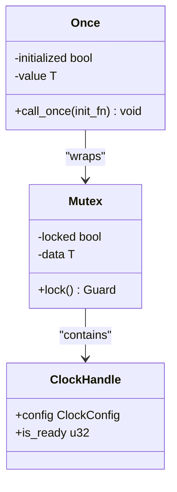
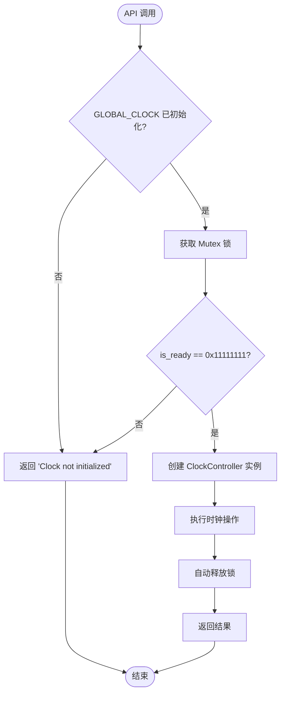

# 线程安全注意事项

<cite>
**Referenced Files in This Document**   
- [lib.rs](file://src/lib.rs)
- [Cargo.toml](file://Cargo.toml)
- [README.md](file://README.md)
</cite>

## 目录
1. [线程安全机制概述](#线程安全机制概述)
2. [全局时钟单例设计](#全局时钟单例设计)
3. [运行时互斥访问](#运行时互斥访问)
4. [API 宏的自动锁管理](#api-宏的自动锁管理)
5. [ClockController 的线程安全性](#clockcontroller-的线程安全性)
6. [性能影响与最佳实践](#性能影响与最佳实践)

## 线程安全机制概述

本驱动通过精心设计的并发控制机制确保在多线程环境下的安全性。核心策略结合了编译时和运行时的同步原语，防止数据竞争和不一致状态。系统采用分层保护：`Once`类型保证全局资源的单次初始化，`Mutex`提供运行时的互斥访问，而`with_clock!`宏则为所有公共API操作提供了统一的锁获取机制。

**Section sources**
- [lib.rs](file://src/lib.rs#L1-L275)

## 全局时钟单例设计

驱动的核心是`GLOBAL_CLOCK: Once<Mutex<ClockHandle>>`静态变量的设计。`Once`类型来自`spin`库，确保`call_once`中的初始化代码在整个程序生命周期中仅执行一次，即使在多个线程同时尝试初始化的情况下也能保证线程安全。这种设计避免了竞态条件，确保全局时钟句柄的创建是原子且唯一的。

**Diagram sources**
- [lib.rs](file://src/lib.rs#L180-L182)

**Section sources**
- [lib.rs](file://src/lib.rs#L180-L182)

## 运行时互斥访问

虽然`Once`确保了单例的正确初始化，但运行时对时钟资源的访问仍需保护。`Mutex`包装器提供了必要的运行时互斥机制。每次通过`GLOBAL_CLOCK.get().unwrap()`获取全局实例后，必须调用`.lock()`方法才能访问内部的`ClockHandle`。这会阻塞其他试图获取锁的线程，直到当前持有者释放锁，从而防止并发修改共享状态。

**Section sources**
- [lib.rs](file://src/lib.rs#L184-L199)

## API 宏的自动锁管理

为了简化并发编程并减少错误，驱动提供了`with_clock!`宏来自动化锁的获取和释放。所有`api`模块中的函数都通过此宏执行操作，确保在执行任何硬件操作前已正确获取锁。该宏还包含双重检查逻辑：首先验证`GLOBAL_CLOCK`是否已初始化，然后检查`ClockHandle`的`is_ready`标志，只有在完全初始化状态下才允许操作。

**Diagram sources**
- [lib.rs](file://src/lib.rs#L220-L240)

**Section sources**
- [lib.rs](file://src/lib.rs#L220-L240)

## ClockController 的线程安全性

`ClockController`结构体被标记为`unsafe impl Send + Sync`，表明它可以在不同线程间安全地转移所有权（Send）和共享引用（Sync）。然而，这种实现的安全性依赖于外部的同步机制。用户不应直接创建跨线程共享的`ClockController`实例，因为其内部状态（寄存器指针）的并发访问可能导致未定义行为。正确的做法是始终通过`api`模块的函数进行操作，这些函数由`with_clock!`宏提供的锁保护。

**Section sources**
- [lib.rs](file://src/lib.rs#L43-L44)

## 性能影响与最佳实践

尽管当前的线程安全设计确保了正确性，但在实时或多核场景中可能存在性能瓶颈。长时间持有锁会阻塞其他线程的时钟操作，影响系统响应性。建议的最佳实践包括：
- 尽量减少在临界区内执行复杂或耗时的计算
- 避免在中断上下文中长时间持有锁
- 批量执行相关操作以减少锁获取/释放的开销
- 在非关键路径上使用缓存值而非频繁查询硬件状态

**Section sources**
- [lib.rs](file://src/lib.rs#L180-L240)