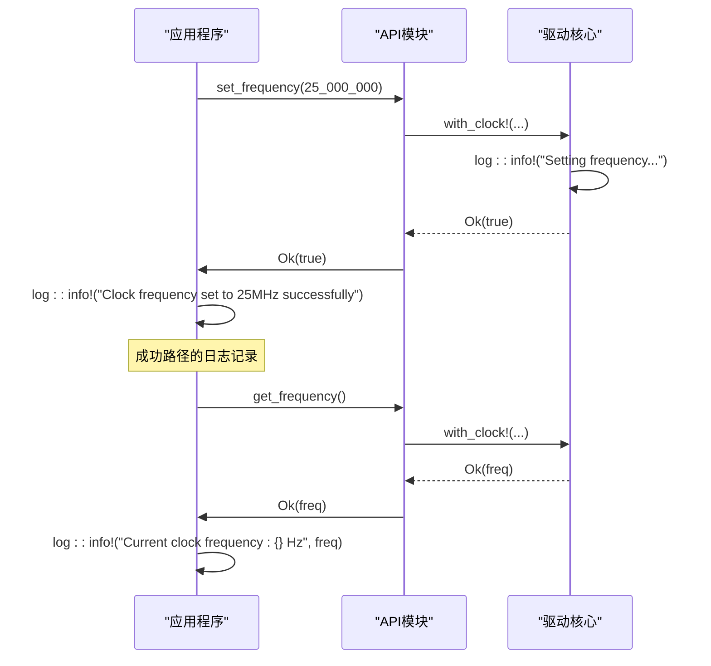

# 调试与日志记录

<cite>
**Referenced Files in This Document **  
- [lib.rs](file://src/lib.rs)
- [basic_usage.rs](file://examples/basic_usage.rs)
- [Cargo.toml](file://Cargo.toml)
</cite>

## 目录
1. [引言](#引言)
2. [核心日志策略](#核心日志策略)
3. [关键操作点日志输出](#关键操作点日志输出)
4. [状态查询与调用频率设置的日志建议](#状态查询与调用频率设置的日志建议)
5. [参考示例分析](#参考示例分析)
6. [日志级别配置建议](#日志级别配置建议)
7. [外部环境配置提醒](#外部环境配置提醒)

## 引言
本文档旨在为`phytium-pi-clock`驱动的开发者提供一套有效的调试方法，重点介绍如何利用`log` crate进行日志记录。通过在关键代码路径中添加适当的日志语句，可以显著提升驱动的可观察性和调试效率。

## 核心日志策略
本驱动采用`log` crate作为日志基础设施，支持多种日志级别（如`info!`, `warn!`, `error!`等），允许开发者根据需要选择合适的日志详细程度。日志系统的设计遵循`no_std`环境的要求，确保在资源受限的嵌入式平台上也能正常工作。

**Section sources**
- [lib.rs](file://src/lib.rs#L1-L275)
- [Cargo.toml](file://Cargo.toml#L1-L41)

## 关键操作点日志输出
在驱动的核心初始化函数`init_clock()`中，已实现明确的日志反馈机制：

- 当时钟控制器成功初始化时，会输出日志信息：`Clock controller initialized successfully`
- 如果尝试重复初始化时钟，系统将提示：`Clock already initialized`

这种设计有助于开发者快速确认驱动的初始化状态，避免因重复初始化导致的潜在问题。

```mermaid
flowchart TD
A["init_clock() 调用"] --> B{"时钟是否已初始化?"}
B --> |是| C["log::info!(\"Clock already initialized.\")"]
B --> |否| D["执行初始化逻辑"]
D --> E["设置配置参数"]
E --> F["标记为已初始化"]
F --> G["log::info!(\"Clock controller initialized successfully\")"]
G --> H["返回 Ok(())"]
```

**Diagram sources **
- [lib.rs](file://src/lib.rs#L180-L195)

**Section sources**
- [lib.rs](file://src/lib.rs#L180-L195)

## 状态查询与调用频率设置的日志建议
为了有效追踪执行流，建议在以下关键操作前后添加日志记录：

### 调用频率设置
在调用`api::set_frequency()`或直接使用`ClockController::set_frequency()`之前和之后，应添加`log::info!`日志，以记录目标频率和实际结果。

### 状态查询
在调用`api::is_ready()`、`api::get_frequency()`等状态查询函数前后，建议使用`log::info!`或`log::warn!`来记录查询意图和结果，特别是在处理异常情况时。

这些日志点可以帮助开发者理解驱动的行为模式，快速定位性能瓶颈或逻辑错误。

**Section sources**
- [lib.rs](file://src/lib.rs#L100-L150)
- [lib.rs](file://src/lib.rs#L250-L275)

## 参考示例分析
`examples/basic_usage.rs`文件提供了完整的日志记录实践范例。该示例展示了如何在各种操作中集成日志记录：

- 频率设置成功时使用`log::info!`
- 操作失败时使用`log::error!`
- 状态检查时使用`log::info!`和`log::warn!`
- 循环操作中使用`log::info!`标记进度

这些实践表明，合理的日志级别选择对于区分正常流程和异常情况至关重要。



**Diagram sources **
- [basic_usage.rs](file://examples/basic_usage.rs#L15-L60)

**Section sources**
- [basic_usage.rs](file://examples/basic_usage.rs#L1-L65)

## 日志级别配置建议
建议开发者在集成此驱动时，根据调试阶段启用合适的日志级别：

- **开发调试阶段**：启用`Info`级别，获取详细的执行流程信息
- **生产环境**：可降低至`Error`或`Warn`级别，减少日志开销
- **深度问题排查**：可临时启用`Debug`级别（如果驱动支持）

通过动态调整日志级别，可以在调试信息丰富度和系统性能之间取得平衡。

**Section sources**
- [Cargo.toml](file://Cargo.toml#L20-L25)
- [lib.rs](file://src/lib.rs#L1-L275)

## 外部环境配置提醒
必须确保外部环境已正确配置日志后端（如`env_logger`、`slog`等），否则所有`log`宏产生的信息将被静默丢弃。在`no_std`环境中，这通常需要平台特定的日志适配器。

**Section sources**
- [Cargo.toml](file://Cargo.toml#L20-L25)