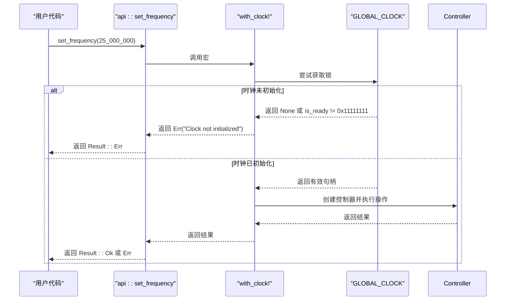

# 错误处理模式

<cite>
**Referenced Files in This Document**   
- [lib.rs](file://src/lib.rs)
- [basic_usage.rs](file://examples/basic_usage.rs)
</cite>

## 目录
1. [引言](#引言)
2. [核心错误类型与返回值](#核心错误类型与返回值)
3. [关键API的错误行为分析](#关键api的错误行为分析)
4. [正确错误处理实践](#正确错误处理实践)
5. [生产环境中的错误传播策略](#生产环境中的错误传播策略)

## 引言

本驱动程序严格遵循Rust的`Result<T, E>`错误处理范式，旨在通过显式的错误匹配（match）而非潜在危险的`unwrap()`调用，来构建健壮且可预测的嵌入式系统。直接解包结果可能导致未处理的panic，这在资源受限或高可靠性要求的环境中是不可接受的。本文档将详细阐述驱动中各类错误的来源，并提供基于`basic_usage.rs`示例的最佳实践指导。

## 核心错误类型与返回值

驱动中的所有公共API函数均返回`Result<T, &'static str>`类型，其中`T`为操作成功时的返回值，而`&'static str`则作为简洁明了的错误消息。这种设计避免了复杂的错误枚举，同时提供了足够的上下文信息用于调试和日志记录。

**Section sources**
- [lib.rs](file://src/lib.rs#L177-L270)

## 关键API的错误行为分析

### `init_clock` 函数的重复初始化保护

`init_clock`函数负责全局时钟实例的初始化。它采用单次初始化模式（Once），并检查内部状态标志以防止重复初始化。如果尝试对已初始化的时钟进行二次初始化，该函数将返回一个明确的错误。

```mermaid
flowchart TD
A[调用 init_clock] --> B{时钟是否已初始化?}
B --> |是| C[返回 Err("Clock already initialized")]
B --> |否| D[设置配置和就绪标志]
D --> E[返回 Ok(())]
```

**Diagram sources**
- [lib.rs](file://src/lib.rs#L177-L195)

### `lookup_config` 函数的无效ID处理

`lookup_config`函数根据提供的`instance_id`查找预定义的时钟配置。目前，该实现仅支持`instance_id`为0的情况。任何其他ID都将导致函数返回`None`，表示找不到对应的配置。

```mermaid
flowchart TD
A[调用 lookup_config(instance_id)] --> B{instance_id >= 1?}
B --> |是| C[返回 None]
B --> |否| D[构造 ClockConfig 并返回 Some(config)]
```

**Diagram sources**
- [lib.rs](file://src/lib.rs#L205-L215)

### `api::*` 操作的未初始化防护

所有位于`api`模块下的便捷操作函数（如`set_frequency`, `get_frequency`等）都依赖于一个全局的、线程安全的时钟句柄。这些函数通过`with_clock!`宏来访问该句柄。如果全局时钟尚未通过`init_clock`成功初始化，或者其内部状态不正确，这些API调用将立即失败并返回统一的错误信息。



**Diagram sources**
- [lib.rs](file://src/lib.rs#L225-L270)

## 正确错误处理实践

`basic_usage.rs`示例文件为如何正确处理这些错误提供了典范。它展示了使用`match`表达式来穷尽性地处理`Result`的所有可能变体：`Ok`和`Err`。

对于`Ok`情况，可以根据具体API进一步区分不同的成功状态（例如，`set_frequency`返回`bool`，`true`表示成功，`false`表示参数无效或硬件操作失败）。对于`Err`情况，则应捕获错误消息并记录到日志中，以便后续分析。

```rust
// 示例：正确的 match 处理
match api::set_frequency(25_000_000) {
    Ok(true) => log::info!("Clock frequency set to 25MHz successfully"),
    Ok(false) => log::error!("Failed to set clock frequency"),
    Err(e) => log::error!("Clock operation error: {}", e),
}
```

此模式确保了：
1.  **无意外panic**：所有错误路径都被显式处理。
2.  **清晰的状态反馈**：不同类型的失败（如参数错误、硬件故障、未初始化）被区分开来。
3.  **可追溯的日志**：详细的错误信息被记录，便于诊断问题。

**Section sources**
- [basic_usage.rs](file://examples/basic_usage.rs#L16-L60)

## 生产环境中的错误传播策略

在生产环境中，建议建立一个统一的错误处理和恢复机制。可以考虑以下策略：

1.  **封装与抽象**：创建一个更高级别的错误类型，将驱动返回的字符串错误映射到更具语义的枚举上，以便于跨模块的错误处理。
2.  **重试逻辑**：对于某些瞬态错误（如时钟未就绪），可以在应用层实现有限次数的重试。
3.  **降级模式**：当关键时钟操作失败时，系统应能进入一个安全的降级模式，而不是完全崩溃。
4.  **监控与告警**：集成监控系统，当日志中出现特定错误时触发告警。

总之，开发者必须始终对`Result`进行匹配处理，这是保证系统稳定性的基石。